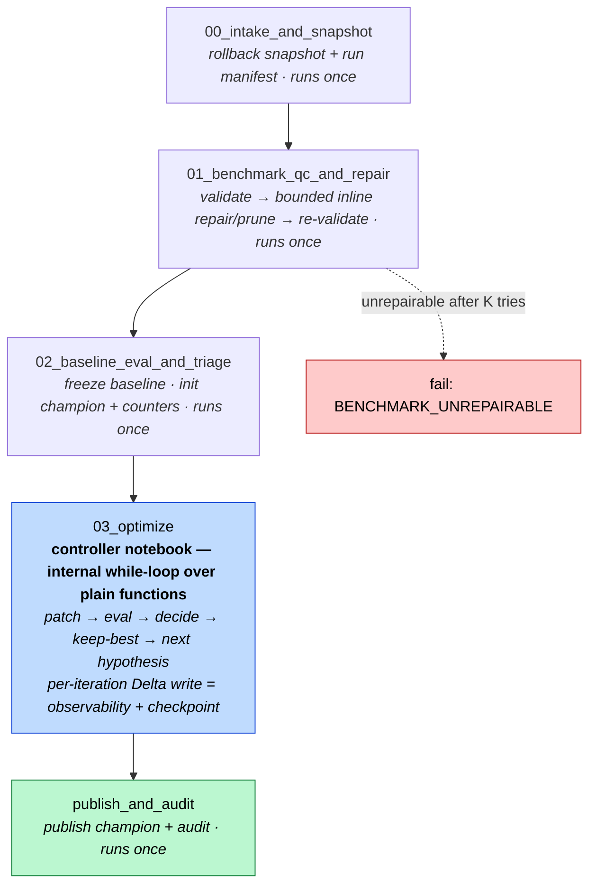

# GSO Workflow Re-Architecture Plan

Status: Draft
Scope: wholesale replacement of the current 6-notebook GSO workflow

This plan replaces the current `preflight -> baseline_eval -> enrichment -> lever_loop -> finalize -> deploy`
shape with a bounded hill-climbing workflow that keeps Delta as the durable handoff layer.

The orchestration shape is a **linear 5-task Databricks Workflow** whose hill-climbing
loop lives **inside one controller notebook** as a `while` loop over plain Python functions.
The acyclic (DAG) constraint of Databricks Jobs applies only *between* tasks, never *inside*
a task, so a runtime loop in a single notebook task is fully legal — and far simpler than
unrolling the loop into per-attempt task nodes.

Enrichment is no longer a separate stage: the broad enrichment pass becomes the loop's **first
attempt** (a deliberately broad, cluster-agnostic coverage pass), measured against the frozen
baseline and rolled back if it regresses; every later attempt is surgical. Deploy is out of scope
for this workflow entirely — a separate concern, not a task or side job here.

The current workflow design problem:

- the pipeline is too complex for the quality of decisions it makes
- enrichment can change the baseline before a root cause is isolated
- the lever loop can burn iterations without producing an admissible patch
- the current workflow does not stop soon enough on no-progress states

## 1. Design Goals

1. Keep the live space mutation intentional and auditable.
2. Keep all handoff state in Delta tables, not notebook-local files.
3. Use benchmark evidence before tuning the space.
4. On surgical attempts (attempt 2 onward), choose one failure cluster and one compatible patch
   family per attempt. Attempt 1 is the deliberate exception: a broad, cluster-agnostic coverage pass.
5. On surgical attempts, apply the smallest viable fix; attempt 1 is intentionally broad.
6. Snapshot rollback state before every edit.
7. Stop early on no-op, plateau, or incompatible proposals.
8. Fold enrichment into the loop as a measured, reversible first attempt against the frozen
   baseline — never an unmeasured preflight that can move the baseline before the loop starts.
9. Treat optimization as bounded hill-climbing with a best-so-far champion.
10. Stop when the target score or attempt budget is reached.
11. Keep the orchestration simple: a linear task graph, with the loop and its gates inside
    the controller notebook rather than expressed as DAG branches.

## 2. Why We Are Changing It

The reference `optimize-genie-space` skill is built around control discipline:

- benchmark QC before tuning
- one focused pass by default
- triage the failure into one cluster
- choose the smallest structured lever
- never feed benchmark answers back into config
- capture rollback-ready state before every edit
- stop on repeated non-improvement

We want that discipline, but not the old one-shot shape. The right translation
is a bounded hill-climbing loop:

- baseline first
- a broad, measured coverage pass as the first attempt, then one hypothesis per attempt after that
- eval against the frozen baseline
- keep the best-so-far state
- generate the next hypothesis from the latest residual failures
- stop at `90%` or `5` attempts

That is a better fit than the current broad autonomous loop. The current
workflow is too willing to:

- mutate the space and **move the baseline** before any candidate is measured against a frozen
  reference (the core enrichment defect)
- search across multiple levers on *every* pass, with no distinction between a deliberate broad
  opening pass and disciplined surgical follow-ups
- keep iterating after zero applied patches
- treat example SQL seeding as an always-on, unmeasured default rather than a measured, firewalled edit

The new workflow should preserve the useful parts of GSO:

- Delta-backed state
- live-space rollback support
- stage tracking
- per-attempt provenance
- best-so-far champion tracking

But it should remove the parts that caused the observed regressions.

## 3. Reference Material

This redesign follows these materials:

- https://github.com/hiydavid/databricks-agent-skills/tree/main/genie-code/optimize-genie-space
- https://github.com/hiydavid/databricks-agent-skills/blob/main/genie-code/optimize-genie-space/SKILL.md
- https://github.com/hiydavid/databricks-agent-skills/blob/main/genie-code/optimize-genie-space/references/benchmark-eval.md
- https://github.com/hiydavid/databricks-agent-skills/blob/main/genie-code/optimize-genie-space/references/failure-triage.md
- https://github.com/hiydavid/databricks-agent-skills/blob/main/genie-code/optimize-genie-space/references/tuning-levers.md
- https://github.com/hiydavid/databricks-agent-skills/blob/main/genie-code/optimize-genie-space/references/persistence.md

Repo docs that describe the current GSO architecture:

- `packages/genie-space-optimizer/docs/optimizer-process-design/03-preflight-benchmark-enrichment.md`
- `packages/genie-space-optimizer/docs/optimizer-process-design/04-lever-loop-rca-process-spine.md`
- `packages/genie-space-optimizer/docs/optimizer-process-design/05-six-optimization-levers.md`

## 4. Current Workflow To Replace

Current notebook series:

1. `preflight`
2. `baseline_eval`
3. `enrichment`
4. `lever_loop`
5. `finalize`
6. `deploy`

This plan replaces that series with a **5-task linear workflow** whose optimization loop
runs inside a single controller notebook.

| Current notebook | Proposed notebook(s) | What changes |
|---|---|---|
| `preflight` | `00_intake_and_snapshot` + `01_benchmark_qc_and_repair` | split rollback capture from benchmark quality review; benchmark repair/prune is now **inlined** into `01` and flows on automatically (see below) |
| `baseline_eval` | `02_baseline_eval_and_triage` | freeze the baseline before any repair choice is made |
| `enrichment` | folded into `03_optimize` as the **attempt-1 coverage pass** | no longer a separate stage or sidecar; broad enrichment runs as the loop's first attempt, measured against the frozen baseline and reversible (example SQL still passes the benchmark-leakage firewall) |
| `lever_loop` | `03_optimize` | a single controller notebook that runs the whole hill-climb as an internal `while` loop over plain Python functions — patch pass, targeted eval + decision, and loop control are functions, not separate DAG tasks |
| `finalize` | `publish_and_audit` | publish only when the target is hit or the attempt budget is exhausted |
| `deploy` | **out of scope** | removed entirely — deploy is a separate concern, not a task or side job in this workflow |

## 5. Databricks Workflow-Compatible DAG

The job is a plain linear 5-task DAG. The bounded loop is a runtime `while` loop inside the
`03_optimize` task, not a back-edge in the task graph.



Why this shape:

- **The loop goes inside a task, not the graph.** The Databricks DAG constraint applies only
  *between* tasks. A `while` loop inside `03_optimize` is ordinary Python and needs nothing from
  the Jobs layer beyond task dependencies. This avoids unrolling the loop into ~20 per-attempt
  task nodes plus `If/else` branch tasks and inter-task task-value plumbing.
- **The attempt budget is a runtime parameter, not graph shape.** Changing `max_attempts` is a
  parameter change, not a DAG reshape, and the iteration count can be genuinely runtime-dependent.
- **`01` repairs inline and continues automatically.** A failed benchmark QC no longer dead-ends
  into a separate `benchmark_repair_prune` job that ends the run and forces a manual re-trigger.
  `01` validates, repairs/prunes if needed, re-validates (bounded by `benchmark_repair_max_tries`),
  and flows **unconditionally** into `02`. Only a benchmark that is still invalid after K tries
  hard-fails, with terminal reason `BENCHMARK_UNREPAIRABLE`.

Loop semantics:

- `iteration 0` is the frozen baseline.
- `attempts 1..max_attempts` are patch/eval cycles, run in one of two modes:
  - **Attempt 1 — coverage mode (broad).** A deliberately broad, cluster-agnostic enrichment pass
    (descriptions, join hints, example SQL seeding, etc.). This handles cold/under-documented spaces
    automatically: a metadata-poor space gets a real lift, a well-documented space finds little and
    the loop moves on. No operator opt-in, no coverage gate.
  - **Attempts 2..max_attempts — surgical mode.** One failure cluster and one compatible patch
    family per attempt, smallest viable fix, exactly as the reference discipline prescribes.
- **Both modes are measured against the frozen baseline and accepted or rolled back as a whole
  attempt.** This is what makes the broad attempt-1 pass safe: it becomes champion only if it beats
  the frozen baseline, and a regression is rolled back like any other rejected attempt. It never
  silently moves the baseline — the defect of the old always-on preflight enrichment.
- each new patch attempt is based on the current champion state plus the latest failure evidence.
- if a patch improves the score, it becomes the new champion state.
- if a patch does not improve the score, the champion state stays put and the next hypothesis is generated from the residual failures.
- rejected attempts are recorded, but only the best-so-far state is carried forward.

Implementation notes:

- Inside `03_optimize`, each step is a **plain Python function** in a versioned, importable,
  unit-testable module — not a `dbutils.notebook.run()` call. State (champion object, residual
  failures, `do_not_repeat` set) lives as ordinary in-process variables.
- Do **not** use a `For each` task for this loop; `For each` is for iterating over an input
  array with a nested task, not for feedback-driven optimization across attempts.
- No `If/else` condition tasks are needed: the per-attempt gates become `break` conditions inside
  the loop, and the one remaining "gate" (benchmark unrepairable) is a notebook hard-fail.

### 5.1 `03_optimize` control flow

```text
# pseudocode — control flow only, no real logic
state = load_or_init_loop_state()          # resume from Delta if a prior run checkpointed
attempt = state.last_attempt
while not state.target_reached and attempt < max_attempts:
    attempt += 1
    mode = "coverage" if attempt == 1 else "surgical"   # broad first, then surgical
    patch = generate_patch(mode, state.champion, state.residual_failures, compat_map, do_not_repeat)

    if patch.is_empty:
        if mode == "coverage":              # warm space: nothing to enrich -> go surgical
            continue
        terminal = "NO_NEW_HYPOTHESIS"; break   # surgical: out of hypotheses
    if not patch.has_compatible_family:     # (surgical) no compatible patch family
        terminal = "NO_NEW_HYPOTHESIS"; break

    result = evaluate(candidate=apply(patch), baseline=state.frozen_baseline)
    if result.eval_invalid:                 # hard stop: eval data missing/invalid
        terminal = "EVAL_INVALID"; break

    decision = decide(result, state.frozen_baseline)        # accept / reject / continue
    state = update_champion(state, patch, result, decision) # keep-best; grow do_not_repeat

    write_loop_state_row(state, attempt, decision, result)  # <-- COMMIT each iteration
    if not state_is_valid(state):           # hard stop: loop state invalid
        terminal = "LOOP_STATE_INVALID"; break

    if state.best_accuracy >= target_accuracy:
        terminal = "TARGET_REACHED"; break
else:
    terminal = "MAX_ATTEMPTS"

finalize(state, terminal)
```

Terminal reasons: `TARGET_REACHED`, `MAX_ATTEMPTS`, `NO_NEW_HYPOTHESIS`, `EVAL_INVALID`,
`LOOP_STATE_INVALID`.

### 5.2 Two-mode loop: reuse vs. net-new in the existing harness

The two modes map onto code that mostly already exists in `packages/genie-space-optimizer`:

- **Attempt 1 — coverage mode** reuses the existing broad-enrichment executor. Today that logic
  lives as a *preflight* stage (`_run_enrichment`, the "Lever 0" pass) that runs before the lever
  loop and **sets the baseline the loop then gates against** — exactly the baseline-pollution defect
  this redesign targets. The change is to *relocate* that executor into the loop as attempt 1, where
  it is measured against the frozen baseline and rolled back if it regresses.
- **Attempts 2..N — surgical mode** are the existing adaptive strategist unchanged: one source
  failure cluster per action group (a hard-enforced invariant today), multiple levers allowed within
  that cluster, capped at the per-attempt patch budget.

Reused as-is (no change needed):

- the **frozen baseline** captured at loop entry;
- **whole-attempt accept / reject / rollback** on a scalar gain gate (so a broad attempt-1 bundle
  rolls back as a unit if it regresses);
- the **context plumbing** the strategist already receives — prior applied patches (reflection
  buffer+ tried-patches) and the latest eval failures at per-question and per-cluster granularity;
- the **benchmark-leakage firewall** on example SQL (applied last-mile on the patch applier, so it
  covers coverage-mode seeding too).

Net-new (the only code the two-mode loop adds):

- a **per-attempt breadth/mode parameter** threaded into the strategist call and its prompt (there
  is no attempt-number or mode signal in the strategist today); and
- a **controller branch** that routes attempt 1 to coverage mode and **bypasses the
  one-source-cluster-per-action-group invariant for that attempt only** (coverage is intentionally
  cluster-agnostic). Surgical attempts keep the invariant.

## 6. Notebook Contracts

Every notebook must persist handoff state in Delta and never let a failed attempt overwrite the
current champion. All five tasks run **exactly once** per job run; there is no notebook reuse
across task keys.

### Notebook contract at a glance

| Notebook | Reads | Writes | Artifact kinds | Hard stop |
|---|---|---|---|---|
| `00_intake_and_snapshot` | job parameters, request metadata, current space config | `genie_opt_runs`, `genie_opt_artifacts`, `genie_opt_stages` | `run_manifest`, `space_snapshot` | abort if snapshot capture fails |
| `01_benchmark_qc_and_repair` | space metadata, snapshot artifact, benchmark set | `genie_opt_artifacts`, `genie_opt_stages` | `benchmark_qc` | `BENCHMARK_UNREPAIRABLE` if benchmark is still invalid/contaminated/too weak after `benchmark_repair_max_tries` repair attempts; otherwise repairs inline and continues |
| `02_baseline_eval_and_triage` | snapshot artifact, repaired/validated benchmark, QC artifact, attempt budget | `genie_opt_iterations`, `genie_opt_provenance`, `genie_opt_artifacts`, `genie_opt_stages` | `baseline_eval`, `triage`, `loop_state` seed | none at triage — the loop always runs at least the attempt-1 coverage pass; patch-family compatibility is enforced per surgical attempt (§5.1) |
| `03_optimize` | triage artifact, snapshot artifact, compatibility map, seeded champion/loop state | `genie_opt_iterations`, `genie_opt_patches`, `genie_eval_lever_loop_decisions`, `genie_opt_provenance`, `genie_opt_artifacts`, `genie_opt_runs`, `genie_opt_stages` | `patch_bundle`, `targeted_eval`, `decision`, `loop_state` (one set per iteration) | per-iteration `break` conditions (see §5.1); the loop itself ends on a terminal reason |
| `publish_and_audit` | champion state, loop-state artifact, patch history, benchmark target, attempt budget | `genie_opt_runs`, `genie_opt_artifacts`, `genie_opt_stages` | `publish_record` | publish and audit when target is reached or budget is exhausted |

### 6.1 What `03_optimize` absorbs

The old unrolled tasks `03_single_patch_pass`, `04_targeted_eval_and_decision`, and
`05_loop_controller` become **functions** inside `03_optimize`:

- `generate_patch(...)` → produces the `patch_bundle` (was `03`).
- `evaluate(...)` + `decide(...)` → produce `targeted_eval` and `decision` (was `04`).
- `update_champion(...)` + `write_loop_state_row(...)` → maintain and commit `loop_state`
  every iteration (was `05`).
- the broad enrichment executor (today the preflight `enrichment` stage / "Lever 0") becomes the
  **attempt-1 coverage pass** invoked by `generate_patch(mode="coverage", ...)` — relocated from a
  baseline-setting preflight into a measured, reversible first attempt (see §5.2).

Because these are in-process calls, no patch bundle / eval / decision / loop-state has to be
serialized through task values between tasks; they are written to Delta directly for durability.

## 7. Delta Tables Used

Delta is the **single source of truth** for both observability and resume. There is no MLflow
in this workflow.

Existing tables to keep:

| Table | Purpose |
|---|---|
| `genie_opt_runs` | top-level run summary, status, champion, final decision, loop summary |
| `genie_opt_stages` | notebook lifecycle, stage transitions, stop reasons |
| `genie_opt_iterations` | baseline and candidate evaluation results |
| `genie_opt_patches` | one row per patch proposal / applied patch |
| `genie_opt_provenance` | cluster labels, root-cause notes, reasoning trail |
| `genie_eval_lever_loop_decisions` | proposal-to-patch gating and acceptance outcomes |

New table to add:

| Table | Purpose |
|---|---|
| `genie_opt_artifacts` | generic Delta handoff table for notebook outputs, loop state, and rollback-safe artifacts |

### 7.1 Suggested `genie_opt_artifacts` schema

This table should be broad enough to carry every notebook handoff without
adding another bespoke table for each stage.

Suggested columns:

| Column | Purpose |
|---|---|
| `run_id` | join key back to the run |
| `stage_name` | notebook or stage that wrote the artifact |
| `iteration` | iteration number, when applicable |
| `artifact_kind` | `run_manifest`, `space_snapshot`, `benchmark_qc`, `baseline_eval`, `triage`, `patch_bundle`, `targeted_eval`, `decision`, `loop_state`, `publish_record` |
| `artifact_json` | payload for the artifact |
| `content_hash` | dedupe / idempotency / replay safety |
| `parent_artifact_id` | lineage pointer |
| `source_notebook` | notebook name that produced the row |
| `created_at` | write timestamp |

### 7.2 Artifact kinds by notebook

| Notebook | Artifact kinds |
|---|---|
| `00_intake_and_snapshot` | `run_manifest`, `space_snapshot` |
| `01_benchmark_qc_and_repair` | `benchmark_qc` |
| `02_baseline_eval_and_triage` | `baseline_eval`, `triage`, `loop_state` (seed) |
| `03_optimize` | `patch_bundle`, `targeted_eval`, `decision`, `loop_state` (one set per iteration) |
| `publish_and_audit` | `publish_record` |

### 7.3 Artifact payload contract

The `artifact_json` payload should be enough to reconstruct the pass without
depending on notebook-local state.

| Artifact kind | Required payload contents |
|---|---|
| `run_manifest` | `run_id`, `space_id`, benchmark target, approval scope, target accuracy, max attempts, baseline config reference, parent run reference |
| `space_snapshot` | serialized space/config snapshot, config hash, snapshot location, captured timestamp |
| `benchmark_qc` | benchmark counts, validity flags, contamination findings, pruning or repair recommendation, repair attempts used, final validity |
| `baseline_eval` | baseline score, question counts, excluded counts, failure set, benchmark denominator used |
| `triage` | selected cluster, root cause, compatibility decision, allowed patch family, regression questions |
| `patch_bundle` | proposed edits, patch count, affected question IDs, rollback token, config surface touched |
| `targeted_eval` | affected-subset score, full-benchmark score, delta vs frozen baseline, fixed / regressed counts |
| `decision` | accept / reject / continue, reason, candidate version pointer, next hypothesis hint |
| `loop_state` | attempt number, attempt mode (`coverage`/`surgical`), best iteration, best accuracy, best config version id, current champion config version id, target accuracy, max attempts, current hypothesis, do-not-repeat list, terminal reason |
| `publish_record` | final run status, champion pointer, audit summary, publish or wait result |

### 7.4 Loop-state fields

The bounded loop should persist its control state in Delta, either in
`genie_opt_runs` additive columns or inside `genie_opt_artifacts` as
`artifact_kind = loop_state`.

Recommended fields:

| Field | Meaning |
|---|---|
| `target_accuracy` | stop threshold, default `0.90` |
| `max_attempts` | hard budget, default `5` |
| `attempt_no` | current attempt number, starting at `1` after baseline |
| `attempt_mode` | `coverage` for attempt 1 (broad), `surgical` for attempts 2 onward |
| `best_iteration` | iteration id of the current champion |
| `best_accuracy` | best full-benchmark accuracy so far |
| `best_config_version_id` | serialized config snapshot for the current champion |
| `current_hypothesis` | active patch hypothesis being tested next |
| `do_not_repeat` | list of rejected lever families or strategies |
| `next_hypothesis` | next patch idea chosen by the controller |
| `terminal_reason` | `TARGET_REACHED`, `MAX_ATTEMPTS`, `NO_NEW_HYPOTHESIS`, `EVAL_INVALID`, `LOOP_STATE_INVALID` |

### 7.5 Observability + checkpoint discipline

Because the whole hill-climb runs inside one task, Delta — not the Jobs UI — is where
per-attempt visibility and resume live:

- **Write one `loop_state` row per iteration, committed at the end of each attempt** — not a
  single batch dump at the end. This gives live progress (query the table mid-run) and makes the
  table a checkpoint: a rerun reads the last committed attempt and resumes (`content_hash` dedupes
  work; `parent_artifact_id` records lineage).
- **Heartbeat to driver logs** each iteration (start/end) for the live "is it still alive?" signal
  the Jobs UI would otherwise give per task, and set a sensible job/cluster timeout for `03_optimize`.

This is the one operational trade-off of the controller-notebook shape: the Jobs UI shows one
`03_optimize` task instead of per-attempt task nodes. The per-iteration Delta rows recover that
visibility — queryable, dashboard-able, and comparable across runs.

## 8. What Is Changing

1. Relocate broad enrichment out of the preflight and into the loop as the **attempt-1 coverage
   pass**, measured against the frozen baseline and reversible. The preflight is now just benchmark
   QC plus a rollback snapshot; it no longer mutates the space or moves the baseline.
2. Inline benchmark repair/prune into `01_benchmark_qc_and_repair` so a failed QC repairs and
   continues automatically instead of dead-ending into a separate job.
3. Remove always-on, unmeasured `proactive_example_sql` seeding. Example SQL is now seeded only
   inside the attempt-1 coverage pass, measured against the frozen baseline and still gated by the
   benchmark-leakage firewall.
4. Replace the current lever loop with bounded hill-climbing inside a single `03_optimize`
   controller notebook (a `while` loop over plain functions), not an unrolled DAG.
5. Carry the best-so-far champion forward between attempts.
6. Re-enter patch generation after each eval while the target is still unmet
   and attempts remain.
7. Stop only when the candidate reaches `target_accuracy` or `max_attempts` is exhausted.
8. Keep all state transfer in Delta tables, with per-iteration commits as the checkpoint.
9. Make any future iterative mode explicit and auditable, not implicit.

## 9. What Is Not Changing

1. Delta remains the durable system of record.
2. Live-space mutation is still allowed, but only when the pass explicitly
   decides to keep a candidate.
3. Rollback still uses the captured baseline snapshot.
4. Existing run / stage / patch / provenance tables remain useful and stay in
   the architecture.
5. Benchmark questions remain evaluation-only.
6. Benchmark repair or pruning stays scoped to benchmark definitions only — distinct from the
   space-config patches applied in `03_optimize` — even though it now runs inline in `01`.

## 10. Why This Is Better

This architecture is closer to hill-climbing for four reasons:

1. It preserves the best-so-far champion instead of letting every attempt
   overwrite the search state.
2. It uses the latest residual failures to form the next hypothesis.
3. It has an explicit target and an explicit attempt budget.
4. It can continue after a non-improving attempt without pretending that the
   failed patch was the new baseline.

That should reduce:

- accuracy regressions caused by unmeasured enrichment that moved the baseline (broad enrichment
  now runs as attempt 1, measured against the frozen baseline and rolled back if it regresses)
- wasted attempts with no applied patches
- lever drift across unrelated failure types on surgical attempts
- difficulty reasoning about why a run succeeded or failed

And the orchestration is dramatically simpler: a 5-task linear job instead of ~24–28 unrolled
task nodes, with the attempt budget as a runtime parameter and no condition tasks or inter-task
task-value plumbing.

## 11. Side Workflows

There are no optional enrichment side workflows in this design. Everything the old sidecars did is
either folded into the main loop or out of scope, so there is no operator choice between "run the
loop" and "run an enrichment sidecar":

| Old side workflow | Disposition |
|---|---|
| `benchmark_repair_prune` | **folded into `01_benchmark_qc_and_repair`** — runs inline and continues automatically |
| `metadata_enrichment_only` | **folded into `03_optimize`** — runs as the attempt-1 coverage pass |
| `example_sql_seed` | **folded into `03_optimize`** — example SQL is seeded in the attempt-1 coverage pass, behind the benchmark-leakage firewall |
| `deploy` | **out of scope** — a separate concern, not a task or side job in this workflow |

A cold/under-documented space is handled by the broad attempt-1 pass; a well-documented space
simply finds little to do on attempt 1 and proceeds to surgical attempts.

## 12. Runtime Parameters

Because the loop is in-notebook, these are **job parameters**, not graph shape:

| Parameter | Default | Meaning |
|---|---|---|
| `max_attempts` | `5` | hill-climb budget |
| `target_accuracy` | `0.90` | stop-early target |
| `benchmark_repair_max_tries` | TBD | K — bound on `01`'s inline repair loop |
| `approval_scope` | from `run_manifest` | governs live-space mutation |

## 13. Open Decisions

1. Set a concrete default for `benchmark_repair_max_tries` (K).
2. Whether to keep a plateau/no-improvement safety stop in addition to the
   `max_attempts` cap. If yes, it is another `break` condition in §5.1 — no DAG change.
3. Whether `publish_and_audit` should set the run to `PUBLISHED_AUDITED` or a
   different terminal status.
4. Confirm `target_accuracy` and `max_attempts` are surfaced as job parameters in the Jobs UI.
5. Whether an empty attempt-1 coverage pass (warm space, nothing to enrich) should consume a budget
   slot or fall through to surgical without counting against `max_attempts`.
6. **Net-new code for the two-mode loop** (see §5.2): a per-attempt breadth/mode parameter threaded
   into the strategist and prompt, and a controller branch that routes attempt 1 to coverage mode and
   bypasses the one-source-cluster-per-action-group invariant for that attempt only. Confirm
   scope/ownership.

## 14. Working Principle

The default GSO workflow should behave like disciplined hill-climbing:

- understand the benchmark (repairing it inline if needed)
- open with a broad, measured coverage pass (attempt 1), then isolate the failure and go surgical
- make the smallest compatible edit on surgical attempts
- measure every attempt against the frozen baseline (broad or surgical), and roll back regressions
- keep the best-so-far champion
- generate the next hypothesis from the latest residual failures
- stop when the target is reached or the attempt budget is exhausted
- publish the champion and audit the run
- run the search as a `while` loop inside one controller notebook, with Delta as the
  observability and checkpoint surface — not as an unrolled DAG of attempt lanes

That is the core idea borrowed from the reference skill, translated into a
bounded loop instead of a one-shot pass.
