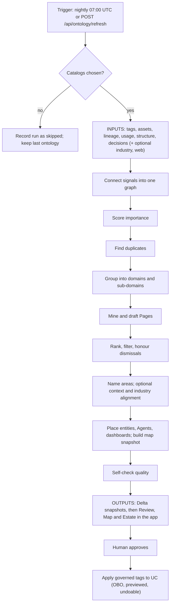

# Genie Ontology — Product Requirements Document (master)

> **Authority.** This is the master PRD for Genie Ontology on the `ontology`
> branch. It is written from the code at HEAD `fc52bc7e` (read 2026-09-30).
> Where this document and older design docs disagree, the code was checked and
> the difference is listed under **Appendix D — Open discrepancies**. Code beats
> docs; this PRD follows code.
>
> **Second job.** This PRD is the source of truth for the in-app "How it works"
> explainer (MV-D108 P2). The **Stage spec** in Part C is the contract that
> explainer renders.
>
> **Citation legend.**
> - Code is cited as `symbol` `path:line` (or `path:start-end`). The symbol
>   named immediately before a citation appears on the cited line or range.
> - Paths starting `ontology/`, `jobs/`, `optimization/` or `common/` are
>   relative to `packages/genie-space-optimizer/src/genie_space_optimizer/`.
>   All other paths are repo-relative.
> - Design documents are cited by section heading, never by line.
> - Live numbers are quoted as "measured DATE on 6t92c3" with their source.
>   They describe one deployment on one day. They are not invariants.
> - Anything that cannot be proven from the repo (personas, KPIs, GA) is a
>   proposal marked **TBD — confirm**.

---

## Part A — Product

### A.1 Problem

A large Unity Catalog estate accumulates thousands of tables, metric views,
dashboards and Genie Agents with no shared business map. Governed tags exist,
but they are applied unevenly. Nobody can answer "which assets make up our
Revenue area?" or "what does a new analyst need to know before asking Genie
about bookings?". Genie Agents are then scoped by hand and re-scoped whenever
the estate moves.

### A.2 What Genie Ontology does

Genie Ontology scans the catalogs you allow. It reads the governance, usage
and structure signals the platform already records, and proposes three kinds
of things for a human to review:

1. **Domains and sub-domains.** These are business areas, expressed as
   governed-tag values on tables, metric views, dashboards and Agents.
2. **Pages.** These are copy-ready knowledge-page drafts of four live
   archetypes: Routing, Disambiguation, Guardrail and Taxonomy (`Disambiguation` `backend/ontology/models.py:398`).
   They are pasted into Discover by hand; Pages have no public write API.
3. **Reassignments.** These say that an asset already tagged into one area
   looks like it belongs in another.

Nothing is written back to Unity Catalog until a person approves it, previews
the exact SQL, and executes it under their own identity. Every write can be
undone.

### A.3 Principles (each backed by code, detailed in Part D)

| Principle | What it means | Enforced at |
|---|---|---|
| Scope first | No catalogs chosen means no scan: the run is recorded as `skipped` and the last good ontology is kept. | `_has_scope` `ontology/materialize.py:661` |
| Reuse before create | Reuse an existing governed tag value before proposing a new one. | `tag_decision` `ontology/cluster.py:1081-1100` |
| Suggest, never auto-apply | The job writes only its own Delta tables. The only writer to UC is the backend apply service, running as the user. | `execute_apply_plan` `backend/ontology/services/apply.py:419` |
| Your decisions stick | A dismissed suggestion is not re-surfaced by the next scan. | `suppressions` `jobs/run_ontology_materialize.py:1009` |
| Degrade, never block | Optional stages (industry model, web context, AI drafting) fail soft. | `apply_alignment` `ontology/materialize.py:924-926` |

### A.4 Personas — TBD — confirm

| Persona | Job to be done | Primary surface |
|---|---|---|
| Data platform admin (proposed) | Set scope, run scans, approve and apply tags | Overview, Settings, Review |
| Data steward / domain owner (proposed) | Curate one business area and its Pages | Review, Map |
| Genie Agent author (proposed) | Scope an Agent to a business area | Map, Estate |
| Architect (proposed) | Understand the estate shape and the signals behind it | Map, Estate |

The surface is admin-gated today (`isAdmin` `frontend/src/App.tsx:218-228`).
Whether non-admin stewards get a read-only view is **TBD — confirm**.
Part G walks every journey these personas take through the tab.

### A.5 Success metrics — TBD — confirm

| Metric (proposed) | Source that could measure it |
|---|---|
| Ontology quality: precision / recall / F1 against an aligned reference model | `assemble_eval_report` `ontology/materialize.py:1027-1032` → `genie_ont_eval` |
| Ungrouped share of the estate | `ungrouped_count` `ontology/ddl.py:36` |
| Review throughput (decisions per surfaced proposal) | `review_decision` `frontend/src/ontology/ontologyTelemetry.ts:13-17`. The sink is a no-op today. |
| Applied memberships per run | `genie_ont_applied` `ontology/ddl.py:249` |
| Scan freshness (share of days with a succeeded run inside 24 h) | `FRESHNESS_WINDOW_HOURS` `backend/ontology/services/refresh.py:26` |

Targets are **TBD — confirm**. One reference point: the harness scored
P 1.0 / R 0.913 / F1 0.955 with alignment on, measured 2026-09-20 on 6t92c3,
run 922302079051503 (source: `docs/design/backlog.md`, the MV-D100 entry).

### A.6 Scope and release — TBD — confirm

- **In scope (built):** scan job, Review / Map / Estate / Settings / Overview
  tabs, apply and undo, Page drafts, optional industry alignment, optional
  external context.
- **Not built:** proposers for metric-view gaps and Agent overlap (see
  Appendix D); a notification sink for telemetry; the "How it works" explainer
  (MV-D108 P2).
- **GA criteria, feature-flag posture and customer rollout:** **TBD — confirm**.

---

## Part B — How it works: Inputs → Processing → Outputs

### B.0 Architecture at a glance

```mermaid
flowchart LR
  subgraph UC["Unity Catalog and platform (read)"]
    T["Governed tags and tag assignments"]
    A["Tables, views, metric views"]
    L["system.access.table_lineage"]
    G["Genie Agents and dashboards"]
  end
  subgraph OPT["Optional inputs (default off)"]
    R["Industry reference model"]
    W["Web and company context"]
  end
  subgraph JOB["genie-ontology-materialize-job (1 task, runs as run_as)"]
    RM["run_materialize"]
  end
  subgraph DELTA["14 genie_ont_* Delta tables"]
    D1["runs, domains, members, pages"]
    D2["graph and taxonomy snapshots, eval"]
    D3["consents, suppressions, applied"]
  end
  subgraph APP["Workbench app"]
    API["/api/ontology (21 routes)"]
    UI["Ontology tabs"]
  end
  T --> RM
  A --> RM
  L --> RM
  G --> RM
  R -.-> RM
  W -.-> RM
  RM --> D1
  RM --> D2
  D1 --> API
  D2 --> API
  API --> UI
  UI -->|approve / dismiss (OBO)| D3
  UI -->|apply / undo (OBO)| UC
```

### B.0.1 One run, end to end



### B.1 Inputs

"Allowlist-scoped" means the read is filtered to the catalogs in Settings.
The batch reads everything as the job's `run_as` identity, not as the
end user.

| Name | Source | Read as | Allowlist-scoped? | Optional / default-off? | Citation |
|---|---|---|---|---|---|
| Catalog allowlist (scan scope) | Settings (Lakebase `genie_ont_settings`) → job param | job param | defines scope | Required. Empty means `skipped`. | `catalog_allowlist` `jobs/run_ontology_materialize.py:78` |
| Governed tag catalog | `system.tags.governed_tags` | job `run_as` | No (metastore-wide by nature) | Required | `governed_tags` `jobs/run_ontology_materialize.py:348` |
| Tag assignments | `information_schema.*_tags` per catalog | job `run_as` | Yes | Required | `assignments` `jobs/run_ontology_materialize.py:355` |
| Metric views | `information_schema.tables` | job `run_as` | Yes | Required | `metric_view_fqns` `jobs/run_ontology_materialize.py:377` |
| Asset types | `information_schema.tables` | job `run_as` | Yes | Required | `table_types` `jobs/run_ontology_materialize.py:394` |
| Genie Agents (list) | Genie API list spaces | job `run_as` | No (workspace list; per-agent scope is filtered) | Required | `agents` `jobs/run_ontology_materialize.py:421` |
| Agent scopes | Genie space config | job `run_as` | Yes | Required | `agent_scopes` `jobs/run_ontology_materialize.py:529` |
| Entity tag assignments | Tag assignments on Agents / dashboards | job `run_as` | No | Required | `entity_tag_assignments` `jobs/run_ontology_materialize.py:431` |
| Dashboard scopes | Lakeview + `table_lineage` | job `run_as` | Yes | Required | `dashboard_scopes` `jobs/run_ontology_materialize.py:578` |
| Lineage adjacency | `system.access.table_lineage` | job `run_as` | Yes, plus schema denylist | Required | `lineage_edges` `jobs/run_ontology_materialize.py:629` |
| Co-query | `system.access.table_lineage` grouped by statement | job `run_as` | Yes | Required | `co_query_edges` `jobs/run_ontology_materialize.py:659` |
| Semantic similarity edges | embeddings | — | — | Gated off in code | `_SEMANTIC_SIM_ENABLED` `jobs/run_ontology_materialize.py:304` |
| Join keys | column metadata | job `run_as` | Yes | Required | `join_key_edges` `jobs/run_ontology_materialize.py:737` |
| Metric-view membership | metric-view sources | job `run_as` | Yes | Required | `mv_membership` `jobs/run_ontology_materialize.py:775` |
| Schema affinity | shared schema | job `run_as` | Yes | Required | `schema_affinity` `jobs/run_ontology_materialize.py:810` |
| Measures | metric-view measures | job `run_as` | Yes | Required | `measure_signals` `jobs/run_ontology_materialize.py:825` |
| Coded columns | low-cardinality columns (needs warehouse) | job `run_as` | Yes | Degrades without a warehouse | `coded_column_signals` `jobs/run_ontology_materialize.py:855` |
| Descriptions | table and column comments | job `run_as` | Yes | Required | `comment_signals` `jobs/run_ontology_materialize.py:953` |
| Agent instructions | — | — | — | Stub, always empty | `space_instructions` `jobs/run_ontology_materialize.py:1003` |
| Prior dismissals | `genie_ont_suppressions` | job `run_as` | metastore-keyed | Required | `suppressions` `jobs/run_ontology_materialize.py:1009` |
| Usage (30-day reads and distinct users) | `system.access.table_lineage` | job `run_as` | Yes | Required | `usage_signals` `jobs/run_ontology_materialize.py:1027` |
| Certification | table properties / tags | job `run_as` | Yes | Required | `certification_status` `jobs/run_ontology_materialize.py:1063` |
| Industry reference model (airline, retail) | bundled YAML | — | n/a | **Off by default** | `industry_alignment_enabled` `jobs/run_ontology_materialize.py:140`; `_BUNDLED` `ontology/reference_models.py:184` |
| Company / web context pack | web search ladder and connectors | job `run_as` | n/a | **Off by default**; blocked under HIPAA BAA | `external_context_enabled` `jobs/run_ontology_materialize.py:132`; `external_context_hipaa_baa` `jobs/run_ontology_materialize.py:135` |
| Embeddings | Foundation Model endpoint | job `run_as` | n/a | Degrades to none | `_embedder` `jobs/run_ontology_materialize.py:1113` |
| LLM (naming, adjudication, Page drafting) | serving endpoint via wheel `call_llm_core` | job `run_as` | n/a | Bounded caps; degrades | `LLM_MODEL` `jobs/run_ontology_materialize.py:152-154` |

The notebook declares 34 widgets, in `metastore_id`
`jobs/run_ontology_materialize.py:73` through
`industry_alignment_reference_model`
`jobs/run_ontology_materialize.py:141`. Their defaults are the effective
settings for any run that does not pass them (see Appendix D, item 2).

External context sources are registered in `web_search` `ontology/context_registry.py:59-122`:

- **Default off:** web search, You.com, Confluence, Google Drive, Microsoft 365.
- **Default on (in-estate):** Genie One and Databricks SQL.

Mail, chat and calendar sources are excluded by design.

### B.2 Processing

#### B.2.1 Jobs, tasks, trigger, identity

| Fact | Value | Citation |
|---|---|---|
| Ontology jobs | **1**: `genie-ontology-materialize-job` (resource key `ontology-materialize-runner`) | `genie-ontology-materialize-job` `databricks.yml:246`; `ontology-materialize-runner` `databricks.yml:245` |
| Tasks | **1**: `ontology_materialize` → `jobs/run_ontology_materialize.py` | `ontology_materialize` `databricks.yml:290`; `notebook_path` `databricks.yml:292` |
| Schedule | Quartz `0 0 7 * * ?`, UTC, unpaused | `quartz_cron_expression` `databricks.yml:261` |
| Concurrency | 1 run at a time, extra runs queue | `max_concurrent_runs` `databricks.yml:257` |
| Timeout / retries | 5400 s / 0 | `timeout_seconds` `databricks.yml:305`; `max_retries` `databricks.yml:306` |
| Compute | Serverless environment with the GSO wheel | `environment_version` `databricks.yml:310` |
| Identity | Job `run_as`, a bundle variable (defaults to the deployer) | `run_as` `databricks.yml:256`; `ontology_job_run_as` `databricks.yml:16` |
| Declared job parameters | 8 (workspace_id, trigger, catalog, schema, catalog_allowlist, run_id, warehouse_id, llm_model) | `catalog_allowlist` `databricks.yml:277` |
| On-demand trigger | `POST /api/ontology/refresh` → the SP calls `jobs.run_now` with about 20 parameters | `trigger` `backend/ontology/services/refresh.py:262`; `run_now` `backend/ontology/services/refresh.py:224-229` |
| In-flight guard | A second click while a run is active returns the active run | `trigger` `backend/ontology/services/refresh.py:262-269` |
| Job id wiring | `GSO_ONT_JOB_ID` placeholder in `app.yaml`, resolved and injected by `deploy.sh` | `GSO_ONT_JOB_ID` `app.yaml:98-99`; `ontology-materialize-runner` `scripts/deploy.sh:460-469` |
| App SP permission | CAN_MANAGE_RUN on the job | `_grant_job_run` `scripts/grant_permissions.py:318` |
| Install paths | DABs only. The notebook installer leaves the job id blank. | `GSO_ONT_JOB_ID` `scripts/deploy_lib/install.py:87-90` |

For contrast, the GSO optimizer is a separate 4-task job,
`gso-optimization-job` `databricks.yml:60`. Ontology does not add tasks to it.

#### B.2.2 `run_materialize`, in code order

`run_materialize` `ontology/materialize.py:579` is the whole batch. Steps
appear in the order the code runs them.

| # | Step | What happens | Citation |
|---|---|---|---|
| 1 | Ensure tables | Creates the 14 `genie_ont_*` tables if missing | `ensure_tables` `ontology/materialize.py:636` |
| 2 | Run row | Writes a `running` row | `upsert_run` `ontology/materialize.py:652` |
| 3 | Scope guard | Empty allowlist → `skipped` row and return, with no MERGE, so an empty nightly cannot clear a curated ontology | `_has_scope` `ontology/materialize.py:661`; `skipped` `ontology/materialize.py:661-677` |
| 4 | Governance | Governed tags and assignments | `governed_tags` `ontology/materialize.py:680`; `assignments` `ontology/materialize.py:681` |
| 5 | Asset types | Table / view / metric view | `_gather_asset_types` `ontology/materialize.py:685` |
| 6 | Tag graph | Tag keys, values, collisions | `assemble_tag_graph` `ontology/materialize.py:686-688` |
| 7 | Taxonomy tree | Metric views, Agents, current tree | `build_taxonomy_dict` `ontology/materialize.py:691` |
| 8 | Structural signals | Lineage, co-query, joins, metric views, schema | `_gather_structural_signals` `ontology/materialize.py:697` |
| 9 | Agent / dashboard scopes | Scopes and names | `_gather_agent_scopes` `ontology/materialize.py:702`; `_gather_dashboard_scopes` `ontology/materialize.py:708` |
| 10 | Signal graph | One multiplex graph over 9 edge kinds | `build_signal_graph` `ontology/materialize.py:710-721` |
| 11 | Centrality | PageRank importance | `pagerank_centrality` `ontology/materialize.py:732` |
| 12 | ER candidates | Similarity, candidate pairs, optional embeddings | `candidates_from_graph` `ontology/materialize.py:738` |
| 13 | Entity resolution | Merge / escalate / keep separate; LLM adjudication capped | `run_er` `ontology/materialize.py:746-753` |
| 14 | Identity rows | Canonical entity ↔ member refs | `identity_map_rows` `ontology/materialize.py:756-760` |
| 15 | Snapshot MERGE | Tag graph, taxonomy, identity | `genie_ont_tag_graph` `ontology/materialize.py:766`; `genie_ont_identity` `ontology/materialize.py:768` |
| 16 | Usage | 30-day reads and users, normalized | `_gather_usage` `ontology/materialize.py:782` |
| 17 | Cluster | Leiden multiplex into domains and sub-domains | `cluster` `ontology/materialize.py:783-786` |
| 18 | Domain MERGE | Domains and members | `build_domain_rows` `ontology/materialize.py:787-790`; `TABLE_ONT_MEMBERS` `ontology/materialize.py:792` |
| 19 | Pages | Mine archetypes; bounded AI drafting | `_gather_page_inputs` `ontology/materialize.py:801`; `mine_pages` `ontology/materialize.py:808-823` |
| 20 | Pages MERGE | Preserves human-drafted bodies | `TABLE_ONT_PAGES` `ontology/materialize.py:831-835` |
| 21 | Rank signals | Certification plus usage, centrality, governance | `_gather_certification` `ontology/materialize.py:847`; `RankSignals` `ontology/materialize.py:859-865` |
| 22 | Score and surface | Weighted score, surface gate, dismissals honoured | `score_proposals` `ontology/materialize.py:866-874`; `mark_surfaced` `ontology/materialize.py:875-877` |
| 23 | Rename | LLM names for newly surfaced areas | `rename_surfaced` `ontology/materialize.py:882-885` |
| 24 | Context prior (optional) | Company context adjusts evidence, never membership | `apply_context_prior` `ontology/materialize.py:892-894` |
| 25 | Industry alignment (optional) | Aligns to a reference model; errors are swallowed | `align` `ontology/materialize.py:918-923`; `apply_alignment` `ontology/materialize.py:924-926` |
| 26 | Re-MERGE | Domains and Pages after ranking | `TABLE_ONT_DOMAINS` `ontology/materialize.py:932-938` |
| 27 | Placement | Entity tags; Agent and dashboard placement | `agent_domain_placement` `ontology/materialize.py:991` |
| 28 | Map snapshot | Layout-ready graph (top 2000 by centrality) | `build_graph_snapshot` `ontology/materialize.py:1006-1013`; `TOP_N_BY_CENTRALITY` `ontology/layout.py:32` |
| 29 | Self-check | Quality harness → `genie_ont_eval` (inner try) | `assemble_eval_report` `ontology/materialize.py:1027-1032`; `TABLE_ONT_EVAL` `ontology/materialize.py:1034` |
| 30 | Context tables (optional) | Context pack and sources | `pack_rows` `ontology/materialize.py:1052-1055` |
| 31 | Succeeded row | Counts and finish time | `upsert_run` `ontology/materialize.py:1090` |
| 32 | Failure | `failed` row, then re-raise | `failed` `ontology/materialize.py:1092-1100` |

Algorithm facts:

- **Edge kinds (9):**

  | Kind | Citation |
  |---|---|
  | `tag_assignment` | `ontology/graph.py:120` |
  | `lineage_adjacency` | `ontology/graph.py:128` |
  | `co_query` | `ontology/graph.py:137` |
  | `agent_scope` | `ontology/graph.py:153` |
  | `dashboard_scope` | `ontology/graph.py:169` |
  | `semantic_sim` | `ontology/graph.py:180` |
  | `join_key` | `ontology/graph.py:193` |
  | `mv_membership` | `ontology/graph.py:202` |
  | `schema_affinity` | `ontology/graph.py:211` |

- **Clustering:**
  - Layer weights: `lineage_adjacency` `ontology/cluster.py:77-84`.
  - Resolution: `GAMMA_COARSE` `ontology/cluster.py:71`, `GAMMA_FINE` `ontology/cluster.py:72`.
  - Reassign margin: `REASSIGN_MARGIN` `ontology/cluster.py:118`.
- **Rank weights:** usage .40, centrality .35, governance .25 (`FACTOR_WEIGHTS` `ontology/rank.py:57`).
- **ER thresholds:** `MERGE_THRESHOLD` `ontology/er.py:47` and `ESCALATE_LOW` `ontology/er.py:48`.
- **Page archetypes (8, 4 of them dormant):** `Routing` `ontology/pages.py:56-66`.
  Every Page must pass `identifier_gate` `ontology/pages.py:556`.
- **LLM calls:** go through the wheel's `call_llm_core` (`call_llm_core` `ontology/er.py:475-477`; `call_llm_core` `ontology/pages.py:1607-1609`).
- **Similarity backend:** defaults to in-process cosine (`InProcessCosineBackend` `ontology/similarity.py:92`).

#### B.2.3 App-side processing (not a job)

| Processing | Identity | Citation |
|---|---|---|
| Preflight: 5 permission tiers (inventory, signals, tag graph, membership write, external enrichment) | OBO and SP, per tier | `/preflight` `backend/ontology/routers/preflight.py:151-305` |
| Freshness / status / scan-stats from the latest run row | SP reads Delta through the warehouse | `compute_status` `backend/ontology/services/refresh.py:66`; `compute_scan_stats` `backend/ontology/services/refresh.py:153` |
| Record a decision (approve / dismiss / reassign) | OBO | `record_decision` `backend/ontology/services/decisions.py:80` |
| Draft one Page body, or a sub-domain's bodies, in the background | app-side LLM | `draft_one` `backend/ontology/services/draft_body.py:304`; `draft_subdomain` `backend/ontology/services/draft_body.py:444` |
| Build an apply plan (dry run, grant probe, plan hash) | OBO | `build_apply_plan` `backend/ontology/services/apply.py:186`; `_probe_write` `backend/ontology/services/apply.py:265` |
| Execute apply / undo | OBO for UC writes, SP for the audit row | `execute_apply_plan` `backend/ontology/services/apply.py:419`; `execute_undo_plan` `backend/ontology/services/apply.py:874` |
| Graph read and expand | SP reads the snapshot | `read_graph_snapshot` `backend/ontology/services/mirror.py:172` |
| Settings read/write | Lakebase | `ont_upsert_settings` `backend/ontology/services/ont_settings.py:180-209` |

### B.3 Outputs

#### B.3.1 Delta tables (14, metastore-keyed, no partitions)

The MERGEs are metastore-scoped. `NOT MATCHED BY SOURCE`
`ontology/ddl.py:422-423` deletes only rows of the same metastore.

| Table | Key | Writer | Reader |
|---|---|---|---|
| `genie_ont_runs` `ontology/ddl.py:24` | run_id | job (upsert) | status, scan-stats, freshness |
| `genie_ont_tag_graph` `ontology/ddl.py:44` | metastore, tag_key | job | Tags lens |
| `genie_ont_taxonomy_snapshot` `ontology/ddl.py:59` | metastore | job | Taxonomy view |
| `genie_ont_graph_snapshot` `ontology/ddl.py:72` | metastore | job | Map |
| `genie_ont_eval` `ontology/ddl.py:91` | metastore | job | no API reader |
| `genie_ont_domains` `ontology/ddl.py:110` | metastore, domain_id | job | Review, Map |
| `genie_ont_members` `ontology/ddl.py:128` | metastore, domain_id, asset | job | Review, Map, apply |
| `genie_ont_pages` `ontology/ddl.py:140` | metastore, page_id | job; backend OBO body update | Review |
| `genie_ont_consents` `ontology/ddl.py:162` | metastore, kind, id | backend OBO; SP flips to applied | apply |
| `genie_ont_suppressions` `ontology/ddl.py:174` | metastore, kind, id | backend OBO | job (next scan) |
| `genie_ont_identity` `ontology/ddl.py:189` | metastore, canonical_id, member | job | no API reader |
| `genie_ont_applied` `ontology/ddl.py:249` | metastore, apply_id | backend SP (audit insert) | Map "Applied", undo |
| `genie_ont_context_pack` `ontology/ddl.py:294` | metastore, company, version | job (optional) | no API reader |
| `genie_ont_context_sources` `ontology/ddl.py:312` | metastore, pack, field | job (optional) | no API reader |

All 14 are registered in `_ONT_ALL_DDL` `ontology/ddl.py:338-353`. Names
resolve through `_gso_fqn` `backend/ontology/services/mirror.py:30`.

#### B.3.2 API routes (21, all under `/api/ontology`)

Routers are mounted in `ontology_preflight_router` `backend/main.py:241`
through `ontology_graph_router` `backend/main.py:252`.

| # | Method and path | Purpose | Citation |
|---|---|---|---|
| 1 | GET `/preflight` | Permission tiers | `/preflight` `backend/ontology/routers/preflight.py:151-305` |
| 2 | GET `/health` | Liveness | `/health` `backend/ontology/routers/preflight.py:308-320` |
| 3 | GET `/inventory` | Catalogs, metric views, Agents, tags | `/inventory` `backend/ontology/routers/inventory.py:35-56` |
| 4 | GET `/taxonomy` | Taxonomy tree | `/taxonomy` `backend/ontology/routers/taxonomy.py:51-82` |
| 5 | GET `/tags` | Tag graph | `/tags` `backend/ontology/routers/tags.py:30-69` |
| 6 | GET `/settings` | Read settings | `/settings` `backend/ontology/routers/settings.py:22-24` |
| 7 | PUT `/settings` | Write settings | `/settings` `backend/ontology/routers/settings.py:27-30` |
| 8 | GET `/refresh` | Run status | `/refresh` `backend/ontology/routers/refresh.py:21-23` |
| 9 | POST `/refresh` | Start a scan | `/refresh` `backend/ontology/routers/refresh.py:26-28` |
| 10 | GET `/scan-stats` | Last-run summary | `/scan-stats` `backend/ontology/routers/refresh.py:31-34` |
| 11 | GET `/drafts` | Proposals to review | `/drafts` `backend/ontology/routers/drafts.py:50-72` |
| 12 | POST `/decision` | Approve / dismiss / reassign | `/decision` `backend/ontology/routers/drafts.py:89-104` |
| 13 | POST `/pages/{page_id}/draft-body` | Draft one Page | `/draft-body` `backend/ontology/routers/drafts.py:110-132` |
| 14 | POST `/subdomains/{domain_id}/draft-bodies` | Draft a sub-domain's Pages | `/draft-bodies` `backend/ontology/routers/drafts.py:135-156` |
| 15 | GET `/subdomains/{domain_id}/draft-bodies/status` | Batch status | `/status` `backend/ontology/routers/drafts.py:158-185` |
| 16 | POST `/apply/preview` | Dry-run plan | `/apply/preview` `backend/ontology/routers/apply.py:41-60` |
| 17 | POST `/apply/execute` | Execute (confirm + plan hash) | `/apply/execute` `backend/ontology/routers/apply.py:63-102` |
| 18 | POST `/apply/undo-preview` | Undo plan | `/apply/undo-preview` `backend/ontology/routers/apply.py:105-125` |
| 19 | POST `/apply/undo` | Execute undo | `/apply/undo` `backend/ontology/routers/apply.py:128-163` |
| 20 | GET `/graph` | Map snapshot | `/graph` `backend/ontology/routers/graph.py:103-137` |
| 21 | GET `/graph/expand` | Expand a node | `/graph/expand` `backend/ontology/routers/graph.py:140-192` |

#### B.3.3 UI surfaces (5 tabs)

The tabs are defined in `OntologyTab` `frontend/src/ontology/tabs.ts:5`.
The default tab is `overview` `frontend/src/ontology/OntologyPage.tsx:114`.

| Tab | What the user sees | Citation |
|---|---|---|
| Overview | Next best action (set scope / scan / review / caught up), KPIs, checklist | `OverviewPanel` `frontend/src/ontology/OntologyPage.tsx:300-308`; `buildKpis` `frontend/src/ontology/overviewModel.ts:68-84` |
| Review | Domain and Page cards; approve / dismiss; Draft with AI; apply bar | `DraftsView` `frontend/src/ontology/OntologyPage.tsx:343-363` |
| Map | Estate graph with Applied / Proposed modes, tray, search, minimap, inspector | `EstateGraph` `frontend/src/ontology/OntologyPage.tsx:366-384` |
| Estate | Taxonomy and Tags lenses | `EstateView` `frontend/src/ontology/OntologyPage.tsx:387-408` |
| Settings | Allowlist, thresholds, industry and context toggles | `SettingsForm` `frontend/src/ontology/OntologyPage.tsx:311-328` |

With no allowlist set, the page sends the user to Settings first
(`catalog_allowlist` `frontend/src/ontology/OntologyPage.tsx:145`).

#### B.3.4 What flows back to Unity Catalog

Only governed tags, and only through `apply.py`:

- `_create_tag_statement` `backend/ontology/services/apply.py:122` (CREATE GOVERNED TAG; not undoable)
- `_set_tag_statement` `backend/ontology/services/apply.py:130` (SET TAG)
- `_unset_tag_statement` `backend/ontology/services/apply.py:138` (UNSET TAG, used by undo)

Everything else stays inside the workbench. That includes Pages (manual paste
into Discover), names, scores and the map.

---

## Part C — Explainer contract: Stage spec

**Contract.** The "How it works" tab renders exactly these stages in this
order, grouped Inputs → Processing → Outputs.

- Narratives are plain language, with no SQL and no internal jargon (MV-D23).
- A live stat may come **only** from a field of `OntologyScanStats`
  `backend/ontology/models.py:317`, served by `GET /api/ontology/scan-stats`.
  "none" means the stage shows no number.

### C.1 Inputs

| id | Plain title | User narrative | Inputs | Outputs | Optional? | Live stat | Code anchor |
|---|---|---|---|---|---|---|---|
| in.scope | You choose what to scan | You pick the catalogs the scan may look at, and nothing outside them is read. | Settings allowlist | Scan scope | Required | `scope_allowlist` (count) | `_has_scope` `ontology/materialize.py:567` |
| in.governance | Your existing tags | It starts from the tags your team already governs, so it reuses them before inventing new ones. | Governed tags, assignments | Tag graph | Required | `tag_count` | `governed_tags` `jobs/run_ontology_materialize.py:348` |
| in.assets | Your data assets | It lists your tables, metric views, dashboards and Genie Agents. | Catalog metadata | Asset list | Required | none | `metric_view_fqns` `jobs/run_ontology_materialize.py:377` |
| in.usage | How your data is used | It looks at what is read together and how often over the last 30 days. | Lineage history | Usage and co-use | Required | none | `usage_signals` `jobs/run_ontology_materialize.py:1027` |
| in.structure | How your tables connect | It notes shared keys, shared schemas, descriptions and certification. | Column and table metadata | Structure signals | Required | none | `join_key_edges` `jobs/run_ontology_materialize.py:737` |
| in.decisions | What you already decided | Suggestions you dismissed stay dismissed. | Your past dismissals | Suppression list | Required | none | `suppressions` `jobs/run_ontology_materialize.py:1009` |
| in.industry | Industry model | If you turn it on, it compares its groupings with a standard model for your industry. | Bundled reference model | Alignment evidence | Optional, off | none | `load_reference_model` `jobs/run_ontology_materialize.py:1171-1174` |
| in.web | Company context | If you turn it on, public company facts can help name areas, labelled as informational and not certified. | Web and connected sources | Context pack | Optional, off | none | `resolve_context_pack` `jobs/run_ontology_materialize.py:1145-1158` |

### C.2 Processing

| id | Plain title | User narrative | Inputs | Outputs | Optional? | Live stat | Code anchor |
|---|---|---|---|---|---|---|---|
| proc.guard | Check the scope | With no catalogs chosen, the scan stops and your last results stay as they were. | Scope | Run state | Required | `last_run_state` | `_has_scope` `ontology/materialize.py:661` |
| proc.connect | Connect the signals | Everything it read is joined into one picture of how assets relate. | All inputs | Relationship graph | Required | none | `build_signal_graph` `ontology/materialize.py:710-721` |
| proc.importance | Find what matters most | Assets that many others depend on count for more. | Graph | Importance scores | Required | none | `pagerank_centrality` `ontology/materialize.py:732` |
| proc.dedupe | Spot duplicates | Copies of the same thing are recognised so they are not counted twice. | Graph, names | Merged entities | Required | none | `run_er` `ontology/materialize.py:746-753` |
| proc.group | Group into business areas | Related assets are grouped into areas and smaller sub-areas. | Graph, usage | Domains, sub-domains | Required | `domain_count` | `cluster` `ontology/materialize.py:783-786` |
| proc.pages | Draft knowledge Pages | For each area it drafts the notes a new analyst would need. | Areas, metadata | Page drafts | Required (AI drafting bounded) | none | `mine_pages` `ontology/materialize.py:808-823` |
| proc.rank | Rank and filter | Only the strongest suggestions are shown, and dismissed ones stay hidden. | Scores, dismissals | Surfaced suggestions | Required | none | `score_proposals` `ontology/materialize.py:866-874` |
| proc.name | Name the areas | New areas get readable names, and optional context can only adjust names and evidence. | Surfaced areas | Names | Required (context optional) | none | `rename_surfaced` `ontology/materialize.py:882-885` |
| proc.check | Check its own work | Each scan grades itself so quality can be tracked over time. | Results | Quality score | Required (soft-fail) | none | `assemble_eval_report` `ontology/materialize.py:1027-1032` |

### C.3 Outputs

| id | Plain title | User narrative | Inputs | Outputs | Optional? | Live stat | Code anchor |
|---|---|---|---|---|---|---|---|
| out.publish | Save the results | Results are saved in one step, so you never see half a scan. | All results | Saved snapshot | Required | `finished_at`, `duration_seconds` | `upsert_run` `ontology/materialize.py:1090` |
| out.map | The estate map | You can explore every area and what belongs to it. | Snapshot | Map | Required | none | `build_graph_snapshot` `ontology/materialize.py:1006-1013` |
| out.review | Suggestions to review | You approve or dismiss each suggestion. | Surfaced suggestions | Your decisions | Required | none | `DraftsView` `frontend/src/ontology/OntologyPage.tsx:343-363` |
| out.ungrouped | Still unorganised | Assets that fit no area are listed so you can decide. | Snapshot | Ungrouped list | Required | `ungrouped_count` | `ungrouped_count` `ontology/ddl.py:36` |
| out.apply | Tags written back only when you say so | Approved tags are written to your catalog under your name after you preview them, and you can undo. | Your approvals | Governed tags in UC | Human-gated | none | `execute_apply_plan` `backend/ontology/services/apply.py:419` |

Live values, measured 2026-09-22 on 6t92c3 (source: `docs/design/backlog.md`,
MV-D108 entry; `docs/design/ontology-scan-explainer-driver.md`, status
table): domain_count 338, tag_count 2923, ungrouped_count 72,
duration_seconds 1967.

### C.4 Reconciliation with the driver's 8 stages

The driver (`docs/design/ontology-scan-explainer-driver.md`, section "The
stages") lists: Scope · Read · Signals · Rank · Cluster · Align & enrich ·
Pages · Publish. This PRD wins. The differences:

| Driver stage | PRD stage(s) | Difference |
|---|---|---|
| Scope | in.scope, proc.guard | Split into the choice (input) and the guard (processing) |
| Read | in.governance, in.assets, in.usage, in.structure, in.decisions | Split by what is read; dismissals are an explicit input |
| Signals | proc.connect | Same |
| Rank | proc.importance, proc.rank | The code has two rankings. Importance runs **before** grouping; the proposal score runs **after** Pages. |
| Cluster | proc.dedupe, proc.group | Duplicate detection runs before grouping and is missing from the driver |
| Align & enrich | in.industry, in.web, proc.name | In code, alignment and context run **after** Pages and ranking (steps 24–25), not before |
| Pages | proc.pages | Same |
| Publish | out.publish, out.map, out.review, out.ungrouped, out.apply | Outputs made explicit; apply is human-gated and not part of the scan |
| — | proc.check | Self-check missing from the driver |

Scan-summary sentence: the driver wants "N catalogs · D domains · P Pages ·
T tags · U ungrouped". `OntologyScanStats` has no Pages count, so either an
append-only `page_count` is added to the model, or P is dropped from the
sentence. This is a decision for MV-D108 P2 (**TBD — confirm**).

---

## Part D — Trust and safety

| Guarantee | Mechanism | Citation |
|---|---|---|
| The job never writes to UC | The only UC-mutating statements live in `apply.py`, and a firewall test pins that | `apply.py` `backend/tests/test_ontology_firewall.py:34-35` |
| UC writes run as the user | `require_obo_workspace_client` hard-fails without OBO | `require_obo_workspace_client` `backend/ontology/services/apply.py:435`; `require_obo_workspace_client` `backend/services/auth.py:124` |
| The audit row cannot be forged by the user | Audit insert and consent flip run as SP | `get_service_principal_client` `backend/ontology/services/apply.py:622-625` |
| Preview equals execute | Execute requires `confirm` and a matching plan hash (400 / 409) | `/apply/execute` `backend/ontology/routers/apply.py:63-102` |
| Grants checked before offering apply | Probe APPLY TAG and ASSIGN on the governed tag | `membership_write_probe` `backend/ontology/services/grants.py:123` |
| Undo | Per-apply undo plan; CREATE TAG is not undone | `build_undo_plan` `backend/ontology/services/apply.py:771` |
| Scope isolation | Catalog-scoped reads; an empty scope skips the run | `_has_scope` `ontology/materialize.py:661` |
| Metastore isolation | MERGE deletes only same-metastore rows | `NOT MATCHED BY SOURCE` `ontology/ddl.py:422-423` |
| No PII in tag names | `LeakageOracle` screens proposed names | `LeakageOracle` `ontology/rank.py:109-111`; `tag_name_leaks` `optimization/leakage.py:931` |
| Context cannot move membership | The firewall forbids context from changing membership, measures or certification | `FORBIDDEN_TARGETS` `ontology/context_firewall.py:25-32` |
| HIPAA posture | External context is disabled when the BAA flag is set | `external_context_hipaa_baa` `jobs/run_ontology_materialize.py:1127` |
| Stale data is labelled | Review goes cold after 24 h without a succeeded run | `mirror_is_fresh` `backend/ontology/services/refresh.py:192` |

Known gaps are listed in Appendix D: Page leak scanning is not wired in the
batch, and the external-context toggle is not forwarded.

---

## Part E — Frontend architecture

- **Mount.** `OntologyPage` is lazy-loaded (`OntologyPage` `frontend/src/App.tsx:17-19`) and admin-gated (`ontology` `frontend/src/App.tsx:289-296`). There is no router: `App.tsx` switches views.
- **Shell.**
  - `OntologyPage.tsx` owns tab state, the tablist (`tablist` `frontend/src/ontology/OntologyPage.tsx:277-282`) and a page-level error boundary (`OntologyErrorBoundary` `frontend/src/ontology/OntologyPage.tsx:296-297`).
  - The scan action is `runScan` `frontend/src/ontology/OntologyPage.tsx:188-216`.
  - Freshness controls show on review, map and estate (`FreshnessControls` `frontend/src/ontology/OntologyPage.tsx:333-340`).
- **API layer.** A single module with `API_BASE` `frontend/src/ontology/api.ts:28`. `getScanStats` `frontend/src/ontology/api.ts:98-99` exists but no component calls it yet; the MV-D108 P2 explainer is its intended consumer.
- **Pure models (unit-tested, no React):**
  - `overviewModel` next-action ladder: `Choose catalogs to scan` `frontend/src/ontology/overviewModel.ts:33-34`, `Scan the estate` `frontend/src/ontology/overviewModel.ts:39-40`.
  - Map layout constants: `proposalCap` `frontend/src/ontology/ontologyTreeLayout.ts:92`, `CULL_THRESHOLD` `frontend/src/ontology/ontologyTreeLayout.ts:910`.
  - Access buckets: `PURPOSE` `frontend/src/ontology/accessModel.ts:1-3`.
  - Poll settling: `settled` `frontend/src/ontology/refreshPolling.ts:14-19`.
- **Map.** `EstateGraph` provides:
  - Applied / Proposed modes (`Applied` `frontend/src/ontology/components/EstateGraph.tsx:97-100`) and a proposal tray grouped by proposal (`groupTrayByProposal` `frontend/src/ontology/components/EstateGraph.tsx:382-384`).
  - Search (`GraphSearch` `frontend/src/ontology/components/EstateGraph.tsx:1298`) and a minimap (`GraphMinimap` `frontend/src/ontology/components/EstateGraph.tsx:1827`).
  - Visibility controls (`DomainVisibilityPanel` `frontend/src/ontology/components/EstateGraph.tsx:1902`) and an inspector (`GraphInspector` `frontend/src/ontology/components/EstateGraph.tsx:1912`).
- **Error boundaries.** Graph surfaces are wrapped, so a visualization failure cannot crash the page (`alert` `frontend/src/ontology/components/OntologyErrorBoundary.tsx:26-31`).
- **Telemetry.** There are 4 events (`overview_view` `frontend/src/ontology/ontologyTelemetry.ts:13-17`). The sink is a no-op (`emitOntologyEvent` `frontend/src/ontology/ontologyTelemetry.ts:32-34`).

---

## Part F — Quality gates

| Gate | What it checks | Where |
|---|---|---|
| Backend unit tests | 19 files, 206 tests (counted 2026-09-30 at `fc52bc7e`) | `backend/tests/test_ontology*.py` |
| Engine unit tests | 15 files, 503 tests (counted 2026-09-30 at `fc52bc7e`) | `packages/genie-space-optimizer/tests/unit/test_ontology*.py` |
| Frontend tests | 24 files, 266 `it`/`test` cases (counted 2026-09-30 at `fc52bc7e`) | `frontend/src/ontology/**/*.test.ts(x)` |
| Full suites | `./scripts/test.sh` floor 1099 + 2065; vitest 746 (source: `.cursor/rules/mv-advisor.mdc` suite floor; `docs/design/backlog.md` MV-D108 entry) | local |
| Single-writer firewall | Only `apply.py` issues tag DDL; POST routes allowlisted | `backend/tests/test_ontology_firewall.py` |
| Quality harness | P/R/F1 per run, flat-or-up comparison | `compare_reports` `ontology/eval_harness.py:496-525` |
| Map rubric | G1–G7 and R1–R27 (see `docs/design/ontology-map-DESIGN.md`, rubric section) | human review |
| Deploy-verify | Frontend build plus a live scan on a workspace | human |

---

## Part G — Critical user journeys (CUJs)

A CUJ is one thing a customer comes to the Ontology tab to get done, traced
from the first click to the state that proves it is done. Each journey below
was traced through the current UI and API code, not taken from design docs.

**How to read a journey.**

- **Persona.** Today the only persona the code serves is a workspace admin
  (`isAdmin` `frontend/src/App.tsx:218-228`). Journeys that another persona
  would own (see A.4) say so, and that ownership is **TBD — confirm**.
- **Steps** give what the user does, what they see (quoted UI copy), the API
  route (numbered as in B.3.2) and the identity that does the work.
- **Done when** names the persisted record that earns the success state.
- **Maps to** links the journey to the rest of this PRD: inputs (B.1),
  processing (B.2), outputs (B.3), explainer stages (Part C) and trust
  guarantees (Part D).
- **Status** is one of: **Supported** (completes end to end), **Partial**
  (completes, but with a defect or a missing affordance) or **Blocked** (cannot
  be completed from the UI). Every defect points to an Appendix D item.

### G.1 Journey index

| id | Journey | Family | Status | Maps to | Gaps (Appendix D) |
|---|---|---|---|---|---|
| CUJ-01 | Open the Ontology tab | Access | Works | B.3.3; route 1 | 26 (resolved) |
| CUJ-02 | Understand what access I have | Access | Partial | Part D; route 1 | 27, 28 |
| CUJ-03 | Fix a missing permission | Access | Partial | Part D; route 1 | 27, 51 |
| CUJ-04 | Choose what to scan (first run) | Scope and settings | Supported | in.scope; routes 6–7 | 32 |
| CUJ-05 | Tune how areas are formed | Scope and settings | Partial | B.1 widgets; route 7 | 2, 31, 32 |
| CUJ-06 | Align to an industry model | Scope and settings | Supported | in.industry; step 25 | — |
| CUJ-07 | Add company and web context | Scope and settings | Blocked | in.web; route 7 | 3, 29, 30 |
| CUJ-08 | Run a scan from Overview | Scanning | Partial | Part C; routes 8–9 | 33 |
| CUJ-09 | Refresh and watch progress | Scanning | Partial | out.publish; routes 8–9 | 34 |
| CUJ-10 | Recover from a scan that produced nothing | Scanning | Partial | proc.guard; route 8 | 1, 33, 36 |
| CUJ-11 | Keep the ontology fresh without clicking | Scanning | Blocked | B.2.1 schedule | 1, 2 |
| CUJ-12 | Review domain and sub-domain suggestions | Review | Partial | out.review; routes 11–12 | 37, 38, 41 |
| CUJ-13 | Resolve a tag reassignment | Review | Partial | proc.group; route 12 | 37, 38 |
| CUJ-14 | Dismiss a suggestion for good | Review | Partial | in.decisions; route 12 | 37, 38 |
| CUJ-15 | Draft a Page with AI | Pages | Partial | proc.pages; routes 13–15 | 10, 52 |
| CUJ-16 | Publish a Page to Discover | Pages | Partial | B.3.4; no route | 40, 51 |
| CUJ-17 | Apply approved groupings to Unity Catalog | Apply | Partial | out.apply; routes 16–17 | 39 |
| CUJ-18 | Undo an apply | Apply | Supported | out.apply; routes 18–19 | — |
| CUJ-19 | Explore the map | Explore | Partial | out.map; routes 20–21 | 42, 43, 44, 50 |
| CUJ-20 | Browse the taxonomy and clean up tags | Explore | Partial | Estate tab; routes 4–5 | 45 |
| CUJ-21 | Find where an asset or Agent belongs | Explore | Partial | out.map; route 20 | 46, 47, 48, 49 |
| CUJ-22 | Track progress on Overview | Progress | Partial | B.3.3; route 3 | 35, 53 |

The totals are 3 Supported, 17 Partial and 2 Blocked.

### G.2 Access and permissioning

#### CUJ-01 · Open the Ontology tab

- **Persona and goal.** A workspace admin wants to reach the ontology.
- **Steps.**
  1. The admin clicks **Ontology** in the nav. The entry only appears for
     admins (`isAdmin` `frontend/src/App.tsx:218-228`).
  2. The page loads preflight, inventory and settings in parallel (routes 1,
     3, 6) and shows "Resolving access & reading the estate…"
     (`Resolving access` `frontend/src/ontology/OntologyPage.tsx:273`).
  3. The admin lands on **Overview** by default, or on **Settings** if no
     catalogs are chosen yet (`catalog_allowlist`
     `frontend/src/ontology/OntologyPage.tsx:145`).
- **Done when.** The five tabs render (`Overview`
  `frontend/src/ontology/tabs.ts:7-13`).
- **Branches.**
  - A non-admin sees "Ontology is available to workspace admins." (`available to workspace admins` `frontend/src/App.tsx:295-297`).
  - A load failure shows the error, or "Failed to load Ontology" (`Failed to load Ontology` `frontend/src/ontology/OntologyPage.tsx:147`).
- **Maps to.** B.3.3 (UI surfaces); route 1 (preflight), route 3 (inventory), route 6 (settings).
- **Status.** Works. The frontend hides the tab from non-admins and every
  `/api/ontology/*` route refuses them server-side (D-26, resolved by MV-D109 P1).

#### CUJ-02 · Understand what access I have

- **Persona and goal.** The admin wants to know what the tab can read and
  write, and as whom.
- **Steps.**
  1. The admin opens **Settings → Access & sharing**. The panel is collapsed
     unless a read is blocked or degraded (`AccessSharingPanel`
     `frontend/src/ontology/OntologyPage.tsx:326-327`).
  2. Preflight returns five tiers, and the panel groups them by purpose
     (`PURPOSE` `frontend/src/ontology/accessModel.ts:1-3`):

     | Tier | Identity | What it gates |
     |---|---|---|
     | Inventory | OBO | Nothing hard; it explains an empty scope |
     | Signals | SP | Ranking quality; degrades softly |
     | Tag graph | SP | Review, Map and Estate cannot render without it |
     | Membership write | OBO | Apply |
     | External enrichment | batch | External context; off by default |

  3. When all reads work, the panel says "You're set — reading as the signed-in admin (OBO)." (`reading as the signed-in admin` `frontend/src/ontology/components/PermissionBanner.tsx:234-235`).
- **Done when.** Every tier shows a status and a reason.
- **Maps to.** Part D (identity rows); route 1 (preflight).
- **Status.** Partial.
  - The panel files membership write under "Not used this release" and says the tab "writes nothing to Unity Catalog", but apply is live (D-28).
  - The grant copy contradicts itself on which identity needs the grant (D-27).

#### CUJ-03 · Fix a missing permission

- **Persona and goal.** The admin is blocked from Review, Map or Estate and
  wants to unblock it.
- **Steps.**
  1. The admin opens Review, Map or Estate and sees "Unlock the governed-tag
     reads" (`Unlock the governed-tag reads`
     `frontend/src/ontology/OntologyPage.tsx:69`), with the button
     **Open Access & sharing** (`Open Access & sharing`
     `frontend/src/ontology/OntologyPage.tsx:77`).
  2. In the tier row, the admin clicks **Show SQL** and copies the grant
     (`Show SQL` `frontend/src/ontology/components/PermissionBanner.tsx:133`).
     The app never grants anything itself.
  3. A metastore admin runs the SQL outside the app. The admin then reloads
     the tab, and preflight re-probes (route 1).
- **Done when.** Preflight reports that the tag graph can render and the
  tab bodies load.
- **Branches.**
  - For the apply grant, the preview shows the blocked changes with the grant SQL (`need a permission first` `frontend/src/ontology/components/ApplyDiff.tsx:47-58`). See CUJ-17.
- **Maps to.** Part D ("Grants checked before offering apply"); route 1 (preflight), route 16 (apply preview).
- **Status.** Partial.
  - There is no **Re-check** button, so the only way to re-probe is a reload.
  - A failed clipboard copy is silent (D-51).
  - The grant copy is inconsistent (D-27).

### G.3 Scope and settings

#### CUJ-04 · Choose what to scan (first run)

- **Persona and goal.** The admin wants the ontology to cover specific
  catalogs and nothing else.
- **Steps.**
  1. On first load with no allowlist, the tab opens on Settings. The other
     tabs show "Choose catalogs to see your ontology"
     (`Choose catalogs to see your ontology`
     `frontend/src/ontology/OntologyPage.tsx:94-98`).
  2. The admin fills in **Catalog allowlist**
     (`Catalog allowlist` `frontend/src/ontology/components/SettingsForm.tsx:139`)
     and clicks **Save settings** (`Save settings`
     `frontend/src/ontology/components/SettingsForm.tsx:442`). That calls
     route 7, which writes Lakebase (`ont_upsert_settings`
     `backend/ontology/services/ont_settings.py:180-209`).
  3. The page re-runs preflight and inventory (`loadHead`
     `frontend/src/ontology/OntologyPage.tsx:320-324`).
- **Done when.** Settings saved to Lakebase and "Saved" shown
  (`Saved` `frontend/src/ontology/components/SettingsForm.tsx:444-448`).
- **Branches.**
  - Saving an empty list is allowed, and the next scan is then `skipped` (`_has_scope` `ontology/materialize.py:661`).
  - Blank number fields are sent as 0 (D-32).
- **Maps to.** in.scope (Part C); B.1 (catalog allowlist row); Part D ("Scope isolation"); routes 6–7 (settings).
- **Status.** Supported. The allowlist is forwarded to on-demand runs (`run_now` `backend/ontology/services/refresh.py:224-229`).

#### CUJ-05 · Tune how areas are formed

- **Persona and goal.** The admin (or, **TBD — confirm**, a data steward)
  wants fewer, cleaner business areas.
- **Steps.**
  1. The admin edits the curation thresholds. The first group is **Domain legitimacy bar** (`Domain legitimacy bar` `frontend/src/ontology/components/SettingsForm.tsx:189`). The others are:
     - the facet denylist
     - the non-business schema denylist
     - the join-key proxy
     - the diffuseness net
  2. The admin saves (route 7) and scans (CUJ-08).
- **Done when.** The next succeeded run reflects the new thresholds in its
  domains.
- **Maps to.** B.1 (notebook widgets); proc.group; route 7 (settings).
- **Status.** Partial.
  - Only on-demand runs use these values; the nightly run uses defaults (D-2).
  - Page auto-draft limits are forwarded to runs but have no control here (D-31).
  - There is no input validation (D-32).

#### CUJ-06 · Align to an industry model

- **Persona and goal.** The admin wants area names that match a standard
  model for their industry.
- **Steps.**
  1. The admin ticks **Align to an industry reference model** (`Align to an industry reference model` `frontend/src/ontology/components/SettingsForm.tsx:410`), picks a model and saves (route 7).
  2. The admin scans. The settings are forwarded to the job (`run_now`
     `backend/ontology/services/refresh.py:224-229`), and alignment runs
     after ranking (`apply_alignment` `ontology/materialize.py:924-926`).
- **Done when.** A succeeded run with alignment evidence on its domains.
  The harness also scores against the aligned reference.
- **Branches.**
  - An alignment error is swallowed, and naming stays estate-only (`align` `ontology/materialize.py:918-923`).
- **Maps to.** in.industry; step 25 in B.2.2; A.5 (the quality metric).
- **Status.** Supported. Only two bundled models exist, airline and retail (`_BUNDLED` `ontology/reference_models.py:184`).

#### CUJ-07 · Add company and web context

- **Persona and goal.** The admin wants public company facts to improve area
  names.
- **Steps.**
  1. The admin ticks **Use industry context to improve naming** (`Use industry context to improve naming` `frontend/src/ontology/components/SettingsForm.tsx:367`) and saves (route 7).
  2. Per-source checkboxes only appear after that save, once preflight
     returns sources (`externalEnabled`
     `frontend/src/ontology/components/SettingsForm.tsx:376`).
  3. The admin scans.
- **Done when (intended).** A run whose context pack is persisted to
  `genie_ont_context_pack`.
- **What actually happens.** `_launch` never forwards the toggle, so the job
  runs estate-only (`_launch` `backend/ontology/services/refresh.py:201`).
  There is also no HIPAA control anywhere in Settings (D-29).
- **Maps to.** in.web; step 24 in B.2.2; Part D ("Context cannot move membership", "HIPAA posture").
- **Status.** Blocked (D-3, D-29, D-30).

### G.4 Scanning and freshness

#### CUJ-08 · Run a scan from Overview

- **Persona and goal.** The admin wants fresh suggestions now.
- **Steps.**
  1. On Overview, the primary action reads "Scan the estate" (`Scan the estate` `frontend/src/ontology/overviewModel.ts:39-40`). The admin clicks it.
  2. `runScan` posts route 9, and the service principal launches the job
     (`runScan` `frontend/src/ontology/OntologyPage.tsx:188-216`;
     `run_now` `backend/ontology/services/refresh.py:224-229`).
  3. The button shows "Scanning…" while the page polls route 8 every 2.5 s
     (`2500` `frontend/src/ontology/OntologyPage.tsx:216`).
  4. When the run settles, the page reloads and switches to **Review**
     (`setTab("review")` `frontend/src/ontology/OntologyPage.tsx:211`).
- **Done when.** `genie_ont_runs` holds a `succeeded` row, and Review shows
  suggestions or "all caught up".
- **Branches.** Several failure cases return HTTP 200 with a message, and
  Overview discards that message:
  - The job is not deployed ("Refresh isn't set up yet", `GSO_ONT_JOB_ID` `backend/ontology/services/refresh.py:271-275`).
  - The launch failed.
  - A run is already in flight.

  In each case the user sees "Scanning…", then lands on a cold Review with no explanation.
- **Maps to.** Part C (the whole stage spec runs); routes 8–9 (refresh); B.2.1 (trigger).
- **Status.** Partial (D-33).

#### CUJ-09 · Refresh and watch progress

- **Persona and goal.** The admin is on Review, Map or Estate and wants to
  re-scan without leaving.
- **Steps.**
  1. The admin clicks **Refresh ontology** (`Refresh ontology` `frontend/src/ontology/components/FreshnessControls.tsx:130`), which posts route 9.
  2. The status chip follows the run: running, then updated N minutes ago.
     It polls every 4 s (`4000`
     `frontend/src/ontology/components/FreshnessControls.tsx:106`), and the
     chip text comes from the server (`compute_status`
     `backend/ontology/services/refresh.py:66`).
  3. On settle, the tab reloads its data in place.
- **Done when.** The chip reads "Updated … ago" from a succeeded run row.
- **Branches.**
  - If the POST itself throws, nothing is shown (D-34).
- **Maps to.** out.publish; routes 8–9 (refresh); B.3.1 (`genie_ont_runs`).
- **Status.** Partial (D-34).

#### CUJ-10 · Recover from a scan that produced nothing

- **Persona and goal.** A scan finished but nothing changed, and the admin
  wants to know why.
- **Steps (by cause).**

  | Cause | What the user sees | Citation |
  |---|---|---|
  | Empty scope | An amber chip with a **Set allowlist** button | `Set allowlist` `frontend/src/ontology/components/FreshnessControls.tsx:25-33` |
  | Job failed | "Last refresh didn't finish" | `showing the live view` `backend/ontology/services/refresh.py:99-100` |
  | Stale for more than 24 h | Review shows the first-run "Scan your estate" state | `Scan your estate for suggestions` `frontend/src/ontology/components/DraftsView.tsx:133-142` |

- **Done when.** The user can name the cause and the fix.
- **Maps to.** proc.guard; route 8 (refresh status); B.3.1 (`genie_ont_runs.state`).
- **Status.** Partial.
  - The explanations only appear on Review, Map and Estate, never on Overview (D-33).
  - A stale snapshot looks exactly like "never scanned" (D-1, D-36).

#### CUJ-11 · Keep the ontology fresh without clicking

- **Persona and goal.** The admin expects the nightly job to keep
  suggestions current.
- **What happens.** The nightly run passes no allowlist and records
  `skipped` (`catalog_allowlist` `databricks.yml:277`). Review goes cold
  24 h after the last manual scan (`mirror_is_fresh`
  `backend/ontology/services/refresh.py:192`).
- **Maps to.** B.2.1 (schedule); MV-D41.
- **Status.** Blocked (D-1, D-2).

### G.5 Reviewing suggestions

#### CUJ-12 · Review domain and sub-domain suggestions

- **Persona and goal.** The admin (or, **TBD — confirm**, a domain owner)
  decides which proposed areas to keep.
- **Steps.**
  1. On **Review**, the admin reads "Domain suggestions — strongest first"
     (`Domain suggestions` `frontend/src/ontology/components/DraftsView.tsx:182-183`).
     Cards are ordered high, then medium, then low (`_TIER_RANK`
     `backend/ontology/services/mirror.py:484`).
  2. Each card leads with the decision, the confidence band, "Why we're
     suggesting this" (`suggesting this`
     `frontend/src/ontology/components/DomainDraftCard.tsx:186`), the
     evidence chips, the proposed sub-domains and the member assets.
  3. The admin clicks **Approve**. Route 12 writes a consent as the user
     (`get_workspace_client` `backend/ontology/services/decisions.py:121-122`),
     and the card leaves the list (`remove`
     `frontend/src/ontology/components/DraftsView.tsx:119`).
- **Done when.** A `genie_ont_consents` row in state `approved`
  (`approved` `backend/ontology/services/decisions.py:117`).
- **Branches.**
  - A failed write keeps the card and shows "Couldn't record that decision" (`record that decision` `frontend/src/ontology/components/DraftsView.tsx:121`).
- **Maps to.** out.review; proc.rank; routes 11–12 (drafts, decision); B.3.1 (`genie_ont_consents`).
- **Status.** Partial.
  - The drafts read does not consult the decision ledgers, so a decided card can come back on reload (D-37).
  - A decision cannot be reversed in the UI (D-38).
  - Low-band cards are not held behind a disclosure (D-41).

#### CUJ-13 · Resolve a tag reassignment

- **Persona and goal.** An asset already tagged into one area looks like it
  belongs in another, and the admin decides.
- **Steps.**
  1. The card shows the overlap callout and two buttons: **Accept
     reassignment** and **Keep current**. These map to `reassign_accept` and
     `reassign_reject` (`reassign_accept`
     `backend/ontology/services/decisions.py:34-38`).
  2. Accept writes a consent; keep writes a suppression (route 12).
- **Done when.** A consent or suppression row exists. An accepted
  reassignment becomes a "move" in the next apply plan (CUJ-17).
- **Maps to.** proc.group (reuse / create / reassign); route 12 (decision).
- **Status.** Partial (D-37, D-38).

#### CUJ-14 · Dismiss a suggestion for good

- **Persona and goal.** The admin never wants to see a given suggestion
  again.
- **Steps.**
  1. The admin clicks **Dismiss**. Route 12 writes `genie_ont_suppressions`.
  2. The next scan reads the suppression list and does not surface the
     suggestion again (`suppressions`
     `jobs/run_ontology_materialize.py:1009`;
     `mark_surfaced` `ontology/materialize.py:875-877`).
- **Done when.** A suppression row exists, and the next succeeded run omits
  the suggestion.
- **Maps to.** in.decisions; A.3 ("Your decisions stick").
- **Status.** Partial.
  - Until the next scan, a reload can bring the card back (D-37).
  - There is no un-dismiss (D-38).

### G.6 Pages

#### CUJ-15 · Draft a Page with AI

- **Persona and goal.** The admin wants a readable Page body instead of a
  stub.
- **Steps.**
  1. On a Page card, the admin clicks **Draft with AI** (`Draft with AI` `frontend/src/ontology/components/PageDraftCard.tsx:191-200`). Route 13 drafts one body as the user and updates `genie_ont_pages` (`draft_one` `backend/ontology/services/draft_body.py:304`).
  2. For a whole sub-domain, the admin clicks **Draft pages with AI**
     instead and confirms the one-AI-call-per-page prompt
     (`one AI call per page`
     `frontend/src/ontology/components/DraftsView.tsx:71-73`). The page then
     polls routes 14–15 and reports "Drafted N page(s)"
     (`draft_subdomain` `backend/ontology/services/draft_body.py:444`).
- **Done when.** The Page row carries an AI body. The next batch keeps that
  body (`TABLE_ONT_PAGES` `ontology/materialize.py:831-835`).
- **Branches.**
  - Drafting failures come back as a typed reason, never a 500.
  - A failed bulk start looks like an empty, finished batch (D-52).
- **Maps to.** proc.pages; routes 13–15 (draft bodies); Part D. On-demand drafting has no leak check (D-10).
- **Status.** Partial (D-10, D-52).

#### CUJ-16 · Publish a Page to Discover

- **Persona and goal.** The admin wants the Page live in Databricks
  Discover.
- **Steps.**
  1. The admin clicks **Copy for Discover** on the Page card. The clipboard
     receives the title, body, synonyms, related assets, sources and links
     (`pageDraftCopy` `frontend/src/ontology/components/PageDraftCard.tsx:15`).
  2. The admin pastes it into Discover by hand. Pages have no public write
     API.
  3. Optionally, the admin clicks **Approve**, which records a consent.
- **Done when.** Outside the app. No persisted record proves the paste.
- **Maps to.** B.3.4 ("Pages (manual paste into Discover)"); A.2.
- **Status.** Partial.
  - Approving a Page has no downstream effect, and the UI does not say so (D-40).
  - A failed copy is silent (D-51).

### G.7 Applying and undoing

#### CUJ-17 · Apply approved groupings to Unity Catalog

- **Persona and goal.** The admin wants the approved areas written as
  governed tags.
- **Steps.**
  1. On Review, the admin clicks **Apply approved changes** (`Apply approved changes` `frontend/src/ontology/components/DraftsView.tsx:172-174`).
  2. Route 16 builds a dry-run plan. It reads the approved consents and
     probes the user's grants (`build_apply_plan`
     `backend/ontology/services/apply.py:186`). The preview lists each
     change in plain words (`describeChange`
     `frontend/src/ontology/applyDescribe.ts:15-24`).
  3. The admin ticks the confirmation "I've reviewed these N change(s)…"
     and clicks **Apply these changes** (`Apply these changes`
     `frontend/src/ontology/components/ApplyPreview.tsx:209-220`).
  4. Route 17 checks the confirmation and the plan hash. It then runs
     SET TAG as the user and writes the audit row and the consent flip as
     the service principal (`execute_apply_plan`
     `backend/ontology/services/apply.py:419`).
- **Done when.** `genie_ont_applied` rows exist and the consents read
  `applied`. The UI shows "Applied n of total", taken from the execute
  response.
- **Branches.**
  - Nothing is approved yet: "Nothing to apply yet" (`Nothing to apply yet` `frontend/src/ontology/components/ApplyPreview.tsx:185`).
  - The plan changed since preview: HTTP 409, "These suggestions changed since you opened this" (`changed since you opened this` `frontend/src/ontology/components/ApplyPreview.tsx:95`).
  - Missing grant: the change is listed as blocked, with the grant SQL.
  - Partial success: the result is reported per statement.
- **Maps to.** out.apply; B.3.4; Part D ("UC writes run as the user", "Preview equals execute", "The audit row cannot be forged"); routes 16–17 (apply preview, execute); B.3.1 (`genie_ont_applied`, `genie_ont_consents`).
- **Status.** Partial. The per-card **Apply for me** is disabled as "Coming soon" (D-39).

#### CUJ-18 · Undo an apply

- **Persona and goal.** The admin applied something wrong and wants it
  back.
- **Steps.**
  1. Right after a successful apply, the admin clicks **Undo these changes**
     (`Undo these changes`
     `frontend/src/ontology/components/ApplyPreview.tsx:247`).
  2. Route 18 builds the undo plan. Tag creation is never undone, and the
     preview says the groupings are left in place (`build_undo_plan`
     `backend/ontology/services/apply.py:771`).
  3. The admin confirms, and route 19 reverses the writes as the user
     (`execute_undo_plan` `backend/ontology/services/apply.py:874`).
- **Done when.** New `genie_ont_applied` rows record the undo, and the
  consents return to `approved`.
- **Maps to.** out.apply; Part D ("Undo"); routes 18–19 (undo preview, undo).
- **Status.** Supported. Undo is offered only inside the same session as the apply; there is no apply history view to undo from later. Whether that is required is **TBD — confirm**.

### G.8 Exploring

#### CUJ-19 · Explore the map

- **Persona and goal.** An architect (**TBD — confirm**) or the admin wants
  to see the shape of the estate.
- **Steps.**
  1. The user opens **Map**. It defaults to **Applied**, the current governed
     tags (`Applied` `frontend/src/ontology/components/EstateGraph.tsx:97-100`),
     and route 20 serves the snapshot as the service principal
     (`read_graph_snapshot` `backend/ontology/services/mirror.py:172`).
  2. The user switches to **Proposed** to see the ungrouped tray and the
     suggested-area cards (`groupTrayByProposal`
     `frontend/src/ontology/components/EstateGraph.tsx:382-384`).
  3. The user clicks nodes to open the inspector, expands metric views
     (route 21), searches, filters areas, pans with the minimap and goes
     fullscreen.
- **Done when.** A read-only journey; there is nothing to persist.
- **Maps to.** out.map; step 28 in B.2.2 (the top 2000 by centrality); Part E (Map); routes 20–21 (graph).
- **Status.** Partial.
  - **Both** fetches only the applied graph (D-43).
  - The Map is mounted without the Review drafts (D-44).
  - **Approve** in the inspector is a stub hint (D-42).
  - The "out of date" banner can never appear (D-50).

#### CUJ-20 · Browse the taxonomy and clean up tags

- **Persona and goal.** A data steward (**TBD — confirm**) wants to see
  what the governed tags say today and fix near-duplicates.
- **Steps.**
  1. The user opens **Estate**, which has two lenses, **Taxonomy** and
     **Tags** (`Taxonomy` `frontend/src/ontology/components/EstateView.tsx:12-14`).
     Route 4 serves the snapshot if it is fresh, otherwise a live read.
  2. The Taxonomy lens marks each area as Confirmed, Better proposal or
     Declared-but-unpopulated (`Confirmed`
     `frontend/src/ontology/components/TaxonomyView.tsx:51-85`).
  3. The Tags lens (route 5) lists every governed tag, its collisions and
     its cleanup candidates (`Collisions`
     `frontend/src/ontology/components/TagsLens.tsx:100-104`).
- **Done when.** A read-only journey. Fixes happen via Review and apply.
- **Maps to.** in.governance; B.3.3 (Estate tab); routes 4–5 (taxonomy, tags).
- **Status.** Partial. **Better proposal** opens Review without taking the user to that proposal (D-45).

#### CUJ-21 · Find where an asset or Agent belongs

- **Persona and goal.** A Genie Agent author (**TBD — confirm**) wants to
  know which business area a table, dashboard or Agent sits in, to scope an
  Agent.
- **Steps.**
  1. On Map, the user searches "Find a table, area or metric…"
     (`Find a table, area or metric`
     `frontend/src/ontology/components/GraphSearch.tsx:35`). The first
     match opens with its ancestors expanded, and the breadcrumb names its
     area.
  2. On Estate, the user searches the taxonomy for the asset's full name
     among the domain members, or under **Ungrouped**.
- **Done when.** The user can name the asset's area.
- **Maps to.** out.map; out.ungrouped; step 27 in B.2.2 (Agent and dashboard placement).
- **Status.** Partial.
  - Map search misses ungrouped assets (D-46).
  - Estate lists no ungrouped dashboards (D-47).
  - Attached Pages cannot be opened from the inspector (D-48).
  - There is no link between Map, Estate and Review for one asset (D-49).

### G.9 Progress

#### CUJ-22 · Track progress on Overview

- **Persona and goal.** The admin wants to know "what should I do next?"
  and "how far along are we?".
- **Steps.**
  1. **Overview** shows one next action, chosen in this order: choose
     catalogs, then scan, then "Review N suggestions", then "all caught up"
     (`Choose catalogs to scan`
     `frontend/src/ontology/overviewModel.ts:33-34`).
  2. Six KPIs follow (`buildKpis`
     `frontend/src/ontology/overviewModel.ts:68-84`): metric views, Genie
     Agents, governed tags, domains, suggestions pending and last scanned.
  3. A four-step "Getting started" checklist follows (`buildChecklist`
     `frontend/src/ontology/overviewModel.ts:101-116`). It hides once all
     four steps are done.
- **Done when.** The checklist is complete and the next action is
  "caught up".
- **Maps to.** B.3.3 (Overview row); route 3 (inventory); A.5 (metrics); MV-D108 explainer (the planned consumer of route 10).
- **Status.** Partial.
  - "Last scanned" shows the time of the inventory request, not the time of the last scan (D-35).
  - The checklist items cannot be clicked, and "Apply groupings" has no action (D-53).

### G.10 Journey coverage of the PRD

This table shows which Part C stages a user can reach through a journey:

| Stage spec id | Journeys |
|---|---|
| in.scope, proc.guard | CUJ-04, CUJ-10, CUJ-11 |
| in.governance | CUJ-03, CUJ-20 |
| in.decisions | CUJ-13, CUJ-14 |
| in.industry | CUJ-06 |
| in.web | CUJ-07 |
| proc.group, proc.rank | CUJ-05, CUJ-12, CUJ-13 |
| proc.pages | CUJ-15 |
| out.publish | CUJ-08, CUJ-09 |
| out.review | CUJ-12 to CUJ-14 |
| out.map, out.ungrouped | CUJ-19, CUJ-21 |
| out.apply | CUJ-17, CUJ-18 |

Eight stages have no journey of their own:

- inputs: in.assets, in.usage, in.structure
- processing: proc.connect, proc.importance, proc.dedupe, proc.name, proc.check

They are background work. The user sees them only indirectly: as the
evidence chips and names on CUJ-12's cards, and as the quality metric in
A.5. The MV-D108 explainer is the surface meant to make them visible.

Every one of the 21 routes is used by at least one journey:

| Routes | Journeys |
|---|---|
| 1 | CUJ-01 to CUJ-03 |
| 2 | none (health only) |
| 3 | CUJ-01, CUJ-22 |
| 4, 5 | CUJ-20 |
| 6, 7 | CUJ-04 to CUJ-07 |
| 8, 9 | CUJ-08 to CUJ-10 |
| 10 | none yet; the planned consumer is the MV-D108 explainer |
| 11, 12 | CUJ-12 to CUJ-14 |
| 13 to 15 | CUJ-15 |
| 16, 17 | CUJ-17 |
| 18, 19 | CUJ-18 |
| 20, 21 | CUJ-19, CUJ-21 |

---

## Appendix A — MV-D register (ontology)

Entries MV-D36 through MV-D107 are registered in
`docs/design/mv-advisor-playbook.md`, section "Decision register". The
register is authoritative for decision text. The status labels there lag
the backlog for several entries (Appendix D, item 15). The key decisions this
PRD relies on:

| id | Topic (as used here) |
|---|---|
| MV-D38, D44, D46, D47 | External / company context: opt-in, labelled, firewalled |
| MV-D40 | Similarity substrate |
| MV-D41 | Refresh cadence (nightly plus on-demand) |
| MV-D42 | Scan scope: allowlist, not the whole account |
| MV-D50 | Batch reads as job `run_as` |
| MV-D57 | Curation policy is per-enterprise config |
| MV-D65 | LLM calls in the wheel go through `call_llm_core` |
| MV-D83 | Proposal tray and hulls on the Map |
| MV-D93–D97 | Usage, centrality and ranking signals |
| MV-D98/D99 | Combined entry |
| MV-D100 | Quality harness |
| MV-D107 | Map clickability and density |
| MV-D108 | "How it works" explainer. **Not registered** (proposed). |

## Appendix B — Glossary

| Term | Meaning |
|---|---|
| Domain / sub-domain | A business area, represented as a governed-tag value |
| Page | A knowledge note draft of one archetype (Routing, Disambiguation, Guardrail or Taxonomy) for manual paste into Discover |
| Allowlist | The catalogs a scan may read |
| Surfaced | A proposal that passed the rank gate and is shown for review |
| Suppression | A dismissed proposal, excluded from future scans |
| Consent | An approval, recorded before apply |
| Apply / undo | Previewed, OBO governed-tag writes and their reversal |
| Reuse / create / reassign | The three tag decisions for a proposed area |
| Ungrouped | Assets that fit no area |
| Snapshot | The per-metastore result set a run MERGEs |
| OBO / SP | On-behalf-of the user / the app's service principal |
| `run_as` | The identity the scheduled job runs as |
| Degrade-never-block | Optional stages fail soft and never stop a run |
| CUJ | Critical user journey: one job a customer comes to the tab to do, traced end to end (Part G) |

## Appendix C — Document index

| Document | Role |
|---|---|
| `docs/design/ontology-prd.md` | This master PRD |
| `docs/design/ontology-engine-architecture.md` | Layered engine design (L0–L9); partly stale, see Appendix D |
| `docs/design/ontology-map-DESIGN.md` | Map visual contract, verbs and rubric |
| `docs/design/ontology-scan-explainer-driver.md` | MV-D108 explainer driver; superseded by Part C for stage content |
| `docs/design/backlog.md` | Build and deploy-verify history |
| `docs/design/mv-advisor-playbook.md` | MV-D decision register and rules |

## Appendix D — Open discrepancies (code wins)

1. **The nightly schedule does no work by default.** The job's
   `catalog_allowlist` defaults to `"[]"` (`catalog_allowlist`
   `databricks.yml:277`), so the scheduled run records `skipped`
   (`skipped` `ontology/materialize.py:661-677`). Freshness counts only
   succeeded runs (`mirror_is_fresh`
   `backend/ontology/services/refresh.py:192`), so Review goes cold 24 h
   after the last on-demand scan. MV-D41 and the architecture doc ("Refresh"
   section) say nightly keeps the ontology fresh.
2. **Scheduled runs ignore Settings.** Only 8 job parameters are declared.
   On-demand runs forward the Settings values (`run_now`
   `backend/ontology/services/refresh.py:224-229`); scheduled runs use
   notebook widget defaults.
3. **The external-context toggle is inert for runs.** It is persisted
   (`ont_upsert_settings`
   `backend/ontology/services/ont_settings.py:180-209`) but not forwarded by
   `_launch` `backend/ontology/services/refresh.py:201`. The job's default is
   off (`external_context_enabled` `jobs/run_ontology_materialize.py:132`).
4. **Co-query source.** Docs say `system.query.history`. Code uses
   `table_lineage` grouped by statement (`co_query_edges`
   `jobs/run_ontology_materialize.py:659`).
5. **Usage source; no cost signal.** MV-D94 and the architecture doc cite
   query history and billing. Code uses 30-day `table_lineage` only
   (`usage_signals` `jobs/run_ontology_materialize.py:1027`).
6. **Centrality.** The architecture doc says degree/betweenness on lineage.
   Code uses PageRank over several edge kinds (`pagerank_centrality`
   `ontology/materialize.py:732`).
7. **Read identity.** The architecture doc ("Identity map" section) has the
   batch read `information_schema` via OBO. Code reads everything as job
   `run_as` (MV-D50).
8. **Similarity substrate.** MV-D40 describes Lakebase search. The default is
   in-process cosine (`get_similarity_backend`
   `ontology/similarity.py:157`).
9. **LLM client.** The workspace rule text says
   `llm_utils.call_serving_endpoint` plus `validate_chat_model`. The ontology
   engine uses the wheel's `call_llm_core` (`call_llm_core`
   `ontology/cluster.py:445-447`), per MV-D65.
10. **Page leakage scanning is not active.** The batch passes no Page oracle
    (the `run_materialize` call at `run_materialize`
    `jobs/run_ontology_materialize.py:1179` has no `page_oracle`). The check
    no-ops without one (`contains_page_leak` `ontology/pages.py:1036-1044`),
    and on-demand drafting has no leak check. This contradicts the rule that
    benchmark text never lands in Page drafts.
11. **Routing validation is not wired.** The architecture doc's L5 validates
    Routing Pages via ask_genie. The job passes `routing_validator=None`
    `jobs/run_ontology_materialize.py:1203`.
12. **Mirror.** The architecture doc says the app reads a Lakebase mirror.
    Code reads Delta through the SQL warehouse as SP (`_delta_query`
    `backend/ontology/services/mirror.py:42`); the synced-table flag is off.
13. **The architecture doc header is stale.** It lists the Map, L9 apply and
    the eval harness as not built. All three are built.
14. **Metric-view-gap and Agent-overlap proposers** (architecture doc,
    "Proposers" section) are not called anywhere in `run_materialize`
    `ontology/materialize.py:579`.
15. **Register lag.** MV-D108 is cited but not registered. Several register
    status labels (for example MV-D93–D97 "PROPOSED") lag the backlog's
    deploy-verified entries.
16. **MV-D57 mislabel.** The explainer driver and backlog cite MV-D57 for
    external context. The register's MV-D57 is curation-policy config;
    external context is MV-D38/D44/D46/D47.
17. **The explainer driver is stale on several points:**
    - Its `refresh.py` line anchors no longer match.
    - Its stage order (Rank before Cluster; Align before Pages) differs from
      code.
    - It says both "7 stages" and "8 stages".
    - Its summary sentence needs a Pages count that `OntologyScanStats` lacks.
18. **DDL comments lag code:**
    - The `genie_ont_runs` state comment (`state` `ontology/ddl.py:29`) omits
      `skipped`.
    - The consents state comment says `applied`, but decisions first write
      `approved` (`approved` `backend/ontology/services/decisions.py:117`).
    - The proposal-kind comment says `domain|member|page`, but code uses
      domain / subdomain / page / reassign (`DecisionKind`
      `backend/ontology/models.py:337`).
19. **The notebook header's write list** omits the graph snapshot, eval and
    context tables.
20. **`IndustryAlignment` docstring** says the setting is "stored and
    dormant". It is forwarded to the job and live (`IndustryAlignment`
    `backend/ontology/models.py:251`).
21. **No eval notebook.** The backlog mentions `jobs/run_ontology_eval.py`,
    which does not exist. Eval runs inside materialize (`TABLE_ONT_EVAL` `ontology/materialize.py:1034`).
22. **Page archetypes.** The architecture doc lists 4 miners. Code defines 8
    archetypes, 4 of them dormant (`Routing` `ontology/pages.py:56-66`).
23. **Apply grants.** The architecture doc says MANAGE DISCOVERY + ASSIGN.
    Code probes APPLY TAG + ASSIGN (`membership_write_probe`
    `backend/ontology/services/grants.py:123`).
24. **Scope wording.** MV-D42 says the scan does not read the whole account.
    The governed-tag catalog and the Agent list are read metastore- and
    workspace-wide (`governed_tags` `jobs/run_ontology_materialize.py:348`;
    `agents` `jobs/run_ontology_materialize.py:421`). Per-asset reads are
    scoped.
25. **The Agent instructions input is a stub** (`space_instructions`
    `jobs/run_ontology_materialize.py:1003`). Docs treat it as a signal.

The items below came out of the CUJ research in Part G. Each one breaks or
weakens a named journey.

26. **Resolved (MV-D109 P1).** ~~The admin gate exists only in the frontend~~
    (CUJ-01). Every ontology router now carries one router-level gate,
    `dependencies=[Depends(require_admin)]` (`require_admin`
    `backend/services/admin_gate.py`), so a non-admin who calls
    `/api/ontology/*` directly gets 403. On Databricks Apps the gate admits
    an admin only by the caller's OBO groups (`resolve_is_admin`
    `backend/services/admin_gate.py`), the same signal `/api/auth/me` uses.
    The `X-Forwarded-Groups` header is ignored there: the Apps proxy never
    sets it, so any value is caller-supplied. Off Apps the header counts as
    an exact `admins` group match.
27. **The grant copy disagrees about who needs the grant** (CUJ-02, CUJ-03).
    - The blocked-state card asks for an SP grant (`SELECT on system.tags.governed_tags` `frontend/src/ontology/OntologyPage.tsx:72-74`).
    - The access banner says no SP grant is needed to view (`no service-principal grant is` `frontend/src/ontology/components/PermissionBanner.tsx:223-225`).
28. **The UI says the tab writes nothing** (CUJ-02). The access panel files
    membership write under "Not used this release" (`Not used this release`
    `frontend/src/ontology/components/PermissionBanner.tsx:256-258`), but
    apply is live (`execute_apply_plan`
    `backend/ontology/services/apply.py:419`).
29. **There is no HIPAA control in Settings** (CUJ-07). The flag exists only
    as a job widget (`external_context_hipaa_baa`
    `jobs/run_ontology_materialize.py:135`).
30. **External-context sources cannot be picked up front** (CUJ-07). The
    checkboxes appear only after the toggle is saved and preflight returns
    sources (`externalEnabled`
    `frontend/src/ontology/components/SettingsForm.tsx:376`).
31. **Page auto-draft limits have no control** (CUJ-05). They are forwarded
    to runs (`run_now` `backend/ontology/services/refresh.py:224-229`), but
    Settings has no field for them.
32. **Settings number fields are not validated** (CUJ-04, CUJ-05). A blank
    field is sent as 0 (`parseInt`
    `frontend/src/ontology/components/SettingsForm.tsx:91-100`).
33. **Overview hides scan failures** (CUJ-08, CUJ-10).
    - `runScan` ignores the message returned by the POST (`triggerRefresh` `frontend/src/ontology/OntologyPage.tsx:194`).
    - So "job not deployed" (`GSO_ONT_JOB_ID` `backend/ontology/services/refresh.py:271-275`) and "launch failed" both show "Scanning…" and then a cold Review.
34. **A failed Refresh click is silent** (CUJ-09). `setBusy`
    `frontend/src/ontology/components/FreshnessControls.tsx:115-117` resets
    the button and shows nothing.
35. **"Last scanned" is not the last scan** (CUJ-22). The KPI shows the
    inventory's `as_of`, which is set to request time
    (`as_of` `backend/ontology/routers/inventory.py:55`).
36. **Stale and never-scanned look the same on Review** (CUJ-10). Past 24 h
    the drafts route returns an empty cold response (`_cold`
    `backend/ontology/routers/drafts.py:56-57`). There is no "showing the
    last snapshot" mode for Review, although taxonomy and tags fall back to a
    live read.
37. **Decided cards can come back** (CUJ-12, CUJ-13, CUJ-14).
    - The Review list removes a card optimistically, and the code comment claims it never resurfaces (`never resurfaces` `frontend/src/ontology/components/DraftsView.tsx:119`).
    - But the drafts read filters only on the surfaced flag and never consults consents or suppressions (`surfaced` `backend/ontology/services/mirror.py:463-475`).
    - A reload before the next scan therefore shows the card again.
38. **A decision cannot be reversed in the UI** (CUJ-12 to CUJ-14). There is
    no un-approve and no un-dismiss control.
39. **Per-card apply is a disabled button** (CUJ-17). **Apply for me** is
    disabled as "Coming soon" (`Coming soon`
    `frontend/src/ontology/components/DomainDraftCard.tsx:278-280`). Apply
    works only from the Review-level bar.
40. **Approving a Page does nothing downstream, and the UI does not say
    so** (CUJ-16). Page consents are skipped by the apply plan
    (`copy-ready-only` `backend/ontology/services/apply.py:222-225`).
41. **Low-band suggestions are not behind a disclosure** (CUJ-12). Every
    surfaced tier renders inline (`_tier_of_row`
    `backend/ontology/services/mirror.py:467`). The workspace suggest-surface
    contract (MEDIUM+ by default, LOW behind explicit disclosure) was written
    for metric-view suggestions. Whether it binds Ontology Review is
    **TBD — confirm**.
42. **Map Approve is a stub** (CUJ-19). The inspector button only shows a
    hint (`Phase-5 apply gate`
    `frontend/src/ontology/components/EstateGraph.tsx:1917`).
43. **Map "Both" shows only applied** (CUJ-19). The fetch maps every
    non-proposed mode to applied (`getGraph`
    `frontend/src/ontology/components/EstateGraph.tsx:270`).
44. **The Map is mounted without Review drafts** (CUJ-19).
    - `EstateGraph` gets only `graph` and `api` (`graphApi` `frontend/src/ontology/OntologyPage.tsx:383`).
    - So the draft confidence bands and the taxonomy tray override never reach the Map.
45. **"Better proposal" loses its target** (CUJ-20). Estate passes the
    proposal id (`proposalId`
    `frontend/src/ontology/components/TaxonomyView.tsx:73`), but the page
    handler drops it and just opens Review (`onReview`
    `frontend/src/ontology/OntologyPage.tsx:406`).
46. **Map search misses ungrouped assets** (CUJ-21). Search runs over tree
    nodes only, and its placeholder does not mention Agents
    (`Find a table, area or metric`
    `frontend/src/ontology/components/GraphSearch.tsx:35`).
47. **Estate lists no ungrouped dashboards** (CUJ-21). Ungrouped covers
    only metric views and Genie Agents (`Genie Agents`
    `frontend/src/ontology/components/TaxonomyView.tsx:330-360`).
48. **Attached Pages cannot be opened from the Map** (CUJ-21). The inspector
    lists them as plain text (`Attached pages`
    `frontend/src/ontology/components/GraphInspector.tsx:134`).
49. **No link between surfaces for one asset** (CUJ-21). There is no jump
    from a Map node to its Estate row or Review card, or the reverse.
50. **The Map "out of date" banner can never appear** (CUJ-19). The graph
    route only returns cold or fresh (`state`
    `backend/ontology/routers/graph.py:134`).
51. **Clipboard failures are silent** (CUJ-03, CUJ-16). For example,
    `writeText` `frontend/src/ontology/components/PermissionBanner.tsx:46-51`
    has no error message.
52. **A failed bulk-draft start looks finished** (CUJ-15). The start
    degrades to an empty task (`task_id`
    `backend/ontology/routers/drafts.py:155`), which the UI reads as zero
    pages done.
53. **The checklist cannot be clicked** (CUJ-22). "Apply groupings" is a
    checklist step with no action (`Apply groupings`
    `frontend/src/ontology/overviewModel.ts:116`).
