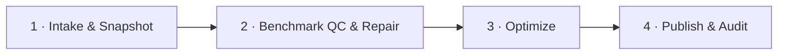
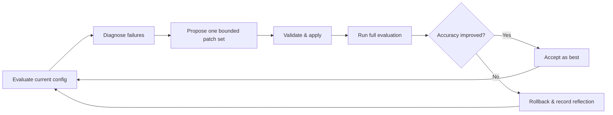

# Auto-Optimize (GSO)

Auto-Optimize measures a Genie Agent against its benchmark corpus, diagnoses failures, and tests targeted configuration changes. It is powered by the Genie Space Optimizer package in `packages/genie-space-optimizer/`.

Unlike the [IQ Scanner](/docs/features/iq-scanner), which produces an instant rule-based readiness score, Auto-Optimize runs a bounded optimization job against the live Space. Every attempt is evaluated, accepted only when accuracy improves, and persisted for audit.

## Four-task pipeline

The current Lakeflow Job is a linear four-task DAG:

| # | Task | Responsibility |
|---|------|----------------|
| 1 | **Intake & Snapshot** | Validate the run envelope, retain the trigger-time rollback snapshot, and write the `run_manifest` artifact. |
| 2 | **Benchmark QC & Repair** | Review question clarity and question-to-SQL alignment, validate SQL and ground-truth data, and—only when allowed for the run—repair or replace hard failures before persisting `benchmark_qc`. |
| 3 | **Optimize** | Apply low-risk Space quality enrichment, run the baseline evaluation, and execute the bounded patch/evaluation loop. |
| 4 | **Publish & Audit** | Resolve the stamped terminal reason, mark the champion when eligible, generate a best-effort audit summary, capture postflight IQ, and write terminal run state. |

Each task receives the complete job parameter set and exchanges durable state through Delta by `run_id`. There is no notebook chaining or task-value handoff.

### Benchmark quality review

Each run has an explicit benchmark policy. The Workbench defaults to **review
only**: GSO reviews the native benchmark questions captured in the pre-run
snapshot, excludes invalid questions from that run's evaluation corpus, and
does not generate, repair, push, or ledger any live benchmark mutation. Turning
on **Allow GSO to repair and add benchmarks** enables the bounded repair,
replacement, and live merge behavior used by earlier runs.

Benchmark QC separates five kinds of evidence: question quality,
question-to-SQL alignment, SQL validity, data validity, and review-system
health. A benchmark with a hard semantic or validation error is excluded from
the evaluation working set. Repair-enabled runs replace excluded questions
toward the configured target; review-only runs retain only the accepted native
subset. Wording that is weak but still has one defensible answer remains
eligible with a warning. A semantic-review outage is recorded as
`review_not_run`; it is never silently reported as a successful review.

Repair-enabled runs re-review every changed benchmark. If rewriting a question
reveals a follow-up expected-SQL correction, GSO applies that correction in a
later bounded repair round and reviews the result again. A benchmark leaves the
repair loop only when it passes, has no coherent actionable proposal, or
exhausts the configured repair limit. The reported repaired count includes only
benchmarks that finish trusted; the mutation ledger separately records every
question or SQL change that was actually published.

Generation targets 30 valid questions. A run may proceed with fewer when
generation or bounded repair cannot reach that ideal. At least 15 valid
questions are required to optimize; 15–29 is accepted with 30 still treated as
the target. If fewer than 15 remain, Optimize performs no evaluation or
configuration mutation and Publish & Audit records a terminal `SKIPPED` summary
with reason `INSUFFICIENT_VALID_BENCHMARKS`.

The `benchmark_qc` artifact records structured findings, review coverage,
quality counts, and proposed repairs. The **Benchmark Changes** panel surfaces
trusted, warning, and excluded counts alongside the mutation ledger. Long
mutation groups are disclosures; **Added** starts collapsed so generated
benchmark SQL does not dominate the run page.

Before review, and again after any repair or regeneration sweep, GSO
deduplicates normalized question text. The deterministic winner order is:
user/Genie-authored, SQL-valid, curated/P0, then stable input order. Every
rejected duplicate is recorded as a `removed` mutation with reason
`duplicate_normalized_question`; `benchmark_qc` also records the retained
question id.

The final corpus is written directly to
`genie_benchmarks_<domain>` as a Delta table with nested `inputs` and
`expectations` structs. MLflow is not used for dataset persistence, run
tracking, model registration, or evaluation; it is used only for LLM tracing.

## Optimization loop

The Optimize task uses a full-benchmark hill-climbing loop:

Iteration 0 is the baseline. Later rows are patch attempts. A candidate is accepted only when its full-evaluation accuracy is strictly greater than the best accepted accuracy; otherwise its patches and iteration are marked rolled back and the live serialized configuration is restored.

The controller stores attempt mode, hypothesis, decision, decision reason, best accuracy, retry memory, terminal reason, and champion state on `genie_opt_iterations`. Terminal stamping adds the terminal reason without overwriting the attempt's existing accept/reject decision.

## Levers

The strategist selects from the configured levers for each attempt:

| Lever | Area | Typical changes |
|-------|------|-----------------|
| 1 | Tables & columns | Table and column descriptions, synonyms |
| 2 | Metric views | Governed metric definitions and routing |
| 3 | Table-valued functions | Parameterized query patterns |
| 4 | Join specifications | Preferred relationships and join keys |
| 5 | Instructions | Business vocabulary, routing rules, constraints, examples |
| 6 | SQL expressions | Reusable filters, measures, expressions, and worked SQL |

Before baseline evaluation, a narrow Space-quality phase may also fill low-risk curation gaps such as an empty top-level Space description, thin instructions, and prompt-matching flags. Format assistance is enabled on visible columns, while entity matching is allocated deterministically to eligible string columns using UC types, cardinality, benchmark references, and RLS safeguards. These flags are not proposed by the LLM lever loop. The post-enrichment description is persisted separately because Genie stores `description` as Space metadata, outside `serialized_space`.

For wide schemas, column ranking can use workspace-scoped
`system.query.history` after filtering to finished `SELECT` statements that
reference configured assets and excluding the GSO service principal. Two
strict Databricks-generated profiling signatures are also excluded: the
`WITH SampledData` null/distinct-count batch and the exploded
`approx_top_k(...).item.item AS value` query. Ordinary CTEs and ordinary
`approx_top_k` analytics remain eligible.

## Evaluation and leakage safety

Current runs use Genie's native benchmark Eval-Run API as the sole evaluation
harness and persist the official evaluation run identifiers, status, question
counts, correctness counts, and needs-review counts. Headline accuracy is
`num_correct / num_questions` for native evaluation rows.

Benchmark expected SQL is evaluation truth and must never become inference-visible configuration. The optimizer's leakage firewall blocks patches that copy or closely echo benchmark answer material into instructions, examples, descriptions, or other Space content.

## Terminal outcomes

The loop stamps one of the typed reasons below. Publish & Audit uses that stamped reason and never re-derives it from accuracy.

| Terminal reason | Run status | Champion publish |
|-----------------|------------|------------------|
| `TARGET_REACHED` | `CONVERGED` | Yes |
| `MAX_ATTEMPTS` | `MAX_ITERATIONS` | Yes |
| `NO_NEW_HYPOTHESIS` | `STALLED` | No |
| `EVAL_INVALID` | `FAILED` | No |
| `CONFIG_VALIDATION_FAILED` | `FAILED` | No |
| `LOOP_STATE_INVALID` | `FAILED` | No |
| `EVAL_BUDGET_EXHAUSTED` | `STALLED` | No |
| `INSUFFICIENT_VALID_BENCHMARKS` | `SKIPPED` | No; Optimize does not run |
| Missing or unknown | `STALLED` | No, fail closed |

Publishing is an idempotent Delta champion mark. Accepted patches are already applied to the live Space by the loop; Publish & Audit does not replay them. Audit-summary generation and postflight IQ capture are soft-failing and cannot prevent the final status write.

## History, revert, and discard

Optimization History separates **View Details** and **Revert Options** into
different columns. The benchmark-handling column records whether the run was
review-only or repair-enabled and, for repair-enabled runs, how many live
benchmark additions or SQL updates it made.

One **Revert Options** action opens a dialog with two independent choices:

- **Agent config:** restore the run's champion or its pre-run baseline.
- **Benchmarks:** restore the champion iteration's benchmark block, preserve
  the current live benchmark block, or restore the run's pre-run baseline
  benchmark block.

The dialog defaults to restoring both the champion config and its benchmarks.
It previews how many benchmarks either historical snapshot will add, remove, or
update and requires confirmation before replacing the live Agent. A history
revert does not change the historical run status. Champion config restores the
captured post-enrichment description when available; legacy runs preserve the
current description.

Optimization History compares the live Agent configuration and benchmark block
independently with every visible captured baseline and champion. Runs removed
from Workbench history are excluded from this comparison. A green **Live** badge
means both components match the same version. If they match different known
versions—for example, champion config with baseline benchmarks—the history
shows the state as mixed without treating it as external drift. If either
component matches no visible captured version, a warning names the changed
component, including benchmark-only edits made directly in the Genie UI or API.
For older runs that predate authoritative captures, the UI reports that history
is incomplete instead of claiming an external change. Returning to the
Workbench tab after a direct Genie UI edit forces a fresh live-state check.

**Discard** remains the pre-Apply resolution action. It restores the complete
trigger-time snapshot, including the original benchmark block and top-level
description, then marks the run `DISCARDED` only after rollback succeeds.

Both paths snapshot live state before a two-part serialized-config/description mutation. If the description update fails after the serialized config succeeds, the optimizer attempts compensation and never reports success for the partial operation.

History revert is disabled while any run for the same Space is active. The backend also reconciles all same-Space runs and returns a conflict if one remains `QUEUED`, `IN_PROGRESS`, or `RUNNING`.

Terminal runs also have **Remove from history**. After confirmation, the run
disappears for everyone from Optimization History and the unified History
chart. This is a Workbench display tombstone: it does not change the live Genie
Agent, delete the Databricks workflow run, or purge GSO Delta audit records.
The action requires `CAN_EDIT` or `CAN_MANAGE` on the Agent and is unavailable
while the selected run is active. Lakebase must be available so the removal is
durable across app restarts.

## Permission model

The app service principal owns optimizer Delta state and executes the Lakeflow Job. A history action therefore reads internal state with the SP, but separately authorizes the requesting OBO user against the target Genie Agent. The user must have `CAN_EDIT` or `CAN_MANAGE`; the SP's broader access never substitutes for user authorization.

See [Authentication & Permissions](/docs/platform/authentication) for setup and required grants.

## Durable state

The main current-run sources of truth are:

| Table | Contents |
|-------|----------|
| `genie_opt_runs` | Run envelope, trigger snapshot, status, champion pointer, terminal reason |
| `genie_opt_stages` | Four-task and nested-stage timeline |
| `genie_opt_iterations` | Baseline/attempt evaluation and controller state |
| `genie_opt_patches` | Applied and rolled-back patch records |
| `genie_opt_benchmark_mutations` | Benchmark QC additions, removals, and changes |
| `genie_benchmarks_<domain>` | Direct Delta handoff of the deduplicated benchmark corpus to Optimize |
| `genie_opt_artifacts` | `run_manifest`, `benchmark_qc`, `space_quality_enrichment`, and `publish_record` payloads |
| `genie_opt_scan_snapshots` | Optional paired preflight/postflight IQ snapshots |

Workbench stores removed-history tombstones separately in Lakebase table
`genie.hidden_optimization_runs`; GSO audit tables remain immutable.

The Workbench prefers Lakebase synced reads for UI views and falls back to direct Delta reads where needed. Mutating integration paths use the configured SQL Warehouse and SP-owned state.

## Triggering from the UI

1. Open a Space and select **Optimize**.
2. Configure levers, target accuracy, attempt budget, model, and whether GSO may repair or add live benchmarks. Repair is off by default.
3. Start the run. The UI submits `POST /api/auto-optimize/trigger` and polls the run status.
4. Review the attempt ladder, question results, patches, benchmark QC, audit summary, and terminal outcome.
5. Keep the accepted state, discard it to the trigger snapshot, or later use **Revert Options** to choose a past config and benchmark scope independently.

## Source files

- `packages/genie-space-optimizer/databricks.yml` — four-task job definition
- `packages/genie-space-optimizer/src/genie_space_optimizer/jobs/` — task notebooks
- `packages/genie-space-optimizer/src/genie_space_optimizer/optimization/unified_loop.py` — optimizer controller
- `packages/genie-space-optimizer/src/genie_space_optimizer/optimization/publish.py` — publish and audit
- `packages/genie-space-optimizer/src/genie_space_optimizer/integration/` — trigger, apply, discard, and history revert
- `backend/routers/auto_optimize.py` — Workbench API bridge

## Related documentation

- [Debug GSO runs with Genie Code](/docs/reference/gso-run-debugger)
- [Authentication & Permissions](/docs/platform/authentication)
- [IQ Scanner](/docs/features/iq-scanner)
- [Operations Guide](/docs/platform/operations)
