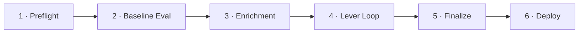
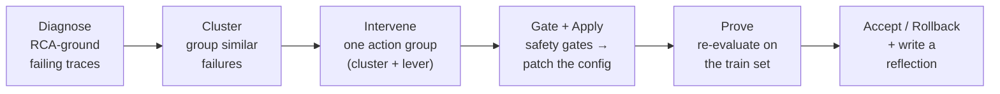

# Auto-Optimize (GSO)

Auto-Optimize is a benchmark-driven optimization pipeline that measures Genie Agent accuracy, diagnoses failures, and iteratively applies metadata patches until quality thresholds are met. It is powered by the Genie Space Optimizer (GSO) engine — a separate Python package at `packages/genie-space-optimizer/`.

## Overview

Unlike the [IQ Scanner](/docs/features/iq-scanner) (which produces instant rule-based findings), Auto-Optimize runs a **closed-loop pipeline**: it generates benchmarks, evaluates Genie's generated SQL against expected answers using specialized judges, identifies failure patterns, proposes and tests metadata changes, and only commits changes that pass multi-stage evaluation gates.

## The 6-Task Pipeline

The optimization runs as a Databricks Lakeflow Job with six sequential tasks:



### Task Details

| # | Task | Purpose | Key Actions |
|---|------|---------|-------------|
| 1 | **Preflight** | Validate prerequisites | Check SP permissions, verify benchmark questions, validate table access, ensure Prompt Registry is enabled |
| 2 | **Baseline Evaluation** | Measure current accuracy | Run all benchmark questions through Genie, evaluate with 9 judges, establish baseline score |
| 3 | **Enrichment** | Gather optimization context | Proactive metadata enrichment — profile tables, analyze query patterns, identify improvement opportunities |
| 4 | **Lever Loop** | Iterative optimization | The core loop: RCA-ground failures → cluster → pick one action group (cluster + lever) → generate patches → safety gates → apply → re-evaluate → accept or roll back |
| 5 | **Finalize** | Consolidate results | Merge accepted patches, validate final configuration, compute final accuracy |
| 6 | **Deploy** | Apply to agent | Optionally apply the optimized configuration to the live Genie Agent |

## The Levers

Levers are the categories of metadata change the optimizer can apply. **Lever 0 (Proactive Enrichment)** always runs first — in the Enrichment task — and is not user-selectable. **Levers 1–6** are the adaptive levers the lever loop chooses from; they can be selected per run from the Optimize tab.

| Lever | Name | Target | Examples |
|-------|------|--------|----------|
| **0** | Proactive Enrichment *(always-on)* | UC metadata the agent doesn't yet inline | Table/column descriptions, glossary terms, UC tags — non-behavioral context only |
| **1** | Tables & Columns | Table allowlist + per-column metadata | Add a table, add column synonyms/aliases, mark deprecated columns |
| **2** | Metric Views | Governed metric definitions | Add or refine a metric view for a common aggregation |
| **3** | Table-Valued Functions | Parameterized SQL patterns | Register a TVF for a recurring query shape |
| **4** | Join Specifications | Table relationships | Add or correct a join spec / preferred join key |
| **5** | Genie Agent Instructions | Natural-language guidance | Add a domain term, routing rule, or guardrail to the instructions block |
| **6** | SQL Expressions | Example SQL library | Add a worked example, replace a stale one |

The lever loop's **strategist** analyzes current failure patterns and selects the lever most likely to address them.

## The Lever Loop

The heart of Auto-Optimize is an evidence-grounded iteration — **measure, diagnose, intervene, prove, learn** — that never changes the Genie Agent on a hunch:



1. **Diagnose** — for every failing benchmark question, the optimizer builds a root-cause (RCA) ledger from the trace: the SQL Genie wrote, the judge verdicts, and the tables/joins it used.
2. **Cluster** — failures sharing a root cause are grouped so one patch can fix a whole theme.
3. **Intervene** — the strategist commits to exactly **one** action group per iteration (a cluster paired with a lever). One change at a time keeps cause and effect attributable.
4. **Gate + apply** — proposed patches run the safety gates (below); survivors are applied to a candidate config, with a pre-iteration snapshot kept for rollback.
5. **Prove** — the train benchmark is re-evaluated through the patched agent with the same judge panel.
6. **Accept / learn** — the acceptance rule (below) keeps or rolls back the change, and a reflection entry records what worked so the strategist won't repeat a dead end.

## Acceptance: did the score actually improve?

Each iteration is kept or discarded by a single explicit rule (`decide_acceptance`): the **post-arbiter accuracy** of the patched agent must beat the carried baseline by at least a gain floor.

```
accept if  candidate_accuracy ≥ baseline_accuracy + min_gain_pp
```

| Outcome | Condition |
|---------|-----------|
| `ACCEPTED` | Gain ≥ `min_gain_pp` and no regression |
| `REJECTED_INSUFFICIENT_GAIN` | Score moved up by less than the floor |
| `REJECTED_REGRESSION` | Score went down |

The gain floor is `MIN_POST_ARBITER_GAIN_PP` (env `GSO_MIN_POST_ARBITER_GAIN_PP`, default `0.0` — so any genuine positive gain is accepted). A rejected patch set is **rolled back** from its pre-iteration snapshot, and the strategist records a reflection entry so it doesn't retry the same approach.

## Safety Gates

Before a proposed patch is ever applied, it must clear a pipeline of safety gates (`GATE_PIPELINE_ORDER`). Only survivors get applied and evaluated:

| Gate | What it checks |
|------|----------------|
| `intra_ag_dedup` | Collapses duplicate proposals within the action group |
| `lever5_structural` | Rejects proposals with empty patch content (no `patch_text` / `value` / `new_text` / `example_sql`) |
| `rca_groundedness` | The patch must carry an `rca_id` linking it to a clustered RCA finding — no guessing |
| `blast_radius` | Caps how many distinct tables a single patch may touch (default 5) |
| `content_fingerprint_dedup` | Drops patches whose content fingerprint was already rolled back |
| `dead_on_arrival` | Drops no-op patches (they wouldn't change the config) and records their signature |

:::note
`slice`, `p0`, `full`, `held_out`, and `enrichment` are evaluation **scopes**, not gates. The older slice + P0 pre-gates are disabled by default (`GSO_ENABLE_LEGACY_SLICE_P0_GATES=false`); acceptance is now decided by the single full-eval criterion above.
:::

## The 9 Judges

Every benchmark answer is scored by a panel of nine judges (`make_all_scorers` / `EXPECTED_JUDGE_SET`), each evaluating a different dimension of SQL correctness:

| Judge | Kind | What it evaluates |
|-------|------|-------------------|
| `syntax_validity` | code | The generated SQL is valid (passes `EXPLAIN`) |
| `schema_accuracy` | LLM | References the correct tables, columns, and joins |
| `logical_accuracy` | LLM | Correct aggregations, filters, GROUP BY / ORDER BY / WHERE |
| `semantic_equivalence` | LLM | Measures the same thing as the expected SQL, even if written differently |
| `completeness` | LLM | Fully answers the question (no missing dimensions/measures/filters) |
| `response_quality` | LLM | Genie's natural-language explanation accurately describes the SQL and answer |
| `asset_routing` | code | Genie used the correct asset type (metric view / TVF / table) |
| `result_correctness` | code | Returned result set matches the expected result |
| `arbiter` | LLM (conditional) | On a result mismatch, decides whether the ground-truth or Genie's SQL is correct |

The panel is **3 deterministic code judges** (`syntax_validity`, `asset_routing`, `result_correctness`) plus **6 LLM judges**. The `arbiter` fires only when `result_correctness` flags a mismatch; after it adjudicates, the resulting **post-arbiter accuracy** is the single number the acceptance rule compares against the baseline. Two further judges (`repeatability`, `previous_sql`) are diagnostic-only and never drive acceptance.

Judge prompts are managed via **MLflow Prompt Registry**, providing version control and traceability for evaluation criteria.

## Finalize: generalization & repeatability

A candidate that scores well on the questions it was tuned against might simply be overfit. The Finalize task guards against that before anything is promoted:

- **Held-out generalization** — at preflight the benchmark is split, reserving ~15% (`HELD_OUT_RATIO = 0.15`) of questions that the lever loop **never sees**. Finalize evaluates the candidate against this held-out set; a large train-vs-held-out gap flags overfitting.
- **Repeatability** — the candidate is re-run to confirm the score is stable rather than a lucky draw from LLM-graded variance.
- **Champion promotion** — each accepted iteration is snapshotted as an MLflow **LoggedModel**; the best is promoted to the **`champion`** alias (`promote_best_model`). The Deploy task applies that champion config to the live agent.

## Convergence

The lever loop terminates when one of three conditions is met:

| Status | Condition | Meaning |
|--------|-----------|---------|
| `CONVERGED` | Accuracy target reached (typically ≥ 85%) | Optimization succeeded |
| `STALLED` | No improvement across consecutive iterations | Further optimization is unlikely |
| `MAX_ITERATIONS` | Iteration limit reached (default 5) | Time-boxed stop |

The IQ Scanner checks for terminal GSO runs when evaluating checks 11 and 12. A `CONVERGED` run with `best_accuracy ≥ 85%` satisfies both checks.

## Data Persistence

Auto-Optimize stores all state in **12 Delta tables** under `GSO_CATALOG.GSO_SCHEMA`:

| Table | Contents |
|-------|----------|
| `genie_opt_runs` | Run metadata: status, accuracy, timestamps, config |
| `genie_opt_iterations` | Per-iteration evaluation results |
| `genie_opt_patches` | All patches generated (accepted and rejected) |
| `genie_opt_suggestions` | Strategist suggestions per iteration |
| `genie_opt_eval_results` | Detailed per-question evaluation results |
| `genie_opt_asi_results` | ASI (judge) results per question per iteration |
| `genie_opt_benchmarks` | Benchmark question definitions |
| `genie_opt_enrichments` | Proactive enrichment data |
| `genie_opt_lever_configs` | Lever configuration per run |
| `genie_opt_space_snapshots` | Space config snapshots (before/after) |
| `genie_opt_failure_clusters` | Failure pattern clusters |
| `genie_opt_reflection` | Reflection buffer (what worked, what didn't) |

The Workbench frontend reads this data through `backend/routers/auto_optimize.py`, which queries Lakebase synced tables (preferred) or falls back to direct Delta queries via the SP.

## Permission Model

The optimization job runs entirely as the app's **Service Principal** (SP). See [Authentication & Permissions](/docs/platform/authentication) for the full security model, including:

- Why jobs can't use OBO
- How user authorization is verified before job submission
- What SP permissions are required

## MLflow Integration

- **Experiment tracking**: each optimization run is tracked as an MLflow experiment
- **Prompt Registry**: judge prompts are versioned in MLflow Prompt Registry, enabling reproducible evaluations
- **Configuration versioning**: each accepted iteration is snapshotted as an MLflow LoggedModel; the winning config is promoted to the **`champion`** alias and applied on deploy
- **`MLFLOW_EXPERIMENT_ID`**: configured in `app.yaml`, validated at startup

:::warning
MLflow Prompt Registry must be enabled on the workspace. If disabled, the preflight task will fail with `FEATURE_DISABLED`.
:::

## Triggering from the UI

Users trigger optimization from the **Optimize** tab in the Space Detail view:

1. The UI calls `GET /api/auto-optimize/permissions/{space_id}` to pre-check SP access
2. User configures options (apply mode, levers) and clicks "Optimize"
3. `POST /api/auto-optimize/trigger` starts the job (see [trigger flow](/docs/platform/authentication#optimization-trigger-flow))
4. The UI polls `GET /api/auto-optimize/runs/{run_id}/status` for progress
5. On completion, the user can review patches and choose to apply or discard

## Source Files

- `packages/genie-space-optimizer/` — the GSO engine package
- `backend/routers/auto_optimize.py` — 16 API endpoints for GSO management
- `backend/services/gso_lakebase.py` — synced table reads
- `backend/main.py` — `_ensure_gso_job_run_as()` startup hook
- `databricks.yml` — job definition for the optimization DAG

## Related Documentation

- [Authentication & Permissions](/docs/platform/authentication) — SP-based execution model
- [IQ Scanner](/docs/features/iq-scanner) — checks 11–12 evaluate optimization results
- [Operations Guide](/docs/platform/operations) — managing the GSO job
