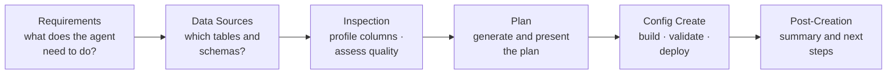

# Create Agent

The Create Agent is a multi-turn, tool-calling LLM agent that walks users from business requirements to a fully configured and deployed Genie Agent. It handles data discovery, profiling, plan generation, config assembly, validation, and agent creation — all through a conversational interface.

## How It Works

The agent follows a structured progression through six steps. Each step focuses on gathering specific information before moving to the next:

### Step Descriptions

| Step | Label | What Happens |
|------|-------|-------------|
| `requirements` | Understanding Requirements | Agent gathers business context, use case, terminology, and target audience |
| `data_sources` | Discovering Data | Agent browses Unity Catalog (catalogs → schemas → tables) to find relevant tables |
| `inspection` | Inspecting Tables | Agent profiles columns, assesses data quality, and checks table usage patterns |
| `plan` | Building Plan | Agent generates a structured plan with tables, questions, example SQLs, benchmarks |
| `config_create` | Creating Agent | Agent builds the `serialized_space` config, validates it, and creates the Genie Agent |
| `post_creation` | Done | Agent provides a summary, the agent URL, and suggests next steps (e.g., run IQ Scan) |

Step detection is automatic — the agent infers the current step from conversation history using `detect_step()` in `backend/prompts_create/`.

## Tool Inventory

The agent has access to 17 tools organized into six categories:

### UC Discovery

| Tool | Purpose |
|------|---------|
| `discover_catalogs` | List Unity Catalog catalogs accessible to the user |
| `discover_schemas` | List schemas within a catalog |
| `discover_tables` | List tables within a catalog.schema |
| `describe_table` | Get full table metadata (columns, types, comments) |

### Profiling & Quality

| Tool | Purpose |
|------|---------|
| `profile_columns` | Statistical profiling: distinct counts, nulls, min/max, sample values |
| `assess_data_quality` | Data quality assessment: completeness, consistency, anomalies |
| `profile_table_usage` | Usage patterns: query frequency, access patterns |

### SQL

| Tool | Purpose |
|------|---------|
| `test_sql` | Execute a SQL query on the warehouse (throttled to 8 concurrent) |
| `discover_warehouses` | List available SQL warehouses |

### Schema & Config

| Tool | Purpose |
|------|---------|
| `get_config_schema` | Return the Genie Agent JSON schema reference |
| `generate_config` | Build a `serialized_space` config from the plan |
| `validate_config` | Validate a config against the Genie API schema (errors + warnings) |
| `update_config` | Modify an existing agent's config |

### Plan

| Tool | Purpose |
|------|---------|
| `generate_plan` | Generate a structured plan (delegates to parallel plan builder) |
| `present_plan` | Present the plan to the user for review/editing |

### Deploy

| Tool | Purpose |
|------|---------|
| `create_space` | Create a new Genie Agent via the Databricks API |
| `update_space` | Update an existing Genie Agent |

## Parallel Plan Generation

When the agent calls `generate_plan`, the request is routed to `backend/services/plan_builder.py`, which splits the work into five parallel sections:

| Section | Content Generated |
|---------|-------------------|
| `tables` | Table selection, descriptions, column configs |
| `questions` | Sample questions for the agent |
| `example_sqls` | Example question-SQL pairs with usage guidance |
| `benchmarks` | Benchmark question-answer pairs for accuracy measurement |
| `analytics` | Join specs, measures, filters, expressions |

These sections are generated concurrently using a `ThreadPoolExecutor` with 3 workers. After all sections complete, `_assemble()` merges the results and `_validate_plan_sqls()` runs SQL validation with 8 concurrent checks to catch syntax errors.

## Fast Path

When the user reviews the plan in the UI and clicks "Create" (sending `action: "create"` with `edited_plan`), the agent uses `_fast_create` to skip additional LLM rounds. It directly:

1. Calls `generate_config` to build the `serialized_space` from the plan
2. Calls `validate_config` to check for errors
3. Calls `create_space` (or `update_space` if modifying an existing agent)

This avoids unnecessary LLM inference and completes in seconds.

## Auto-Chain

After certain tool calls, the agent automatically chains to the next logical step without requiring another LLM turn:

- After `generate_config` → automatically calls `validate_config`
- After `validate_config` (if clean) → automatically calls `create_space` or `update_space`

This reduces latency and keeps the flow smooth.

## Streaming Protocol

The create agent uses SSE (Server-Sent Events) to stream progress to the frontend. Each event is a JSON object with a `type` field:

| Event Type | Purpose |
|------------|---------|
| `session` | Session ID for reconnection |
| `step` | Current step label and thinking status |
| `thinking` | Agent is processing (shows thinking indicator) |
| `tool_call` | Agent is calling a tool (name + arguments) |
| `tool_result` | Tool execution result |
| `message_delta` | Incremental text from the LLM (streamed token-by-token) |
| `message` | Complete message from the agent |
| `created` | Genie Agent was created (includes space ID and URL) |
| `updated` | Existing agent was updated |
| `heartbeat` | Keep-alive ping (every 15s to prevent proxy timeout) |
| `error` | Something went wrong |
| `done` | Stream complete (may include `needs_continuation: true`) |

### Continuation Protocol

Each HTTP request performs exactly **one** LLM inference plus **one** batch of tool calls, then closes. This keeps each response under the Databricks Apps reverse proxy timeout (~120s).

When the LLM requests tools, the `done` event carries `needs_continuation: true`. The frontend immediately opens a new SSE stream with an empty message to start the next round. This creates a seamless multi-turn experience while respecting HTTP timeout limits.

## Session Persistence

Agent sessions are persisted across page refreshes:

- **L1 (in-memory)**: Fast access for active sessions
- **L2 (Lakebase)**: Durable storage; sessions survive app restarts

`backend/services/create_agent_session.py` manages the two-tier cache. Sessions store the full message history and current step, enabling reconnection via `GET /api/create/agent/sessions/{session_id}`.

## Source Files

- `backend/services/create_agent.py` — agent orchestration and streaming
- `backend/services/create_agent_tools.py` — all 17 tool definitions
- `backend/services/plan_builder.py` — parallel plan generation
- `backend/services/create_agent_session.py` — session persistence
- `backend/routers/create.py` — HTTP endpoints
- `backend/prompts_create/` — prompt templates for each step

## Related Documentation

- [IQ Scanner](/docs/features/iq-scanner) — run after creating an agent to assess quality
- [Architecture Overview](/docs/getting-started/architecture-overview) — how the create agent fits in the app
