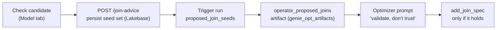

# Join Advisor

The **Join Advisor** lives in the [Model tab](/docs/features/semantic-model) and
proposes **data-grounded** candidate joins the Agent's model does not declare yet.
Its defining principle: a proposed join is **advice for the optimizer, never an
edit to the Genie Agent config**. The Workbench does not make ad-hoc edits to
`serialized_space` — that belongs to the Genie product UI. Instead, a checked
candidate is persisted as a **seed** that the next [Auto-Optimize](/docs/features/auto-optimize)
run re-validates against data and adds itself.

## Why advice, not a direct edit

The optimizer's patch allowlist (`unified_loop.py`) permits `add_join_spec` and
`update_join_spec` but **drops `remove_join_spec`**. A declared join is therefore
effectively *locked* — a wrong one cannot be undone by a later run. Writing a join
directly from a UI checkbox would be a foot-gun. So the Join Advisor deliberately
stops short of declaring anything: it hands the optimizer a **hypothesis to
validate**, and the optimizer adds only the joins that hold.

## Candidate discovery

`GET /api/auto-optimize/spaces/{space_id}/join-candidates` reads the live
`serialized_space` (OBO-tolerant, like the semantic-graph route) and discovers
candidates two ways, then scores each with a warehouse **containment probe**:

- **Declared UC foreign keys** between configured tables.
- **Name + type matching** — likely key columns that share a name and type across
  two tables.

The probe measures row **containment** — is `from.fromCol ⊆ to.toCol`? — as a
ratio in `[0, 1]`. It is **honest-empty**: when no warehouse is available to probe,
the ratio is `null` (never a silent `0`), and the response `status` reflects "no
warehouse" or "no candidates" rather than failing.

## Verdicts

Each candidate carries a verdict derived from its containment ratio:

| Verdict | Containment | Meaning |
|---------|-------------|---------|
| validated | ≥ 90% | Strong row containment — a confident candidate |
| partial | 50–89% | Some containment — plausible but imperfect |
| unverified | &lt; 50%, or no warehouse probe | Weak or unmeasured |

Turning on a **weak** candidate (containment `< 50%` or unprobed) trips a
**confirm gate** before it can be seeded, so an unverified join is never seeded by
accident.

In the Blueprint, a candidate renders as a **dashed `proposed_join` overlay** —
never a base relationship edge — preserving the *arrows require proof* invariant.

## From seed to optimizer

Seeding is a two-step handoff that keeps the advice auditable and re-validated:

1. **Persist.** `POST /api/auto-optimize/spaces/{space_id}/join-advice` saves the
   checked candidates to Lakebase (`join_advice`), tagged with the seeding user.
   An empty `seeds` array clears the pending advice.
2. **Carry into the run.** `trigger` passes the pending seeds as
   `proposed_join_seeds`, written best-effort as a run-scoped
   `operator_proposed_joins` artifact in `genie_opt_artifacts`.
3. **Inject as advice.** At loop start the optimizer reads that artifact
   (`_load_operator_proposed_joins`) and projects each seed into the LLM prompt
   under `operator_proposed_joins`, with explicit guidance: *"treat each as a
   hypothesis to validate, not as ground truth."*
4. **Validate and add.** The optimizer adds only the joins that hold, via
   `add_join_spec`. Nothing here writes a declared `join_spec` on the operator's
   behalf, and a write failure never fails the run — the loop simply sees no
   operator advice.

## Endpoints

| Method | Path | Purpose |
|--------|------|---------|
| `GET` | `/api/auto-optimize/spaces/{space_id}/join-candidates` | Discover data-grounded candidates with containment verdicts |
| `GET` | `/api/auto-optimize/spaces/{space_id}/join-advice` | Read the pending seeded advice for a space |
| `POST` | `/api/auto-optimize/spaces/{space_id}/join-advice` | Seed (or clear) the advice — never a config edit |

## Source files

- `backend/services/join_advisor.py` — candidate discovery + containment probe
- `frontend/src/components/model/blueprint/advisor.ts` — verdict thresholds,
  weak-probe confirm gate, seed payload shape
- `backend/routers/auto_optimize.py` — `/join-candidates` and `/join-advice`
- `backend/services/lakebase.py` — `save_join_advice` / `get_join_advice`
- `packages/genie-space-optimizer/src/genie_space_optimizer/integration/trigger.py`
  — writes the `operator_proposed_joins` artifact
- `packages/genie-space-optimizer/src/genie_space_optimizer/optimization/unified_loop.py`
  — reads seeds and injects them into the optimizer prompt

## Related documentation

- [Semantic Model (Blueprint)](/docs/features/semantic-model) — where the Join Advisor lives
- [Auto-Optimize](/docs/features/auto-optimize) — the run that validates and applies seeded joins
