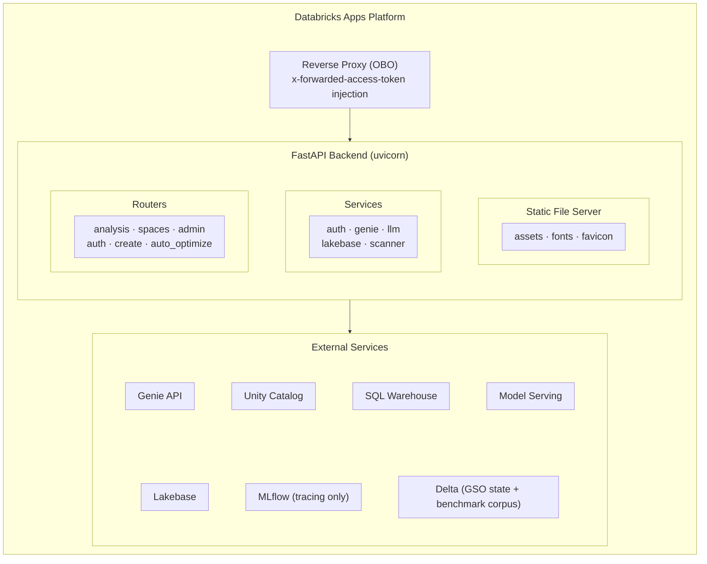

# Architecture Overview

Genie Workbench is a full-stack application deployed as a [Databricks App](https://docs.databricks.com/aws/en/dev-tools/databricks-apps/). This document describes the major components, their interactions, and the data flows between them.

## High-Level Architecture

## Backend Structure

The backend is a FastAPI application (`backend/main.py`) that provides REST API endpoints and serves the built React frontend as static files.

### Entry Point (`backend/main.py`)

- Registers `OBOAuthMiddleware` for user identity on all `/api/*` routes
- Mounts routers with their prefixes
- Serves `frontend/dist/` as static files (SPA with fallback to `index.html`)
- On startup, ensures the GSO job's `run_as` matches the app's SP via `_ensure_gso_job_run_as()`

### Routers

| Router | Prefix | Purpose |
|--------|--------|---------|
| `analysis.py` | `/api` | Space fetch/parse, app settings, debug auth |
| `spaces.py` | `/api` | Space listing, scanning, history, starring |
| `admin.py` | `/api/admin` | Org-wide dashboard, leaderboard, alerts |
| `auth.py` | `/api/auth` | Current user info, health check |
| `create.py` | `/api/create` | Create agent chat, UC discovery, wizard, session management |
| `auto_optimize.py` | `/api/auto-optimize` | GSO trigger, run management, results, patches, and benchmark changes |

See [Appendix A: API Reference](/docs/reference/api) for the complete endpoint list.

### Services

| Service | File | Purpose |
|---------|------|---------|
| Auth | `services/auth.py` | OBO `ContextVar` management, SP singleton, `WorkspaceClient` factory |
| Genie Client | `services/genie_client.py` | Genie API: fetch space, list spaces, SP fallback on scope error |
| Scanner | `services/scanner.py` | Rule-based IQ scoring (12 checks, 3 maturity tiers) |
| Create Agent | `services/create_agent.py` | Multi-turn tool-calling LLM agent for agent creation |
| Create Agent Tools | `services/create_agent_tools.py` | Tool definitions: UC discovery, SQL, config generation |
| Create Agent Session | `services/create_agent_session.py` | Session persistence (L1 in-memory + L2 Lakebase) |
| Plan Builder | `services/plan_builder.py` | Parallel LLM plan generation across 5 sections |
| LLM Utils | `services/llm_utils.py` | OpenAI-compatible LLM client via Databricks model serving |
| UC Client | `services/uc_client.py` | Unity Catalog browsing (catalogs, schemas, tables) |
| Lakebase | `services/lakebase.py` | PostgreSQL persistence with in-memory fallback |
| GSO Lakebase | `services/gso_lakebase.py` | GSO synced table reads from Lakebase |

### Prompt Templates

- `backend/prompts/` — templates for analysis
- `backend/prompts_create/` — modular templates for the create agent (step detection, system prompts, tool instructions)
- `backend/references/schema.md` — Genie Agent JSON schema reference (needed at runtime)

## Frontend Structure

The frontend is a React 19 + TypeScript + Tailwind CSS v4 application built with Vite.

### Navigation

`App.tsx` uses React state (not a router library) to switch between four views:

| View | Component | Description |
|------|-----------|-------------|
| `list` | `SpaceList` | Browse and search Genie Agents with IQ scores |
| `detail` | `SpaceDetail` | Space detail with tabs: Score, Optimize, History |
| `admin` | `AdminDashboard` | Org-wide stats, leaderboard, alerts |
| `create` | `CreateAgentChat` | Conversational agent for building new Genie Agents |

### Component Organization

- `components/ui/` — design system primitives (button, card, badge, etc.) using `class-variance-authority`
- `components/auto-optimize/` — 24 components for the GSO optimization UI
- `pages/` — `SpaceList`, `SpaceDetail`, `AdminDashboard`, `HistoryTab`, `IQScoreTab`
- `hooks/` — `useAnalysis`, `useTheme`
- `lib/api.ts` — all API calls and SSE streaming helpers
- `types/index.ts` — TypeScript mirrors of backend Pydantic models

### Design System

- **Primary accent**: Electric Indigo (`#4F46E5`)
- **Secondary accent**: Cyan (`#06B6D4`)
- **Themes**: Light and dark mode via CSS variables on `:root` / `.dark`, toggled by `useTheme()` hook
- **Fonts**: Cabinet Grotesk (display), General Sans (body), JetBrains Mono (code)

## GSO Package

The `packages/genie-space-optimizer/` directory contains the Python optimization engine:

- **Python engine** — benchmark QC, native patch/evaluation loop, publish, and durable Delta state
- **Four job notebooks** — intake, benchmark QC/repair, optimize, and publish/audit
- **Deployed as** — a wheel installed into the Workbench app environment and the four-task Databricks Job
- **Dependencies** — package-local `pyproject.toml` with the repository-root `uv.lock`

The Workbench app owns the FastAPI and React surfaces and exposes GSO through `backend/routers/auto_optimize.py`.

## Data Flows

### SSE Streaming

One endpoint uses Server-Sent Events via FastAPI's `StreamingResponse`:

| Endpoint | Use |
|----------|-----|
| `/api/create/agent/chat` | Create agent events (15s keepalive) |

The frontend consumes SSE via manual `fetch` + `ReadableStream` in `lib/api.ts` (not the `EventSource` API). Buffers are split on `\n\n` delimiters.

For SSE endpoints, the OBO `ContextVar` is **not** cleared after `call_next` in the middleware, because the response body streams lazily after the middleware returns. Streaming handlers stash the user token on `request.state` and re-set it inside the generator.

### Persistence

| Store | Technology | Contents |
|-------|-----------|----------|
| Lakebase | PostgreSQL (asyncpg) | `scan_results`, `starred_spaces`, `seen_spaces`, `optimization_runs`, `agent_sessions` |
| Delta Tables | Unity Catalog | GSO optimization state plus the direct `genie_benchmarks_<domain>` corpus handoff under `GSO_CATALOG.GSO_SCHEMA` |
| MLflow | Tracing | LLM call traces only; no Dataset, run-tracking, model-registry, or evaluation dependency |

Lakebase degrades gracefully to in-memory dictionaries when `LAKEBASE_HOST` is not configured, making the app functional (but non-persistent) without a database.

## Key Design Decisions

1. **No local dev server** — the app depends on Databricks OBO auth, Lakebase, and model serving endpoints that are only available inside a Databricks App environment. All testing is done by deploying to a real workspace.

2. **Two deployment mechanisms** — `deploy.sh` manages the app (create, sync, `databricks apps deploy`); the GSO optimization job is managed by DABs (`databricks bundle deploy -t app`). They coexist but are independent.

3. **Pydantic/TypeScript model sync** — `backend/models.py` and `frontend/src/types/index.ts` must be kept in sync manually. There is no code generation step.

4. **Root `package.json` is a no-op** — exists solely to satisfy the Databricks Apps platform build hook. The real frontend build happens in `frontend/`.

## Next Steps

- [Authentication & Permissions](/docs/platform/authentication) — the dual auth model in detail
- [API Reference](/docs/reference/api) — complete endpoint listing
