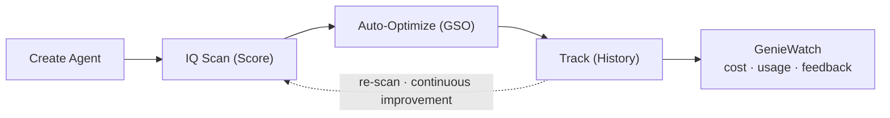

# Introduction

## What is Genie Workbench?

Genie Workbench is a developer tool for Databricks Genie Agents — the natural-language-to-SQL interface for business users. It addresses the gap between creating a Genie Agent and having one that reliably produces correct SQL: most agents start with incomplete metadata, missing instructions, and no benchmarks, leading to poor user experiences.

Genie Workbench provides five capabilities that form a continuous improvement loop:

1. **Create** — An AI agent that walks you from business requirements through data discovery, inspection, and plan generation to a fully configured Genie Agent.
2. **Score** — A rule-based IQ Scanner that evaluates agent quality across 12 checks and assigns a maturity tier.
3. **Optimize** — A benchmark-driven pipeline (Auto-Optimize / GSO) that measures real accuracy, diagnoses failures, and iteratively improves the agent configuration.
4. **Track** — Persistent history of every scan, optimization run, and configuration change, stored in Lakebase.
5. **Watch** — GenieWatch, an observability surface that reports per-Agent cost, usage, feedback, and executed-resource lineage from Databricks system tables.

:::note
An earlier LLM-based "Fix" capability (Quick Fix) has been removed. Auto-Optimize is now the only path that mutates Agent configuration.
:::

## Target Audience

- **Genie Agent developers** building and maintaining agents for their organizations
- **Data platform teams** managing quality across multiple Genie Agents
- **Workspace administrators** deploying and operating the Workbench app

## Key Concepts

| Term | Definition |
|------|-----------|
| **Genie Agent** | A Databricks resource (formerly "Genie Space") that lets business users ask data questions in natural language. Configured with tables, instructions, example SQL, and benchmarks. |
| **`serialized_space`** | The JSON configuration of a Genie Agent, accessed via the Genie Conversation API. Contains `data_sources`, `instructions`, `config`, and `benchmarks` sections. |
| **IQ Score** | A 0–12 score based on 12 binary checks. Each check evaluates one aspect of agent configuration quality. |
| **Maturity Tier** | One of three labels derived from the IQ Score: **Not Ready**, **Ready to Optimize**, or **Trusted**. |
| **Finding** | A specific configuration gap identified by the IQ Scanner (e.g., "No join specifications for multi-table agent"), paired with a recommended next step. |
| **Benchmark** | A question plus expected SQL, used to measure Genie accuracy. Runs are scored by Genie's native benchmark Eval-Run API. |
| **Lever** | An optimization strategy category in Auto-Optimize. Six user-selectable levers: tables/columns, metric views, TVFs, join specs, instructions & examples, and SQL expressions. |
| **Patch** | A targeted change to the `serialized_space` configuration, represented as a `field_path` + `new_value` pair. |
| **OBO (On-Behalf-Of)** | Authentication model where the app acts on behalf of the signed-in user. See [Authentication & Permissions](/docs/platform/authentication). |
| **SP (Service Principal)** | The app's own identity, used for background jobs and API fallback. See [Authentication & Permissions](/docs/platform/authentication). |
| **GSO (Genie Space Optimizer)** | The Auto-Optimize engine package that runs the benchmark-driven optimization pipeline. |

## Feature Workflow

The features form a lifecycle that can be entered at any point and repeated as the Genie Agent evolves:

- **Create Agent** builds a new agent from scratch (or updates an existing one).
- **IQ Scanner** evaluates the agent and produces findings with recommended next steps.
- **Auto-Optimize** runs a deeper benchmark-driven pipeline for accuracy improvement.
- **Track** persists all results to Lakebase so you can see progress over time.
- **GenieWatch** reports how the Agent is actually being used in production — cost, query volume, user feedback, and which tables answered real questions.
- The cycle repeats: after optimization, re-scan to see the updated score.

## Next Steps

- [Architecture Overview](/docs/getting-started/architecture-overview) — understand how the app is built
- [Authentication & Permissions](/docs/platform/authentication) — understand the security model
- [Deployment Guide](/docs/getting-started/deployment-guide) — deploy the app to your workspace
