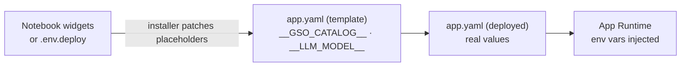

# Environment Variables

## App Environment Variables (`app.yaml`)

These variables are defined in `app.yaml` and injected into the app runtime. Placeholder values (e.g., `__GSO_CATALOG__`) are patched before deployment — by `notebooks/install.py` into its generated workspace source folder (recommended path), or in place by `deploy.sh` (local terminal path).

### MLflow Tracing

| Variable | Value | Description |
|----------|-------|-------------|
| `MLFLOW_TRACKING_URI` | `databricks` | MLflow tracking server (Databricks workspace) |
| `MLFLOW_EXPERIMENT_ID` | `__MLFLOW_EXPERIMENT_ID__` | Experiment for tracing LLM calls. Workspace-specific; validated at startup, cleared if invalid |

### LLM Model

| Variable | Value | Description |
|----------|-------|-------------|
| `LLM_MODEL` | `__LLM_MODEL__` | Databricks model serving endpoint for analysis and the create agent. Default: `databricks-claude-sonnet-4-6` |

### SQL Warehouse

| Variable | Source | Description |
|----------|--------|-------------|
| `SQL_WAREHOUSE_ID` | `valueFrom: sql-warehouse` | SQL Warehouse ID, pulled from the app resource named `sql-warehouse` |

### Genie Agent Configuration

| Variable | Value | Description |
|----------|-------|-------------|
| `GENIE_TARGET_DIRECTORY` | `/Shared/` | Where new Genie Agents are created. Override to a specific folder if needed |

### Local Development

| Variable | Value | Description |
|----------|-------|-------------|
| `DEV_USER_EMAIL` | (empty) | User email for local dev auth. Only used when running outside Databricks Apps |

### Lakebase PostgreSQL

| Variable | Source | Description |
|----------|--------|-------------|
| `LAKEBASE_HOST` | `valueFrom: postgres` | Hostname, injected from the `postgres` app resource |
| `LAKEBASE_PORT` | `5432` | PostgreSQL port |
| `LAKEBASE_DATABASE` | `databricks_postgres` | Database name (standard Lakebase default) |
| `LAKEBASE_INSTANCE_NAME` | `__LAKEBASE_INSTANCE__` | Lakebase Autoscaling project name (patched by deploy script) |

### Auto-Optimize (GSO Engine)

| Variable | Source | Description |
|----------|--------|-------------|
| `GSO_CATALOG` | `__GSO_CATALOG__` | Unity Catalog for optimizer state tables. Patched from `.env.deploy` |
| `GSO_SCHEMA` | `genie_space_optimizer` | Schema within the catalog for GSO tables (fixed name) |
| `GSO_JOB_ID` | `__GSO_JOB_ID__` | Databricks Job ID for the optimization DAG. Patched from bundle deploy state |
| `GSO_WAREHOUSE_ID` | `valueFrom: sql-warehouse` | SQL Warehouse for GSO queries |

## Deploy Configuration Variables (`.env.deploy`)

These variables apply to the **local terminal path only** — they are read by `deploy.sh` and written by `install.sh`. They are **not** injected into the app runtime directly; the deploy scripts use them to patch `app.yaml` placeholders and configure resources.

On the recommended notebook path there is no `.env.deploy` file. The equivalent values come from `notebooks/install.py` widgets (`app_name`, `catalog`, `warehouse_id`, `lakebase_mode`, `lakebase_project_name`).

| Variable | Required | Default | Description |
|----------|----------|---------|-------------|
| `GENIE_WAREHOUSE_ID` | Yes | — | SQL Warehouse ID (hex string from warehouse URL or detail page) |
| `GENIE_CATALOG` | Yes | — | Unity Catalog name (you need CREATE SCHEMA permission) |
| `GENIE_APP_NAME` | No | `genie-workbench` | Databricks App name (must be unique in your workspace) |
| `GENIE_DEPLOY_PROFILE` | No | `DEFAULT` | Databricks CLI profile name |
| `GENIE_LLM_MODEL` | No | `databricks-claude-sonnet-4-6` | LLM serving endpoint for analysis |
| `GENIE_LAKEBASE_INSTANCE` | No | `<app-name>` | Lakebase Autoscaling project name (auto-provisioned by deploy) |

## How Variables Flow

1. The installer collects values — notebook widgets on the notebook path, or `install.sh` writing `.env.deploy` on the terminal path
2. The installer patches `__PLACEHOLDER__` strings in `app.yaml`. The notebook path writes the patched copy into its generated workspace source folder and leaves the Git folder's `app.yaml` untouched; the terminal path patches the file in place
3. `databricks apps deploy` (or the notebook's equivalent SDK call) uploads the patched `app.yaml`
4. The Databricks Apps platform injects env vars into the running container
5. `valueFrom` variables (e.g., `LAKEBASE_HOST`, `SQL_WAREHOUSE_ID`) are resolved from app resources at runtime

## Related Documentation

- [Deployment Guide](/docs/getting-started/deployment-guide) — deploy workflow and configuration
- [Operations Guide](/docs/platform/operations) — MLflow and Lakebase management
