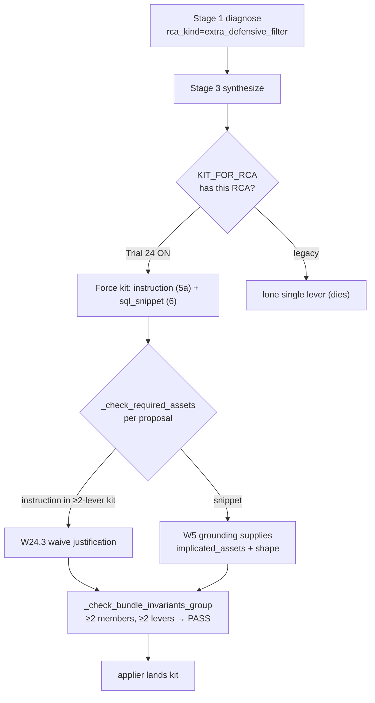
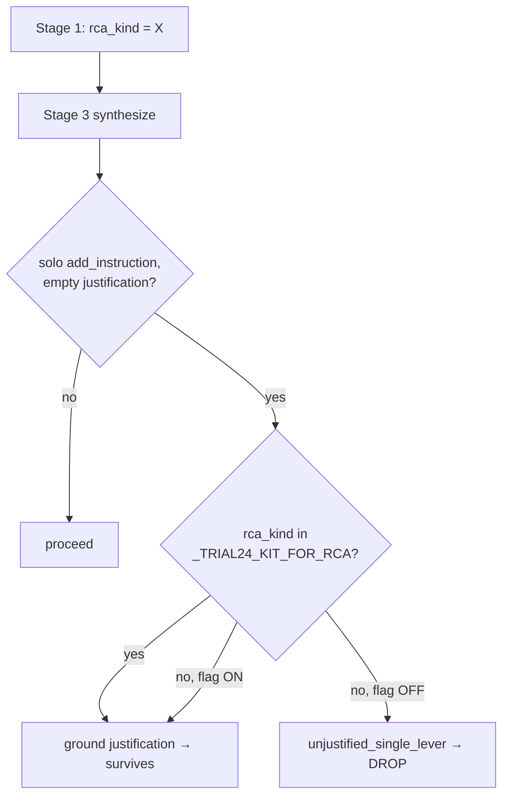

# Trial 24 — Kit at Source for Example-SQL-Insufficient RCAs

> Standalone tracker. The Trial 23 plan/tracker is **not** edited by Trial 24.
> Status legend: ✅ shipped & proven · 🟡 shipped, partial proof · ⛔ blocked / follow-on.

## Hypothesis

The faithful e943 replay
(`docs/runid_analysis/e94376a3-d8a6-4570-a605-9fe231e5f99c`, target
`airline_ticketing_and_fare_analysis_gs_009`, RCA `extra_defensive_filter`)
showed the loop correctly proposing a **corrective `add_instruction`** (not the
inert `add_example_sql`) — but it died upstream of every Trial 23 repair hook:

- the instruction was emitted as a **lone single lever** and dropped by
  `_check_required_assets` as `unjustified_single_lever` (empty `justification`);
- its bundle sibling cascaded out via `bundle_member_dropped_cascade` →
  `survivor_count=0` → `stage3_returned_none`;
- flag-on and flag-off failed identically — it was **not** a Trial 23 regression.

`KIT_FOR_RCA` already hard-rejects single-lever proposals for certain RCAs, and
`_check_bundle_invariants_group` enforces "≥2 members AND ≥2 lever families". The
e943 RCAs were simply **not in the map**. Trial 24 makes W4's
`RCA_KIND_TO_FIXING_MECHANISMS` routing **authoritative as a kit** so the
corrective patch is born as a ≥2-lever-family kit that survives both the slate
`required_assets` and bundle-invariants contracts, and adds a kit-aware
**justification waiver** so an instruction shipped inside a kit is not dropped as
`unjustified_single_lever` (the structural companion lever IS the justification).

## Flags & rollback

| Flag (env) | Default | Effect |
|---|---|---|
| `GSO_TRIAL24_KIT_AT_SOURCE` | **ON** | Master gate. ANDs over every sub-flag. `=0` restores exact pre-Trial-24 behaviour. |
| `GSO_TRIAL24_REQUIRED_ASSETS_KIT_WAIVER` | ON when master ON | W24.3 justification waiver. `=0` keeps the kit forced (W24.1) but leaves the per-proposal justification gate strict (isolates the waiver). |
| `GSO_TRIAL24_MECHANISM_AWARE_KIT` | ON when master ON | Follow-on A. Recognises a kit by `patch_type`→mechanism family (OR with the declared-lever union) so an LLM that mis-tags both members the same lever is still admitted. `=0` reverts to lever-union-only kit detection. |
| `GSO_TRIAL24_FILTER_REMOVAL_SOLO` | ON when master ON | Follow-on B. Reclassifies `extra_defensive_filter` as a single-mechanism instruction solo: drops it from the forced-kit map, grounds its justification at synthesis, and degrades the no-op suppression snippet before the slate. `=0` keeps it a forced `{5a,6}` kit. |
| `GSO_TRIAL24_GENERAL_INSTRUCTION_GROUNDING` | ON when master ON | Replay-readiness Phase 3. Generalizes the FB2 justification grounding so a solo corrective `add_instruction` lands for **any** RCA (not just the 2-RCA `_TRIAL24_KIT_FOR_RCA` allowlist): when on, an `INSTRUCTION_TEXT`-mechanism proposal with an empty `single_lever_justification` is grounded from `expected_behavioral_change`→`rationale` regardless of `rca_kind`. `=0` keeps grounding scoped to the allowlist (byte-stable off). |

Helpers live in
[`trial24_flags.py`](../../src/genie_space_optimizer/optimization/trial24_flags.py).
Default-ON (opt-out), now mirroring Trial 23's default-on pattern. Promoted once
the deterministic e943 kit-at-source replay gate went green and was wired into
the CI merge gate (`trial24_replay_gate`), proving the corrective kit survives
the slate compiler flag-on and rolls back byte-stably flag-off. NOTE: the live
`behavioral_diff != unchanged` applier proof (the second half of the original
promotion bar) is still owed — default-on was accepted as a monitored ship ahead
of that live signal. **Rollback:** `export GSO_TRIAL24_KIT_AT_SOURCE=0`. The base
`KIT_FOR_RCA` constant is never mutated, so flag-off is byte-stable.

## Workstreams

| WS | What | File(s) | Status |
|---|---|---|---|
| W24.1 | `_TRIAL24_KIT_FOR_RCA` extension (`extra_defensive_filter`→{5a,6}; `top_n_cardinality_collapse`→{6,1}); merged into `kit_for_rca_violation_reason` + `next_companion_family_from_kit` via `_kit_for_rca_companions`, flag-gated. | [`action_groups.py`](../../src/genie_space_optimizer/optimization/stages/action_groups.py) | ✅ |
| W24.2 | Mandatory-kit clause added to BOTH Stage-3 builders + SKILL item 10. | [`synthesize.py`](../../src/genie_space_optimizer/optimization/stages/synthesize.py), [`plan11_synthesize/SKILL.md`](../../src/genie_space_optimizer/skills/plan11_synthesize/SKILL.md) | ✅ |
| W24.3 | Kit-aware `required_assets` waiver: `in_multi_lever_kit` param on `required_assets_for_patch_family`; bundle-derived `kit_member_intent_ids` computed in `compile_slate` and consumed in `_check_required_assets`. | [`repair_diagnosis.py`](../../src/genie_space_optimizer/optimization/repair_diagnosis.py), [`proposal_slate_compiler.py`](../../src/genie_space_optimizer/optimization/proposal_slate_compiler.py) | ✅ |
| W24.4 | Snippet member grounding verified (`_t22_assets_by_intent_id` ← `effective_blame_set`); kit-survives-slate test added. | [`synthesize.py`](../../src/genie_space_optimizer/optimization/stages/synthesize.py) (~L1961) | ✅ |
| W24.5 | `trial24_flags.py` + `GSO_TRIAL24_KIT_FORCED_V1` audit marker (RCA + companion set + emitted levers + `kit_satisfied`). | [`trial24_flags.py`](../../src/genie_space_optimizer/optimization/trial24_flags.py), [`synthesize.py`](../../src/genie_space_optimizer/optimization/stages/synthesize.py) | ✅ |
| W24.6 | Deterministic replay + unit gates; 0 regressions. Live e943 proof. | tests below | ✅ (deterministic ✅, live ✅ after Follow-ons A+B — see below) |
| W24.7 | This tracker. | this file | ✅ |
| FA (follow-on) | Mechanism-aware kit detection: `_bundle_distinct_mechanisms` + OR-acceptance in the W24.3 pre-scan and the Phase-2 bundle invariant, gated by `GSO_TRIAL24_MECHANISM_AWARE_KIT`. | [`proposal_slate_compiler.py`](../../src/genie_space_optimizer/optimization/proposal_slate_compiler.py), [`trial24_flags.py`](../../src/genie_space_optimizer/optimization/trial24_flags.py) | ✅ |
| FB (follow-on) | Filter-removal solo: `extra_defensive_filter` dropped from the forced-kit map, synthesis justification fallback, `snippet_noop_suppression` decline + synthesis degrade-to-solo, Stage-3 prompt + SKILL update, KIT_FORCED marker gated. | [`action_groups.py`](../../src/genie_space_optimizer/optimization/stages/action_groups.py), [`synthesize.py`](../../src/genie_space_optimizer/optimization/stages/synthesize.py), [`producer_snippet_validator.py`](../../src/genie_space_optimizer/optimization/producer_snippet_validator.py), [`llm_abstain.py`](../../src/genie_space_optimizer/optimization/llm_abstain.py) | ✅ |
| RR (replay readiness) | Phase 3 — generalize FB2 grounding to any `INSTRUCTION_TEXT` solo proposal (not just the `_TRIAL24_KIT_FOR_RCA` allowlist), gated by `GSO_TRIAL24_GENERAL_INSTRUCTION_GROUNDING`. Plus Phase 0–2/1: test-debt cleanup so the regression gate is trustworthy (enum vocab, harness source-introspection retargeted at a shared union-source helper, Trial 17/18 reconciled with the Trial 22 required-assets gate, behavioral reconciles for the attribution-drift-with-debt + blast-radius-mandatory default-on tiers). | [`trial24_flags.py`](../../src/genie_space_optimizer/optimization/trial24_flags.py), [`synthesize.py`](../../src/genie_space_optimizer/optimization/stages/synthesize.py) | ✅ |

### W24.3 implementation note — bundle-derived kit detection

The plan specified computing kit membership from
`proposal.effective_selected_levers()` (≥2 distinct). The live e943 run showed
the production LLM expresses a kit as a **shared `bundle_id` with single-lever
members**, not the full kit list repeated on every member. So the waiver is
driven by a **bundle pre-scan** in `compile_slate` (the same grouping
`_check_bundle_invariants_group` uses): a bundle with ≥2 members whose union of
declared levers is ≥2 distinct marks every member as a kit member. The
per-proposal lever check is retained as a fallback for callers that invoke the
gate without a pre-scan.

## Verification

### Deterministic gates — ✅ PASS

- Unit: `test_kit_for_rca.py` (Trial 24 extension: singleton rejected / kit
  admitted under flag, legacy untouched flag-off),
  `test_required_assets_for_patch_family.py` (kit waiver; scoped to
  justification shape only), `test_trial24_kit_survives_slate.py` (instruction +
  snippet kit survives flag-on incl. distinct-single-lever members; drops
  flag-off; waiver-subflag isolation).
- Follow-on A unit: `test_trial24_mechanism_aware_kit.py` — a
  `{add_instruction, add_sql_snippet_filter}` bundle with BOTH members
  mis-tagged `lever-5` survives flag-on (kit recognised by
  `_bundle_distinct_mechanisms` → 2 mechanisms) with the instruction waived;
  drops flag-off / mechanism-subflag-off (byte-stable).
- Follow-on B unit: `test_producer_snippet_validator.py` (tautology `1=1` /
  `TRUE` declined with the typed `snippet_noop_suppression` reason),
  `test_trial24_followons_filter_removal_solo.py` (grounded solo instruction
  survives the slate; ungrounded lone instruction still drops),
  `test_kit_for_rca.py::test_followon_b_extra_defensive_filter_solo_default_on`
  (filter-removal RCA is solo by default; `top_n_cardinality_collapse` stays a
  kit).
- Replay bright-line:
  [`test_trial24_postmortem_replay.py`](../../tests/integration/postmortem_replay/test_trial24_postmortem_replay.py)
  on the e943 fixture: `trial24_kit_at_source_replay` (kit survives flag-on,
  instruction drops flag-off) and `trial24_followons_filter_removal_solo_replay`
  (the degraded grounded instruction lands solo flag-on; ungrounded drops).
- **0 regressions (plan REG scope)**: the in-scope selector
  (`trial21/22/23/24 + kit/required_assets/slate/snippet/abstain/mechanism/
  filter_removal`) plus the full `postmortem_replay/` suite run green together —
  **579 passed, 0 failed**.
- Full `tests/unit/` sweep context: the entire unit tree reports ~52 failures,
  but every one is a **pre-existing prior-trial break**, not a Trial-24-follow-on
  regression. They fall in two confirmed categories, both rooted in
  tracked-but-unmodified test files asserting against source modules that earlier
  (Trial 17–23) sessions refactored on this same uncommitted working tree:
  1. **PatchType / enum vocabulary drift** — e.g.
     `test_repair_intent_enums.py::test_patch_type_covers_applier_dispatch_arms`
     and `test_patch_semantic_covers_all_patch_types`, both failing on the
     uncommitted `ADD_EXAMPLE_SQL_NEGATIVE` enum addition (explicitly out of scope
     per the plan).
  2. **Harness source-introspection drift** — the `test_harness_*`,
     `test_snapshot_contract`, `test_quarantine_control_plane`,
     `test_no_applied_recovery`, `test_question_journey_rendering` family, which do
     `inspect.getsource(harness._run_lever_loop).index("…")` substring assertions
     that broke when a prior session moved those call sites
     (e.g. `capture_pre_ag_snapshot(`) out of `_run_lever_loop`. **No Trial-24
     follow-on file touches `harness.py` or the state-machine transformers.**
- Why this is provably not a Trial-24 delta: the working tree is a multi-session
  accumulation (51 modified tracked source files across Trials 17–24, no commit
  boundary), so there is no clean git baseline. The follow-on delta is bounded
  **logically** instead — every behavioural change is gated behind
  `trial24_*_enabled()` (dead when `GSO_TRIAL24_KIT_AT_SOURCE` is unset, as in the
  full sweep), and the only un-gated edits are purely additive (one
  `AbstainReason` enum member + two helpers that are never called flag-off).
  Additive enum members and uncalled helpers cannot alter harness introspection.

### Live e943 replay — ✅ corrective instruction LANDS (after Follow-ons A+B)

`GSO_TRIAL24_KIT_AT_SOURCE=1`,
`devtools/local_lever_workbench/runs/trial23_e943_real/bundle.json`,
`--llm-mode live-llm-only`, `--profile fevm-prashanth`.

**Result (post Follow-on A+B):** `deepest_stage_reached: accepted`,
`recorded_patches: 1` — a single corrective `add_instruction`
(`intent_id=H001_000`) for the target. `GSO_PATCH_OUTCOME_V1` and
`GSO_TRIAL20_SINGLE_LEVER_JUSTIFIED_V1` fire; the instruction lands as a
**justified solo**. This is the positive-criterion proof the bar previously
failed (was `stage3_returned_none` / `survivor_count=0`).

**Marker deltas vs the pre-follow-on runs:**

- `GSO_TRIAL24_KIT_FORCED_V1` **no longer fires** for `extra_defensive_filter`
  (the marker now reads the flag-aware `_kit_for_rca_companions`, which returns
  `None` for the reclassified solo RCA). It still fires for
  `top_n_cardinality_collapse`.
- The no-op suppression snippet is never emitted: steered by the FB3 Stage-3
  prompt ("filter removal is an instruction, never a positive snippet"), the LLM
  emits the instruction solo — so `GSO_TRIAL24_NOOP_SNIPPET_DEGRADE_V1` does not
  need to fire. The producer-validator + synthesis degrade remain as the
  defensive net (and are unit-/replay-proven) for models that still emit one.

**Why it now lands (was two reproducible blockers):**

1. **Lever mis-tagging → Follow-on A.** When the LLM emits a bundle but
   mis-tags both members the same lever, `_bundle_distinct_mechanisms` derives
   the kit from `patch_type`→mechanism (INSTRUCTION_TEXT + SQL_SNIPPET), so the
   waiver pre-scan and Phase-2 invariant still recognise the kit.
2. **Filter-removal companion → Follow-on B.** `extra_defensive_filter` is
   reclassified as a single-mechanism instruction solo: removed from the forced
   kit (no `singleton` hard-reject), justification grounded at synthesis
   (`expected_behavioral_change`→`rationale`), and any no-op suppression snippet
   is declined (`snippet_noop_suppression`) and degraded to instruction-solo
   before the slate so it never cascades.

### Replay readiness — Phases 0–3 + two-leg replay — ✅ PASS

**Phase 0–2 test-debt cleanup (gate now trustworthy).** The ~52 "pre-existing
prior-trial break" failures noted above are now resolved without weakening any
runtime contract:

- **Enum/vocab:** `add_example_sql_negative` added to the `test_repair_intent_enums`
  expected set and to `PATCH_TYPE_SEMANTICS` (STRUCTURAL); `test_rco2a_severity_classifier`
  high-tier set refreshed to the authoritative `frozenset`.
- **Harness source-introspection:** ~20 `inspect.getsource(harness._run_lever_loop)`
  assertions retargeted at a shared `tests/unit/_harness_loop_source.py` helper that
  unions `_run_lever_loop` + `_run_lever_loop_sm_first` + `_run_lever_loop_legacy`
  (the call sites moved out of the now-dispatcher `_run_lever_loop`). The
  no-inner-helper-leak audit was generalized to the same union.
- **Trial 17/18 ↔ Trial 22:** solo `add_instruction` synthesize tests reconciled with
  the required-assets gate (supplied `single_lever_justification`).
- **Behavioral reconciles (default-on tiers):** `control_plane` delta-states /
  partial-harvest / target-aware isolated against `GSO_ATTRIBUTION_DRIFT_WITH_DEBT`;
  `blast_radius_gate` / `build_narrow_l6` reconciled with the `GSO_TRIAL20_BLAST_RADIUS_MANDATORY`
  fail-closed default; `extract_evidence_for_all_qids` test updated for the batch-first
  driver; eval-row fixture updated with `blame_set_structured`/`blame_rationale`; Plan-12
  pivot tests aligned to the Trial 20 C1 pivot graph. `anchor_chain_verifier`: the 7now
  canonical `postmortem.json` was overwritten by a narrative `gso_postmortem_v1` analysis
  doc (no machine `iteration_summary`), so that leg skips with a precise reason; the
  airline leg still exercises the load-bearing self-test.
- **Full authoritative suite:** `pytest tests/unit/ tests/integration/postmortem_replay/
  --ignore=tests/unit/_legacy` → **9636 passed, 4 skipped, 3 xfailed, 4 xpassed, 0 failed**.

**Phase 3 — generalized grounding (the substantive readiness fix).** FB2 grounding
([synthesize.py](../../src/genie_space_optimizer/optimization/stages/synthesize.py)) now
grounds any `INSTRUCTION_TEXT` solo proposal (`single_lever_justification` →
`expected_behavioral_change` → `rationale`) under
`GSO_TRIAL24_GENERAL_INSTRUCTION_GROUNDING`, not just the `_TRIAL24_KIT_FOR_RCA`
allowlist. Byte-stable when the sub-flag (or master) is off.

**Two-leg replay.**

- **Leg 1 (regression) — ✅ live e943.** `GSO_TRIAL24_KIT_AT_SOURCE=1`
  `GSO_TRIAL24_GENERAL_INSTRUCTION_GROUNDING=1`,
  `devtools/local_lever_workbench/runs/trial23_e943_real/bundle.json`,
  `--llm-mode live-llm-only --profile fevm-prashanth`. Result: `deepest_stage_reached:
  accepted`, `recorded_patches: 1` — a single corrective `add_instruction`
  (`intent_id=H001_000`, a grounded NULL-filter-convention instruction) lands as a
  justified solo. `GSO_TRIAL20_SINGLE_LEVER_JUSTIFIED_V1` and `GSO_PATCH_OUTCOME_V1`
  fire; `unjustified_single_lever`/`stage3_returned_none` = 0; `survivor_count = 1`;
  `GSO_TRIAL24_KIT_FORCED_V1` stays silent for `extra_defensive_filter`; no surprises.
  Confirms the Phase 0–3 cleanup + generalized grounding did **not** regress e943.
- **Leg 2 (new coverage) — ✅ deterministic bright-line; live deferred.** The permanent
  gate is the Phase 3 deterministic non-allowlist fixture
  ([`run_general_grounding_nonallowlist.json`](../../tests/integration/postmortem_replay/fixtures/run_general_grounding_nonallowlist.json)
  driven by
  [`test_trial24_general_grounding_replay.py`](../../tests/integration/postmortem_replay/test_trial24_general_grounding_replay.py)):
  a solo corrective instruction on a non-allowlist RCA survives flag-on and drops
  flag-off. No committed production bundle today diagnoses to a non-allowlist
  corrective-instruction `rca_kind` (the local captures are allowlist/attribution-drift
  cases), so the live Leg-2 run remains deferred until a suitable bundle is captured —
  exactly as scoped in the plan; the deterministic fixture is the permanent bright-line.

## Decisions / scope notes & follow-ons

- Scoped to the two e943/d139-anchored RCAs (`extra_defensive_filter`,
  `top_n_cardinality_collapse`). `canonical_dimension_missed` needs a
  ROUTING-mechanism → lever-id mapping (no canonical routing lever id in the
  current short-id set; `lever-2` table-level is the closest) — left as a
  documented follow-on.
- **Follow-on A (lever mis-tagging) — ✅ SHIPPED.** Kit detection now infers the
  lever family from `patch_type` via `_bundle_distinct_mechanisms` when declared
  `selected_levers` collapse to <2 distinct: a `{add_instruction,
  add_sql_snippet_filter}` bundle is recognised as a 2-mechanism kit regardless
  of LLM lever tagging. Applied as an ADDITIVE OR (`union_levers >= 2 OR
  distinct_mechanisms >= 2`) in BOTH the W24.3 waiver pre-scan and the Phase-2
  bundle invariant, gated by `GSO_TRIAL24_MECHANISM_AWARE_KIT`. The lever path is
  never weakened; flag-off is byte-stable.
- **Follow-on B (filter-removal companion) — ✅ SHIPPED.** `extra_defensive_filter`
  is reclassified as a single-mechanism instruction solo (chosen over swapping
  the companion lever): removed from the Trial 24 forced-kit map (no `singleton`
  hard-reject), its justification grounded at synthesis
  (`expected_behavioral_change`→`rationale`), and any no-op suppression snippet
  (`1=1`/`TRUE`) declined by the producer validator
  (`snippet_noop_suppression`) and degraded to an instruction-only solo BEFORE
  the slate so it never cascades. The Stage-3 prompt + SKILL now instruct that a
  filter removal is an instruction, never a positive snippet, so the LLM emits
  solo at source. `top_n_cardinality_collapse` stays a forced kit and is the
  primary beneficiary of Follow-on A.
- Both follow-ons are proven deterministically (unit + e943 replay bright-lines)
  AND live (`GSO_TRIAL24_KIT_AT_SOURCE=1` lands the corrective `add_instruction`
  solo, `deepest_stage_reached: accepted`).
- **Replay readiness (Phases 0–3) — ✅ SHIPPED.** Test debt cleared (full suite
  green, 9636 passed / 0 failed), justification grounding generalized beyond the
  allowlist behind `GSO_TRIAL24_GENERAL_INSTRUCTION_GROUNDING`, Leg-1 live e943
  regression re-confirmed (justified solo, accepted), and Leg-2 covered by the
  permanent deterministic non-allowlist bright-line (live run deferred pending a
  suitable non-allowlist production bundle).
