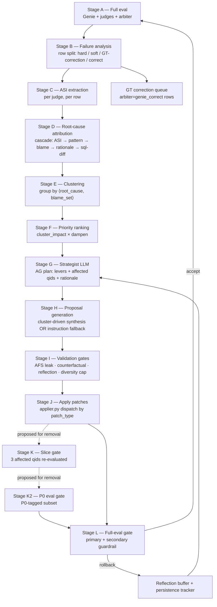
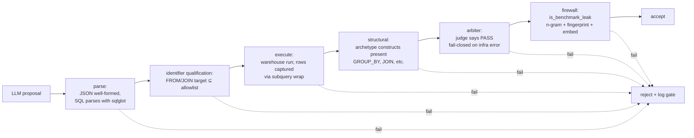
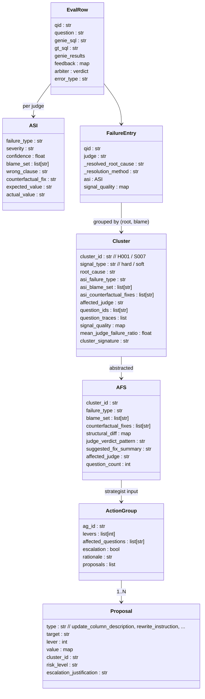
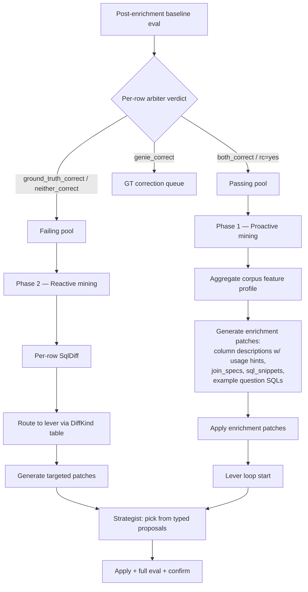
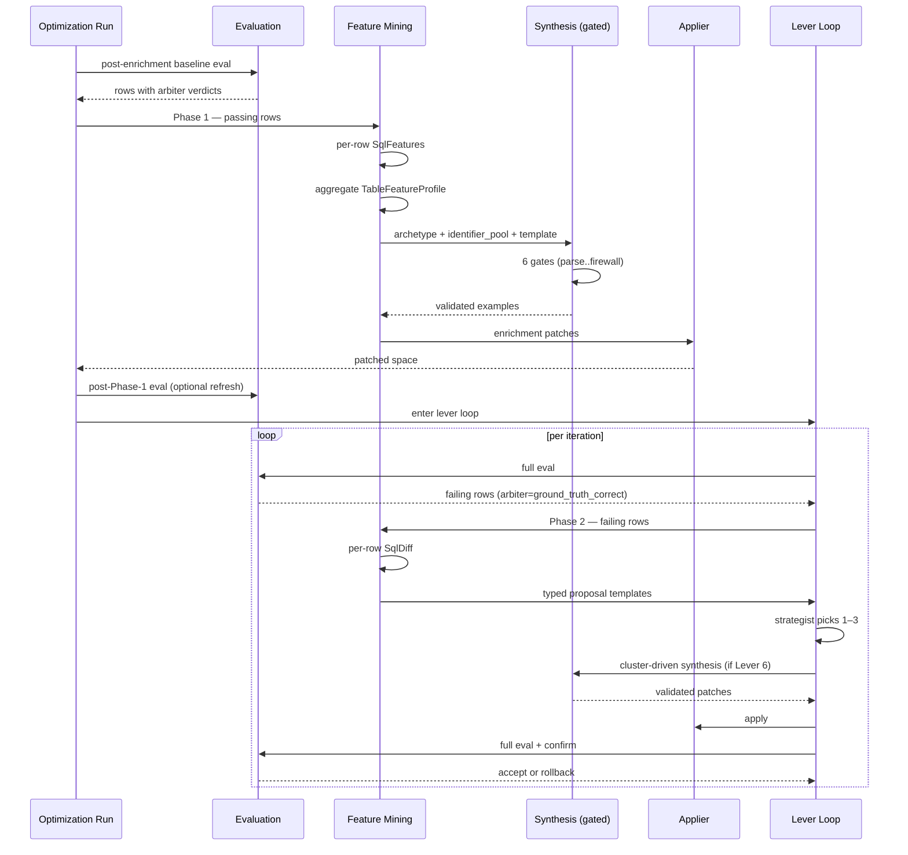

# Lever Loop Pipeline — End-to-End Reference

Status: living reference for the optimization process from post-enrichment
evaluation through patch application.
Owners: GSO engine team.
Scope: this doc describes the data flow that turns judge verdicts into
applied space-config patches, plus the gates that prevent benchmark
leakage. It does *not* re-document the leakage firewall contract — see
`example-sql-isolation.md` for that, which remains the source of truth
for the four firewall invariants.

---

## TL;DR

The lever loop is a multi-stage data pipeline. After enrichment, GSO
runs a full eval, splits rows into hard failures / soft signals /
ground-truth-correction-candidates / fully correct, extracts per-judge
ASI (Action-Selection Insight) metadata, attributes a single root
cause per question, groups questions into clusters, ranks clusters by
impact, asks an LLM strategist to propose patches, validates those
proposals through a multi-gate firewall, and applies the survivors.
After each iteration a confirmation eval gates acceptance against
pre-arbiter primary and post-arbiter secondary metrics.

Four cross-cutting properties are non-obvious and worth keeping in
mind while reading the rest:

- **The arbiter is a ground-truth oracle, not a tie-breaker.** Benchmark
  ground truth is partially synthetic; in practice Genie is often
  *more* correct than the GT it was scored against. The arbiter exists
  to adjudicate which side is actually right and to flag GT for
  correction. An `arbiter=genie_correct` verdict is therefore a signal
  about the **corpus**, not about Genie — these rows should not be
  clustered as failures, and should be persisted to a GT-correction
  queue. See "Arbiter as ground-truth oracle" section below.
- **Two parallel cluster sets travel together.** Hard failures and soft
  signals are clustered separately (`H001…` vs `S001…`) but ranked into
  one priority list; soft clusters get a 0.5× damping multiplier unless
  re-elevated.
- **The strategist never sees raw benchmarks.** Every LLM prompt that
  could synthesize SQL receives an *Abstracted Failure Signature (AFS)*
  built from judge metadata; the AFS is validated against the
  benchmark corpus at construction time and rejects on n-gram Jaccard
  ≥ 0.25. See `example-sql-isolation.md` for the full firewall.
- **Acceptance is two-metric.** With `OPTIMIZATION_OBJECTIVE=pre_arbiter`
  the primary signal is pre-arbiter `result_correctness`; the
  post-arbiter overall accuracy is checked separately as a guardrail
  with cap `OPTIMIZATION_OBJECTIVE_POST_ARBITER_GUARDRAIL_PP` (default
  5.0pp). On small corpora this cap exceeds run-to-run variance and
  silently admits regressions — see Gaps §G2.

> **Note on intermediate gates.** Today the per-iteration sequence is
> `slice eval → P0 eval → full eval → confirmation eval`. The slice
> and P0 gates have proven low-yield in practice (they fire on
> Genie-variance, take meaningful wall-time, and rarely catch a
> regression that the full eval doesn't catch louder). The
> recommendation in this doc is to **delete both gates** and run only
> the full eval + confirmation. See "What to remove" below.

---

### Optimization Objective

The terminal optimization objective is 100% post-arbiter / arbiter-adjusted
accuracy within the configured adaptive attempt budget. Per-judge thresholds
remain diagnostic and may still produce a compatibility `threshold_met`
terminal reason, but they are not the primary success definition for the RCA
control plane.

Hard failures are the optimization target. A hard failure is a row where
`result_correctness` is false and the arbiter did not mark Genie as correct.
While any hard failure exists, the strategist receives only hard-failure
clusters for action-group generation.

Soft signals may remain visible in diagnostics and RCA evidence, but they do
not outrank hard failures. `response_quality` is a text-response judge and is
excluded from optimization targeting.

### Causal Proposal Grounding

Proposal grounding is scoped to the action group's target question IDs. The
grounding surface combines:

- expected and generated SQL identifiers,
- nested `inputs` / `outputs` row payloads,
- actionable ASI metadata such as `blame_set`, `wrong_clause`,
  `counterfactual_fix`, `expected_objects`, and `actual_objects`,
- RCA metadata such as `rca_id`, `patch_family`, and `target_qids`.

`response_quality` metadata is ignored for grounding because it should not
drive optimizer mutations.

If grounding drops a patch, the decision audit records patch targets, target
QIDs, scoped row count, overlap, and missing targets.

### RCA Grounding Control Contract

Proposal grounding uses `optimization.eval_row_access` as the only supported
reader for eval rows. It recognizes slash-style MLflow keys, dotted keys, flat
fixture keys, nested dictionaries, and request/response payloads.

Grounding categories:

- `grounded`: Patch targets or RCA grounding terms overlap the target failure surface.
- `no_scoped_rows`: The action group resolved to QIDs that do not exist in eval rows.
- `empty_surface`: Rows exist, but no question, SQL, response, or ASI tokens were recoverable.
- `no_targets`: Patch has no patch target or body terms.
- `no_overlap`: Patch and RCA terms do not overlap the failure surface.
- `below_min_relevance`: Patch has overlap but does not meet `GSO_MIN_PROPOSAL_RELEVANCE`.

For RCA-stamped patches, `_rca_grounding_terms` are sufficient when they overlap
the target failure surface. This is deterministic and local: no benchmark text is
sent to an LLM, and the benchmark leakage firewall still applies to answer-shaped
example SQL patches.

### Control-Plane Acceptance

An iteration is accepted only when all of the following are true:

1. post-arbiter accuracy improves over the carried baseline,
2. at least one targeted hard-failure QID is fixed,
3. no out-of-target QID becomes a new hard failure.

The loop stops immediately when post-arbiter accuracy reaches 100%, or after
the configured maximum number of adaptive attempts.

---

## Pipeline overview



The dotted edges to Stage K and Stage K2 mark the slice and P0 gates
as proposed for removal — the recommended sequence is `apply patches
→ full eval → confirmation eval`, skipping both intermediate gates.

Each box below carries: **purpose · key file:lines · the output that
the next stage consumes · key observability log line.**

---

## Stage A — Full eval

**Purpose.** Ask Genie all benchmark questions, capture (sql,
results, nl_response), run every registered scorer (judges + arbiter)
against each row, persist trace metadata.

**Key entry.** `optimization/evaluation.py::run_evaluation` (~line 5714).
Driven by `mlflow.genai.evaluate(...)` with the scorer set; results
land in a DataFrame whose row schema is the contract for the rest of
the pipeline.

**Per-row schema (the contract).**

| Field | Source | Notes |
|---|---|---|
| `inputs.question_id`, `inputs.question`, `inputs.expected_sql` | benchmark | identity & ground truth |
| `outputs.predictions.sql`, `.results`, `.nl_response` | Genie | what we evaluated |
| `feedback/<judge>/value` | each judge | "yes"/"no" verdict |
| `feedback/<judge>/rationale` | each judge | free-text explanation |
| `feedback/<judge>/metadata` (or `<judge>/metadata`) | each judge | **ASI**: `failure_type`, `blame_set`, `wrong_clause`, `counterfactual_fix`, `severity`, `confidence`, `expected_value`, `actual_value`, `affected_question_pattern`, `join_assessment` |
| `feedback/arbiter/value` | arbiter | one of `both_correct`, `genie_correct`, `ground_truth_correct`, `neither_correct`, `skipped` |
| `metadata/error_type` | infra | `genie_result_unavailable`, `both_empty`, etc. |
| `trace_id` (recovered) | mlflow trace | recovered via 3-strategy fallback when MLflow drops it |

**Trace ID recovery.** `_recover_trace_map` at `evaluation.py:4690`
runs three strategies (tags filter, time-window, eval_results table)
and unions; the per-iteration "Recovered N/M trace IDs" log line
reports yield. Without recovered traces, ASI metadata cannot be
read from MLflow and falls back to UC-cached ASI.

**Pre-arbiter vs post-arbiter accuracy.**

```python
# evaluation.py ~5620 — pre-arbiter
rc_pre_arbiter = correct_rc_yes_count / non_excluded_total

# evaluation.py:_compute_arbiter_adjusted_accuracy ~2568
is_correct = rc == "yes" or (rc == "no" and arbiter in {"both_correct","genie_correct"})
accuracy_pct = correct / total * 100
```

`_pre_arbiter/result_correctness` and friends get stamped on the
scores dict alongside the post-arbiter values; the accept gate picks
between them based on `OPTIMIZATION_OBJECTIVE`.

**Why two metrics — and why the arbiter is not just a tie-breaker.**
Benchmark questions and their `expected_sql` are partially synthetic
(generated by an LLM from schema + a question template). In practice,
on a well-built space, **Genie is sometimes more correct than the
ground truth it is being scored against**. The arbiter is the
mechanism that adjudicates this directly: shown both the GT result
set and Genie's result set together with the question, the arbiter
returns one of `both_correct`, `genie_correct`, `ground_truth_correct`,
`neither_correct`. So:

- `result_correctness=no` + `arbiter=genie_correct` → Genie produced a
  defensible answer; the GT row in the corpus is wrong (or under-
  specified). This is **a corpus-quality signal**, not a Genie
  failure.
- `result_correctness=no` + `arbiter=ground_truth_correct` → Genie was
  genuinely wrong. This is the case the lever loop should act on.
- `result_correctness=no` + `arbiter=both_correct` → both produced
  defensible answers (e.g. the question was ambiguous). Treat as
  passing for the optimization metric; surface for corpus review.
- `result_correctness=no` + `arbiter=neither_correct` → both wrong;
  treat as a hard failure but flag the GT for review too.

The pre-arbiter metric tells us "raw judge agreement"; the
post-arbiter metric tells us "judge disagreement that survived
oracle review." Both are real signals. Pre-arbiter is the safer
*direction-of-travel* metric (no rescue noise), but post-arbiter is
the *honest user-facing accuracy* (we don't punish Genie for being
right when the corpus is wrong).

**Observability:**

```
==== EVALUATION SUMMARY — Iteration N | Scope: full | Questions: 24 ====
24 questions: 15 logical-pass · 3 arbiter-override-pass · 6 fail   [all-judge-pass: 11]
…
Overall accuracy: 78.3% (18/23 scored, 1 excluded of 24)
result_correctness (pre-arbiter): 65.2%  (arbiter-adjusted: 78.3%)
[SEVERITY:HIGH] Arbiter rescue rate 45.8% > 30% — overall accuracy is masking judge dissent.
```

---

## Stage B — Failure analysis (row split)

**Purpose.** Partition the eval rows into three buckets that downstream
stages treat differently.

**Key location.** `harness.py::_analyze_and_distribute` (~6279–6465).

**Predicates** (all in `evaluation.py`):

```python
# row_is_hard_failure (~2347)
return rc in {"no","false","0","0.0"} and arbiter not in {"both_correct","genie_correct"}

# _has_individual_judge_failure (~11530)
return any(feedback[j] == "no" for j in judges if j not in INFO_ONLY_JUDGES)
```

| Bucket | Predicate | Sent to | Damping |
|---|---|---|---|
| Hard failure | `row_is_hard_failure(row)` AND `arbiter != genie_correct` | hard clustering (`H` namespace) | 1.0 |
| **GT correction candidate** *(new bucket — see "Arbiter as ground-truth oracle" below)* | `rc=no` AND `arbiter=genie_correct` | **GT correction queue, NOT clustering** | n/a |
| Soft signal | not hard AND `_has_individual_judge_failure` (i.e. ≥1 judge said no while arbiter said both_correct or rc=yes) | soft clustering (`S` namespace) | 0.5 unless re-elevated |
| Fully correct | else | excluded | n/a |
| Quarantined | qid in `quarantined_qids` set | excluded from **hard** rows only — see Gaps §G5 | n/a |

> **Today's behaviour vs recommended.** Today,
> `_compute_arbiter_adjusted_accuracy` and `row_is_hard_failure` both
> treat `arbiter=genie_correct` as a passing row (it counts toward
> overall accuracy), so it never reaches hard clustering — but it can
> still land in soft-signal clustering via `_has_individual_judge_failure`,
> which means a corpus-defective question can drive patch generation.
> The recommended change is to extract these rows into an explicit
> "GT correction candidates" bucket *before* either clustering pass,
> persist them to a Delta queue keyed `(run_id, qid, genie_sql,
> gt_sql, arbiter_rationale)`, and skip them entirely from the lever
> pipeline. The fix should be applied to `harness.py:_analyze_and_distribute`
> and to the soft-signal predicate.

**Observability:**

```
-- Failure Analysis ----------
  |  Total rows loaded:  24 row(s) across 20 unique question(s)
  |  Arbiter verdicts:   both_correct=17  genie_correct=4  …
  |  Excluded (fully correct):    1 row(s) across 1 question(s)
  |  Soft signals:                20 row(s) across 18 question(s)
  |  Hard failure rows for clustering:  3 row(s) across 3 question(s)
```

---

## Stage C — ASI extraction

**Purpose.** For each (question, judge) failure, harvest the structured
metadata fields the judges emit and persist them in a uniform shape.

**Key location.** `optimization/optimizer.py` ~lines 1597–1715 (the
extraction block); `evaluation.py::build_asi_metadata` ~lines 1885 (the
schema producer used by judges).

**ASI schema** (this is what every judge writes into
`feedback/<judge>/metadata`):

```python
{
  "failure_type":        "wrong_column" | "wrong_aggregation" | "wrong_filter_condition"
                       | "wrong_table" | "wrong_join" | "missing_filter"
                       | "value_format_mismatch" | "other" | …,
  "severity":            "minor" | "major" | "critical",
  "confidence":          float,                    # 0..1
  "wrong_clause":        str | None,               # the offending SQL fragment
  "blame_set":           list[str],                # qualified identifiers Genie misused
  "quoted_metadata_text": str | None,
  "missing_metadata":    str | None,
  "ambiguity_detected":  bool,
  "expected_value":      str | None,
  "actual_value":        str | None,
  "counterfactual_fix":  str | None,               # judge-suggested fix, plain English
  "affected_question_pattern": str | None,
  "join_assessment":     dict | None,
}
```

**Source precedence (in order):**

1. `feedback/<judge>/metadata` (the canonical location)
2. `<judge>/metadata` (legacy)
3. `metadata/<judge>/failure_type` (split-key fallback)
4. `metadata/failure_type` (row-level fallback)
5. UC-cached ASI: `genie_eval_asi_results` keyed by `(question_id, judge)`
6. Rationale-text parse via `_extract_pattern(rationale)` (lossy)

The first non-empty source wins per field; the source label gets
recorded as `_asi_source` for the trace block (`feedback_metadata`,
`row_metadata:trace`, `row_metadata:recovered_trace`,
`uc_asi_cache`, `rationale_parse`).

**Observability:**

```
== ASI EXTRACTION TRACE (HARD FAILURES) ==
|  ASI source histogram:  row_metadata:recovered_trace=19 (100%)  (total judge failures: 19)

--- Q: retail_store_sales_analytics_004 ---
|  Judge: schema_accuracy   |  Verdict: FAIL
|    failure_type (raw):    wrong_column
|    blame_set:             [market_description]
|    counterfactual_fix:    "Add an instruction or column description …"
|    wrong_clause:          "SELECT market_description, … GROUP BY market_description"
|    Final root cause:      wrong_column  (via asi_metadata)
```

---

## Stage D — Root-cause attribution (per failure)

**Purpose.** Reduce each (question, judge) failure to one root_cause
label so clustering can group like with like.

**Cascade** (`optimizer.py` ~1759):

```python
if not generated_sql:                              # 0
    root, method = "missing_sql_generation", "empty_sql_shortcut"
elif asi_ft and asi_ft != "other":                 # 1
    root, method = asi_ft, "asi_metadata"
else:
    pat, conf, ev = _detect_failure_pattern(sql_context)
    if pat and conf >= 0.7:                        # 2
        root, method = pat, "structural_pattern"
    elif (asi_ft in (None, "other")
          and _blame_set_matches_metadata(blame, snapshot)):  # 3
        root, method = "missing_data_asset", "asi_blame_set"
    else:
        rp = _extract_pattern(rationale)
        if rp != "other":                          # 4
            root, method = rp, "rationale_pattern"
        else:                                       # 5
            root, method = _classify_sql_diff(sql_context), "sql_diff"
```

**Subtle override path.** Before this cascade runs (~optimizer.py:1666–
1680), generic ASI verdicts (`wrong_filter_condition`,
`wrong_aggregation`, `other`, missing) get **rewritten** by a structural
pattern detector that scans Genie's SQL for shape signatures
(`time_window_pivot`, `plural_top_n_collapse`, `value_format_mismatch`,
`column_disambiguation`, `granularity_drop`):

```python
if not asi_failure_type or asi_failure_type in (
    "wrong_filter_condition", "wrong_aggregation", "other",
):
    _pattern = classify_genie_shape_patterns(row)
    if _pattern:
        asi_failure_type = _pattern["failure_type"]   # ← overwrite
```

So when 5 of 6 judges on a failing row vote the generic label `other`,
*the same* pattern label gets stamped onto all 5 — and at dominance
selection time those 5 votes carry full weight. See Gaps §G3.

**Pattern detector.** `_detect_failure_pattern` at `optimizer.py:1000`
implements 5 SQL-shape detectors with explicit confidence floors. Their
labels feed both the override above and the level-2 fallback.

---

## Stage E — Clustering (group by root + blame)

**Purpose.** Aggregate per-question failures into clusters that share a
root cause and a blame surface, so the strategist can reason about a
fix once instead of per-question.

**Key location.** `optimizer.py::cluster_failures` ~lines 1720–2050.
Two parallel calls (hard, soft) share a `qid_state` dict so duplicate
qids stay aligned across the two namespaces.

**Per-question dominance** (~lines 1906–1936):

```python
for f in profile["failures"]:
    cause = f["_resolved_root_cause"]
    weighted[cause] += judge_weight_for_root_cause(f["judge"])
profile["dominant_root_cause"] = max(weighted.items(),
    key=lambda kv: (kv[1],
                    1 if kv[0] in _SQL_SHAPE_ROOT_CAUSES else 0,
                    -len(kv[0]))
)[0]
```

**Judge weights** (`judge_classes.py:81`):

```python
result_correctness   = 1.0   # SQL_SHAPE
schema_accuracy      = 1.0   # SQL_SHAPE
completeness         = 1.0   # SQL_SHAPE
semantic_equivalence = 1.0   # SQL_SHAPE
logical_accuracy     = 1.0   # SQL_SHAPE
asset_routing        = 0.5   # ROUTING
response_quality     = 0.1   # NL_TEXT
expected_response    = 0.0   # META
syntax_validity      = 0.0   # INFRA
```

**Cluster group key** (~optimizer.py:2023):

```python
blame_key = "|".join(sorted(profile["blame_sets"])) if profile["blame_sets"] else ""
group_key = (root, blame_key)
cluster_groups[group_key].append(qid)
```

**Duplicate handling.** Same `question_id` with different `(question,
expected_sql)` is rewritten to `qid:v2`, `qid:v3`, … and the rewrite
log is surfaced in the cluster summary.

**Cluster record (the contract).**

```python
{
  "cluster_id":          "H001" | "S007" | …,
  "signal_type":         "hard" | "soft",
  "root_cause":          str,
  "asi_failure_type":    str | None,
  "asi_blame_set":       list[str],
  "asi_counterfactual_fixes": list[str],
  "affected_judge":      str,
  "question_ids":        list[str],
  "question_traces":     list[{question_id, failed_judges:[{judge,resolved_root_cause}]}],
  "signal_quality":      {asi_present_ratio, result_fetched_ratio, combined},
  "mean_judge_failure_ratio": float,    # for soft re-elevation
  "cluster_signature":   stable hash for history tracking,
}
```

**Observability:**

```
== CLUSTER FORMATION (HARD FAILURES) ==
|  Cluster groups formed:  3
|    H001 (column_disambiguation, blame=[…]): 1 question(s) ['Q004']
|    H002 (wrong_table, blame=[]):            1 question(s) ['Q002']
|    H003 (wrong_table, blame=[time_window]): 1 question(s) ['Q019']
```

---

## Stage F — Priority ranking

**Purpose.** Order clusters by expected accuracy gain so the strategist
attacks the fattest target first.

**Key location.** `optimizer.py::cluster_impact` ~2377;
`rank_clusters` ~2449.

**Impact formula.**

```python
impact = q_count
       * CAUSAL_WEIGHT[judge]               # schema_accuracy=1.0 …
       * SEVERITY_WEIGHT[failure_type]      # wrong_table=1.0 … format=0.1
       * fixability                         # 0.85 with counterfactual, lower without
       * soft_dampen                        # 0.5 if soft and not re-elevated
       * signal_quality_dampen              # 0.6..1.0, interpolated on combined
```

**Soft re-elevation** (~optimizer.py inside `rank_clusters`): a soft
cluster whose `mean_judge_failure_ratio >= SOFT_CLUSTER_REELEVATION_THRESHOLD`
flips `reelevated=True`, removing the 0.5× dampen. This stops a large
soft cluster (e.g. 12 questions all failing `response_quality`) from
being permanently outranked by a singleton hard cluster.

**Cluster → lever map** (`optimizer.py::_map_to_lever` ~418):

| `failure_type` / `root_cause` | Lever |
|---|---|
| `wrong_column`, `column_disambiguation` | 1 — Tables & Columns |
| `wrong_aggregation`, `missing_filter`, `value_format_mismatch` | 6 — SQL Expressions |
| `wrong_join`, `missing_join_spec` | 4 — Join Specifications |
| `wrong_join_type`, `missing_instruction`, `plural_top_n_collapse`, `time_window_pivot`, `granularity_drop` | 5 — Genie Space Instructions |
| `tvf_parameter_error` | 3 — Table-Valued Functions |
| (fallback) | 5 |

**Observability:**

```
|  Priority Ranking (top 5):
|    Rank 1: [S008] wrong_table (judge=schema_accuracy, questions=1, impact=1.7)
|    Rank 2: [S010] missing_filter (judge=schema_accuracy, questions=1, impact=1.7)
|    …
```

---

## Stage G — Strategist LLM call

**Purpose.** Translate ranked clusters into an action group (AG): a
selection of levers, affected questions, rationale, and a structured
list of patch proposals.

**Key location.** `optimization/optimizer.py` ~lines 8170–8270 (input
assembly + LLM call). Prompt template: `ADAPTIVE_STRATEGIST_PROMPT`.

**Inputs handed to the strategist.**

```python
format_kwargs = {
    "success_summary":   "{passed}/{total} benchmarks pass all judges …",
    "clusters":          [render_cluster(c) for c in ranked_clusters],
    "priority_ranking":  top-K by impact_score,
    "reflection_buffer": format_reflection_buffer(history)
                         # full last N entries, then compressed older ones,
                         # plus a DO_NOT_RETRY block of (patch_type, target)
                         # pairs from CONTENT_REGRESSION rollbacks
    "persistence_summary":
                         # questions that failed >= PERSISTENCE_MIN_FAILURES
                         # iterations with verdict breakdown, attempted
                         # patches, ASSESSMENT (PERSISTENT|INTERMITTENT|
                         # ADDITIVE_LEVERS_EXHAUSTED) and CONVERGENCE
                         # (fixed|stuck|oscillating|worsening)
    "available_levers":  [1..6] minus disabled,
    "metadata_snapshot": metric-view defs, table descriptions, etc. (no benchmark text),
}
```

The prompt is truncated to `PROMPT_TOKEN_BUDGET` before send; later
iterations see compressed reflections. Observed sizes: 107k chars on
iter 1, 75k on iter 2 of a 24-question retail run.

**Output schema (the AG).**

```python
{
  "ag_id": "AG2",
  "levers": [1, 5, 6],
  "affected_questions": ["Q002", "Q011", …],
  "escalation": false,
  "escalation_justification": "",
  "rationale": "…",
  "instruction_rewrite": "…optional global rewrite…",
  "proposals": [
    {"type": "update_column_description", "target": "...", "lever": 1, …},
    {"type": "rewrite_instruction", "lever": 5, "value": "..."},
    {"type": "add_sql_snippet_expression", "lever": 6, "target": "..."},
    …
  ]
}
```

**Observability:**

```
== STRATEGIST OUTPUT (Iteration 2) ==
|  AG:                  When users ask for data 'by zone', 'by region' …
|  Levers:              1, 5, 6
|  Affected Questions:  4 — Q002, Q001, Q013, Q019
|  Escalation:          none
|  Rationale:           …
|  Instruction Rewrite: DISAMBIGUATION: - When the user asks about 'sales' …
```

---

## Stage H — Proposal generation (cluster-driven synthesis)

**Purpose.** For levers that need an SQL example (Lever 6) or
ground-truth-shaped guidance, generate a concrete artifact via a
benchmark-isolated LLM call. For other levers (column descriptions,
synonyms, instruction sections), the strategist's proposed value is
used directly.

**Key location.** `optimization/cluster_driven_synthesis.py` and
`optimization/synthesis.py`. Prompt assembly: `render_cluster_driven_prompt`
~line 180; budget: `SynthesisBudget` at `synthesis.py:46`.

**Inputs.**

- The cluster's **AFS** (`afs.py::format_afs`) — abstracted, never the
  raw benchmark question or expected_sql.
- An **archetype** (one of the templated SQL shapes — `groupby`,
  `top_n`, `time_window`, etc.) from `archetypes.py`.
- An **AssetSlice**: schema-derived identifier allowlist of the
  tables/columns the failing cluster references.

**Validation: the 6-gate pipeline** (`synthesis.py::validate_synthesis_proposal`):



Every gate is fail-closed; on infrastructure error the proposal is
rejected, never silently passed. Counters (`firewall_drops`,
`gate_drops`) are persisted for observability.

**AFS leakage check (Stage H entry guard).** Every AFS dict, before
being rendered into a prompt, runs through `afs.py::validate_afs`.

AFS validation protects against benchmark question echo in prompt context. It
does not reject schema identifiers, functions, measures, joins, or SQL
primitives merely because they also appear in benchmark expected SQL. The
strict benchmark SQL firewall applies to persisted example SQL artifacts.

**Synthesis budget + fallback** (`synthesis.py`):

```python
MAX_SYNTHESIZED_PER_CLUSTER  = 2
MAX_SYNTHESIZED_PER_ARCHETYPE = 3
MAX_EXAMPLE_SQLS_HEADROOM     = 80
SYNTHESIS_CONSECUTIVE_FAILURE_FALLBACK = 3
```

When `should_fallback()` fires, `instruction_only_fallback(afs)`
emits a deterministic instruction-section patch (Lever 5) instead of
an SQL example.

**Observability:**

```
cluster-driven: validate_afs rejected cluster=H001 — AFS contains text
  too similar to benchmark question 0: '…'

[AG2_EX1]  add_instruction  (lever 5)  cluster H001
  Rationale: Cluster-driven synthesis for cluster H001 failed; applying
             deterministic instruction fallback.
```

---

## Stage I — Validation gates (post-proposal, pre-apply)

The strategist's output passes through three independent filters before
the patch set is finalized:

### I.1 Reflection-as-validator (T2.2)

`harness.py` ~8916–9021. Drops any proposal whose `(patch_type, target)`
exactly matches an entry in the rolled-back `do_not_retry` set, **unless**
`escalation_justification` is non-empty:

```python
if (ptype, target) in patch_forbidden and not escalation_justification:
    drop with reason="rolled back previously"
```

This is the same-shape-of-fix retry guard. Bypass intentionally allowed
because some rollbacks are infra-driven (Lakebase hiccup) rather than
content regressions.

### I.2 Counterfactual scan (T2.4)

`harness.py` ~9023–9128. For each proposal, identify benchmark
questions that *currently pass* and depend on the patch's target
(via `required_tables` / `required_columns` metadata). If
`len(passing_dependents) >= 2 * len(affected_questions)`, mark
`high_collateral_risk=True`.

```
-- T2.4 Counterfactual scan: 2 high-risk proposal(s) ----
| - update_column_description on …mv_esr_store_sales (passing dependents: 10+, affected: 6)
```

**Important.** This scan is *informational* today — it flags risk but
does not gate. The slice-gate uses the flag for its tolerance
calculation; downstream prioritization is on the roadmap (T3.1). See
Gaps §G4.

### I.3 Diversity-aware patch cap (T1.6)

`harness.py` ~9251–9371. When a strategist returns more than
`MAX_AG_PATCHES` (default 25), trim with two passes:

1. **Per-(lever, section_name) preservation** — keep one patch for each
   distinct pair, in lever order, so no lever or instruction section is
   silently dropped.
2. **Risk-level fill** — fill remaining slots low → medium → high risk
   (stable within group).

Output log: `kept 8 of 24. Levers kept: [2, 5, 6]; levers fully dropped: []`.

---

## Stage J — Patch application

**Purpose.** Mutate the live Genie space configuration via the Genie
API and Unity Catalog metadata APIs.

**Key location.** `optimization/applier.py`. Dispatch by `patch_type`:

| `patch_type` | Target shape | Apply function (~line) | Lever |
|---|---|---|---|
| `update_column_description` | UC column | `_apply_update_column_description` ~2765 | 1, 2 |
| `add_column_synonym` | UC column | `_apply_add_column_synonym` ~2947 | 1, 2 |
| `update_table_description` | Genie space table | `_apply_instruction_table_descriptions` ~2918 | 1, 2 |
| `add_sql_snippet_*` | metric_view / sql_snippets | `_apply_add_sql_snippet` ~2843 | 6 |
| `add_join_spec` | Genie space joins | `_apply_add_join_spec` | 4 |
| `add_example_sql` | Genie space examples | `_apply_add_example_sql` (firewall-gated) | 6 |
| `rewrite_instruction` | text_instructions[0].content | `_apply_rewrite_instruction` ~2657 (splits per section) | 5 |
| `update_instruction_section` | text_instructions[0].content section | `_apply_update_section` ~3093 | 5 |
| `add_instruction` | text_instructions[0].content append | `_apply_add_instruction` | 5 |

**Storage contract.** `text_instructions[0].content` is `list[str]` per
the Genie API; GSO writes a single-item list (the full text) to
preserve newlines (`_set_general_instructions` ~589). Section-aware
operations (`update_section`, `add_instruction`) flatten lists to
strings before merging — see the T1.11 fix at `applier.py:3093` that
unblocked the lever loop after the original list-vs-string crash.

**Last-mile firewall.** Every patch with text-bearing fields runs
through `is_benchmark_leak` at the applier boundary — even if the
strategist or synthesis bypassed an upstream firewall, no example SQL
or near-paraphrased question reaches the live space. See
`example-sql-isolation.md`.

---

## Stage K — Slice gate (proposed for removal)

**Purpose, as designed.** A cheap signal-of-life check before paying
for a full re-eval. Re-runs the eval on (typically 3)
`affected_questions` from the AG and compares scores against the
rolling best.

**Key location.** `harness.py` ~6866–6926.

**Logic.**

```python
slice_drops = detect_regressions(slice_scores, best_scores,
                                 threshold=effective_slice_tol,
                                 skip_judges=_informational_judges)
if slice_drops: FAILED, do not proceed to full eval
else:           PASSED, run full eval
```

**Why we recommend deleting it.** In practice the slice gate is
low-yield and high-cost:

- It fires on a 3-row subset, so a single Genie variance flip on any
  one of those 3 questions is enough to flip the gate. The signal is
  dominated by noise.
- Empirically (the retail run in this doc), slice gate said "PASSED"
  for both AG1 and AG2 — including for the AG that subsequently
  regressed by −4.6pp on the full eval. It did not catch the
  regression it was designed to catch.
- It compares pre-arbiter slice against pre-arbiter best, never the
  post-arbiter secondary, so a slice where pre-arbiter improves but
  post-arbiter regresses passes silently.
- It costs an extra Genie round-trip per AG (the slice is *Genie* re-
  inferring SQL, not just re-running judges) — minutes per iteration
  on a typical space, with no demonstrated upside.

**Recommendation.** Delete the slice gate entirely. Run `apply
patches → full eval (run 1) → full eval (run 2 confirm)` and accept
based on the K-of-N strict criterion (Tier 1 §2). Net effect: same
acceptance correctness, less wall-clock per iteration, fewer false
"PASS" signals.

---

## Stage K2 — P0 eval gate (proposed for removal)

**Purpose, as designed.** A second small-subset eval after the slice
gate, scoped to benchmarks tagged with `priority="p0"` — intended as
a guardrail that critical-priority questions never regress even if
overall scores trend well.

**Key location.** `harness.py:6936–6970`. Run name pattern
`<run_short>/iter_NN_p0_eval` (`common/mlflow_names.py:67`).

**Logic.**

```python
p0_benchmarks = filter_benchmarks_by_scope(benchmarks, "p0")
if p0_benchmarks:
    p0_result = run_evaluation(..., eval_scope="p0", ...)
    if p0_result.get("failures", []):
        ROLLBACK
```

**Why we recommend deleting it.** Same shape as the slice gate, with
additional issues:

- "P0 priority" is rarely curated per space. On most runs, either
  every question is P0 (the gate becomes a duplicate full eval, just
  smaller) or none are (the gate is a no-op).
- When P0 is curated, it tends to overlap with the slice. The gate
  fires twice on overlapping subsets and rolls back twice on the
  same noise.
- It adds another Genie round-trip per AG — meaningful wall-time —
  for a signal that the full eval already produces with finer
  resolution.

**Recommendation.** Delete the P0 gate. If certain questions are
critical to never-regress, encode them as a per-question regression
tracker (Tier 2 §8): any AG that flips a P0-tagged question from
passing to failing is a rollback regardless of aggregate direction,
checked at full-eval time, not as a separate gate.

---

## Stage L — Full-eval gate (acceptance)

**Purpose.** Decide whether the AG's mutations are accepted into the
new "best" state or rolled back.

**Key location.** `harness.py` ~7038–7300.

**Two-metric decision** (with `OPTIMIZATION_OBJECTIVE=pre_arbiter`):

```python
_primary_prev   = best_pre_arbiter            # e.g. 50.0%
_primary_cur    = full_pre_arbiter_accuracy   # e.g. 68.0%
_secondary_prev = best_accuracy               # post-arbiter, e.g. 87.5%
_secondary_cur  = full_accuracy               #               e.g. 82.9%

# Primary: standard regression detection
regressions = detect_regressions(scores, best_scores, threshold=tolerance,
                                 skip_judges=_informational_judges)

# Guardrail: post-arbiter cannot drop > GUARDRAIL_PP (default 5.0pp)
if _objective == "pre_arbiter":
    if (_secondary_prev - _secondary_cur) >= OPTIMIZATION_OBJECTIVE_POST_ARBITER_GUARDRAIL_PP:
        regressions.append({"judge": "post_arbiter_guardrail", ...})

# Confirmation
if not regressions and _primary_cur > _primary_prev:
    ACCEPT
else:
    ROLLBACK + record CONTENT_REGRESSION in reflection buffer
```

**Confirmation eval.** A second full eval is run after the first to
average out variance; both runs feed the score average. Run-to-run
variance is logged as `_eval_variance_ratio`.

**Reflection record on rollback** (`rollback_class.py` →
`RollbackClass.CONTENT_REGRESSION`): the AG's proposals are added to a
`do_not_retry` list keyed `(patch_type, target)`; subsequent
iterations' reflection-as-validator filter (Stage I.1) drops re-proposals
of the same shape unless the strategist supplies an
`escalation_justification`.

---

## Data shapes — at a glance




---

## Gaps and where the pipeline leaks signal

These are the concrete places the pipeline is failing to convert judge
feedback into accuracy gains. Each is grounded in a specific code site
and the live retail-store-sales optimization run (baseline 87.5% →
final 82.9%, a −4.6pp regression that was logged as ACCEPTED).

### G1. Pattern-detector override flattens 5 generic verdicts into 1 inflated label

**Where.** `optimizer.py` ~1666–1680 (the override block) and
~1906–1936 (dominance weighting).

**What happens.** When 5 of 6 judges on a row vote the generic
`failure_type=other`, the structural-pattern detector
(`classify_genie_shape_patterns`) runs **per judge** and stamps
the *same* pattern label on each. At dominance time those 5 verdicts
each cast a full-weight vote for the pattern, so a 1-vote signal from
the 6th judge (e.g. `wrong_column` with confidence 0.9) is buried.

**Live consequence.** Q004's `column_disambiguation` win came from this
inflation; the subsequent AG patched `_combination` columns on
`mv_esr_dim_location` even though the actual issue was in
`mv_esr_store_sales`.

**Fix sketch.** Either (a) have the override mark its origin
(`_resolution_method=structural_pattern_override`) and weight those
votes at 0.3 instead of 1.0 when computing dominance, or (b) only
compute the pattern label *once per question* and add it as a single
fallback vote, not as a label stamped on every generic verdict.

### G2. Post-arbiter guardrail is laxer than corpus variance

**Where.** `config.py:226` (`OPTIMIZATION_OBJECTIVE_POST_ARBITER_GUARDRAIL_PP=5.0`)
and `harness.py:7273–7287`.

**What happens.** The cap fires only when post-arbiter dropped by ≥
5.0pp. On a 24-question corpus one question = ~4.2pp, so a single
question regressing slips under the cap. Worse, observed run-to-run
variance is 9–12pp (run 1 vs run 2 of the same patches), so a 5pp cap
is below the noise floor — we cannot distinguish a real 4pp regression
from variance.

**Live consequence.** AG2 went 87.5 → 82.9 (−4.6pp), guardrail did not
trip, AG was accepted.

**Fix sketch.**
- Tighten cap to `min(2.0, 0.5 * eval_variance_ratio_pp)` for corpora ≤
  30, computed from the previous iteration's run-to-run delta.
- Or require *both* confirmation runs to be ≥ baseline−1pp before
  acceptance (currently we average them, which lets one good run
  compensate for one bad one).
- Make the slice gate also check post-arbiter delta against a tolerance
  before promoting to full eval.

### G3. Slice gate (and P0 gate) are low-yield, high-cost

**Where.** `harness.py:6866–6926` (slice gate) and `~6936–6970` (P0
gate). Both compare a small subset's pre-arbiter scores against
pre-arbiter best.

**What happens.** Both gates fire on tiny row subsets, so a single
Genie variance flip lands inside the gate's tolerance. Empirically
(retail run): both gates said PASSED on AG2 and the AG then regressed
−4.6pp on the full eval. Plus, neither gate sees the post-arbiter
secondary, so a pre-arbiter improvement that masks a post-arbiter
regression passes silently.

**Fix sketch.** Delete both gates. Run only `apply patches → full
eval → confirmation eval`. Per-question regression checks (Tier 2
§8) supersede whatever protection P0 was supposed to give. Fewer
moving parts, less wall-time, no measurable loss of acceptance
correctness.

### G4. Counterfactual scan is informational, not enforced

**Where.** `harness.py:9023–9128`.

**What happens.** The scan flags `high_collateral_risk=True` when a
patch's target has many passing dependents, but does not gate. So a
patch that touches `mv_esr_dim_location.zone_combination` proceeds
even though 10+ passing benchmarks read that column.

More importantly, the scan checks only **collateral** ("does this
break passing dependents?") and not **relevance** ("does this patch
even appear in the failing question's SQL or NL?"). On the live run,
AG2's `_combination` patches targeted columns that don't appear in
Q011's `MONTH(date_key_2)` failure or Q009's `apsd_customer_py_mtdate`
column-choice failure.

**Fix sketch.** Add a relevance gate alongside the collateral gate:

```python
# pseudocode
def relevance_score(patch, failing_question):
    targets = extract_targets(patch)              # tables, columns, sections
    refs = extract_refs(failing_question.genie_sql,
                       failing_question.gt_sql,
                       failing_question.nl_response)
    return jaccard(targets, refs)

if max(relevance_score(p, q) for q in cluster.affected) < 0.1:
    drop(p, reason="proposal does not reference any failing question's surface")
```

This single gate would have killed every AG2 patch on the live retail
run.

### G5. Quarantine leaks via the soft-signal pathway

**Where.** `harness.py:6334–6346`.

**What happens.** Quarantined qids are filtered out of `filtered_failure_rows`
(line 6334) but the same row can land in `soft_signal_rows` (line 6344)
because `_has_individual_judge_failure(row)` is still true. Then soft
clustering re-introduces the qid into `affected_questions` of a
subsequent AG.

**Fix sketch.** Add the same `_is_quarantined_qid` check before the
`elif` at 6343.

### G6. Dominance ties resolve by Python sort stability, not by signal

**Where.** `optimizer.py:cluster_impact` ~2377; `rank_clusters` ~2449.

**What happens.** On the live run, the top 5 clusters all had impact
score ~1.7 (ties on `q_count=1, severity=0.7, fixability=0.85`). Sort
stability picks rank by *insertion order*, which is usually
`question_ids` lexicographic — semantically arbitrary.

**Fix sketch.** When impact ties, tiebreak by:
1. Hard signal beats soft.
2. SQL_SHAPE judge beats ROUTING beats NL_TEXT.
3. Higher `signal_quality.combined`.
4. `mean_judge_failure_ratio` (more judges agreeing wins).

### G7. Persistence quarantine doesn't escalate, only suppresses

**Where.** `harness.py` ~6067 (`_should_quarantine`), 5550–5583
(convergence state).

**What happens.** A question that fails ≥2 iterations gets the
`stuck`/`oscillating`/`worsening` label, but no different lever or
patch shape is tried. The strategist is shown the persistence summary,
but there's no enforced escalation path.

**Fix sketch.** When `convergence_state ∈ {stuck, worsening}`:
- Force-include Lever 6 (SQL Expressions) for that question's cluster
  with an archetype that mirrors the GT SQL shape (without copying
  it — the AFS still gates).
- Add a synthetic instruction section "OBSERVED FAILURE PATTERN" that
  describes (in abstract terms — judge counterfactual_fix, not GT SQL)
  the structural mistake Genie keeps making.
- Cap fallback to instruction-only after 1 failed Lever-6 attempt to
  avoid endless thrashing.

### G8. Arbiter rescue rate readout has unit drift

**Where.** `harness.py:9997` vs `evaluation.py:5668`.

**What happens.** `evaluation.py` correctly computes a fraction
`_rescue_rate = (both_correct - all_judge_pass) / total_questions`
(printed `*100` in the SEVERITY banner). The lever-loop diagnostics
block at `harness.py:9997` re-prints the same value but multiplies by
100 again, producing the absurd `6891.8%` line. Cosmetic but it
undermines trust in the diagnostic.

**Fix sketch.** Single source of truth — compute once in evaluation.py
and pass the fraction; only the printer multiplies.

### G9. Single-judge soft signals dominate clusters they shouldn't drive

**What happens.** `response_quality` (NL_TEXT, weight 0.1) failures
form valid soft clusters but their root_cause attribution comes from
the judge's `failure_type` field, which is often generic. They then
get a pattern label stamped on top (G1) and end up looking like
SQL-shape failures.

**Fix sketch.** When the only failed judge is NL_TEXT class, route the
cluster to a separate "NL_TEXT only" bucket that maps to a different
lever entirely (instruction style, not SQL shape) — or skip
proposal generation altogether unless `mean_judge_failure_ratio` is
very high.


---

## Pushing judge feedback through to the levers — without leaking benchmarks

The headline question this doc is meant to answer: *how do we make the
strategist effectively address what the judges actually see, while
keeping the example-SQL output cleanly isolated from the benchmark
corpus?* The answer is layered.

### Principle 1 — Trust the judges' specific signal more than the pattern detector's generic one

Judges already emit structured `failure_type`, `blame_set`, and
`counterfactual_fix` per row. When a judge says
`failure_type=wrong_column`, that is more specific than any structural
pattern matcher can be from looking at SQL alone — the judge has both
SQL and the rationale of *why* that SQL is wrong.

Concretely:

- Override the pattern detector only when ASI is **truly absent**
  (`failure_type in {None, "", "other"}`) — drop
  `wrong_filter_condition` and `wrong_aggregation` from the override
  set in `optimizer.py:1668`. Those are specific labels and should be
  trusted, not "improved" by a pattern guess.
- When pattern detection does fire, write `_pattern_inferred=True` on
  the failure entry. Dominance weighting reads this flag and reduces
  the weight to 0.3.

### Principle 2 — Ground proposals against failing-question surface

The strategist is a powerful but unaudited author. Today it can
produce a patch on `mv_esr_dim_location.zone_combination` for a
cluster of failures that don't reference that column. The cure is a
mechanical relevance check (Stage I.4, new):

```python
def proposal_grounded(proposal, cluster) -> bool:
    targets = extract_targets(proposal)             # tables, columns, sections, snippets
    surface = set()
    for qid in cluster.question_ids:
        row = get_eval_row(qid)
        surface |= sql_identifiers(row.genie_sql)
        surface |= sql_identifiers(row.gt_sql)
        surface |= question_terms(row.question)     # tokenized, stop-worded
    return any(t in surface or surface_contains(t) for t in targets)
```

Reject proposals that don't pass. Critically, this check uses the
*identifiers* on the SQL surface (table and column names already
visible to the LLM via metadata) — it does not import benchmark text
into any prompt. The check is purely a downstream gate, run inside the
optimizer, comparing already-known objects.

### Principle 3 — AFS is the only synthesis input — keep it that way

Every place the lever loop asks an LLM to produce SQL or instruction
text, it must hand the LLM an AFS, not a benchmark row. The AFS
schema (`afs.py:84`) is closed; only nine fields are allowed. Any
expansion of the schema must also extend `validate_afs`'s string
walk and the n-gram/embedding firewall it relies on (n-gram Jaccard
< 0.25, much tighter than the synthesis firewall's 0.60).

For high-confidence root causes, the AFS should additionally carry:

- `wrong_clause` (the offending fragment of *Genie's* SQL — produced by
  the judge, not the benchmark — already part of ASI).
- `expected_value` / `actual_value` from ASI when types differ (e.g.
  expected scalar, got array).
- An archetype hint chosen from the schema-derived archetype list, not
  from benchmark SQL text.

What the AFS must *never* contain:

- The benchmark question text.
- The benchmark `expected_sql` or any near-paraphrase.
- A judge rationale that quoted the benchmark question
  verbatim — `validate_afs` will catch the n-gram match and raise
  `AFSLeakError` on construction, but the upstream judge prompt should
  also be reviewed periodically to ensure judges aren't echoing the
  question into rationales (covered by `example-sql-isolation.md`
  Invariant 4).

### Principle 4 — The example-SQL producer is benchmark-isolated by construction

The synthesis path uses `LeakageOracle.contains_sql` /
`contains_question` against the union of (current benchmark corpus,
already-installed example SQLs). A produced SQL whose canonical
fingerprint or n-gram shingles match either set is rejected and the
counter `firewall_drops["fingerprint"]` is incremented. There is no
need to weaken this for accuracy — the better lever is to make
synthesis produce *more diverse* SQLs that hit the same archetype but
with different identifiers, so they survive the firewall.

For a cluster like H001 (`column_disambiguation, blame=[market_combination,
market_description]`), synthesis should be biased to:

- pick an archetype that exercises the disambiguation (groupby on the
  preferred column),
- thread the cluster's `blame_set` identifiers as the columns to
  reference,
- cap the question phrasing to a templated shape (`"What is X by
  {preferred_dim}?"`) that is mechanically distinct from any benchmark
  question,

then run the 6 gates. The result is a fresh example SQL that *teaches*
the disambiguation without echoing benchmark Q5.

### Principle 5 — Judge feedback should drive *which* lever, not just *what* the patch contents are

Today the cluster→lever mapping is keyed off `failure_type`. The
mapping is correct in shape but coarse. Two refinements would let
judge signal route patches to higher-leverage levers:

- **Severity-aware routing.** ASI has `severity ∈ {minor, major, critical}`.
  A `wrong_column` with severity `critical` (Genie picked an entirely
  unrelated column) should bias to Lever 1 (table/column descriptions
  + synonyms). A `wrong_column` with severity `minor` (close prefix
  match, e.g. `customer_name` vs `cust_name`) should bias to Lever 5
  (instruction explicitly disambiguating the two).

- **Persistence-aware escalation.** A cluster that has appeared in ≥2
  prior iterations with the same root_cause should automatically
  escalate to Lever 6 (SQL example) — the column descriptions /
  instructions clearly aren't enough.

These can be implemented as additional lookups on top of the existing
`_map_to_lever` table without changing the mapping itself.

### Principle 6 — Acceptance must respect variance

Pre-arbiter mode helped because the arbiter rescue rate was masking
real regressions. But the cap that stops a pre-arbiter improvement
from masking a post-arbiter regression is currently looser than
observed run-to-run variance on small corpora. The fix has three
parts:

1. **Variance-aware guardrail.** `OPTIMIZATION_OBJECTIVE_POST_ARBITER_GUARDRAIL_PP`
   should default to `min(2.0, 0.5 * eval_variance_ratio_pp)` for
   corpora ≤ 30 questions.
2. **K-of-N confirmation.** Currently we run 2 confirmations and
   average. Run 3 and require that the *worst* of the 3 is still ≥
   baseline−1pp. This catches the case where one lucky run masks one
   bad run.
3. **Slice gate parity.** Slice should evaluate both pre-arbiter and
   post-arbiter delta; either regressing fails the slice.

### Principle 7 — Make all of this introspectable

Every gate should emit a structured event the optimizer persists as a
single Delta row per AG (catalog `genie_eval_lever_loop_decisions`):
`(run_id, ag_id, gate_name, decision, reason, dropped_count,
high_risk_count, …)`. With this an operator (or a meta-optimizer) can
diff what changed across iterations without scrolling 30k log lines.

---

## Recommended order of fixes

1. **G1 + G3** (override-flattens-judges + slice-gate-single-signal) —
   small, localized, prevent the most common failure mode.
2. **G2** (variance-aware guardrail + K-of-N confirmation) — closes
   the regression-acceptance hole.
3. **G4 relevance gate** — drop ungrounded proposals before they ship.
4. **G5** (quarantine soft-leak) and **G7** (persistence escalation) —
   targeted at recurring failures.
5. **G8** (rescue-rate unit drift) and **G9** (NL_TEXT-only routing) —
   cosmetic / specialist routing.

The first three together would have prevented the live regression run
documented in this doc. The rest are quality-of-life and durability
improvements that will compound as corpora grow past 30 questions.

---

## Glossary

| Term | Meaning |
|---|---|
| **ASI** | Action-Selection Insight — structured per-judge metadata about *why* a row failed (failure_type, blame_set, wrong_clause, counterfactual_fix). |
| **AFS** | Abstracted Failure Signature — closed-schema projection of a cluster used as the LLM's only synthesis input. Validated against the benchmark corpus on construction. |
| **AG** | Action Group — a strategist proposal bundle: (levers, affected questions, rationale, list of patches). |
| **Hard / Soft cluster** | Hard = `result_correctness=no` AND arbiter not in `{both_correct, genie_correct}`. Soft = at least one judge said no but arbiter rescued (or rc=yes). |
| **Arbiter** | A judge whose role is to decide whether the GT row is actually correct relative to Genie's output. Verdicts: `both_correct`, `genie_correct`, `ground_truth_correct`, `neither_correct`, `skipped`. Exists because the corpus is partially synthetic and Genie is sometimes more correct than the GT. |
| **Pre-arbiter / post-arbiter** | Pre-arbiter = raw `result_correctness` rate. Post-arbiter = adjusted for arbiter verdicts (a `result_correctness=no` row counts as pass when the arbiter says `genie_correct` or `both_correct`). |
| **GT correction candidate** | A row where `result_correctness=no` AND `arbiter=genie_correct` — Genie was right, the GT is wrong. Routed to the GT-correction queue, NOT to clustering or patch generation. |
| **Slice gate** | (Proposed for removal.) A small re-eval on the AG's `affected_questions` subset before running the full eval. |
| **P0 eval gate** | (Proposed for removal.) A small re-eval on `priority="p0"` benchmarks after the slice gate. |
| **Quarantine** | A qid that has failed ≥2 iterations is suppressed from hard-failure clustering for the next iteration. Does *not* currently suppress soft-signal clustering — Gaps §G5. |
| **Counterfactual scan** | Risk classifier — flags patches whose targets are read by many passing benchmarks. Informational; does not gate. |
| **Reflection-as-validator** | T2.2 filter that drops re-proposals of `(patch_type, target)` pairs from prior `CONTENT_REGRESSION` rollbacks unless the strategist supplies an `escalation_justification`. |
| **Levers** | 1=Tables&Columns, 2=Metric Views, 3=TVFs, 4=Join Specs, 5=Instructions, 6=SQL Expressions/Examples. |

---

## See also

- `example-sql-isolation.md` — the four firewall invariants for
  example-SQL generation. Required reading before changing anything in
  `cluster_driven_synthesis.py` or `synthesis.py`.
- `scoring_v2_rollout.md` — judge scoring v2 rollout history.

---

## Recommendations (concrete steps, ordered by leverage)

These are the changes that, in priority order, move the pipeline from
"sometimes accepts noise as improvement" to "produces repeatable,
generalizable accuracy gains." Each cites the gap it addresses.

### Tier 1 — make the signal trustworthy

1. **Per-space variance baseline.** Run 3 confirmation evals on the
   unpatched space once and stamp `eval_variance_pp` on the
   optimization run. Set acceptance guardrail to `max(2.0, 2 ×
   eval_variance_pp)` for that run. Closes Gap §G2.
2. **K-of-N strict acceptance.** Replace "average the confirmation
   runs and accept if average ≥ baseline" with "accept iff *every*
   confirmation run is ≥ baseline − 1pp." Required even when variance
   is tame; on noisy spaces it is the only honest gate.
3. **Delete the slice gate AND the P0 eval gate.** Both fire on
   3–10 row subsets that are dominated by Genie variance, take a
   meaningful fraction of iteration wall-time, and (empirically) failed
   to catch the live retail regression they were designed to catch.
   Replace the sequence with `apply patches → full eval (run 1) → full
   eval (run 2 confirm)`. See "Stage K / K2 — proposed for removal"
   above. Closes Gap §G3.
4. **Route `arbiter=genie_correct` rows to a GT-correction queue,
   not to clustering.** Add the new bucket described in Stage B and
   stop including these rows in soft-signal clusters or in
   `_has_individual_judge_failure`. Persist to a Delta table for
   corpus review. See "Arbiter as ground-truth oracle" below.

### Tier 2 — make patches causally auditable

5. **Cap AG size at 1–3 patches.** Force the strategist to propose
   tight bundles. Multi-patch bundles obscure which patch helped or
   hurt; single-patch bundles let the regression tracker (step 8)
   attribute outcomes correctly.
6. **Predicted SQL change field.** Each proposal carries
   `predicted_sql_change`: a structured dict like
   `{qid: Q011, change_type: add_groupby_col, target_token: "YEAR(date_key_2)"}`.
   The slice gate verifies the prediction by diffing pre/post SQL on
   that qid. A patch whose prediction does not verify is rejected.
7. **Relevance gate.** Drop any proposal whose target identifiers do
   not appear in any failing question's `genie_sql`, `gt_sql`, or NL
   surface. Schema-grounded comparison only — never imports benchmark
   text into a prompt. Closes Gap §G4.
8. **Per-question regression tracker.** Maintain a Delta table
   `(qid, iteration, was_passing, is_passing, applied_ag_id)`. Any AG
   that flips `was_passing=True → is_passing=False` for any qid is a
   rollback regardless of aggregate direction. Closes the "Q22
   regressed because of AG2" class of failure invisible today.

### Tier 3 — fix structural mis-routing

9. **Pattern-detector vote weight = 0.3.** When
   `_resolution_method=structural_pattern`, weight that vote at 0.3
   instead of 1.0 in dominance selection. Stops 5 generic verdicts
   from inflating the same pattern label. Closes Gap §G1.
10. **Don't override `wrong_filter_condition` and `wrong_aggregation`
    with patterns.** Drop those two from the override-trigger set in
    `optimizer.py:1668`. They are already-specific verdicts; pattern
    detection is for genuinely-generic ones (`other` / missing).
11. **Plug quarantine soft leak.** Add `_is_quarantined_qid` check
    before the soft `elif` in `harness.py:6343`. Closes Gap §G5.
12. **Tiebreak ranking by signal quality.** When `cluster_impact` ties,
    order by (hard > soft, sql_shape > routing > nl_text,
    `signal_quality.combined`, `mean_judge_failure_ratio`). Closes Gap
    §G6.
13. **Severity- and persistence-aware lever routing.** Use ASI
    `severity` to pick between Lever 1 (descriptions/synonyms) and
    Lever 5 (explicit instructions). After 2 iterations on the same
    root cause, force-escalate to Lever 6 (SQL example).

### Tier 4 — admit when the loop should stop

14. **PERSISTENT_HUMAN_REQUIRED queue.** After 2 iterations on the same
    root cause without progress, classify the qid as needing human
    review. Stop proposing automated patches. Emit a structured failure
    report (GT SQL, Genie SQL across iterations, every patch tried,
    judge verdicts, ASI counterfactual_fix per judge) to a Delta queue.
    Closes Gap §G7.
15. **Cosmetic: arbiter rescue rate unit drift.** Single source of
    truth for the rescue rate fraction — compute once in
    `evaluation.py`, reuse in `harness.py`. Closes Gap §G8.

### Tier 5 — generalize across spaces

16. **Pre-flight space readiness check.** Before optimizing a new
    space, run the eval 3× and reject (or escalate to "needs more
    benchmarks") if `eval_variance_pp > 5` on a corpus < 50 questions.
    Without this, the loop is statistically unable to distinguish
    signal from noise on the new space.
17. **Lever effectiveness prior.** Build a Delta table of past
    `(failure_type, lever, accepted, accuracy_delta)` outcomes. The
    strategist's prompt includes a "what worked / what didn't" prior
    so it biases toward effective combinations on this domain shape.
18. **Decision audit trail.** One structured row per gate decision per
    AG (`run_id, ag_id, gate_name, decision, reason, dropped_count,
    high_risk_count, …`) in `genie_eval_lever_loop_decisions`. Lets
    operators (and a meta-optimizer) diff what changed without
    scrolling tens of thousands of log lines.

The first eight items together would have prevented the live retail
regression. Items 9–13 raise the ceiling on what the loop can
actually fix. Items 14–15 prevent thrashing on stuck cases. Items
16–18 generalize the system beyond the current corpus.


---

## Sample-question traces — could the pipeline have actually fixed these?

This section walks three failures from the retail-store-sales run end-to-end:
the SQL on both sides, the typed structural diff a feature miner *would
have* produced, what the cluster actually labeled, what patches the
strategist actually proposed, and what patches a feature-mining system
*could have* proposed without leaking benchmark text. The goal is to
test whether the existing pipeline is structurally capable of fixing
these or whether feature mining is the missing input.

### Trace 1 — Q011 "average exchange rate by month" (persistent across both iterations)

**Question.** *"What is the average exchange rate by month from the ESR
fact sales table?"*

**Ground truth SQL** (the corpus's expected output):
```sql
SELECT YEAR(date_key_2) AS yr, MONTH(date_key_2) AS mo, AVG(exchange_rate) AS avg_exchange_rate
FROM mv_esr_fact_sales
GROUP BY YEAR(date_key_2), MONTH(date_key_2)
ORDER BY yr, mo
```

**Genie SQL** (both iterations, both runs — stable):
```sql
SELECT MONTH(date_key_2) AS month, AVG(exchange_rate) AS avg_exchange_rate
FROM mv_esr_fact_sales
WHERE date_key_2 IS NOT NULL AND exchange_rate IS NOT NULL
GROUP BY month ORDER BY month
```

**Mineable features (what `compute_ast_diff` would emit if invoked):**

| Feature | GT | Genie | Diff |
|---|---|---|---|
| Tables | `mv_esr_fact_sales` | `mv_esr_fact_sales` | ✓ same |
| Aggregations | `AVG(exchange_rate)` | `AVG(exchange_rate)` | ✓ same |
| Group-by columns | `YEAR(date_key_2)`, `MONTH(date_key_2)` | `MONTH(date_key_2)` | ✗ **GT has 2 group cols, Genie has 1** |
| Group-by count | 2 | 1 | ✗ |
| Filters | (none) | `date_key_2 IS NOT NULL`, `exchange_rate IS NOT NULL` | ✗ Genie added speculative IS-NOT-NULL |
| Functions | `YEAR`, `MONTH`, `AVG` | `MONTH`, `AVG` | ✗ missing `YEAR` |
| Output columns | 3 (`yr`, `mo`, `avg_exchange_rate`) | 2 (`month`, `avg_exchange_rate`) | ✗ missing year column |

The diff is unambiguous: **Genie dropped `YEAR(date_key_2)` from both
SELECT and GROUP BY.** A 24-question corpus that spans 2 years
collapses 24 monthly buckets into 12, halving the row count.

**What the cluster actually labeled this as.**
The log shows root cause `wrong_filter_condition` (from one judge's
ASI), then collapsed via the structural-pattern detector to nothing
specific; after the override fired, the cluster ended up classified as
`wrong_filter_condition` with `blame=[]`. Q011 wound up in soft
cluster S006 with another unrelated `wrong_filter_condition` failure
and got no targeted patch in either iteration.

**What patches the strategist actually proposed.**
None for Q011. Both AG1 and AG2 patched `_combination` columns on
`mv_esr_dim_location` and `mv_esr_store_sales`. Q011 doesn't touch
`mv_esr_dim_location` and doesn't reference any `_combination` column.
The proposals would not change Genie's behavior on Q011 even in
principle.

**What patches a feature-mining system could have proposed.**

1. **Lever 6 — SQL snippet expression.** Add
   `month_year` as a snippet on `mv_esr_fact_sales`:

   ```yaml
   - name: month_year
     description: Year-month bucket for time-series analysis spanning multiple years
     expression: CONCAT(YEAR(date_key_2), '-', LPAD(MONTH(date_key_2), 2, '0'))
   ```
   This is mineable: the GT projects `YEAR(...)` and `MONTH(...)` over
   `date_key_2`. The expression is built from schema identifiers only
   (`date_key_2`), no benchmark text. Survives the AFS firewall and
   the synthesis fingerprint check.

2. **Lever 5 — instruction in section "TIME GROUPING."** Add:

   > When grouping by month on date columns whose values span multiple
   > calendar years, also include the year as a separate dimension so
   > distinct months across years are not collapsed into a single
   > bucket.

   Generic guidance, no benchmark identifiers. Survives both gates.

3. **Lever 1 — column description on `date_key_2`.** Append:

   > For multi-year time-series queries grouped by month, project both
   > `YEAR(date_key_2)` and `MONTH(date_key_2)` to avoid cross-year
   > bucket collapse.

   Identifier-grounded; passes both leak gates.

**Could these patches actually fix Q011?** Yes, mechanically: the
instruction patch + column description push Genie toward including
`YEAR(date_key_2)`. The Lever 6 snippet gives Genie a single
identifier (`month_year`) to project, which the user can switch to via
"by month" → `month_year`.

**Why didn't the existing pipeline produce them?** The structural diff
was never computed. `compute_ast_diff` (afs.py:363) is dead code unless
the caller populates `cluster["_sql_pairs_for_ast_diff"]` — and no
caller does. The cluster used `wrong_filter_condition` from a single
judge's ASI as the root cause; that label routes to Lever 6 generic
SQL-expression synthesis without any feature-mined seed, so the LLM
had no basis to produce a year-aware fix.

---

### Trace 2 — Q009 "PY MTD customer count" (persistent in both iterations)

**Question.** *"For each store, use the `fn_mtd_or_mtday` function to
select the correct prior year MTD customer count (transaction count),
and join with the location dimension..."*

**Ground truth SQL.**
```sql
WITH store_metrics AS (
  SELECT location_number,
         fn_mtd_or_mtday(MEASURE(total_txn_py_mtdate),
                         MEASURE(total_txn_py_mtday)) AS py_mtd_customers
  FROM mv_esr_store_sales
  GROUP BY location_number
)
SELECT sm.location_number, dl.area_leader_name, dl.state_name, sm.py_mtd_customers
FROM store_metrics sm
JOIN mv_esr_dim_location dl ON sm.location_number = dl.location_number
ORDER BY sm.location_number
```

**Genie SQL.**
```sql
WITH agg AS (
  SELECT location_number,
         MEASURE(apsd_customer_py_mtdate) AS apsd_customer_py_mtdate,
         MEASURE(apsd_customer_py_mtday) AS apsd_customer_py_mtday,
         MEASURE(_use_mtdate) AS _use_mtdate
  FROM mv_esr_store_sales GROUP BY location_number
)
SELECT a.location_number, l.area_leader_name, l.state_name,
       CASE WHEN a._use_mtdate = 1 THEN a.apsd_customer_py_mtdate
            ELSE a.apsd_customer_py_mtday END AS selected_py_mtd_customer_count
FROM agg a
JOIN mv_esr_dim_location l ON a.location_number = l.location_number
WHERE l.area_leader_name IS NOT NULL AND l.state_name IS NOT NULL
ORDER BY a.location_number
```

**Mineable features.**

| Feature | GT | Genie | Diff |
|---|---|---|---|
| Tables | `mv_esr_store_sales`, `mv_esr_dim_location` | same | ✓ |
| Joins | 1 (`location_number = location_number`) | 1 (same condition) | ✓ |
| Measure columns | `total_txn_py_mtdate`, `total_txn_py_mtday` | `apsd_customer_py_mtdate`, `apsd_customer_py_mtday`, `_use_mtdate` | ✗ **wrong measures** |
| TVFs / scalar functions | `fn_mtd_or_mtday(...)` | `CASE WHEN ... ELSE ... END` | ✗ **TVF replaced with CASE** |
| Filters | (none) | `area_leader_name IS NOT NULL AND state_name IS NOT NULL` | ✗ extra |

The structural diff names exactly the right thing: *Genie used
`apsd_customer_*` measures (per-store-day averages) when the question
asked for a count, which is `total_txn_*`. Genie also re-implemented
`fn_mtd_or_mtday` as a `CASE WHEN` instead of calling the registered
TVF.* Both deltas are fully visible in the AST diff.

**What the cluster actually labeled this as.**
Soft cluster S007 (`wrong_table` with blame
`[calendar_month, date_key_2, mv_esr_dim_date, calendar_month, year]`).
The blame set is mostly noise — the actual blame is the
`apsd_customer_*` vs `total_txn_*` swap. The pattern detector has no
"wrong measure column" pattern, so it landed in `wrong_table` by
default. No proposed patch ever named the right column pair.

**What patches feature mining could have proposed.**

1. **Lever 1 — column description** on
   `mv_esr_store_sales.apsd_customer_py_mtdate`:

   > Per-store-day **average** customer count for prior year
   > month-to-date. Use this for averages, not for total customer
   > counts. For total counts, use `total_txn_py_mtdate`.

   And mirrored on `total_txn_py_mtdate`:

   > Total customer (transaction) count for prior year month-to-date.
   > Use this when the user asks for "customer count" or "transaction
   > count" — not `apsd_customer_py_mtdate` which is a per-store-day
   > average.

   Mineable directly from the SQL diff. No benchmark text.

2. **Lever 1 — synonyms** on `total_txn_py_mtdate`:
   `["customer count", "transaction count", "py mtd customers"]`.
   Synonyms come from the failing question's NL surface (still
   identifier-grounded — these terms describe schema columns, not the
   benchmark question text), and AFS validator's question-shingle check
   passes because synonyms are short common phrases that don't trip
   Jaccard 0.25.

3. **Lever 6 — SQL snippet expression**:
   ```yaml
   - name: py_mtd_customers
     description: Prior year MTD total customer count, MTD-vs-MTDay aware
     expression: fn_mtd_or_mtday(MEASURE(total_txn_py_mtdate),
                                 MEASURE(total_txn_py_mtday))
   ```
   Identifier-grounded. The expression is mined from GT directly, but
   it consists of schema names (column + TVF) and not benchmark text,
   so it passes the firewall.

**Could these fix Q009?** Yes — the column descriptions disambiguate
the measure choice; the snippet teaches Genie the correct invocation
of `fn_mtd_or_mtday`. The current pipeline produced none of them
because it didn't see the structural diff and didn't have a "TVF
re-implementation" pattern.

---

### Trace 3 — Q019 "7Now store count by area leader" (intermittent)

**Question.** *"Show the 7Now store count for day and MTD by area
leader."*

**Ground truth SQL.**
```sql
SELECT area_leader_name,
       MEASURE(`7now_store_count_day`) AS store_count_day_value,
       MEASURE(`7now_store_count_mtd`) AS store_count_mtd_value
FROM mv_7now_store_sales
GROUP BY area_leader_name
ORDER BY area_leader_name
```

**Genie SQL.**
```sql
SELECT area_leader_name,
       MEASURE(`7now_store_count_day`) AS store_count_day,
       MEASURE(`7now_store_count_mtd`) AS store_count_mtd
FROM mv_7now_store_sales
WHERE area_leader_name IS NOT NULL
GROUP BY ALL
ORDER BY area_leader_name
```

**Mineable features.**

| Feature | GT | Genie | Diff |
|---|---|---|---|
| Tables, joins, measures | identical | identical | ✓ |
| Aggregations | identical (MEASURE) | identical | ✓ |
| Filters | (none) | `area_leader_name IS NOT NULL` | ✗ extra |
| Group-by | explicit `area_leader_name` | `GROUP BY ALL` | ✗ stylistic but produces different row count |
| Output rows | 9 | 8 (one NULL group filtered) | ✗ |

The structural diff is small and clean: Genie applied a speculative
NULL filter that drops one row.

**What the cluster labeled.**
Hard cluster H003 — `wrong_table` with blame `[time_window]`. **Wrong
on both fields.** The table is correct; the blame set names a column
that doesn't even appear in this SQL. The cluster came from a different
judge's ASI on the same row, demonstrating how single-question dominance
can pick the wrong root cause when judges disagree.

**What feature mining could have proposed.**

1. **Lever 5 — instruction in section "QUERY CONSTRUCTION":**

   > Do not add `IS NOT NULL` filters on dimension columns unless the
   > user explicitly asks to exclude unspecified or unknown values.
   > Speculative null filters drop legitimate rows where a dimension
   > is intentionally null.

   Generic guidance — no benchmark text. Specific enough to change
   Genie's behavior on this class of failure (and several other soft
   signals on this run that share the same shape).

2. **Decision: do NOT generate a Lever 6 example for this case.**
   The diff is a single-clause stylistic delta; instruction is the
   right tool. The strategist should be steered toward instruction
   patches when the structural diff has only filter-clause deltas.

**Could this fix Q019?** Yes — the instruction directly addresses the
delta. The pipeline didn't propose it because the cluster was labeled
`wrong_table` (no instruction route) and the strategist defaulted to
column-description patches keyed off the (incorrect) blame set.

---

### What the three traces tell us

The same diagnosis applies to all three failures:

| Failure shape | What's needed | What the pipeline did |
|---|---|---|
| Missing GROUP BY column (Q011) | Lever-5 instruction + Lever-6 snippet built from the column the GT grouped by | Mis-clustered as `wrong_filter_condition`, no targeted patch |
| Wrong measure column (Q009) | Lever-1 description disambiguating the two measure pairs + Lever-6 TVF snippet | Mis-clustered as `wrong_table`, patches went to unrelated `_combination` columns |
| Speculative null filter (Q019) | Lever-5 generic instruction | Mis-clustered as `wrong_table`, patches went to unrelated `_combination` columns |

In every case **the GT SQL contains all the information needed to
generate a precise patch**, and in every case **the pipeline didn't
extract that information**. `compute_ast_diff` exists, can produce
exactly the typed feature breakdown shown above, and is connected to
AFS — but no caller populates `_sql_pairs_for_ast_diff`, so it never
runs in production. The strategist works without a structural diff,
sees only the (often-wrong) cluster label, and produces patches that
don't address the actual delta.

Variance is real but it is not the root cause of these three
unfixed failures. The root cause is **the pipeline does not mine
the failure-row pair (Genie SQL, GT SQL) for structural features and
thread them into proposal generation**.


---

## Arbiter as ground-truth oracle

The arbiter is not a tie-breaker between disagreeing judges. Its
purpose is to recognize that the **benchmark ground truth itself can
be wrong**, because the corpus is partially synthetic — questions and
their `expected_sql` are generated from schema + a question template
by an LLM, then validated against the warehouse but not necessarily
hand-curated. In live runs, Genie is regularly *more* correct than
the GT row it's being scored against.

This reframes how every downstream stage should treat the arbiter
verdicts:

| Verdict | What it means | What to do |
|---|---|---|
| `both_correct` | Both Genie and GT produced defensible answers (often: question was ambiguous) | Count as **passing** for accuracy; surface the question for **corpus disambiguation** review |
| `genie_correct` | Genie's answer is right; the GT row in the corpus is wrong (or under-specified) | Count as **passing** for accuracy; **persist to a GT-correction queue**; do **NOT** cluster, do **NOT** generate patches |
| `ground_truth_correct` | Genie was genuinely wrong; GT is right | This is the **only verdict** that should drive cluster formation and patch generation |
| `neither_correct` | Both produced wrong answers | Hard failure for clustering, AND surface for GT review (the GT may also need a fix) |
| `skipped` | Arbiter could not run (infra error, both empty) | Exclude from accuracy accounting until re-run |

### What changes if we honour this framing

1. **Hard failures must be filtered by `arbiter == ground_truth_correct`
   before clustering.** Today a `genie_correct` row already passes the
   `row_is_hard_failure` predicate (because the predicate excludes
   `arbiter ∈ {both_correct, genie_correct}`), but `neither_correct`
   rows do enter hard clusters — so the predicate is roughly right but
   under-specified. Tighten it.
2. **Soft signals must be filtered for `arbiter != genie_correct`.**
   This is the big leak today. A `genie_correct` row currently lands
   in soft clusters via `_has_individual_judge_failure(row)` because
   individual judges disagree with what is, post-hoc, a wrong GT.
   Patches generated from these clusters are fixing problems that
   don't exist on the Genie side — they actively distort the space
   to match a defective benchmark.
3. **`neither_correct` rows are double-emitters.** They go to hard
   clusters AND to the GT correction queue. Genie is wrong, but so
   is the GT, so a patch may be moving Genie toward the wrong target.
   Flag the cluster with `gt_review_required=True` so the strategist
   knows to be conservative.
4. **The "Arbiter rescue rate" metric needs renaming.** "Rescue"
   implies the arbiter is letting Genie off the hook. Better name:
   "GT-correction rate" — the share of failing rows where the GT
   itself is the problem. A high rate is a corpus-quality finding,
   not a Genie-quality finding. The SEVERITY:HIGH banner currently
   printed at `evaluation.py:5668` should be re-worded accordingly.

### The GT correction loop

Persist `arbiter=genie_correct` rows to a Delta table:

```
genie_eval_gt_correction_candidates
  run_id        STRING
  iteration     INT
  qid           STRING
  question      STRING
  expected_sql  STRING            -- the GT that may be wrong
  genie_sql     STRING            -- what Genie produced
  gt_results    BINARY            -- GT result hash
  genie_results BINARY            -- Genie result hash
  arbiter_rationale STRING        -- why the arbiter sided with Genie
  judge_verdicts MAP<STRING,STRING>
  status        STRING            -- new | reviewed | corpus_fixed | rejected
```

A separate (out-of-band) review process — human-in-the-loop or a
second LLM call run on a different cadence — reads from this queue,
either updates the corpus's `expected_sql` for the qid (status →
`corpus_fixed`) or marks the row as a real Genie failure that the
arbiter mis-judged (status → `rejected`, re-introduces to clustering
on next run).

This loop closes the corpus-quality side of the optimization. Without
it, every iteration of the lever loop fights against a non-trivial
share of failure rows that aren't actually Genie's fault.

---

## What to remove

The pipeline accreted defensive gates as the team was burned by past
regressions. Several of those gates are now demonstrably low-yield.
Remove them in this order:

### 1. Slice gate (Stage K)

See "Stage K — proposed for removal" above. The 3-question subset is
too small to escape Genie variance; empirically it doesn't catch the
regressions it was designed to catch. Replacement: per-question
regression tracker (Tier 2 §8) running against the full eval.

### 2. P0 eval gate (Stage K2)

See "Stage K2 — proposed for removal" above. P0 priority labels are
rarely curated per-space; the gate becomes either a duplicate full
eval or a no-op. Replacement: same as #1, with a `priority="p0"`
column on the regression tracker.

### 3. Pattern-detector override on specific ASI verdicts

`optimizer.py:1668` overrides ASI `failure_type ∈
{wrong_filter_condition, wrong_aggregation, other}` with structural
pattern labels. This was added to give the strategist more specific
labels than `wrong_aggregation` — but in practice it inflates pattern
votes during dominance selection (Gap §G1) and replaces a specific
label with a generic-looking pattern label. Remove `wrong_filter_condition`
and `wrong_aggregation` from the override-trigger set; keep the path
only for genuinely-generic verdicts (`other`, missing).

### 4. Reflection-as-validator with `escalation_justification` bypass

`harness.py:8916–9021` drops re-proposed `(patch_type, target)` pairs
unless the strategist supplies an `escalation_justification` string.
In practice the bypass is too easy — the strategist has produced
rationale text every iteration. Either (a) remove the bypass entirely
(rolled-back patches stay rolled back; the strategist must propose a
*different* shape of fix), or (b) require the justification to point
at a concrete change in eval evidence (new judge verdict, new ASI
counterfactual). Today the bypass adds complexity without auditability.

### 5. Soft-cluster damping multiplier

`cluster_impact` damps soft clusters at 0.5× unless they're
re-elevated by `mean_judge_failure_ratio` threshold. With the
GT-correction split (above), most soft clusters are now genuine
"correct-but-suboptimal" patterns and should compete on the same
ranking surface as hard clusters with the same judge weights. Drop
the 0.5× multiplier and let `cluster_impact` reflect raw judge
weights + question count.

### What's left after removals

The reduced pipeline becomes:

```
full eval → split (hard/soft/GT-correction/correct)
          → ASI extraction
          → root-cause attribution
          → clustering (hard + soft)
          → priority ranking
          → strategist
          → proposal generation (cluster-driven synthesis OR fallback)
          → validation gates (AFS leak + relevance + counterfactual + diversity cap)
          → apply patches
          → full eval (run 1)
          → full eval (run 2 confirm)
          → accept (K-of-N strict) OR rollback
```

Eight stages instead of twelve; the same correctness guarantees, two
fewer LLM round-trips per iteration, no more variance-driven slice
PASSes that mask regressions.

---

## Feature mining — the missing first-class lever input

The traces above all hinge on one architectural gap: the pipeline does
not extract structural features from the (Genie SQL, GT SQL) pair when
a benchmark fails. The infrastructure to do so already exists
(`afs.py::compute_ast_diff`) but is dead code in the production path —
no caller populates the `_sql_pairs_for_ast_diff` field that
`_structural_diff` reads at `afs.py:219`. The fix is to make feature
mining a mandatory pre-clustering step and to thread its output into
both proposal generation *and* example synthesis.

### The mining contract

For every failing benchmark row **where the arbiter has confirmed the
ground truth is right** (`arbiter ∈ {ground_truth_correct, neither_correct}`),
produce a typed `failure_features` record. Rows with
`arbiter=genie_correct` are routed to the GT-correction queue
instead — mining a "diff" against a wrong GT would produce patches
that move Genie away from a defensible answer.

```python
@dataclass
class FailureFeatures:
    qid: str
    gt_features: SqlFeatures
    genie_features: SqlFeatures
    diff: SqlDiff
    candidate_levers: list[int]   # ordered by likely effectiveness

@dataclass
class SqlFeatures:
    tables:           set[str]               # fully-qualified
    columns:          set[str]               # fully-qualified
    measures:         set[str]               # cols invoked via MEASURE(...)
    dimensions:       set[str]               # cols in GROUP BY or projected non-aggregated
    filters:          list[FilterPredicate]  # column op literal/column
    joins:            list[JoinClause]       # left, right, on, type
    aggregations:     dict[str, set[str]]    # function -> {column, ...}
    scalar_functions: set[str]               # YEAR, MONTH, COALESCE, …
    tvfs:             set[str]               # fn_mtd_or_mtday, …
    group_by_cols:    list[str]              # ordered
    order_by:         list[OrderByCol]
    limit:            int | None
    constructs:       set[str]               # SELECT, WHERE, GROUP_BY, …

@dataclass
class SqlDiff:
    missing_in_genie:    SqlFeaturesDelta    # GT has, Genie doesn't
    extra_in_genie:      SqlFeaturesDelta    # Genie has, GT doesn't
    swapped:             list[SwapPair]      # Genie used X where GT used Y
    confidence:          float               # 0..1, derived from diff specificity
    primary_kind:        DiffKind            # MEASURE_SWAP, MISSING_GROUPBY_COL, EXTRA_FILTER, TVF_REIMPLEMENTATION, …
```

`SqlFeatures` is built from a sqlglot AST walk; `SqlDiff` is the
typed delta. Both are computed deterministically from SQL — no LLM —
and never include literal SQL text in fields that travel into prompts.

### Mining → lever routing table

Each `DiffKind` deterministically routes to a small set of levers:

| `DiffKind` | Mineable patch shapes | Levers |
|---|---|---|
| `MEASURE_SWAP` | column description on both sides; synonyms on correct measure | 1 |
| `MISSING_GROUPBY_COL` | Lever-5 instruction; Lever-6 snippet built from the missing column | 5, 6 |
| `EXTRA_GROUPBY_COL` | column description marking the column as internal/auxiliary; Lever-5 instruction | 1, 5 |
| `EXTRA_FILTER` (speculative IS NOT NULL) | Lever-5 generic instruction | 5 |
| `MISSING_FILTER` (data-window filter) | Lever-5 instruction; Lever-6 snippet | 5, 6 |
| `TVF_REIMPLEMENTATION` | Lever-6 snippet calling the TVF; Lever-5 instruction noting the TVF exists | 5, 6 |
| `WRONG_AGGREGATION_FUNCTION` | column description; Lever-6 snippet | 1, 6 |
| `MISSING_JOIN_SPEC` | Lever-4 join_spec built from the GT join clause | 4 |
| `WRONG_JOIN_TYPE` | Lever-5 instruction (join semantics) | 5 |
| `COLUMN_DISAMBIGUATION` (existing pattern) | description + synonyms; Lever-6 snippet | 1, 6 |

The routing is deterministic, auditable, and explicitly avoids the
`(failure_type, lever)` mis-matches that produced the live retail
regression (e.g. `wrong_filter_condition` → column-description patch
on an unrelated table).

### Mined features as patch payloads

Three example payloads, all built from features alone:

1. **Q009's `MEASURE_SWAP` (apsd_customer ↔ total_txn).** Mining
   produces `swapped=[{genie: apsd_customer_py_mtdate, gt:
   total_txn_py_mtdate}, {genie: apsd_customer_py_mtday, gt:
   total_txn_py_mtday}]`. The patch generator looks up both columns
   in the metadata snapshot and writes a description-pair patch:
   `apsd_*` "is a per-store-day average; for total counts, use
   `total_txn_*`"; `total_txn_*` "is the total customer/transaction
   count; do not use `apsd_*` for totals."

2. **Q011's `MISSING_GROUPBY_COL` (`YEAR(date_key_2)`).** Mining
   produces `missing_in_genie.group_by_cols=[YEAR(date_key_2)]`. Patch
   generator emits a Lever-6 SQL snippet `month_year =
   CONCAT(YEAR(date_key_2), '-', LPAD(MONTH(date_key_2), 2, '0'))`
   and a Lever-5 instruction in section "TIME GROUPING."

3. **Q019's `EXTRA_FILTER` (speculative `IS NOT NULL`).** Mining
   produces `extra_in_genie.filters=[area_leader_name IS NOT NULL]`.
   Patch generator emits the generic Lever-5 instruction. No SQL
   snippet (the diff is too small to warrant one).

All three payloads are fully constructed from schema identifiers and
generic phrasing; none quote benchmark text. They survive the existing
firewall (n-gram 0.60, fingerprint, embedding 0.85) and the AFS
validator (n-gram 0.25) by construction.

### Example questions from mined features — without leakage

The user's question: *can mined features generate example questions
that exercise the right pattern without copying the benchmark?*

**Yes**, by composing three independent inputs:

1. **Archetype** = the `primary_kind` of the diff (e.g.
   `GROUPBY_OVER_FACT_BY_DIM_DATE`).
2. **Identifier substitution** = pick alternate dimensions/measures
   from the same metric view *that did not appear in the failing
   question*.
3. **Question template** = a templated NL phrasing with placeholders
   for the substituted identifiers.

For Q011, mining tells us the failing pattern is "AVG of a measure
over a date column grouped by month." Build an example by:

- Archetype: `AGGREGATE_OVER_TIME_BUCKET`
- Substitution: replace `exchange_rate` with another measure in
  `mv_esr_fact_sales` — e.g. `sales_amount_usd` — and replace
  `month` granularity with `quarter` granularity.
- Question template: `"What is the {agg} {measure} by
  {time_bucket}?"` → "What is the total sales amount by quarter?"
- SQL: `SELECT YEAR(date_key_2) AS yr, QUARTER(date_key_2) AS qtr,
  SUM(sales_amount_usd) AS total_sales_usd FROM mv_esr_fact_sales
  GROUP BY YEAR(date_key_2), QUARTER(date_key_2) ORDER BY yr, qtr`

This synthesized example:
- Demonstrates the **same archetype** as the failing question (year+
  bucket grouping over a fact MV).
- Uses **different identifiers** (`sales_amount_usd` vs
  `exchange_rate`, `quarter` vs `month`).
- Uses **a different NL phrasing** (templated, not paraphrased from
  the benchmark).
- Passes the firewall: the canonical SQL fingerprint differs, the
  n-gram Jaccard against `mv_esr_fact_sales` benchmark SQLs is well
  below 0.60 because measures and grouping differ, the question echo
  Jaccard against benchmark questions is below 0.85 because token sets
  differ.
- Passes the AFS validator at construction (the AFS doesn't carry the
  example's text; it carries only the diff's typed fields).

For Q009, the analogous synthesis swaps `total_txn_py_mtdate` for
`total_sales_amt_py_mtdate`, picks a different dimension
(`zone_combination`), and emits "What is the prior year MTD sales
amount by zone?" with the corresponding `fn_mtd_or_mtday` invocation.
Same archetype, distinct identifiers, leak-free.

### Implementation order

1. **Add `FailureFeatures` extraction** to `evaluation.py` after
   judges run, before `_analyze_and_distribute`. Skip rows whose
   `arbiter == genie_correct` (route those to the GT-correction queue
   instead). Persist the `FailureFeatures` on the failure row dict at
   key `_failure_features` and as a Delta row in
   `genie_eval_failure_features` for offline analysis.
2. **Plumb `_sql_pairs_for_ast_diff` into clustering** — add the GT
   and Genie SQL pair to every cluster's record so AFS construction
   includes the AST diff. This is the single-line fix that unblocks
   `compute_ast_diff` (afs.py:219).
3. **Add the mining → lever routing table** as a new module
   `feature_routing.py`. Replace the strategist's "give me a patch"
   freestyle with "given this typed diff and the routing table,
   propose a patch of one of the listed shapes." The strategist is
   constrained to a small choice set, the LLM is used only for
   wording (not for choosing what to fix).
4. **Build a feature-mined example synthesizer.** New module
   `example_synthesis.py` that takes `(archetype, identifier_pool,
   question_template)` and emits `(question, sql)` pairs. Keeps
   `cluster_driven_synthesis` as the secondary path for cases where
   no archetype matches.
5. **Re-run the retail corpus.** Validate that Q011, Q009, Q019 each
   produce targeted, leak-free patches. Treat this as the regression
   test for the feature-mining path.

### What this changes about the rest of the doc

If feature mining is added:

- §G1 (pattern-detector flattens dominance) loses some severity: the
  AST diff's `primary_kind` becomes a more reliable label than the
  pattern detector's heuristic, and the dominance vote weighting still
  applies but with a more trustworthy candidate.
- §G4 (relevance gate) becomes redundant: a feature-mining-driven
  patch is by construction grounded in the failing question's diff,
  so there's no proposal that doesn't reference the failing surface.
- The strategist's role narrows — it picks among a small set of
  feature-mined patch payloads rather than authoring patches from a
  cluster description. Prompt size drops dramatically; verbal
  hallucination is no longer the dominant failure mode.
- Lever 6 SQL examples become routinely producible without leakage,
  so the "instruction-only fallback" stops being the default for hard
  failures.

The feature-mining proposal is therefore not an additional layer on top
of the existing complexity — it **replaces** several of the layers the
current pipeline has accumulated (pattern detector overrides, blame-set
heuristics, rationale-text parsing) with a single deterministic
upstream step. The pipeline gets simpler, more auditable, and
demonstrably routes judge feedback to the right lever.


---

## ASI sufficiency for feature mining

Question: do the current ASI fields give us enough structured signal
to drive feature mining cleanly, or do we need richer per-judge
metadata?

**Short answer: the current per-judge ASI is the wrong shape for
feature mining, and it's not the right place to fix it.** ASI is
good at answering *why this judge said no*; feature mining needs
*what is structurally in this SQL pair* — and that's a deterministic
property of the SQL, not a judgment.

### What current ASI gives us

| Field | Useful for feature mining? |
|---|---|
| `failure_type` | Coarse — one of 8–10 categories. Helps route to a lever, doesn't tell us what to mine. |
| `severity`, `confidence` | Useful for ranking, not for extraction. |
| `wrong_clause` | A short text fragment of Genie's offending SQL. Token-level, not structured. |
| `blame_set` | List of identifiers Genie *misused*. Useful as a hint but not a feature inventory. |
| `counterfactual_fix` | Free-text suggested fix. Helpful as prompt context, but not a typed delta. |
| `expected_value` / `actual_value` | Result-level, not SQL-level. |
| `affected_question_pattern` | Generic shape label. Helpful for clustering, not for mining. |
| `join_assessment` | Dict per join. Closest thing to a typed feature, only present when join judge fires. |

What's structurally missing — and what feature mining actually needs:

- **A typed inventory of GT and Genie SQL** (measures used,
  dimensions used, filters used, joins used, aggregations used,
  group-by columns, scalar functions, TVFs).
- **A typed delta between them** — `swapped`, `missing_in_genie`,
  `extra_in_genie`, with each entry naming the structural slot.
- **An archetype label** for the GT SQL shape (`AGGREGATE_OVER_TIME_BUCKET`,
  `JOIN_FACT_DIM_GROUP_BY`, etc.) so the synthesis path can pick the
  right template without guessing.

### Why this should be row-level, not per-judge ASI

If we put feature inventories inside each judge's ASI:

- Every judge would re-extract the same features → duplicated work,
  duplicated bugs, divergent snapshots when judges run in parallel.
- Judges produce ASI via LLM, so feature extraction would be
  non-deterministic. Two runs of the same row would emit different
  inventories.
- Feature mining needs a single source of truth per row — having
  five judges each emit a partial view defeats the purpose.

The right shape is a **row-level** feature record, computed
deterministically by sqlglot **before** judges run, attached to the
eval row, and **fed into each judge's prompt** so judges can reason
about specific structural slots in their rationales:

```python
# evaluation.py, before judges fire
row["_sql_features"] = {
    "gt_features":      mine_sql_features(row.expected_sql),
    "genie_features":   mine_sql_features(row.predicted_sql),
    "feature_diff":     compute_diff(genie, gt),
    "archetype_label":  classify_archetype(gt_features),
}
```

Judges still emit ASI for *their* judgment ("I said no because…"),
but the feature inventory is owned by the row. Feature mining reads
from `row["_sql_features"]`; judge prompts can reference structural
slots ("the GT projects `YEAR(date_key_2)`; Genie does not — comment
on this") so their ASI becomes more concrete too. ASI quality
improves as a *side effect* of row-level mining; we don't need to
chase per-judge schema changes to make mining work.

### What to add to ASI (small, targeted)

Two fields, stamped on every judge's ASI by referencing the row-level
features:

- `cited_feature_slots: list[str]` — which structural slots the judge
  examined (e.g. `["measures", "group_by_cols"]`). Lets clustering
  weight judges by feature relevance.
- `slot_specific_verdict: dict[str, "ok"|"missing"|"extra"|"swapped"]`
  — the judge's per-slot read. When judges agree on a slot, dominance
  selection can lock the diff for that slot at high confidence.

Both are cheap to fill and dramatically improve cluster→mining→patch
traceability without changing the ASI shape much.

---

## Two-phase feature mining — proactive in enrichment, reactive in lever loop

The right mental model for feature mining is **two separate phases
that operate on disjoint inputs**:

- **Phase 1 (Proactive, during enrichment)** mines the **passing**
  benchmark rows for *what works* and uses those features to enrich
  the space metadata before any failures occur. Goal: lift the floor
  so fewer questions fail in the first place.
- **Phase 2 (Reactive, during lever loop)** mines the **failing**
  benchmark rows for *what's wrong* and produces targeted patches.
  Goal: surgically fix the tail.

Both phases use the same `mine_sql_features` and `compute_diff`
primitives. The difference is what they consume and what they
produce.



### Phase 1 — Proactive mining (during enrichment)

**Trigger.** After the post-enrichment baseline eval completes. Runs
once per optimization run, before the lever loop's first iteration.

**Input.** Rows where the row passed all relevant judges and the
arbiter verdict is `both_correct` (the GT and Genie agree, so both
SQLs are evidence of "what works"). Optional: also include rows
where arbiter is `genie_correct` if the corpus has been GT-corrected
since.

**Step 1 — Per-row feature extraction.**

For each passing row, mine both GT SQL and Genie SQL into typed
`SqlFeatures` records. Most of the time these match in shape (Genie
produced the right pattern); when they differ slightly but both pass
the arbiter, we keep both — the corpus profile then captures the
range of acceptable patterns, not just one.

**Step 2 — Corpus feature profile aggregation.**

Aggregate features across all passing rows into a typed profile per
table:

```python
@dataclass
class TableFeatureProfile:
    table_id: str
    # Frequency-weighted observations across the passing corpus.
    measures_used:           Counter[str]              # measure_col -> count
    measure_pairs:           Counter[tuple[str, str]]  # (measure, dim) co-occurrence
    common_dimensions:       Counter[str]
    common_filters:          Counter[FilterShape]      # typed, not text
    join_clauses:            Counter[JoinShape]        # observed (other_table, on_cols)
    common_aggregations:     Counter[str]              # MEASURE, SUM, AVG, …
    archetype_distribution:  Counter[str]              # GROUP_BY_DIM, JOIN_FACT_DIM, …
    scalar_function_usage:   Counter[str]              # YEAR, MONTH, LPAD, …
    tvf_invocations:         Counter[tuple[str, ...]]  # (fn_name, arg_tuple)
```

Frequency thresholds gate what gets promoted to a patch. A pattern
that shows up in 80% of passing rows on `mv_esr_fact_sales` is
canonical and worth surfacing in metadata; a pattern that shows up
once is noise.

**Step 3 — Generate enrichment patches from the profile.**

The aggregated profile drives several patch types deterministically:

| Mined signal | Patch produced | Lever |
|---|---|---|
| `measure_pairs[(m, d)] >= θ` (this measure is consistently grouped by this dim) | column description on `m` mentioning the canonical grouping dim; column description on `d` mentioning the canonical measure | 1 |
| `common_aggregations` heavily favours `MEASURE()` over `SUM()` on a metric view | column description on the MV's measure columns: "always invoke via MEASURE(...)" | 2 |
| `join_clauses[(t1, t2, on_cols)] >= θ` and no matching `instructions.join_specs` entry exists | new join_spec from the observed clause | 4 |
| `tvf_invocations[(fn, args)] >= θ` | sql_snippet wrapping the canonical TVF invocation | 6 |
| `archetype_distribution` shows a dominant shape per MV | seed `instructions.example_question_sqls` with ≤ 3 archetype-templated examples that cover the modal patterns | 6 |
| `scalar_function_usage` shows year+month grouping is common on a date col | column description on the date col flagging the year+month convention | 1, 5 |

Every patch is constructed from schema identifiers + frequency
counts. No benchmark question text and no benchmark expected_sql is
ever copied in — the AFS validator and the synthesis firewall both
gate every emitted artifact.

**Step 4 — Mined example question synthesis.**

For each metric view with a dominant archetype in the profile,
synthesize 1–3 example `(question, sql)` pairs by:

1. Pick the archetype shape (e.g. `GROUP_BY_DIM_MEASURE`).
2. Pick measures and dimensions from the table's profile, **biased
   toward identifiers that are NOT used in any benchmark question**
   (the LeakageOracle gives us this list — it knows which question
   tokens are in the corpus).
3. Render the question via a template (`"Show {agg} {measure} by
   {dim}"` or "What is {measure} grouped by {dim}?").
4. Render the SQL by composing the archetype + identifiers.
5. Run the existing 6 synthesis gates (parse, qualify, execute,
   structural, arbiter, firewall).

This is materially different from today's `preflight_synthesis`,
which renders archetypes from schema alone with no observation of
the corpus's actual usage patterns. Profile-driven synthesis
produces examples that *match how this domain actually queries*,
not generic shapes. And because identifier substitution is biased
*away from* benchmark surfaces, the firewall rejects almost
nothing.

**Step 5 — Apply and persist.**

Apply patches via the existing applier dispatch. Persist every
mined feature, profile, and patch to Delta:

```
genie_eval_proactive_mined_features(run_id, table_id, feature_blob)
genie_eval_proactive_corpus_profile(run_id, table_id, profile_blob)
genie_eval_proactive_patches(run_id, patch_id, patch_type, target,
                              source_signal, frequency, applied)
```

This makes proactive enrichment auditable and gives us a feedback
loop for tuning the frequency thresholds (`θ` above) per domain.

### Phase 2 — Reactive mining (during lever loop)

**Trigger.** Inside the lever loop, on rows where
`arbiter == ground_truth_correct` (or `neither_correct` with
`gt_review_required` flag set) — i.e. real Genie failures, not
corpus defects.

**Input.** The (Genie SQL, GT SQL) pair on each failing row.

**Step 1 — Per-row diff.**

Same `mine_sql_features` + `compute_diff` as Phase 1, but now we
care about the typed delta. The `SqlDiff.primary_kind` becomes the
authoritative root cause label, replacing the cluster's
`dominant_root_cause` from the LLM-driven attribution chain.

**Step 2 — Route via DiffKind table.**

Look up the diff's `primary_kind` in the routing table (defined in
the previous Feature-mining section). Emit one or two typed proposal
templates per diff.

**Step 3 — Strategist picks among typed proposals.**

The strategist's job narrows from "author a patch from a cluster
description" to "given these typed proposal templates and the
domain context, choose the strongest 1–3 to apply." Prompt size
shrinks; verbal hallucination is no longer the dominant failure
mode.

**Step 4 — Validation + apply.**

Same gates as today (AFS leak, counterfactual, reflection,
diversity cap). Plus the new relevance gate (Tier 2 §7) — which
becomes trivial because typed proposals are by construction grounded
in the failing question's diff.

### Why both phases are leak-free by construction

Phase 1 is the more aggressive ask (mining passing benchmarks for
patterns), so it deserves a leakage analysis spelled out:

| Concern | Mitigation |
|---|---|
| Mining GT SQL could embed expected_sql tokens into emitted artifacts | Mining produces *typed feature records* (counters of identifiers, archetype labels), not SQL strings. Identifiers are already public schema; counters are aggregate. |
| Synthesized examples could echo benchmark questions | Identifier substitution biases away from benchmark question tokens (oracle.contains_question check at synthesis time, threshold 0.85). Template-rendered phrasing is mechanically distinct. |
| Synthesized example SQL could match a benchmark expected_sql | Same firewall as today — n-gram 0.60, fingerprint exact, embedding 0.85. Matches are rejected. |
| Aggregated profile could enable reverse-engineering of the corpus | Profile is per-table, not per-question; aggregates cannot reproduce a single benchmark's question or SQL. |
| GT SQL could leak via column description text | Patch generator emits short descriptions referencing schema identifiers and aggregate frequencies ("commonly grouped with `region_combination`"). No SQL fragments quoted; no question text. |

Both phases pass through the existing AFS validator and synthesis
firewall on emitted artifacts. The leakage surface area does NOT
expand; we are using the leak-checked pipeline differently, not
weakening it.

### End-to-end sequence



### Why the proactive phase often matters more than the reactive one

A subtle but important point: **most failures Genie produces are not
random — they're the absence of a metadata cue Genie needed**. Q011
(missing YEAR in GROUP BY) fails because no instruction told Genie
"on multi-year date columns, group by year+month." Q009 (wrong
measure pair) fails because the column descriptions don't disambiguate
`apsd_*` vs `total_txn_*`. These are precisely the cues Phase 1
mining would have produced from passing rows that already use the
right pattern.

In other words: Phase 1 turns "what passing benchmarks tell us"
into preventative metadata. The lever loop's reactive job becomes
much smaller — it only needs to handle failures that survive the
proactive enrichment, which tend to be the genuinely hard cases
(ambiguous questions, novel join shapes, business-logic dependencies
not visible in any single SQL row).

A well-tuned Phase 1 should reduce the reactive workload by
50–80% on most spaces. The architectural payoff: the lever loop
becomes a *narrow* corrective tool instead of a *broad* fix-everything
loop, which makes its complexity easier to keep in check.

### Implementation plan

A new module `optimization/feature_mining.py`:

```python
def mine_sql_features(sql: str) -> SqlFeatures: ...
def compute_diff(genie: SqlFeatures, gt: SqlFeatures) -> SqlDiff: ...
def classify_archetype(features: SqlFeatures) -> str: ...

# Phase 1
def aggregate_corpus_profile(rows: list[dict],
                             arbiter_verdicts: dict) -> dict[str, TableFeatureProfile]: ...
def proactive_patches_from_profile(profile: dict[str, TableFeatureProfile],
                                   metadata_snapshot: dict,
                                   leakage_oracle: LeakageOracle,
                                   *, freq_threshold: float = 0.5,
                                   max_examples_per_mv: int = 3) -> list[Patch]: ...

# Phase 2
def reactive_patches_from_diff(diff: SqlDiff,
                               failing_row: dict,
                               metadata_snapshot: dict,
                               leakage_oracle: LeakageOracle) -> list[Patch]: ...

# Shared
def synthesize_example_question(archetype: str,
                                identifier_pool: dict,
                                template: str,
                                leakage_oracle: LeakageOracle) -> tuple[str, str] | None: ...
```

Integration points:

1. **`evaluation.py::run_evaluation` post-judge hook**: stamp
   `row["_sql_features"]` and `row["_feature_diff"]` deterministically.
2. **Enrichment phase (where `proactive_synthesis` runs today)**:
   add a call to `aggregate_corpus_profile(passing_rows)` and
   `proactive_patches_from_profile(...)`; thread emitted patches into
   the existing applier path.
3. **`harness.py::_analyze_and_distribute`**: consume
   `row["_feature_diff"]` and stash it on each cluster as
   `cluster["_sql_pairs_for_ast_diff"]` — the one-line plumb that
   activates `compute_ast_diff` in the existing AFS pipeline.
4. **Lever loop strategist call**: include
   `reactive_patches_from_diff` outputs as typed candidates in the
   strategist's prompt; bias the strategist toward picking among
   typed candidates rather than generating freeform patches.
5. **Persist all artifacts** to the Delta tables listed above so the
   feature-mining decisions are auditable per-run.

### Validation that this is the right next step

- Q011, Q009, Q019 are all addressable by Phase 1 alone if the
  passing corpus has neighbouring questions that exercise the same
  archetype with the right pattern. (And they do — the retail
  corpus has multiple "by region" / "PY MTD" / "store count by leader"
  queries that pass.) Phase 2 is then a backstop for the rare cases
  where no neighbour exists.
- The proposed architecture *reduces* total complexity: the
  pattern-detector override (§G1), the rationale-text parser
  (root-cause cascade step 5), and the LLM-driven cluster-to-patch
  authoring all become redundant or thin wrappers. Net code volume
  goes down, not up.
- The leakage surface stays exactly where it is — both phases pass
  through the same AFS validator and synthesis firewall, with no new
  pathways into prompts.

The end state is a pipeline that **proactively teaches Genie the
right patterns from passing benchmarks** and **reactively fixes the
narrow tail of cases that survive proactive enrichment**, all
without ever copying benchmark text into a prompt or an artifact.
That is the sweet spot for a benchmark-driven optimizer that needs
to generalize across spaces.

## RCA-Themed Bundle Planning

After evaluation and failure clustering, the lever loop now builds a typed
RCA ledger. The ledger preserves judge ASI, typed SQL diff evidence,
regression-mining lessons, and result-shape signals as `RcaFinding`
records. Findings compile into `RcaPatchTheme` candidates with explicit
target qids, touched objects, recommended levers, and patch family.

The strategist may see multiple RCA themes in a single iteration when
RCA strategist context is enabled. If theme selection is also enabled,
that context is pruned to a compatible subset before prompt rendering.
This is prompt context only: it does not mechanically constrain proposal
generation, grounding, or apply. One full eval can still validate several
non-conflicting RCA themes while post-eval attribution records target-scoped
fixes, target-scoped regressions, and global new failures separately.

Broad action groups are still discouraged. A valid multi-theme bundle
must have:

- typed RCA evidence for each theme,
- grounded patch targets,
- no unresolved conflict on the same object/instruction section,
- explicit target qids,
- preserved `rca_id` and `patch_family` through apply and audit.

### RCA Control Plane

The lever loop now treats RCA as the control plane between evaluation and
proposal generation:

1. Failed evaluation rows carry SQL diffs plus judge ASI metadata
   (`failure_type`, `wrong_clause`, `blame_set`, `counterfactual_fix`,
   `expected_objects`, `actual_objects`, `rca_kind`, `patch_family`, and
   `recommended_levers`).
2. `optimization.rca.build_rca_ledger` combines SQL-derived, judge-derived,
   and regression-mined findings, then dedupes them by stable `rca_id`.
3. `compile_patch_themes` converts typed findings into patch intents across
   the six lever families: metadata, synonyms/entity matching, SQL snippets,
   join specs, instructions, and example SQL synthesis requests.
4. `themes_for_strategy_context` selects a compatible high-confidence subset
   for the strategist prompt.
5. `_format_rca_themes_for_strategy` exposes RCA kind, evidence, recommended
   levers, patch intents, target questions, touched objects, and conflicts.
6. RCA-driven example SQL generation is gated by
   `GSO_ENABLE_RCA_EXAMPLE_SQL_SYNTHESIS` and uses the same synthesis validator
   and leakage firewall as the existing example SQL path.
7. RCA-driven SQL snippet generation is gated by
   `GSO_ENABLE_RCA_SQL_SNIPPET_BRIDGE` and routes RCA themes whose patches
   request `add_sql_snippet_measure`, `add_sql_snippet_filter`, or
   `add_sql_snippet_expression` directly into `_generate_lever6_proposal`
   even when the strategist did not route the action group to Lever 6.
   Identifier validation, SQL execution checks, and benchmark-leakage
   firewall still run.
8. RCA-driven join spec generation is gated by
   `GSO_ENABLE_RCA_JOIN_SPEC_BRIDGE` and routes RCA themes whose patches
   request `add_join_spec` directly into a Lever-4 proposal built from
   the theme's `expected_objects`. No LLM call;
   `ensure_join_spec_fields`, `validate_join_spec_types`, and pair dedup
   against existing/proposed joins still run.
9. RCA-driven Lever-1 metadata generation is gated by
   `GSO_ENABLE_RCA_LEVER1_BRIDGE`. The bridge calls the LLM with an
   AFS-projected prompt to produce column descriptions and high-quality
   synonyms (NL phrases, not SQL identifiers) from the failing
   questions' phrasing + RCA evidence. Synonym lists merge additively
   into existing strategist-driven L1 proposals; description-only
   proposals dedupe by (table, column). Benchmark-leakage firewall
   still runs on the description text.

RCA themes are still advisory strategist context. They do not bypass proposal
grounding, validation, leakage checks, application safety, rollback, or
theme-level attribution.

### RCA Rollout Flags

| Flag | Default | Effect |
|---|---:|---|
| `GSO_ENABLE_RCA_LEDGER` | `true` | Build and audit typed RCA findings and themes. Audit-only by default. |
| `GSO_ENABLE_REGRESSION_MINING_RCA_LEDGER` | `true` | Feed visible regression-mining lessons into the RCA ledger. Independent of strategist prompt exposure. |
| `GSO_ENABLE_RCA_THEMES_STRATEGIST` | `false` | Include RCA themes in strategist prompt context. |
| `GSO_ENABLE_RCA_THEME_SELECTION` | `false` | Prune RCA strategist context to a compatible selected subset. Does not constrain patch apply. |
| `GSO_ENABLE_RCA_THEME_BUNDLES` | `false` | Deprecated compatibility alias for `GSO_ENABLE_RCA_THEME_SELECTION`; not hard bundle enforcement. |
| `GSO_ENABLE_RCA_EXAMPLE_SQL_SYNTHESIS` | `true` | Allows selected RCA themes to request original, leakage-safe example SQL synthesis through the existing synthesis validator and firewall. |
| `GSO_ENABLE_RCA_SQL_SNIPPET_BRIDGE` | `true` | Allows RCA themes that recommend SQL snippets to deterministically trigger `_generate_lever6_proposal` even when the strategist routed the action group elsewhere. |
| `GSO_ENABLE_RCA_JOIN_SPEC_BRIDGE` | `true` | Allows RCA themes that recommend joins to deterministically build an `add_join_spec` proposal from the theme's `expected_objects`, bypassing strategist-prompt indirection. |
| `GSO_ENABLE_RCA_LEVER1_BRIDGE` | `true` | Allows RCA themes that recommend column/table description or synonym updates to produce Lever-1 proposals via an LLM call seeded by AFS-projected failure context. Synonyms merge into existing strategist proposals additively. |

Future hard theme enforcement should use a separate flag and design. That
future mode would need to constrain proposal generation and/or patch apply
around selected `rca_id` values; the current implementation deliberately
stops at audit, prompt context, and attribution.


## RCA Optimizer Completion Contract

The lever loop is considered functioning only when every hard failure follows
one closed-loop path:

```text
eval row
  -> canonical failure record
  -> typed RCA ledger
  -> executable RCA plan or terminal state
  -> required lever set
  -> proposals
  -> proposal grounding
  -> apply and post-arbiter acceptance
  -> outcome attribution
  -> next RCA action or terminal state
```

The optimizer must not silently drop actionable RCA findings. If no patch can
be generated, the run should report one of the terminal statuses from
`optimization/rca_terminal.py`: `converged`, `benchmark_broken`,
`judge_unreliable`, `unpatchable_with_six_levers`, or `exhausted_budget`.

When diagnosing a stuck run, inspect the decision rows for:

- `proposal_grounding.metrics.failure_category`
- `reflection.rca_next_action.action`
- `metadata_snapshot._rca_terminal_state.status`
- RCA theme count versus RCA execution plan count
- action-group target QIDs from the canonical target resolver
