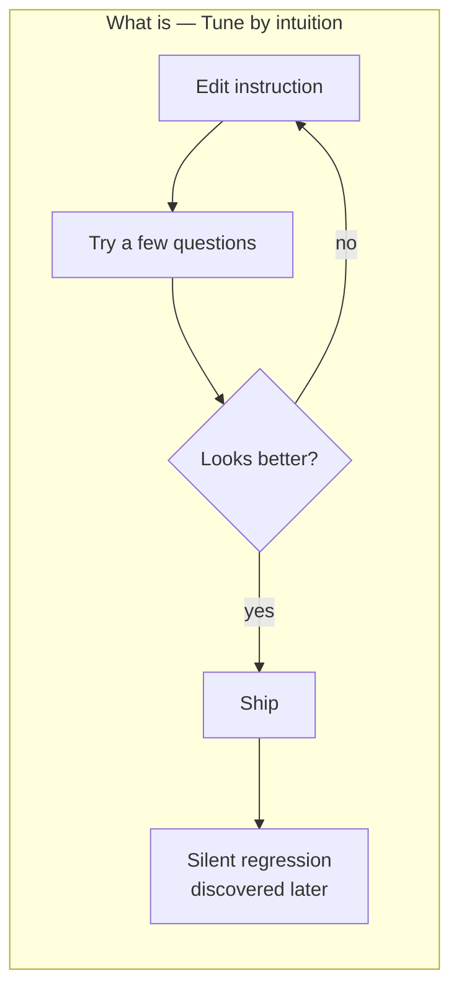
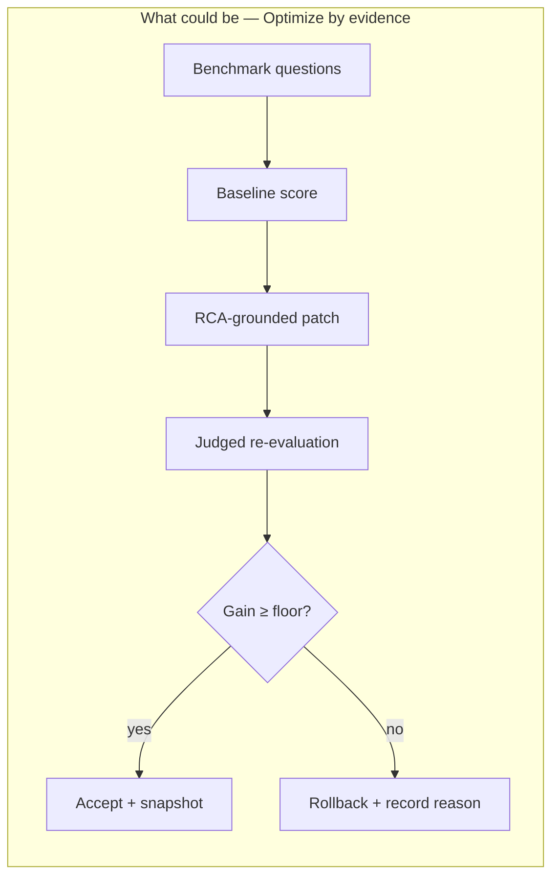
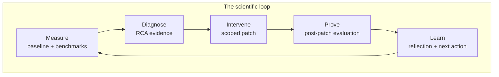

# 01 — Optimizer Mental Model

## Purpose

This document explains *how the optimizer thinks*. Before any code, any DAG, any lever — the optimizer is a mindset: **a Genie Space is a system under test, and improvement is a measurable outcome, not a feeling**.

Understanding this mental model is the prerequisite for using GSO well, debugging it, presenting it, or extending it.

> **The five-word story**
> Measure. Diagnose. Intervene. Prove. Learn.

## The Problem The Optimizer Solves

A Genie Space looks like a chat surface, but underneath it is a complex routing and SQL-generation system over a curated subset of Unity Catalog. It can be impressive in demos and quietly wrong in production. The classic failure pattern is:

1. A subject-matter expert tweaks instructions.
2. They check a few questions, see "yes that looks better," and ship it.
3. Two weeks later a different question silently breaks because of an interaction with a join hint or a column synonym nobody remembers adding.

This is the mental model GSO replaces.

The contrast above is the central before/after of every GSO conversation.

## The Five Mental Moves

The optimizer's loop maps cleanly onto the way good scientists work.

### 1. Measure — A score before any change

The optimizer refuses to claim improvement without a starting line. The baseline evaluation is non-negotiable: it scores the *unchanged* Genie Space against the benchmark and stamps that score into MLflow. Every later iteration is judged against this number, not against opinions.

**In code:** `_run_baseline` in [`optimization/harness.py`](../../src/genie_space_optimizer/optimization/harness.py) and `run_evaluation` in [`optimization/evaluation.py`](../../src/genie_space_optimizer/optimization/evaluation.py).

### 2. Diagnose — A theory of failure before any patch

When a question fails, the optimizer doesn't immediately propose a fix. It first builds an **RCA ledger** — a structured account of *why* each failing row failed: wrong join, missing column synonym, instruction missing, TVF parameter ambiguity, and so on. Then it groups related failures into clusters and themes.

**Why this matters:** Patches without RCA evidence are guesses. Patches grounded in RCA findings are hypotheses with a known target.

**In code:** `build_rca_ledger` in [`optimization/rca.py`](../../src/genie_space_optimizer/optimization/rca.py) and `cluster_failures` in [`optimization/optimizer.py`](../../src/genie_space_optimizer/optimization/optimizer.py).

### 3. Intervene — One bounded experiment per iteration

Each iteration produces exactly **one** action group: the single highest-impact intervention the strategist would attempt next, given the current evidence and prior reflections. The action group is then translated, lever-by-lever, into concrete patch proposals that can be applied to the Genie Space.

**Why this matters:** Multiple simultaneous changes confound the experiment — if accuracy moves, you can't tell which change moved it. One scoped intervention per iteration keeps causal attribution intact.

**In code:** `_call_llm_for_adaptive_strategy` and `generate_proposals_from_strategy` in [`optimization/optimizer.py`](../../src/genie_space_optimizer/optimization/optimizer.py).

### 4. Prove — Re-evaluate, judged, on the same benchmark

After applying patches, the optimizer re-runs the full evaluation through the same scorer panel and the same benchmark. The new score is compared to the carried baseline. If the post-arbiter accuracy doesn't clear `min_gain_pp`, the iteration is **rejected and rolled back**, even if pre-arbiter signals improved.

**Why this matters:** A single criterion — "did the judged final score actually improve" — is harder to game than a portfolio of indirect signals.

**In code:** `decide_acceptance` in [`optimization/acceptance_policy.py`](../../src/genie_space_optimizer/optimization/acceptance_policy.py).

### 5. Learn — Memory across iterations

Whether an iteration accepts or rolls back, the optimizer writes a **reflection entry**: what was tried, what happened, why, and what root causes are now in the do-not-retry set. The next strategist call sees this history. The optimizer compounds learning across iterations rather than restarting from scratch.

**In code:** `_build_reflection_entry` and `_resume_lever_loop` in [`optimization/harness.py`](../../src/genie_space_optimizer/optimization/harness.py).

## Six Mental Anchors

These anchors keep the mental model precise.

| Concept | Plain language | Why it matters |
|---------|---------------|----------------|
| **Benchmark** | A versioned set of questions with expected SQL/results, governed in Unity Catalog | The ground-truth contract — without it, "improvement" is unmeasurable |
| **Baseline** | The score before any optimizer change | The control group |
| **RCA evidence** | A structured list of why specific questions failed | Replaces guessing with diagnosis |
| **Action group** | The single intervention this iteration will attempt | One experiment at a time |
| **Safety gate** | A check a patch must pass before it counts | Bounds blast radius and forces causal grounding |
| **Acceptance** | "Did the judged score improve by at least the gain floor?" | The single criterion that decides keep vs roll back |

## The Optimizer's Skepticism

A useful way to describe GSO to a stakeholder:

> "The optimizer is skeptical by design. It will not accept its own changes unless an independent judge says the score actually improved. Every patch starts as a hypothesis; only post-patch evidence promotes it to a fact."

This is what makes the system safe to run on customer Genie Spaces: it has a strong prior that *most* patches will not work, and the burden of proof is on the patch.

## Trust Comes From Auditability

The optimizer doesn't ask anyone to take its word. Every run produces:

- A human-readable **operator transcript** with one block per iteration.
- A machine-readable **decision trace** of every gate and acceptance.
- A **postmortem bundle** in MLflow with per-stage input/output JSON.
- **LoggedModel** snapshots of the Genie Space configuration before and after each accepted iteration.
- **Trace-level feedback** linking each judge verdict and gate decision to the question it referred to.

If a customer asks "why did you change this?" — the answer is a file, not a story.

## When To Use This Mental Model

| Situation | Use this mental model to... |
|-----------|----------------------------|
| Pitching the optimizer to a customer | Frame it as "measured improvement," not "AI auto-tuning" |
| Reviewing a regression | Read the rejection reason and the reflection entry, not the patch diff |
| Debugging a stalled run | Look at RCA evidence and gate decisions, not at the LLM strategist alone |
| Designing a new lever | Confirm it can produce a hypothesis, be safety-gated, and be measured |
| Onboarding a new engineer | Teach the five mental moves before any code path |

## Common Misreadings (Avoid)

- **"It's prompt optimization."** It is not. It changes Genie Space configuration — tables, columns, metric views, joins, instructions, SQL expressions — and judges results, not prompts.
- **"It's auto-fixing things."** It proposes, gates, applies, judges, and either keeps or rolls back. The acceptance criterion is the headline, not the patch.
- **"It's just an eval harness."** Evaluation is one stage in an eleven-stage scientific loop. Without RCA, action groups, gates, and acceptance, an eval harness is only a thermometer.
- **"It will replace SAs."** It compresses the measurable parts of the work. Judgment about what "trustworthy enough for production" means stays human.

## Next Steps

1. Read [02 — The Six-Task DAG](02-six-task-dag.md) to see how the mental model maps to a concrete Databricks Job.
2. Read [04 — Lever Loop and the RCA Process Spine](04-lever-loop-rca-process-spine.md) to see the per-iteration tape.
3. Read [07 — MLflow Observability and Judges](07-mlflow-observability-and-judges.md) to see the evidence layer.
