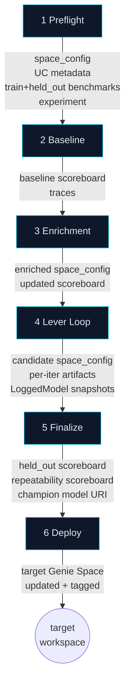

# 02 — The Six-Task DAG

## Purpose

This document is the operator's map of the optimizer. It explains the six Databricks Job tasks that compose a complete optimization run, what each task does, what flows between them, and where the source of truth lives.

> **At a glance**
> One optimization run is one Databricks Job execution. The Job has six tasks. Each task has a single responsibility and a clear handoff.

## The Pipeline

```mermaid
flowchart LR
    PF[1 Preflight<br/>Setup the experiment]
    BL[2 Baseline Eval<br/>Score before changes]
    EN[3 Enrichment<br/>Low-risk context]
    LL[4 Lever Loop<br/>Adaptive optimization]
    FN[5 Finalize<br/>Prove + repeatability]
    DP[6 Deploy<br/>Promote to target]

    PF --> BL --> EN --> LL --> FN --> DP

    classDef setup fill:#0f172a,stroke:#06b6d4,color:#e2e8f0
    classDef measure fill:#0f172a,stroke:#f59e0b,color:#e2e8f0
    classDef change fill:#0f172a,stroke:#ef4444,color:#e2e8f0
    classDef prove fill:#064e3b,stroke:#10b981,color:#ecfdf5
    classDef ship fill:#172554,stroke:#3b82f6,color:#dbeafe
    class PF setup
    class BL,FN measure
    class EN,LL change
    class DP ship
```



The DAG is defined in [`packages/genie-space-optimizer/databricks.yml`](../../databricks.yml). Each task is a Python entrypoint in [`packages/genie-space-optimizer/src/genie_space_optimizer/jobs/`](../../src/genie_space_optimizer/jobs/).

## Task Reference

### 1. Preflight — *Turn a Genie Space into an experimental system*

**What it does**

- Fetches the current Genie Space configuration via the Genie API.
- Resolves the Unity Catalog metadata (catalogs, schemas, tables, columns, descriptions) referenced by the space.
- Runs the IQ scan to surface obvious hygiene issues.
- Generates or refreshes benchmark questions, then splits them into a **train** set (used during the lever loop) and a **held_out** set (untouched until finalize).
- Establishes the MLflow experiment, tags the run with the space ID and revision, and registers the operator-facing run roles.

**Why it matters**

A Genie Space cannot be optimized until it is *measurable*. Preflight is what makes it measurable.

**Inputs**

- Genie Space ID
- Workspace + catalog/schema for benchmark dataset and run state
- Job parameters (max iterations, gain floor, lever set)

**Outputs**

- `space_config.json` (snapshot)
- UC metadata bundle
- Benchmark dataset rows in UC, with a `split` column (`train` or `held_out`)
- MLflow experiment + run scaffolding

**Source anchors**

- `_run_preflight` in [`optimization/harness.py`](../../src/genie_space_optimizer/optimization/harness.py)
- Stage helpers in [`optimization/preflight.py`](../../src/genie_space_optimizer/optimization/preflight.py)

---

### 2. Baseline Evaluation — *Establish the starting line*

**What it does**

- Runs the train benchmark through the unmodified Genie Space.
- Scores each row through the configured **CODE judges** and **LLM judges**.
- Logs trace-level feedback (`mlflow.log_feedback`) so each judgement is anchored to the question it judged.
- Persists the baseline scoreboard.

**Why it matters**

Without a baseline, no improvement claim is possible. Every later iteration is compared to this number.

**Inputs**

- The train benchmark from preflight
- The unmodified `space_config.json`

**Outputs**

- `baseline/scoreboard.json`
- Trace IDs for each baseline question, tagged in MLflow
- Initial signals required for RCA in iteration 1

**Source anchors**

- `_run_baseline` in [`optimization/harness.py`](../../src/genie_space_optimizer/optimization/harness.py)
- `run_evaluation` in [`optimization/evaluation.py`](../../src/genie_space_optimizer/optimization/evaluation.py)
- Scorer composition in [`optimization/scorers/__init__.py`](../../src/genie_space_optimizer/optimization/scorers/__init__.py)

---

### 3. Enrichment (Lever 0) — *Low-risk context before adaptive changes*

**What it does**

- Pulls Unity Catalog metadata that was *not* yet inlined into the Genie Space (table comments, column comments, descriptions).
- Generates safe enrichment patches — table/column descriptions, glossary terms — that don't change behavior, only context.
- Applies them, then re-evaluates against the train benchmark.
- Treats the result as the new effective baseline going into the lever loop.

**Why it matters**

Many "Genie can't answer" failures are really "Genie was never told." Lever 0 handles the metadata-discoverable subset of these issues *before* the LLM strategist starts proposing more invasive changes. This keeps the lever loop focused on real ambiguity rather than on missing context.

**Inputs**

- Baseline scoreboard
- UC metadata bundle from preflight

**Outputs**

- `enrichment/patches.json`
- Updated `space_config.json` (post-enrichment baseline)
- Updated scoreboard used as the lever-loop entry point

**Source anchors**

- `_run_enrichment` in [`optimization/harness.py`](../../src/genie_space_optimizer/optimization/harness.py)
- Proposal generation surfaces (used by Lever 0 enrichment patches) in [`optimization/stages/proposals.py`](../../src/genie_space_optimizer/optimization/stages/proposals.py) and the strategy/proposal modules under [`optimization/`](../../src/genie_space_optimizer/optimization/)

---

### 4. Lever Loop — *The scientific core*

**What it does**

The lever loop iterates the **11-stage RCA process spine** described in detail in [04 — Lever Loop](04-lever-loop-rca-process-spine.md). At a high level, each iteration:

1. Records the current evaluation state.
2. Builds RCA evidence from failures.
3. Clusters failures into themes.
4. Selects exactly one **action group** — the highest-impact intervention to attempt.
5. Generates lever-specific patch proposals.
6. Runs proposals through safety gates.
7. Applies the surviving patch set.
8. Re-evaluates against the train benchmark.
9. Decides accept-or-rollback against the gain floor.
10. Writes a reflection entry into the optimizer's memory.
11. Verifies the run-output contract is intact.

**Why it matters**

This is where measurable improvement happens. Everything before this stage prepares the experiment; everything after this stage proves and ships it.

**Inputs**

- Post-enrichment `space_config.json` and scoreboard
- Train benchmark, RCA configuration, lever set, gain floor, max iterations

**Outputs**

- Per-iteration artifacts: RCA ledger, action group, proposals, gate decisions, applied patch set, post-patch scoreboard, acceptance verdict, reflection entry
- A LoggedModel snapshot per accepted iteration
- The final post-lever-loop `space_config.json` (the *candidate* configuration)

**Source anchors**

- `_run_lever_loop` in [`optimization/harness.py`](../../src/genie_space_optimizer/optimization/harness.py)
- Stage registry: `STAGES` tuple in [`optimization/stages/_registry.py`](../../src/genie_space_optimizer/optimization/stages/_registry.py)
- Process-stage operator order: `PROCESS_STAGE_ORDER` in [`optimization/run_output_contract.py`](../../src/genie_space_optimizer/optimization/run_output_contract.py)

---

### 5. Finalize — *Prove it generalizes and repeats*

**What it does**

- Runs the **held_out** benchmark (untouched until now) through the candidate configuration.
- Runs the train benchmark **N times** (default 3) to measure *repeatability* — does the same configuration produce a stable score under retries?
- Generates an MLflow review session linking traces, judgements, and rejection reasons for human sign-off.
- Promotes the candidate configuration to **champion** status as a registered LoggedModel.

**Why it matters**

A configuration that beat the train benchmark could still be overfit to it. The held-out evaluation tests whether the gains generalize. The repeatability passes test whether the gains are stable. Only configurations that pass both are eligible for deployment.

**Inputs**

- Final `space_config.json` from the lever loop
- Held-out benchmark from preflight
- Repeatability passes parameter

**Outputs**

- `finalize/held_out_scoreboard.json`
- `finalize/repeatability_scoreboard.json`
- `finalize/champion_model_uri` (registered MLflow model)
- Review session URL

**Source anchors**

- `_run_finalize` in [`optimization/harness.py`](../../src/genie_space_optimizer/optimization/harness.py)
- `run_repeatability_evaluation` in [`optimization/evaluation.py`](../../src/genie_space_optimizer/optimization/evaluation.py)

---

### 6. Deploy — *Promote the proven configuration*

**What it does**

- `deploy_check`: validates the target environment and confirms approval state. No write happens here.
- `deploy_execute`: pulls the champion LoggedModel artifact, applies it to the **target** Genie Space (which may live in a different workspace), and tags the deployment in MLflow.

The deploy task is parameterized so it can target either a different prod Genie Space in the same workspace, or a Genie Space in a separate workspace via the cross-env path.

**Why it matters**

Deploy is the bridge from "we can prove it's better" to "the customer has it." Crucially, deploy uses the **champion configuration**, not the latest in-progress edit. The thing that got measured is the thing that ships.

**Inputs**

- Champion model URI from finalize
- Target workspace + space ID
- Approval state

**Outputs**

- Genie Space PATCH applied to the target
- Deployment record in MLflow
- Cross-env decision trace (if applicable)

**Source anchors**

- `deploy_check` and `deploy_execute` in [`optimization/harness.py`](../../src/genie_space_optimizer/optimization/harness.py)
- Cross-env path in [`jobs/run_cross_env_deploy.py`](../../src/genie_space_optimizer/jobs/run_cross_env_deploy.py)

## Task Handoff Map



## Failure Behavior

| Task | If it fails | Recovery |
|------|------------|----------|
| Preflight | Run halts; nothing applied | Fix benchmark/UC config and re-run |
| Baseline | Run halts; no patches applied | Fix scorer/judge config and re-run |
| Enrichment | Patches reverted; run continues with original baseline | Iterate on Lever 0 prompts/configuration |
| Lever Loop | Iteration is rolled back via `rollback`; subsequent iterations may proceed | Inspect rejection reason in reflection entry |
| Finalize | Champion is *not* promoted; lever-loop snapshot remains | Re-run finalize; or accept partial promotion |
| Deploy | Target unchanged; deploy record marks failure | Re-run `deploy_execute` after addressing target-side issues |

> **Invariant**
> Failure in any task downstream of Preflight does not corrupt the source Genie Space. The optimizer keeps a pre-iteration snapshot and uses `rollback` (see [`optimization/applier.py`](../../src/genie_space_optimizer/optimization/applier.py)) to restore configuration when an iteration is rejected.

## Operator's Cheat Sheet

```
Preflight   → "Make it measurable"
Baseline    → "Know the starting score"
Enrichment  → "Add safe context first"
Lever Loop  → "Run experiments, keep what works"
Finalize    → "Prove it generalizes and repeats"
Deploy      → "Promote the proven configuration"
```

## Next Steps

- Want the experimental setup in detail? Go to [03 — Preflight, Benchmark, Enrichment](03-preflight-benchmark-enrichment.md).
- Want to understand each iteration of the loop? Go to [04 — Lever Loop and the RCA Process Spine](04-lever-loop-rca-process-spine.md).
- Want the deploy story? Go to [06 — Finalize, Repeatability, Deploy](06-finalize-repeatability-deploy.md).
