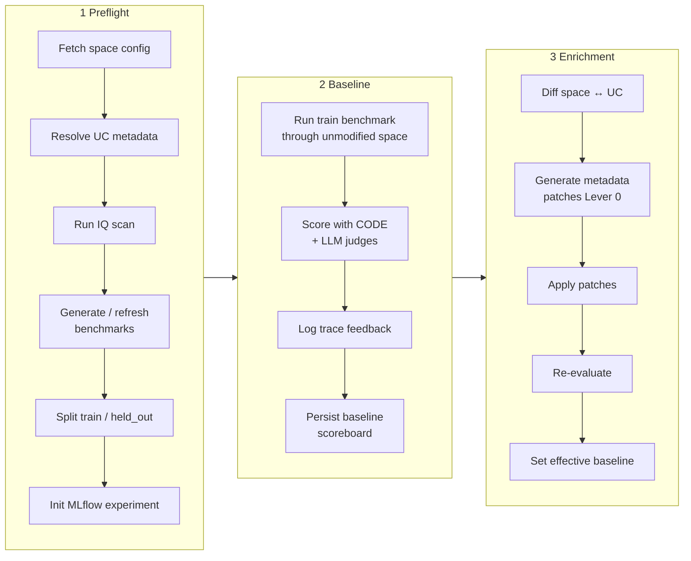
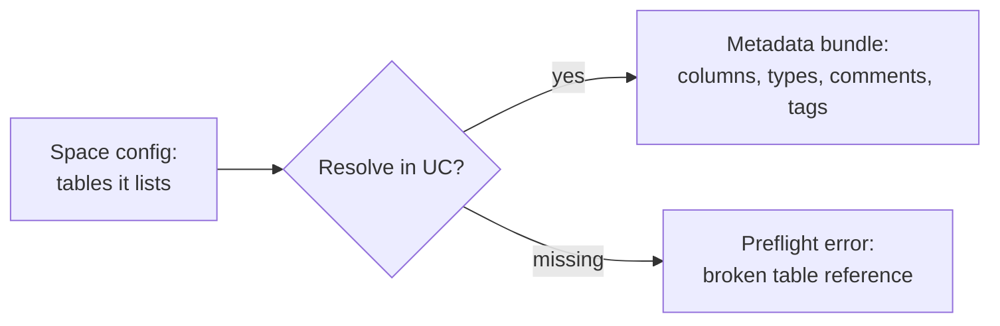
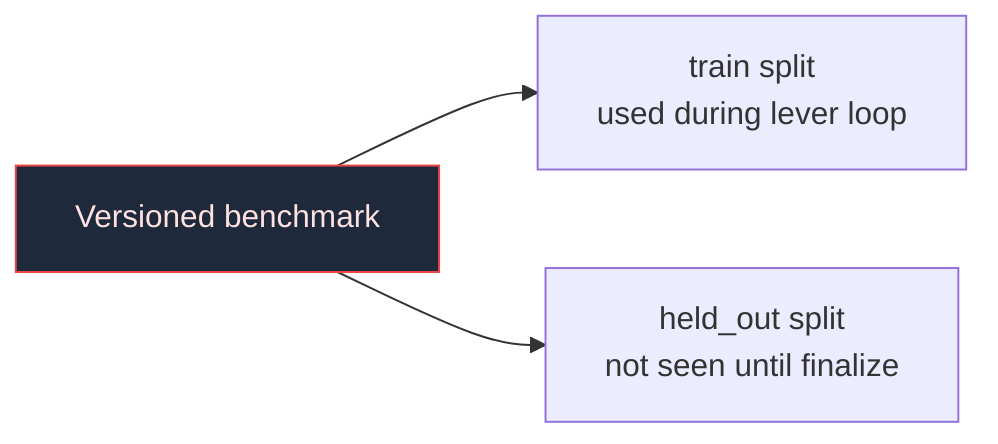
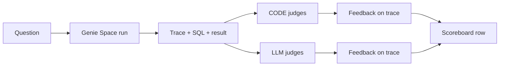
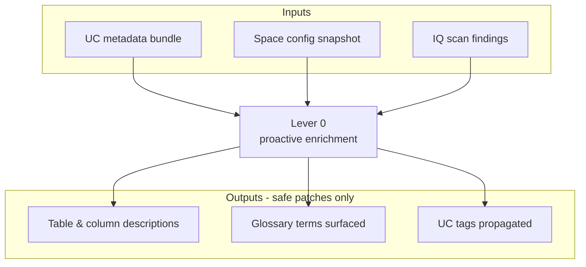
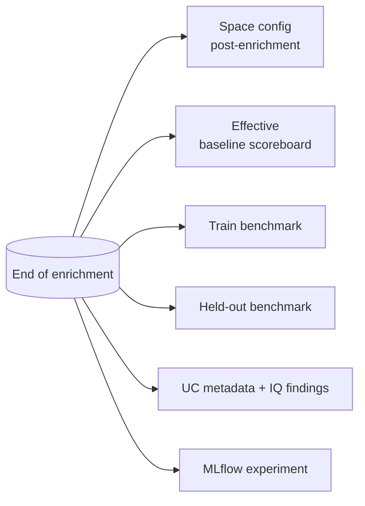

# 03 — Preflight, Benchmark, Enrichment

## Purpose

Tasks 1, 2, and 3 of the DAG turn a raw Genie Space into a measurable experimental system. This document explains how that transformation happens and why each step is required before the lever loop can do anything credible.

> **Mental frame**
> Preflight builds the lab. Benchmark + baseline calibrate the instruments. Enrichment cleans the bench. Only then does the lever loop start doing science.

## The Setup Pipeline

## 1. Preflight In Detail

### 1.1 Fetch space config

A versioned snapshot of the Genie Space is captured via the Genie API. The snapshot is the optimizer's *source-of-truth view* of what the space looks like at run start.

- **Captured fields:** title, description, table allowlist, instructions, SQL example library, metric views, TVFs, joins, and the GSL instructions block.
- **Stored as:** `space_config.json` in the run output bundle, with an MLflow artifact link.

### 1.2 Resolve UC metadata

For every table the space references, the optimizer pulls Unity Catalog metadata: catalog/schema membership, full column list with types, table comment, column comments, and any tags. This is the ground truth about *what data exists*, regardless of what the Genie Space currently knows about it.

A space referencing tables that no longer exist in UC fails preflight. This is intentional: the optimizer refuses to run experiments on a broken substrate.

### 1.3 Run IQ scan

The IQ scan applies a deterministic rule set (see backend `scanner.py` in the workbench app for the canonical 12 checks) and produces a list of structural issues — missing descriptions, undescribed columns referenced by instructions, conflicting glossary terms, and so on. The scan output is RCA fuel: it gives Lever 0 and the lever-loop strategist a head start on known issues.

### 1.4 Generate / refresh benchmarks

Benchmarks are the *contract* that defines what "good" means for this space. They live in Unity Catalog, are versioned, and contain — at minimum — a question, an expected SQL/result, and a difficulty/category tag.

The benchmark builder:

- Generates new questions if the space has no benchmark yet, using the space's domain hints and table set.
- Refreshes question metadata (e.g., expected results) if the schema changed.
- Validates the questions are well-formed.

### 1.5 Split train / held_out

This split is one of the most important lines in the optimizer.

The wall between **train** and **held_out** is enforced as a leakage gate: the lever loop's evaluators are not permitted to see held-out questions; the finalize stage is the only consumer of held-out scores. If a patch only worked because it memorized the train set, finalize will catch it.

### 1.6 Initialize MLflow

Preflight registers an MLflow experiment for the run, tags the parent run with the space ID, revision, lever set, and gain floor, and creates the role-based child runs (operator-facing run, scoring run, judge runs) that the rest of the pipeline writes into.

## 2. Baseline Evaluation In Detail

### 2.1 What gets scored

Each row in the train benchmark is asked to the unmodified Genie Space. The model emits a SQL query and a result. Two kinds of judges then weigh in:

- **CODE judges:** deterministic checks. Did the SQL execute? Did the result match the expected schema? Did the SQL use the expected tables?
- **LLM judges:** model-graded checks. Did the answer match the expected business meaning? Did the SQL pick the right metric view? Did the response correctly handle nulls/edge cases?

Both classes are composed in [`optimization/scorers/__init__.py`](../../src/genie_space_optimizer/optimization/scorers/__init__.py) via `make_all_scorers`.

### 2.2 Trace feedback

Every judge verdict is anchored back to the trace it judged via `mlflow.log_feedback`. The result is that a reviewer can open any failing question and see, in a single trace, exactly which judge said what and why.

### 2.3 The baseline scoreboard

The output is a structured scoreboard with: per-question pass/fail per judge, a post-arbiter overall verdict, latency, and SQL fingerprint. This scoreboard is the **starting line** every later iteration is compared to.

> **Operator tip**
> If the baseline score is unexpectedly low, the problem is almost always benchmark quality or scorer configuration, not the Genie Space. Triage benchmarks before tuning.

## 3. Enrichment In Detail (Lever 0)

### 3.1 Why enrichment is its own task

Most Genie failures are not about the LLM: they are about the *space being told too little about the data*. A column called `dlvr_st_cd` with no description is hard to use; the same column with a comment "delivery state code (US two-letter postal abbreviation)" is easy. Enrichment harvests the metadata that exists in UC but isn't yet inlined in the space.

### 3.2 What enrichment changes

Enrichment patches are intentionally **non-behavioral**: they add context that helps the LLM, but they don't change the table allowlist, the join semantics, the metric definitions, or the SQL examples. This is why enrichment runs *outside* the lever loop and *before* the safety gates: it's safe by construction.

### 3.3 The effective baseline

After enrichment patches apply, the optimizer re-runs the train benchmark. The new score is the **effective baseline** that the lever loop carries forward. This means the lever loop never gets credit for improvements that were really just metadata hygiene — those gains are attributed to enrichment, where they belong.

## End-State After Setup

By the time the lever loop starts, the optimizer has produced:

| Artifact | Lives at | Used by |
|---------|----------|---------|
| `space_config.json` (post-enrichment) | Run output bundle + MLflow artifact | Lever loop, finalize |
| UC metadata bundle | Run output bundle | RCA stage (lever loop) |
| `train` benchmark + `held_out` benchmark | UC table | Lever loop (train), Finalize (held_out) |
| Baseline + post-enrichment scoreboards | Run output bundle + MLflow | Acceptance comparisons in lever loop |
| MLflow experiment + run scaffolding | MLflow tracking server | All later evaluations and feedback writes |
| IQ scan findings | Run output bundle | RCA stage |

This is the entry point of the lever loop. The space is now a measurable, repeatable, observable experimental system.

## Common Misreadings (Avoid)

- **"Enrichment is always safe."** It is *low-risk* by construction, but if a UC comment is wrong, propagating it is wrong. Lever 0 has its own review path; gross errors in UC must be fixed at the source.
- **"The baseline is the floor."** No: the *effective baseline* (post-enrichment) is the floor used by acceptance. The pre-enrichment baseline is recorded for attribution, not for gating.
- **"Held-out is unused noise."** Held-out questions exist *exactly* to be unused during the lever loop. That's the wall that makes finalize meaningful.

## Next Steps

- Read [04 — Lever Loop and the RCA Process Spine](04-lever-loop-rca-process-spine.md) to see what happens after the setup pipeline.
- Read [07 — MLflow Observability and Judges](07-mlflow-observability-and-judges.md) for the evaluation/judging stack used by baseline.
