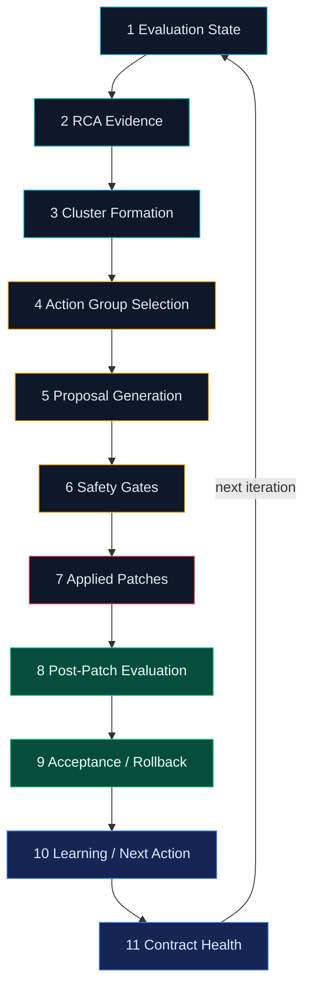
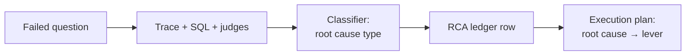
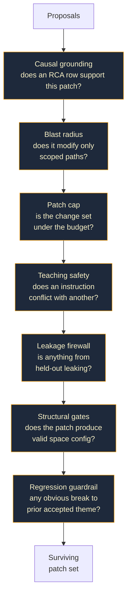
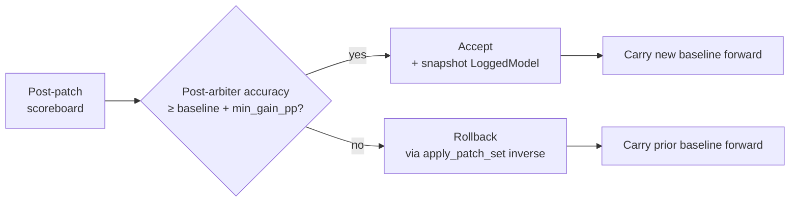
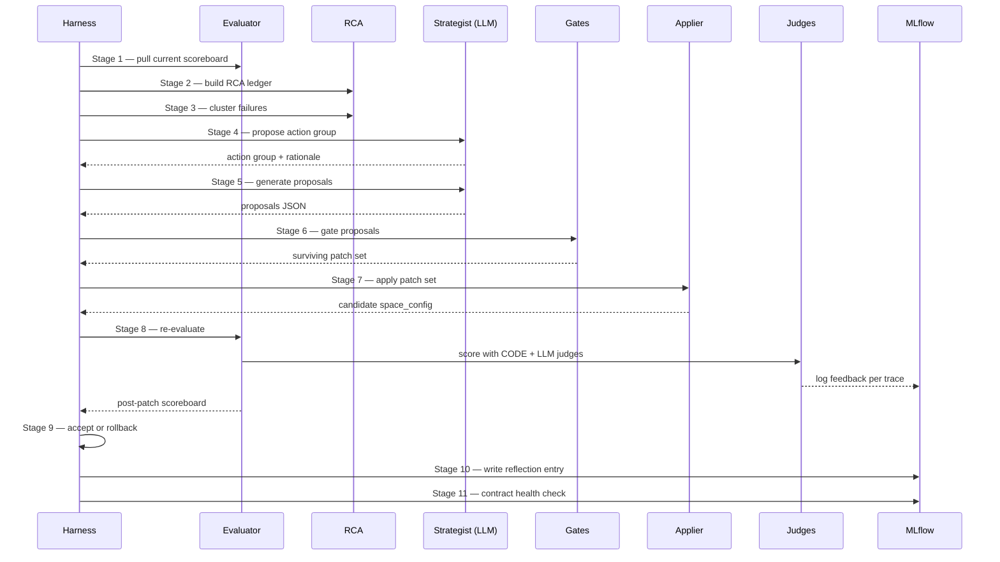
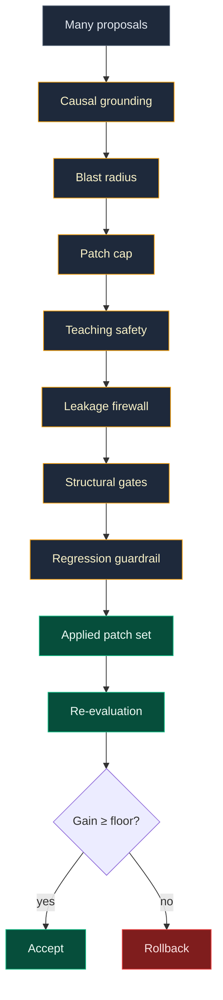

# 04 — Lever Loop and the RCA Process Spine

## Purpose

The lever loop is where the optimizer *thinks*. This document explains the canonical 11-stage **process spine** that runs inside every iteration of the loop, why each stage exists, and what artifact it produces.

> **One-line frame**
> One iteration of the lever loop is one controlled experiment: hypothesis → intervention → judged measurement → kept or rolled back → recorded for future iterations.

The 11 stages come from `PROCESS_STAGE_ORDER` in [`optimization/run_output_contract.py`](../../src/genie_space_optimizer/optimization/run_output_contract.py). The internal stage registry that powers each stage's pre/post artifact contract is `STAGES` in [`optimization/stages/_registry.py`](../../src/genie_space_optimizer/optimization/stages/_registry.py).

## The Process Spine

## Stage 1 — Evaluation State

**Plain language:** "What's the current scoreboard, and what changed since last iteration?"

**Why it exists:** Every later stage needs the current pass/fail by question, the per-judge verdicts, and the deltas from the carried baseline. Stage 1 freezes that view at the top of the iteration so RCA and clustering operate on a stable snapshot.

**Inputs:** Carried baseline scoreboard, prior iteration scoreboard (if any).

**Outputs:** `evaluation_state.json` with per-question verdicts, judge breakdown, and movement deltas.

**Source:** Stage helpers under [`optimization/stages/`](../../src/genie_space_optimizer/optimization/stages/).

## Stage 2 — RCA Evidence

**Plain language:** "Why did each failing question fail?"

**Why it exists:** Without a structured account of *why*, every patch is a guess. Stage 2 walks each failing trace, pulls the SQL, the column references, the join paths, the matched instructions, and the judge verdicts, and writes a structured row into the **RCA ledger**.

**Outputs:**

- `rca_ledger.json` — structured failure rows: question, observed SQL, observed result, judge verdicts, hypothesized root cause type (missing column synonym, wrong metric view, instruction gap, etc.).
- `rca_execution_plan.json` — derived from the ledger via `build_rca_execution_plans`, this is a prioritized plan of which root causes to address and which lever each one maps to.

**Source:** `build_rca_ledger` in [`optimization/rca.py`](../../src/genie_space_optimizer/optimization/rca.py); `build_rca_execution_plans` in [`optimization/rca_execution.py`](../../src/genie_space_optimizer/optimization/rca_execution.py).

## Stage 3 — Cluster Formation

**Plain language:** "Group similar failures so the optimizer can fix many at once."

**Why it exists:** Treating each failed question as its own bespoke fix is expensive and often duplicative. Stage 3 clusters the RCA rows by root cause signature so a single patch can address a *theme* of failures.

**Outputs:** `clusters.json` — clusters of failures with shared root cause and lever recommendation, ranked by impact (failures resolved per patch).

**Source:** `cluster_failures` and `rank_clusters` in [`optimization/optimizer.py`](../../src/genie_space_optimizer/optimization/optimizer.py).

## Stage 4 — Action Group Selection

**Plain language:** "Pick exactly one intervention to attempt this iteration."

**Why it exists:** A controlled experiment changes one variable at a time. Stage 4 selects one *action group* — typically a cluster + lever pair — and commits to attempting only that intervention this iteration. Other clusters wait their turn.

**Why one at a time:** If two changes shipped together and the score moved, you can't say which change moved it. The optimizer keeps causal attribution clean by limiting itself to a single action group.

**Outputs:** `action_group.json` with the chosen cluster, lever, and rationale.

**Source:** `_call_llm_for_adaptive_strategy` in [`optimization/optimizer.py`](../../src/genie_space_optimizer/optimization/optimizer.py), informed by prior reflection entries.

## Stage 5 — Proposal Generation

**Plain language:** "Translate the action group into concrete patch JSON."

**Why it exists:** An action group is a target ("fix the wrong-metric-view cluster on revenue questions"); a proposal is a unified-diff-style JSON change to the space config that, if applied, would address the target. Stage 5 generates one or more proposals, each scoped to a single lever.

**Outputs:** `proposals.json` — a list of candidate patch sets per lever, with patch operations (`add` / `replace` / `remove`) and target paths in the space config.

**Source:** `generate_proposals_from_strategy` in [`optimization/optimizer.py`](../../src/genie_space_optimizer/optimization/optimizer.py).

## Stage 6 — Safety Gates

**Plain language:** "Every patch has to earn its way in."

**Why it exists:** A proposal is just a guess until it passes the gates. Stage 6 funnels proposals through a series of independent checks; only the survivors become applied patches.

**Outputs:** `gate_decisions.json` — for every proposal, every gate's verdict and reason. Surviving patches go forward; rejected patches are recorded with reasons.

**Source:** Gate logic distributed across [`optimization/control_plane.py`](../../src/genie_space_optimizer/optimization/control_plane.py) (`decide_control_plane_acceptance`) and stage-specific gates under [`optimization/stages/`](../../src/genie_space_optimizer/optimization/stages/).

## Stage 7 — Applied Patches

**Plain language:** "Apply the surviving patches to the candidate space config."

**Why it exists:** Stage 7 is the only stage that *writes* to the candidate config. It also stages a pre-iteration snapshot so rollback is possible if the post-patch evaluation fails.

**Outputs:**

- `applied_patches.json` — the exact patch operations applied this iteration.
- A new candidate `space_config.json`.
- A pre-iteration snapshot used by `rollback`.

**Source:** `proposals_to_patches` and `apply_patch_set` in [`optimization/applier.py`](../../src/genie_space_optimizer/optimization/applier.py).

## Stage 8 — Post-Patch Evaluation

**Plain language:** "Re-run the train benchmark through the patched space."

**Why it exists:** This is the experiment's measurement. The same train benchmark, the same scorer panel, the same judges — only the space configuration changed. Any score movement is attributable to this iteration's patch set.

**Outputs:**

- `post_patch_scoreboard.json` — full scoreboard plus per-judge deltas.
- Trace IDs for every post-patch question, with feedback re-attached.

**Source:** `run_evaluation` in [`optimization/evaluation.py`](../../src/genie_space_optimizer/optimization/evaluation.py), called from `_run_lever_loop`.

## Stage 9 — Acceptance / Rollback

**Plain language:** "Did the score actually improve by enough? If not, undo."

**Why it exists:** The optimizer's skepticism lives here. The acceptance criterion is single and explicit: the post-arbiter accuracy must beat the carried baseline by at least `min_gain_pp`. If it doesn't, the iteration is rolled back.

**Outputs:** `acceptance_decision.json` with verdict, gain (pp), and reason; updated carried baseline; LoggedModel snapshot if accepted.

**Source:** `decide_acceptance` in [`optimization/acceptance_policy.py`](../../src/genie_space_optimizer/optimization/acceptance_policy.py); `rollback` in [`optimization/applier.py`](../../src/genie_space_optimizer/optimization/applier.py).

## Stage 10 — Learning / Next Action

**Plain language:** "Write down what we learned so the next iteration is smarter."

**Why it exists:** Without memory, the optimizer would keep proposing the same failed ideas. Stage 10 writes a **reflection entry** that future strategist calls can read.

**Reflection entry contents:**

- The cluster + lever + proposal summary attempted.
- The acceptance verdict and gain.
- Root causes that should now be in the do-not-retry set.
- A short natural-language note from the strategist about why this worked or didn't.

**Outputs:** `reflection_entry.json` appended to the run's reflection log.

**Source:** `_build_reflection_entry` and `_resume_lever_loop` in [`optimization/harness.py`](../../src/genie_space_optimizer/optimization/harness.py).

## Stage 11 — Contract Health

**Plain language:** "Make sure the run's bundle is still well-formed."

**Why it exists:** The optimizer's auditability rests on the run-output contract — the structure that says "for every iteration, these JSON files exist, they reference each other consistently, and the operator transcript is in sync." Stage 11 verifies that contract at the end of each iteration.

**Outputs:** `contract_health.json` — pass/fail per contract clause; if any clause fails, the iteration is flagged for operator review even if accepted.

**Source:** Contract verification helpers under [`optimization/run_output_contract.py`](../../src/genie_space_optimizer/optimization/run_output_contract.py).

## The Iteration In One Picture

## Patch Survival Funnel

The visual that best explains "why most ideas don't ship":

## Per-Iteration Artifacts

Every iteration leaves the same set of named artifacts in the run output bundle, making iteration N comparable to iteration N+1.

| Stage | Artifact |
|-------|---------|
| 1 | `evaluation_state.json` |
| 2 | `rca_ledger.json`, `rca_execution_plan.json` |
| 3 | `clusters.json` |
| 4 | `action_group.json` |
| 5 | `proposals.json` |
| 6 | `gate_decisions.json` |
| 7 | `applied_patches.json`, `space_config_pre.json`, `space_config_post.json` |
| 8 | `post_patch_scoreboard.json`, trace IDs |
| 9 | `acceptance_decision.json`, optional LoggedModel snapshot |
| 10 | `reflection_entry.json` |
| 11 | `contract_health.json` |

## Loop Exit Conditions

The lever loop exits when any of these is true:

- The configured `max_iterations` is reached.
- The optimizer's strategist signals "no further high-confidence interventions" (action group selection returns no candidate).
- Two consecutive iterations roll back without improvement (configurable threshold).
- An operator-issued cancellation lands.

On exit, the *last accepted* candidate config is the one that flows into finalize. If no iteration was accepted, the post-enrichment baseline becomes the candidate.

## Why This Structure Is Trustworthy

- **Hypothesis-grounded:** Patches start from RCA evidence, not free-form ideation.
- **Bounded blast radius:** One action group per iteration; gates cap what each patch can touch.
- **Skeptical acceptance:** A judged gain ≥ floor is the only path to "kept."
- **Reversible:** Pre-iteration snapshots make every rejection a clean rollback.
- **Memorialized:** Reflection entries propagate learning across iterations.
- **Auditable:** Contract health verifies the artifact bundle is intact at every exit.

## Next Steps

- Read [05 — The Six Optimization Levers](05-six-optimization-levers.md) to see what each lever can actually change.
- Read [07 — MLflow Observability and Judges](07-mlflow-observability-and-judges.md) to see how the per-iteration artifacts and traces fit together.
