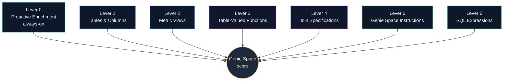
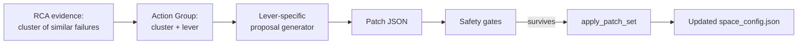

# 05 — The Six Optimization Levers

## Purpose

This document explains the six levers the optimizer can pull to improve a Genie Space, plus the always-on **Lever 0 — Proactive Enrichment** that runs in task 3 of the DAG. Each lever has a different *kind* of patch it can produce, a different defect it addresses, and a different risk profile that the safety gates must defend against.

> **Mental frame**
> The levers are not a menu of "AI tricks." They are six surfaces on the Genie Space configuration that, when adjusted with evidence, demonstrably change accuracy.

The canonical lever names live in `LEVER_NAMES` in [`common/config.py`](../../src/genie_space_optimizer/common/config.py).

## Lever Map At A Glance

The levers naturally cluster into three families:

| Family | Levers | What it does |
|--------|--------|-------------|
| **Make data understandable** | L1 Tables & Columns, L2 Metric Views | Clarify *what the data means* |
| **Route questions to the right shape** | L3 TVFs, L4 Joins | Make the *correct query path* obvious |
| **Teach how to answer** | L5 Instructions, L6 SQL Expressions | Provide *reusable answer patterns* |

Lever 0 sits outside this taxonomy because it is a **task** (Enrichment) rather than a lever-loop intervention.

## Lever 0 — Proactive Enrichment (always-on)

**Purpose:** Inline UC metadata that the space doesn't yet know about, so the LLM has the easy wins handed to it before the lever loop starts.

**Typical patches:**

- Add table descriptions sourced from UC table comments.
- Add column descriptions and type hints sourced from UC column comments.
- Surface UC tags (PII, sensitive, deprecated) so the space respects them.

**Defects it addresses:**

- "Genie can't pick the right table" because no description distinguishes two similar ones.
- "Genie omits a relevant column" because the column has no human-readable comment.
- "Genie uses a deprecated table" because the deprecation tag wasn't surfaced.

**Risk profile:** Lowest. Enrichment patches are *non-behavioral* — they add context, they don't change semantics. Lever 0 has its own minimal gate set: the source UC field must exist; the patch cannot conflict with an existing instruction.

**Where it runs:** DAG task 3 (Enrichment), not the lever loop. See [02 — The Six-Task DAG](02-six-task-dag.md) and [03 — Preflight, Benchmark, Enrichment](03-preflight-benchmark-enrichment.md).

## Lever 1 — Tables & Columns

**Purpose:** Adjust the table allowlist and per-column metadata used by the space, plus any column-level synonyms or aliases.

**Typical patches:**

- Add a previously-excluded table when an RCA cluster shows questions consistently routing to a less-fitting table.
- Add a synonym list to a column whose name is technical but whose business term is well-known (`dlvr_st_cd` → "delivery state code").
- Mark a column as deprecated to steer Genie away from it.

**Defects it addresses:**

- Wrong-table routing.
- Column-not-found despite the data existing under a different name.
- Stale columns being preferred over the supported alternatives.

**Risk profile:** Medium. Adding tables expands blast radius; aliases can collide. The relevant gates are blast radius (limit additions per iteration), regression guardrail (a new alias must not break an accepted theme), and structural validation (allowlist must reference real UC objects).

**RCA signal it consumes:** Failure rows where the SQL referenced an unrelated table or where an LLM judge flagged "missing column."

## Lever 2 — Metric Views

**Purpose:** Define or refine **metric views** — reusable, governed business metrics expressed as YAML with measures and dimensions.

**Typical patches:**

- Promote a frequently-asked aggregation ("monthly active customers in the West region") into a metric view, so Genie can answer it consistently.
- Refine an existing metric view's dimensions to support a new slicing question.
- Mark a metric view as the canonical answer for a question family, so Genie doesn't reinvent the SQL each time.

**Defects it addresses:**

- Inconsistent answers to the same business question because the SQL changes between calls.
- Slow or expensive ad-hoc SQL where a metric view would be cheap and exact.
- Drift between BI dashboards and Genie answers because they don't share a metric.

**Risk profile:** Medium. Metric view changes are governed objects; structural gates must validate the YAML before apply. Regression guardrails are critical because a metric view is consumed by many questions.

**Why it's powerful:** Metric views are the *highest-leverage* lever for question families with stable definitions — they let one patch fix dozens of failure rows simultaneously.

## Lever 3 — Table-Valued Functions

**Purpose:** Register or refine **TVFs** that encapsulate parameterized SQL patterns (e.g., a `sales_by_region(start_date, end_date, region)` function).

**Typical patches:**

- Add a TVF that captures a recurring parameterized query pattern surfaced by the RCA cluster.
- Add or rename TVF parameters so Genie can match them to natural-language slot fillers.
- Document the TVF inside the space so Genie's routing prefers it for the right question shapes.

**Defects it addresses:**

- "Genie regenerates the same complex SQL every time, sometimes incorrectly."
- Missing parameter binding when the natural language clearly contained the slot.
- Inconsistent date-range or region-filter semantics across answers.

**Risk profile:** Medium-high. TVFs are real database objects; structural gates check definitions, and applyability gates check that the function is callable in the warehouse before declaring a patch live.

## Lever 4 — Join Specifications

**Purpose:** Add, refine, or correct **join specifications** between tables in the space.

**Typical patches:**

- Add a join spec when RCA shows Genie inferring a wrong join key.
- Mark a join as preferred between two tables that share multiple keys (e.g., prefer `customer_id` over `email_hash`).
- Add a directional hint when the join is asymmetric (left-only vs many-to-many).

**Defects it addresses:**

- Wrong join key picked by the LLM.
- Cartesian explosion in answers because the join was inferred incorrectly.
- Inconsistent counts across questions because the join semantics drifted.

**Risk profile:** High. Joins change result semantics. Gates here must include strong regression guardrails — a join change that helps revenue questions can silently break churn questions.

## Lever 5 — Genie Space Instructions

**Purpose:** Edit the natural-language instructions block — the GSL near-term schema (`instructions.text_instructions[0].content`) — that Genie reads as a system prompt for the space.

**Typical patches:**

- Add a section explaining a domain term ("a 'churned' customer means inactive for ≥ 30 days").
- Add a routing rule ("for revenue questions, always start from `metric_view.revenue_v1`").
- Add a guardrail ("never join `users` to `events` on email; use `user_id`").
- Remove or rewrite a section that's contradicted by a new metric view.

**Defects it addresses:**

- Domain terminology being misinterpreted.
- Genie picking a non-canonical SQL path despite a better one existing.
- Instructions that are stale, redundant, or self-contradictory.

**Risk profile:** Medium-high. Instructions are global — a single edit can affect every question. Teaching-safety gates check for contradictions with existing sections; structural gates validate against the GSL near-term schema; regression guardrails check accepted themes don't break.

**Special note:** Lever 5 must respect the GSL near-term schema documented in `docs/gsl-instruction-schema.md` (in the workbench app). The fix agent and create agent share this contract.

## Lever 6 — SQL Expressions

**Purpose:** Curate the **SQL example library** that Genie uses as in-context references when generating queries.

**Typical patches:**

- Add a worked SQL example for a question family the RCA cluster keeps failing on.
- Replace a stale SQL example with one that uses the new metric view or TVF.
- Remove a misleading example that consistently shows up in wrong-pathway failures.

**Defects it addresses:**

- Genie regenerating SQL from scratch when a known good pattern exists.
- Wrong style or wrong window function pattern getting copied across answers.
- Examples that disagree with the current schema.

**Risk profile:** Medium. Examples are influential because LLMs are highly sensitive to in-context exemplars. Structural gates validate SQL syntax and table references; teaching-safety gates check examples don't contradict instructions; regression guardrails confirm prior accepted themes still pass.

## Lever-To-Defect Cheat Sheet

| If the RCA evidence shows... | Try this lever | Why |
|------------------------------|----------------|------|
| "Genie used the wrong table" | L1 Tables & Columns | Adjust allowlist or aliases |
| "Same business metric, different SQL each time" | L2 Metric Views | Centralize the definition |
| "Same parameterized pattern, fragile SQL" | L3 TVFs | Encapsulate the pattern |
| "Wrong join key chosen" | L4 Joins | Make the right key explicit |
| "Domain term misunderstood" or "wrong routing" | L5 Instructions | Teach the space the rule |
| "Genie reinvents SQL when a good pattern exists" | L6 SQL Expressions | Add the canonical example |
| "Column has no description; Genie can't tell what it means" | L0 Enrichment | Inline UC metadata |

## How A Lever Choice Becomes A Patch

Each lever's proposals flow through `generate_proposals_from_strategy` (in `optimization/optimizer.py`) and the proposal stage in [`optimization/stages/proposals.py`](../../src/genie_space_optimizer/optimization/stages/proposals.py). Each proposal carries the patch operations *and* the rationale (which RCA rows it claims to fix), so the gates can verify causal grounding.

## Risk-To-Gate Mapping

| Lever | Highest-risk failure mode | Gate that catches it |
|-------|--------------------------|---------------------|
| L0 Enrichment | Wrong UC comment propagated as truth | Source verification + structural gate |
| L1 Tables & Columns | Aliasing collision | Structural gate + regression guardrail |
| L2 Metric Views | Metric definition disagrees with prior accepted theme | Regression guardrail |
| L3 TVFs | Function not callable in target warehouse | Applyability gate |
| L4 Joins | Cartesian explosion or wrong-key drift | Regression guardrail (cross-question impact) |
| L5 Instructions | Self-contradiction or stale rule | Teaching-safety gate |
| L6 SQL Expressions | Example contradicts an instruction | Teaching-safety gate + structural validation |

Gate logic is centralized in [`optimization/control_plane.py`](../../src/genie_space_optimizer/optimization/control_plane.py) and stage-specific gates under [`optimization/stages/`](../../src/genie_space_optimizer/optimization/stages/).

## Choosing The Lever Set For A Run

A GSO run can be configured to enable a subset of levers (the `lever_set` parameter on the Job). Common configurations:

- **Diagnostic run:** Enrichment + L1 + L5 only — low-risk hygiene + instructions.
- **Standard run:** All six levers (default).
- **Aggressive metric refactor:** Enrichment + L2 + L6 — focus on metric views and example library.
- **Read-only safety check:** Enrichment only, no lever loop iterations.

The lever set is recorded in MLflow tags and referenced in the operator transcript so the run's intent is auditable.

## Common Misreadings (Avoid)

- **"More levers = more improvement."** Not necessarily. Each enabled lever expands the strategist's hypothesis space, which can dilute attention. Choose the lever set based on the RCA evidence the customer's space tends to produce.
- **"Lever 5 is the magic one."** Instructions are powerful but high-blast-radius. Treat L2 (metric views) and L6 (SQL examples) as the *cumulative* levers — they fix many questions per patch and are safer than instruction edits.
- **"L0 is mandatory and complete."** L0 is always-on, but it only addresses metadata that *exists* in UC. If UC comments are missing or wrong, L0 has nothing to harvest, and other levers must do the work.

## Next Steps

- Read [04 — Lever Loop and the RCA Process Spine](04-lever-loop-rca-process-spine.md) for how a chosen lever becomes an applied patch.
- Read [06 — Finalize, Repeatability, Deploy](06-finalize-repeatability-deploy.md) to see how lever-driven changes are proven and shipped.
