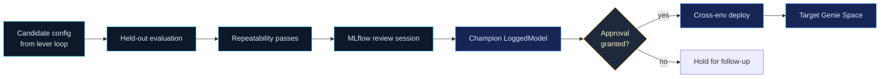
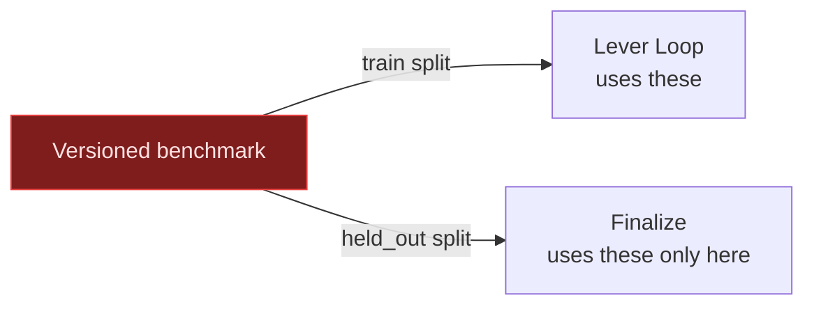
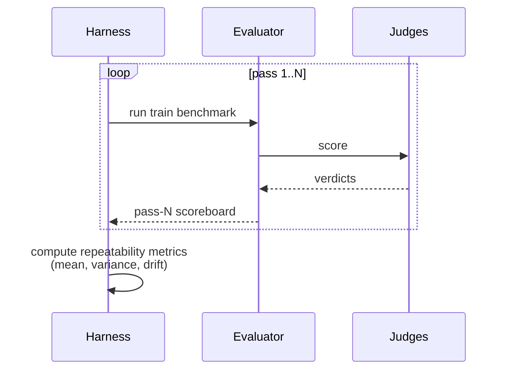
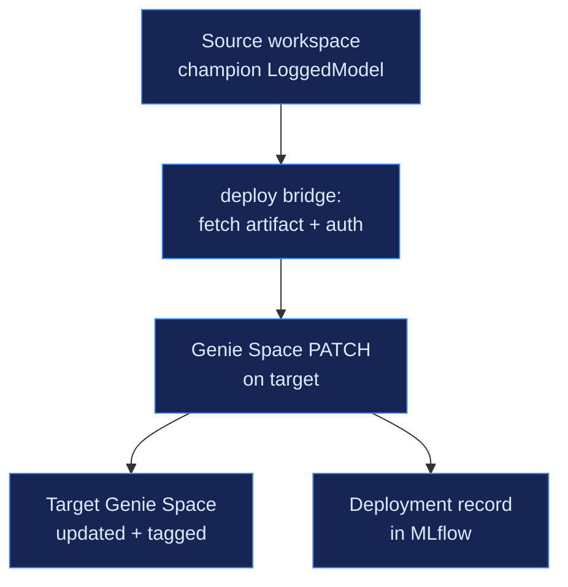
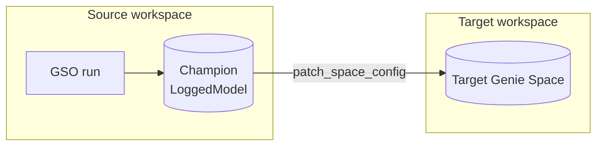

# 06 — Finalize, Repeatability, Deploy

## Purpose

The lever loop produces a *candidate* configuration that beat the train benchmark. Tasks 5 (Finalize) and 6 (Deploy) decide whether that candidate is good enough to ship and, if so, ship it safely to a prod or cross-workspace target.

> **Mental frame**
> Finalize is the optimizer's *generalization test*. Deploy is its *promotion gate*. Together they make sure the configuration that ships is the configuration that was proven, not the configuration that was last edited.

## The Promotion Pipeline



## 5. Finalize

### 5.1 Held-Out Evaluation

The held-out benchmark was carved out at preflight and *never seen* by the lever loop. Finalize runs the candidate config through the held-out questions, scoring with the same CODE + LLM judge panel the train benchmark used.



**Why it matters:** A candidate that beat the train set could have *overfit* to the patterns in those specific questions. The held-out set tests whether the gain generalizes. If held-out accuracy is materially worse than train, the candidate is flagged as overfit and the operator decides whether to ship it.

**Outputs:** `finalize/held_out_scoreboard.json` with per-question verdicts and an overall held-out vs train delta.

### 5.2 Repeatability Passes

The same candidate config is then run through the train benchmark **N times** (default 3) to test whether the score is *stable* under retries.



**Why it matters:** LLM-graded scores can be noisy. A candidate whose accuracy swings 8% between runs is not yet trustworthy, even if its mean is high. Repeatability turns variance into a visible metric.

**Outputs:** `finalize/repeatability_scoreboard.json` with mean, variance, and per-pass deltas. Repeatability scorers are composed via `make_repeatability_scorers` in [`optimization/scorers/__init__.py`](../../src/genie_space_optimizer/optimization/scorers/__init__.py).

### 5.3 MLflow Review Session

Finalize closes by generating a review session URL — an MLflow GenAI dashboard that gathers, in one place:

- Baseline scoreboard.
- Every accepted iteration's reflection entry.
- Held-out scoreboard.
- Repeatability scoreboard.
- The full per-iteration trace tree.
- The candidate `space_config.json` diff against the original.

This is the artifact a human reviewer signs off on before deploy.

### 5.4 Champion Promotion

If the operator chooses to promote, the candidate config is registered as a **LoggedModel** with an explicit `champion` alias. This makes the configuration:

- Discoverable in Unity Catalog as a registered model.
- Versioned, so future runs can compare against the prior champion.
- Reproducible — the registered artifact is exactly what deploys.

**Source anchors:**

- `_run_finalize` in [`optimization/harness.py`](../../src/genie_space_optimizer/optimization/harness.py)
- Repeatability runner: `run_repeatability_evaluation` in [`optimization/evaluation.py`](../../src/genie_space_optimizer/optimization/evaluation.py)

## 6. Deploy

### 6.1 deploy_check (read-only validation)

`deploy_check` is the dry-run gate. It validates:

- The target Genie Space ID resolves and is writable by the optimizer's identity.
- The target's UC dependencies (catalogs, schemas, tables, metric views) exist and match the champion config's references.
- The cross-env auth context (workspace token, OBO context if applicable) is valid.
- An approval record exists for this champion → target pair.

`deploy_check` writes nothing to the target. Its only output is `deploy_check.json` with verdicts per dimension.

### 6.2 deploy_execute (the only writing step)

`deploy_execute` performs the actual Genie API PATCH that promotes the champion config to the target space.



**What gets PATCHed:**

- Table allowlist (Lever 1 changes).
- Metric view bindings (Lever 2).
- TVF bindings (Lever 3).
- Join specifications (Lever 4).
- Instructions block — GSL near-term schema (Lever 5).
- SQL example library (Lever 6).
- Inlined descriptions and tags from Lever 0.

**What does not get PATCHed:**

- Operator-only metadata (titles, owners, sharing settings) is preserved on the target.
- Anything outside the optimizer's known patch surface is left untouched.

**Outputs:**

- Target Genie Space updated.
- `deploy_execute.json` with success state, before/after diff, and a deploy timestamp.
- An MLflow deployment record linking source run, champion model URI, and target space ID.

**Source anchors:**

- `deploy_check` and `deploy_execute` in [`optimization/harness.py`](../../src/genie_space_optimizer/optimization/harness.py)
- Cross-env path: [`jobs/run_cross_env_deploy.py`](../../src/genie_space_optimizer/jobs/run_cross_env_deploy.py)

### 6.3 Same-workspace vs Cross-workspace

Deploy supports two targets:

- **Same workspace, different Genie Space.** Used when the optimizer ran on a "staging" copy of the prod space and the customer wants to promote into the canonical prod space.
- **Different workspace.** Used when optimization happens in a dev/staging workspace and prod lives elsewhere. The cross-env path resolves auth in both workspaces and uses the registered model artifact as the portable carrier.

In both modes, the carrier is the **registered MLflow model** — never a raw file copy. This guarantees the thing deployed is the exact thing that was finalized.



## Approval And Auditability

Approval is not a commit message — it's a recorded record. The deploy task verifies the approval is in place before `deploy_execute` does anything writeable. The audit trail for any deploy includes:

| Item | Provenance |
|------|-----------|
| Train benchmark version | UC table version |
| Held-out benchmark version | UC table version |
| Baseline score | MLflow run artifact |
| Per-iteration scoreboards | MLflow run artifacts |
| Held-out + repeatability scores | MLflow run artifacts |
| Champion model URI | MLflow registered model |
| Approval record | Recorded in deploy bundle |
| Target space pre/post diff | `deploy_execute.json` |

Anyone can ask "why did this Genie Space change?" and get a complete answer.

## Failure Recovery

| Failure | What stays clean | Recovery |
|---------|-----------------|----------|
| Held-out worse than train (overfit) | Source space and prior champion untouched | Operator chooses to extend lever loop or accept partial gains |
| Repeatability variance too high | Source space and prior champion untouched | Re-run finalize with a higher repeatability `N`; consider tightening LLM judge prompts |
| `deploy_check` fails | Target unchanged | Fix target dependency (UC ref, auth, approval) and re-run check |
| `deploy_execute` partial fail | Target may be in mixed state — the API is fail-fast per patch operation | Re-run `deploy_execute`; idempotent for already-applied patches |
| Cross-env auth lapse | Target unchanged | Refresh tokens and re-run |

## Operator's Cheat Sheet

```
Held-out:      proves it generalizes
Repeatability: proves it's stable
Review:        proves a human signed off
Champion:      one immutable artifact
deploy_check:  validates target without writing
deploy_execute: PATCHes the proven config to the target
```

## Common Misreadings (Avoid)

- **"Finalize is just another evaluation."** It is the *generalization* evaluation, intentionally on questions the optimizer never used.
- **"The champion is the latest config."** No: the champion is the *promoted* config, which is the candidate that survived finalize. Latest ≠ champion.
- **"Cross-env deploy is risky because the workspaces are different."** The cross-env path uses the registered model as the carrier and `deploy_check` validates target deps before writing. The risk surface is bounded.

## Next Steps

- Read [07 — MLflow Observability and Judges](07-mlflow-observability-and-judges.md) for the artifact and trace stack that backs the audit trail.
- Read [01 — Optimizer Mental Model](01-optimizer-mental-model.md) for the framing to use with stakeholders before showing them the deploy story.
