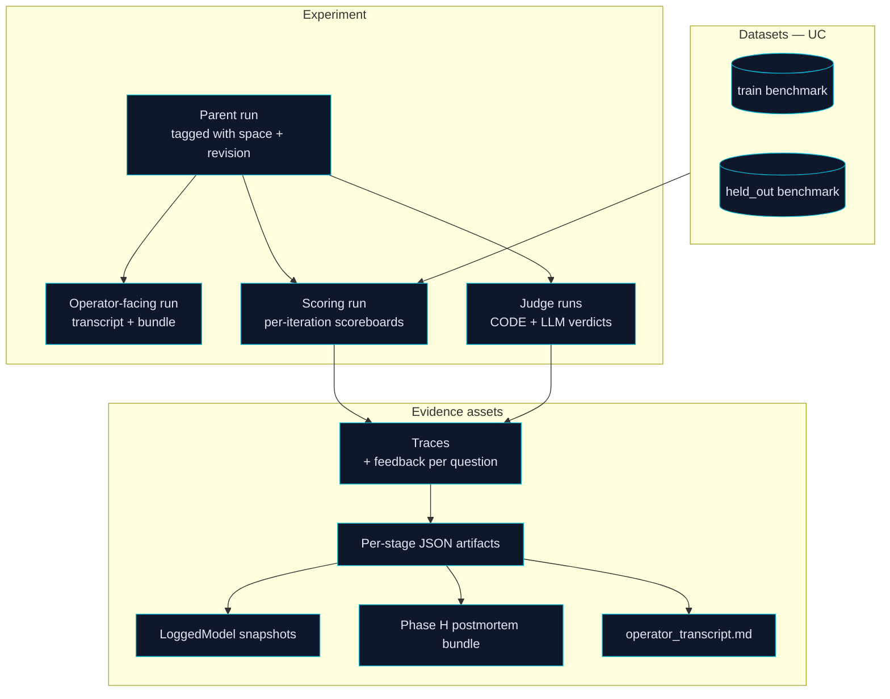
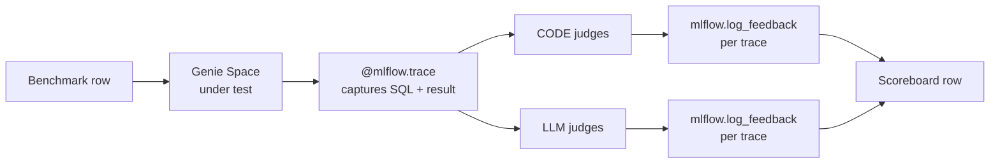
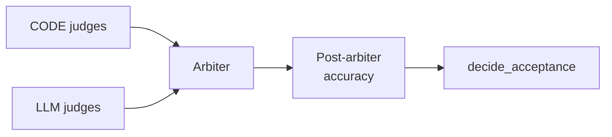
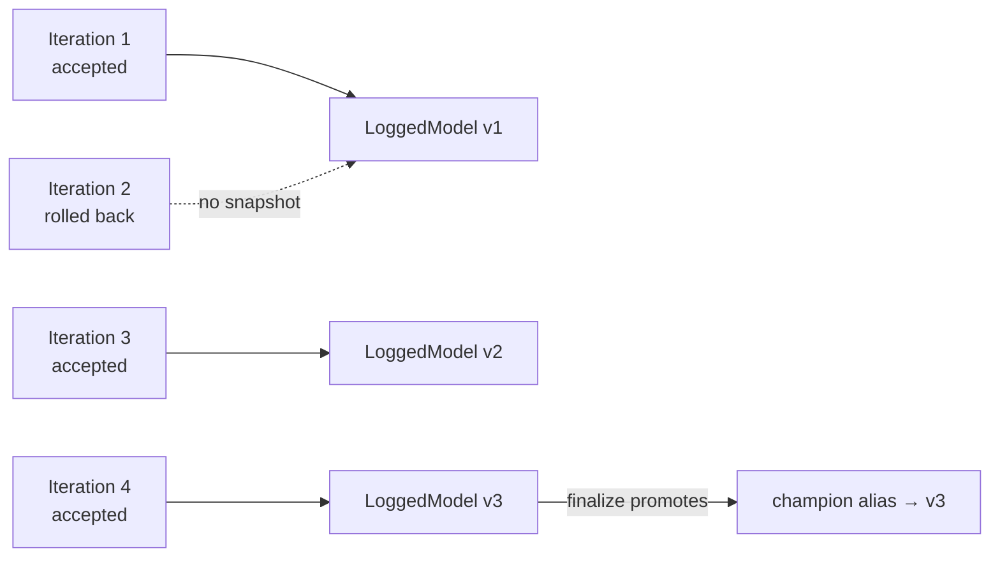

# 07 — MLflow Observability and Judges

## Purpose

MLflow is the optimizer's **evidence room**. Every score, trace, judge verdict, gate decision, and configuration snapshot is logged so the entire run is inspectable after the fact — by an operator, an SA, or a customer reviewer. This document walks the MLflow surface area GSO depends on and explains how each piece is used.

> **Mental frame**
> If a stakeholder asks "why did you change this?" the answer is a file in MLflow, not a story.

## The MLflow Stack At A Glance



## 1. Experiments And Run Roles

GSO opens **one MLflow experiment per Genie Space optimization context** and uses **typed child runs** to separate concerns.

| Run role | Purpose | Lives at |
|----------|---------|---------|
| Parent | Tags: `space_id`, `space_revision`, `lever_set`, `gain_floor`, `repeatability_n`. Holds the operator transcript and the run-output bundle. | Top of the experiment |
| Operator-facing | Human-readable narrative — transcript, decision summary, status. | Child of parent |
| Scoring | Each evaluation pass writes a structured scoreboard + traces + feedback here. | Child of parent |
| Judge | Each judge writes its decisions and rationales here, anchored to the trace it judged. | Children of scoring |
| Repeatability | One scoring child run per repeatability pass. | Children under finalize |
| Deploy | Cross-env decision trace and PATCH record. | Child of parent |

The roles are defined in [`optimization/run_output_contract.py`](../../src/genie_space_optimizer/optimization/run_output_contract.py) and used by `_run_*` helpers in [`optimization/harness.py`](../../src/genie_space_optimizer/optimization/harness.py).

## 2. UC Evaluation Datasets

Benchmarks are first-class **`mlflow.genai.datasets`** stored in Unity Catalog. This means:

- They are governed (catalog/schema permissions apply).
- They are versioned (each `genie generate-benchmarks` produces a new version).
- They are inspectable in the MLflow UI.
- They can be referenced by `mlflow.genai.evaluate()` directly, with the dataset version captured in run metadata.

The `train` and `held_out` splits are columns on the same dataset; `mlflow.genai.evaluate` calls filter by split, so the leakage wall described in [03 — Preflight, Benchmark, Enrichment](03-preflight-benchmark-enrichment.md) is enforced both in code and in MLflow's metadata.

## 3. The Evaluation Call

The optimizer's evaluation entrypoint is `run_evaluation` in [`optimization/evaluation.py`](../../src/genie_space_optimizer/optimization/evaluation.py), which wraps `mlflow.genai.evaluate(...)` with retry handling (`_run_evaluate_with_retries`) and the project's scorer panel.



Every Genie Space invocation runs under a `@mlflow.trace` span, so the full stack — natural-language question, generated SQL, warehouse result, judge verdicts, latency — is one navigable trace.

## 4. Scorers And Judges

The optimizer composes its scorer panel via `make_all_scorers` in [`optimization/scorers/__init__.py`](../../src/genie_space_optimizer/optimization/scorers/__init__.py). Two classes:

### 4.1 CODE Judges

Deterministic Python checks. They run on every evaluation pass and produce boolean verdicts plus reasons.

Examples:

- **`sql_executes`**: did the generated SQL run without error?
- **`result_schema_matches`**: does the returned column set match the expected one?
- **`uses_expected_tables`**: does the SQL reference the tables expected for this question family?

CODE judges are cheap, fast, and necessary — they catch systemic regressions immediately and don't depend on an LLM being available.

### 4.2 LLM Judges

Model-graded judges using the project's foundation-model endpoint. They produce verdicts plus a *judgement rationale* that becomes the feedback string on the trace.

Examples:

- **`answer_matches_business_intent`**: did the answer mean what the question asked for, regardless of phrasing?
- **`metric_view_picked_correctly`**: did the SQL route through the right metric view?
- **`null_and_edge_case_handling`**: did the response handle empty results sensibly?

LLM judges are higher-fidelity but noisier. The optimizer's gain floor and repeatability passes exist partly to defend against LLM-judge variance.

### 4.3 The Arbiter

When CODE and LLM judges disagree, an **arbiter** resolves the verdict using a combination of rule precedence and a final LLM pass. The output is the **post-arbiter accuracy** — the single number used by `decide_acceptance`.

Acceptance only ever looks at post-arbiter accuracy, not at any individual judge's signal. This is intentional: the arbiter is the single source of truth for "did the score actually move."



## 5. Trace Feedback

`mlflow.log_feedback(trace_id=..., name=..., value=..., rationale=...)` is the optimizer's primary tool for making evaluation auditable.

Every judge attaches feedback to the trace it judged. Every gate decision attaches feedback to the proposal it gated. Every acceptance/rollback attaches feedback to the iteration's scoring run.

Helpers:

- `log_gate_feedback_on_traces` — gate decisions become trace-level feedback so a reviewer can open a trace and immediately see "this answer failed because Gate L4 rejected the join change."
- `log_asi_feedback_on_traces` — Action-Strategy-Inference annotations (the strategist's reasoning trail) become trace feedback so the *why* of each iteration is preserved in context.

## 6. LoggedModel Snapshots

Each accepted iteration registers a **LoggedModel** snapshot of the candidate space configuration. This makes the configuration:

- Versionable (every accepted iteration gets a new version).
- Comparable (`mlflow.models.diff` between versions).
- Promotable (the `champion` alias points at the finalize-blessed version).
- Portable (registered models cross workspaces; this is what cross-env deploy carries).

LoggedModel is the optimizer's answer to "what exactly is the proven configuration?"



## 7. The Phase H Postmortem Bundle

After the run completes, a structured postmortem bundle is written to MLflow as a single artifact tree. Highlights:

| File | Contents |
|------|---------|
| `operator_transcript.md` | Human-readable per-iteration narrative |
| `decision_trace_all.json` | Every gate decision and acceptance verdict, structured |
| `scoreboard.json` | Final scoreboard with deltas |
| `space_config.json` | Final candidate config |
| `space_config_diff.json` | Patch from original to final |
| `reflection_log.json` | All reflection entries from all iterations |
| `repeatability_summary.json` | Mean/variance from finalize |
| `held_out_summary.json` | Held-out scores and overfit analysis |

The postmortem bundle is the artifact you hand to a reviewer and the artifact `mlflow_artifact_anchor.py` references for downstream tooling.

## 8. The Operator Transcript

`operator_transcript.md` is the most-read artifact in any GSO run. It is one Markdown file with one section per stage of the pipeline and one block per lever-loop iteration. Each block contains:

- The action group and rationale.
- Proposals attempted, with gate verdicts.
- Applied patch summary.
- Pre/post score with the gain in pp.
- Acceptance verdict and reflection summary.
- Trace links so reviewers can drill in.

The transcript is the optimizer's "show your work" page. It exists to make the run *narratively* explainable, not just data-explainable.

## 9. Review Sessions

The finalize stage opens an **MLflow GenAI review session** that aggregates traces, feedback, and the postmortem bundle into a single dashboard URL. A human reviewer uses this to:

- Spot-check the worst regressions.
- Read the strategist's rationales.
- Verify held-out scores look right.
- Decide whether to grant approval for deploy.

Review sessions turn the raw evidence into a sign-off-ready experience.

## 10. The Audit Trail

Putting it all together, an auditor following the question "why does this Genie Space behave the way it does today?" can walk:

```
Genie Space behavior
  ↓
Champion LoggedModel (current alias)
  ↓
Finalize run (held_out + repeatability)
  ↓
Lever loop run (per-iteration accept/rollback decisions)
  ↓
RCA ledger + reflection log (why each iteration tried what it tried)
  ↓
Trace feedback (per-question judge verdicts and gate decisions)
  ↓
Benchmark dataset version in UC (the contract being satisfied)
  ↓
Original space config snapshot (what we started from)
```

Every link in this chain is an MLflow artifact or trace.

## What MLflow Gives The Optimizer

| Capability | MLflow primitive | Used for |
|-----------|-----------------|---------|
| Experiment tracking | Experiments, runs, tags | Organizing per-space optimization history |
| Versioned eval data | `mlflow.genai.datasets` (UC) | Train/held-out benchmarks |
| Evaluation orchestration | `mlflow.genai.evaluate` | Running benchmarks through scorer panels |
| Per-question observability | `@mlflow.trace` + `mlflow.log_feedback` | Tracing every Genie call and judge verdict |
| Configuration versioning | LoggedModel | Snapshotting accepted candidates |
| Promotion | Registered models + aliases | Champion / cross-env carrier |
| Reviewer experience | GenAI review sessions | Human sign-off |

## Common Misreadings (Avoid)

- **"MLflow is a monitoring layer."** It is, but more importantly it is the *audit* and *promotion* layer. The optimizer relies on MLflow as the substrate that makes claims verifiable.
- **"Traces are nice-to-have."** Without traces, gate decisions and judge verdicts have nothing to attach to. Traces are the connective tissue of the audit trail.
- **"LoggedModel is for ML models."** It is — the optimizer treats Genie Space configurations as a kind of model. The same primitive applies because the same questions apply: what version, who promoted it, what evidence backed the promotion.

## Next Steps

- Read [01 — Optimizer Mental Model](01-optimizer-mental-model.md) for how to talk about MLflow with stakeholders without lapsing into tooling jargon.
- Read [04 — Lever Loop and the RCA Process Spine](04-lever-loop-rca-process-spine.md) to see exactly which stage produces which artifact.
- Read [06 — Finalize, Repeatability, Deploy](06-finalize-repeatability-deploy.md) for the LoggedModel → champion → deploy flow.
