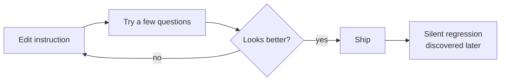
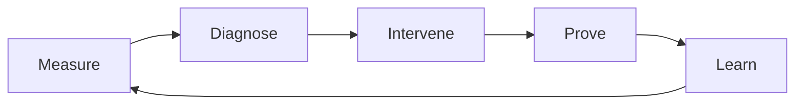

# 08 — SA Deep-Dive Slide Outline (20 slides)

## Purpose

A complete storyboard for a 20-slide SA deep-dive presentation on the Genie Space Optimizer. Each slide is laid out as a one-third text / two-thirds visual layout, with everything needed to either build the slide directly or hand the visual to a designer or LLM image tool.

## Storytelling Principles Applied

| Principle | How it shows up in this deck |
|-----------|------------------------------|
| **Three-act arc** | Act 1 (Slides 1–4): the stakes. Act 2 (Slides 5–17): the method. Act 3 (Slides 18–20): the proof and resolution. |
| **Audience as hero** | The SA is the hero who delivers measurable Genie quality to a customer; the optimizer is the mentor/tool. |
| **What-is vs what-could-be** | Recurring contrast between intuition tuning and evidence-based optimization. |
| **One idea per slide** | Each slide title is a single declarative claim. |
| **Visual dominance** | Every slide allocates ~2/3 of canvas to the visual. |
| **Tension and release** | Problem slides alternate with solution/proof slides to keep momentum. |
| **Callback motif** | The five-word story — *Measure. Diagnose. Intervene. Prove. Learn.* — returns at key moments. |

## Slide Format

Each slide entry below uses the same fields:

- **Slide Title** — one declarative claim
- **Subtitle** — supporting line
- **Slide Text** (1/3 of canvas) — 3–5 short bullets or one short paragraph
- **Visual Description** (2/3 of canvas) — composition, color, labels, hierarchy
- **Sample Visual In Markdown** — Mermaid, ASCII, or a wireframe
- **Speaker Notes** — SA-friendly narration
- **Story Role** — setup, contrast, method, proof, or resolution
- **Audience Question Answered**
- **What-Is / What-Could-Be Contrast**
- **Transition To Next Slide**

---

# Act 1 — The Stakes: From Hope To Measurement

## Slide 1 — Genie Spaces Have A Trust Problem

**Subtitle:** Impressive in demos. Quietly wrong in production.

**Slide Text:**
- A Genie Space looks like a chat — but underneath it is a complex routing and SQL-generation system.
- It can answer 9 questions perfectly and the 10th — the important one — incorrectly.
- The customer-facing question is not "is it cool?" It's "can we trust it?"

**Visual Description:**

> Dark slate full-bleed slide. On the left third, the title and three short bullets. On the right two-thirds, a stylized phone-style chat interface showing three example Genie answers: two with green check marks and one with a glowing red question mark. Beneath the chat, a single lozenge banner: "Trust is the unsolved problem." Use Databricks red-orange for the question-mark glow. Slate background with subtle lakehouse grid.

**Sample Visual In Markdown:**

```
┌──────────────────────────────────────┐
│  Genie Space — answers preview       │
├──────────────────────────────────────┤
│  Q: Total revenue Q3?      ✓         │
│  Q: Active users in West?  ✓         │
│  Q: Churn for SMB segment? ?  ←      │
└──────────────────────────────────────┘
        Trust is the unsolved problem.
```

**Speaker Notes:** Customers don't adopt Genie because of impressive demos. They adopt it when they trust the answers enough to make business decisions. The moment one important question is silently wrong, trust is broken — and rebuilding it takes much longer than building it. This deck is about how the Genie Space Optimizer turns trust into something measurable.

**Story Role:** Setup.
**Audience Question Answered:** "Why does this matter to me as an SA?"
**What-Is / What-Could-Be Contrast:** What is — anecdotal trust. What could be — measured trust.
**Transition To Next Slide:** "Today, the way most teams build that trust is by tweaking and hoping."

---

## Slide 2 — The Old Way: Tune By Intuition

**Subtitle:** Edit. Glance. Ship. Hope.

**Slide Text:**
- Manual prompt edits to instructions.
- A few "golden questions" tested informally.
- Subjective verdict: "looks better."
- No record of what changed or why.

**Visual Description:**

> Left third: the bullet list. Right two-thirds: a messy bulletin board with scattered sticky notes saying "tweak instruction," "try q3 question," "looks better?", "ship it Friday." Sticky notes overlap chaotically, no structure. Use muted slate background. A faint clock icon implies elapsed time. Add one red "regression discovered later" sticky in the corner.

**Sample Visual In Markdown:**



**Speaker Notes:** Be candid about how tuning works today. Most teams use intuition because that's what's available. But intuition leaves no audit trail, doesn't catch interactions between changes, and doesn't tell you *which* edit caused a regression. Set this up as the pain you're going to solve.

**Story Role:** Contrast (the "what is").
**Audience Question Answered:** "How is this done today?"
**What-Is / What-Could-Be Contrast:** What is — intuition tuning. What could be — measured iteration.
**Transition To Next Slide:** "There's a different way: treat the Genie Space like a system under test."

---

## Slide 3 — The New Way: Treat It Like A System Under Test

**Subtitle:** Measure. Diagnose. Intervene. Prove. Learn.

**Slide Text:**
- The Genie Space is the system; benchmarks are the test suite.
- Every patch is a hypothesis until evidence proves it.
- Improvement is a number, not a feeling.

**Visual Description:**

> Left third: the bullet list. Right two-thirds: a precision lab-instrument dial. The dial face shows five labels evenly spaced clockwise: Measure (cyan), Diagnose (amber), Intervene (red-orange), Prove (green), Learn (blue). Center of the dial reads "Evidence, not intuition." Slate background, subtle radial gradient toward the dial.

**Sample Visual In Markdown:**



**Speaker Notes:** This is the central frame for the whole deck. Five words: Measure, Diagnose, Intervene, Prove, Learn. Anything we add later is a refinement of these five words. Land this firmly — it's the callback we'll return to in Slides 9, 17, and 20.

**Story Role:** Method (introduction).
**Audience Question Answered:** "What's the alternative to intuition?"
**What-Is / What-Could-Be Contrast:** Old — anecdotal. New — scientific.
**Transition To Next Slide:** "Here's the whole journey on one map."

---

## Slide 4 — The Whole Journey In One Picture

**Subtitle:** A six-stage Databricks Job from raw space to deployed champion.

**Slide Text:**
- One run = one Databricks Job execution.
- Six tasks. Single responsibility each.
- Clear handoff between every task.

**Visual Description:**

> See [Appendix B — VP-01](appendices/B-visual-prompts.md#vp-01--six-task-pipeline-dag). Six rounded cards in a horizontal pipeline, connected by glowing red-orange arrows. Cards: 1 Preflight, 2 Baseline, 3 Enrichment, 4 Lever Loop, 5 Finalize, 6 Deploy. Each card has an icon and a one-line plain-English output. Slate background, lakehouse grid.

**Sample Visual In Markdown:**


**Speaker Notes:** This is the anchor diagram. Tell the audience: "Every concept in the next 16 slides lives somewhere on this pipeline." Walk left to right slowly: setup, measurement, hygiene, science, proof, ship. Tease that we'll spend most of the deck inside Stage 4 (the Lever Loop) because that's where the science happens.

**Story Role:** Setup (map).
**Audience Question Answered:** "What does the optimizer actually do?"
**What-Is / What-Could-Be Contrast:** Old — opaque. New — staged and inspectable.
**Transition To Next Slide:** "Stage 1 turns the space into something measurable."

---

# Act 2 — The Method: A Controlled Improvement Loop

## Slide 5 — Preflight Turns A Space Into An Experiment

**Subtitle:** Configure the lab before running any test.

**Slide Text:**
- Snapshot the space configuration.
- Resolve every UC dependency it touches.
- Run the IQ scan for hygiene findings.
- Generate / refresh benchmarks; split into train + held-out.
- Initialize the MLflow experiment.

**Visual Description:**

> Left third: bullet list. Right two-thirds: a stylized lab bench with five labeled instruments arranged left-to-right: a clipboard ("space config snapshot"), a magnifying glass ("UC metadata"), a checklist ("IQ scan"), a stack of papers ("benchmark train + held-out"), and a flask ("MLflow experiment"). Above the bench, a banner: "Make it measurable." Slate background with cyan accents on the instruments.

**Sample Visual In Markdown:**

```
[ space_config ] [ UC metadata ] [ IQ scan ] [ benchmarks: train | held-out ] [ MLflow experiment ]
                       ↓
              "Make it measurable"
```

**Speaker Notes:** Preflight is the unsexy stage that everything else depends on. If preflight is half-done, the rest of the run is unreliable. The most important act here is the train/held-out split — that's the wall that protects against overfitting later.

**Story Role:** Method.
**Audience Question Answered:** "How does the optimizer set up?"
**Transition To Next Slide:** "Benchmarks are the contract. Let's look at them carefully."

---

## Slide 6 — Benchmarks Are The Ground-Truth Contract

**Subtitle:** And the train / held-out wall is the most important line in the system.

**Slide Text:**
- Benchmarks live in Unity Catalog. Versioned. Governed.
- `train` split powers the lever loop.
- `held_out` split is untouched until finalize.
- Leakage between them invalidates every claim of improvement.

**Visual Description:**

> See [Appendix B — VP-07](appendices/B-visual-prompts.md#vp-07--train-vs-held-out-wall). One benchmark splits into two streams; a tall red-orange wall labeled "leakage firewall" stands between them. Train flows to "Lever Loop" (cyan); held-out flows to "Finalize" (amber).

**Sample Visual In Markdown:**

```
[ Versioned benchmark ]
        |
   ┌────┴────┐
   ↓         ↓
[ train ]  [ held_out ]
   ↓     ║    ↓
 lever   ║  finalize
  loop   ║
        leakage firewall
```

**Speaker Notes:** Customers will ask "why two sets?" Answer: because if the optimizer trains and tests on the same questions, it can win the train set by memorizing it, and the customer would have no way to tell. The held-out set is how we honestly answer "does it generalize?"

**Story Role:** Method (proof setup).
**Audience Question Answered:** "How do you know the optimizer didn't just memorize?"
**Transition To Next Slide:** "Before any change, we measure where we are."

---

## Slide 7 — Baseline Creates The Starting Line

**Subtitle:** No improvement claim without a starting measurement.

**Slide Text:**
- Run the train benchmark through the unmodified space.
- Score with CODE judges (deterministic) and LLM judges (model-graded).
- Persist the baseline scoreboard. This is the number every later iteration is compared to.

**Visual Description:**

> Left third: bullets. Right two-thirds: a starting-line track view. A row of small question chips approaches the line, gets evaluated, and lands on a "scoreboard" panel. The scoreboard shows a single big number — "Baseline: 72%" — surrounded by sub-metrics (sql_executes, schema_match, business_intent). Slate background, cyan for evidence elements, amber for the scoreboard frame.

**Sample Visual In Markdown:**

```
[ q1 q2 q3 ... qn ] → [ judges: CODE + LLM ] → [ Baseline: 72% ]
                                              | sql_executes:  88%
                                              | schema_match:  91%
                                              | intent_match:  72%
```

**Speaker Notes:** The baseline isn't just a number — it's the *control group*. Every later "we improved by X%" claim is measured against this scoreboard, not against opinions. If the customer is skeptical about whether the score even started where you say it did, this is the artifact you show them.

**Story Role:** Method (proof setup).
**Audience Question Answered:** "Where did the score start?"
**Transition To Next Slide:** "Before adaptive changes, we add safe context."

---

## Slide 8 — Enrichment Adds Low-Risk Context First

**Subtitle:** Lever 0 — proactive metadata before the lever loop's adaptive changes.

**Slide Text:**
- Many failures aren't because Genie is wrong — they're because the space wasn't told enough.
- Lever 0 inlines existing UC comments, descriptions, tags.
- Non-behavioral by construction; safe by design.
- Re-evaluate. The new score is the *effective baseline*.

**Visual Description:**

> Left third: bullets. Right two-thirds: a "before/after" of a single column entry. Before: `dlvr_st_cd` with no description, surrounded by question marks. After: same column with description "Delivery state code (US two-letter postal abbreviation)" and a green check. An arrow labeled "Lever 0 — Enrichment" between the two. Slate background; cyan for the after state.

**Sample Visual In Markdown:**

```
Before:                        After (post-enrichment):
┌──────────────────┐           ┌────────────────────────────────────────┐
│ dlvr_st_cd       │  →        │ dlvr_st_cd                             │
│ (no description) │  Lever 0  │ "Delivery state code (US 2-letter)"   ✓│
└──────────────────┘           └────────────────────────────────────────┘
```

**Speaker Notes:** Tell the story of "Genie didn't know what dlvr_st_cd meant." Most failures look profound but are this simple. Lever 0 doesn't change behavior — it just makes the existing data understandable. Anything Lever 0 fixes is *not* attributed to the lever loop, so the loop never gets credit for hygiene wins.

**Story Role:** Method.
**Audience Question Answered:** "Why does this hand off into adaptive changes only later?"
**Transition To Next Slide:** "Now we enter the scientific core."

---

## Slide 9 — The Lever Loop Is Where The Optimizer Thinks

**Subtitle:** Each iteration is one controlled experiment.

**Slide Text:**
- Diagnose, plan, intervene, judge, learn.
- One action group per iteration.
- Only judged improvements survive.

**Visual Description:**

> See [Appendix B — VP-03](appendices/B-visual-prompts.md#vp-03--scientific-flywheel). The five-word flywheel returns: Measure → Diagnose → Intervene → Prove → Learn, with "Evidence, not intuition" at the center. Make this visual visibly *the same* dial from Slide 3 to land the callback motif.

**Sample Visual In Markdown:**


**Speaker Notes:** This is the callback. Visually, this slide is identical to Slide 3 — the same flywheel — except now the audience knows the journey. The optimizer is the dial. Stage 4 in the pipeline is where this dial spins. The next four slides break this dial apart so we can see what each step does.

**Story Role:** Method (callback).
**Audience Question Answered:** "What is the optimizer actually doing inside the loop?"
**Transition To Next Slide:** "Diagnose first. The optimizer doesn't guess."

---

## Slide 10 — RCA Turns Failures Into Hypotheses

**Subtitle:** Every patch starts from evidence, not from ideation.

**Slide Text:**
- Failed traces become structured RCA rows.
- Each row names a likely root-cause type and the lever that targets it.
- Patches without RCA grounding never get to Apply.

**Visual Description:**

> Left third: bullets. Right two-thirds: a vertical "evidence ledger" view. Each row has columns for Question, Observed SQL (excerpt), Judge verdict, and Hypothesized root cause. Highlight one row in cyan to show it being selected as the cluster anchor. Slate background. Use a faint magnifying-glass watermark to suggest forensic analysis.

**Sample Visual In Markdown:**

```
| Question                       | Observed SQL    | Verdict | Hypothesized root cause   |
|--------------------------------|-----------------|---------|---------------------------|
| Q3 revenue per region?         | sum(price)...   | ✗       | Wrong metric view         |
| Top 5 customers by spend?      | order by sum(...| ✗       | Wrong join key            |
| MAU in West Q4?                | count distinct…| ✓       | (passes — for context)    |
```

**Speaker Notes:** This is the slide that earns the title "scientific." Every patch the optimizer produces is anchored to a row in this ledger. If a customer asks "why did you propose this change?" — the answer is "because of these failed questions, in this evidence row." It's traceable, debuggable, and arguable.

**Story Role:** Method (proof of grounding).
**Audience Question Answered:** "How does the optimizer decide what to try?"
**Transition To Next Slide:** "It commits to one experiment per iteration."

---

## Slide 11 — Action Groups Keep The Experiment Focused

**Subtitle:** One controlled change per iteration. Causal attribution stays clean.

**Slide Text:**
- Cluster related failures by root-cause signature.
- Pick *one* highest-impact cluster + lever pairing.
- Other clusters wait their turn.

**Visual Description:**

> See [Appendix B — VP-11](appendices/B-visual-prompts.md#vp-11--action-group-one-at-a-time). Tray of failed-question chips on the left; a single isolated cylinder under a magnifying-lens cone of light in the middle; a small trio of patch tiles emerging on the right. Banner above: "One controlled experiment at a time."

**Sample Visual In Markdown:**

```
Failed questions ───►  [ ONE action group  ]  ───►  patches scoped only to it
   (many)                  ↑ magnified
                         "Causal attribution stays clean"
```

**Speaker Notes:** This is the slide where the audience often objects: "wouldn't it be faster to apply many fixes at once?" Answer firmly: yes, faster — but if the score moves, you can't tell which patch moved it. Optimizing in parallel breaks the experiment. The optimizer trades speed for attribution because attribution is what makes the loop trustworthy.

**Story Role:** Method (controlled experiment principle).
**Audience Question Answered:** "Why doesn't it batch many changes?"
**Transition To Next Slide:** "What does the optimizer actually change? It has six levers."

---

## Slide 12 — The Six Levers Are The Optimizer's Toolbox

**Subtitle:** Six surfaces of the Genie Space configuration. Each fixes a different defect.

**Slide Text:**
- L1 Tables & Columns
- L2 Metric Views
- L3 Table-Valued Functions
- L4 Join Specifications
- L5 Genie Space Instructions
- L6 SQL Expressions
- (+ L0 Proactive Enrichment, always-on)

**Visual Description:**

> See [Appendix B — VP-06](appendices/B-visual-prompts.md#vp-06--six-lever-hexagon). Six labeled lever nodes arranged in a hexagon around a central "Genie Space score" card. Color-coded by family: L1 + L2 cyan (data understanding), L3 + L4 purple (question routing), L5 + L6 green (answering).

**Sample Visual In Markdown:**

```
                  L1 Tables & Columns
                       (cyan)
        L6 SQL                       L2 Metric
       Expressions                     Views
        (green)                       (cyan)
                  ╲              ╱
                   [ Genie Space score ]
                  ╱              ╲
        L5 Instructions               L3 TVFs
         (green)                     (purple)
                       L4 Joins
                       (purple)
```

**Speaker Notes:** The six levers map cleanly to three families: data understanding, question routing, and answering. Whatever the failure pattern, one of these six is almost always the right place to fix it. The next three slides walk each family in turn.

**Story Role:** Method (toolbox introduction).
**Audience Question Answered:** "What can the optimizer change?"
**Transition To Next Slide:** "Family one — make the data understandable."

---

## Slide 13 — Family 1: Make The Data Understandable

**Subtitle:** L1 Tables & Columns • L2 Metric Views

**Slide Text:**
- L1 adjusts the table allowlist and column metadata; fixes "wrong-table routing."
- L2 promotes recurring business questions to governed metric views; fixes "same metric, different SQL each time."

**Visual Description:**

> Left third: bullets. Right two-thirds: two stacked panels. Top panel: a table icon → expanded to show two columns gaining synonyms / aliases (cyan check marks). Bottom panel: a frequently-asked question becoming a metric view YAML stub with a `metric: revenue_v1` label, then the same question now answered consistently. Slate background; cyan for both panels.

**Sample Visual In Markdown:**

```
L1 — Tables & Columns
   table.column → adds description / synonyms ✓
L2 — Metric Views
   "monthly active customers" → metric_view.mac_v1 ✓
                                used by 17 questions
```

**Speaker Notes:** L2 is often the highest-leverage lever — one metric view can fix dozens of failures at once because many questions ask the same thing in different words. Tell the customer: "If you have a recurring metric question, the optimizer's instinct is to centralize it as a metric view, not to keep regenerating SQL."

**Story Role:** Method (lever family one).
**Audience Question Answered:** "What does the optimizer do to make the data clearer?"
**Transition To Next Slide:** "Family two — route questions to the right query shape."

---

## Slide 14 — Family 2: Route Questions To The Right Shape

**Subtitle:** L3 Table-Valued Functions • L4 Join Specifications

**Slide Text:**
- L3 encapsulates parameterized SQL patterns ("sales by region from-to") into TVFs.
- L4 declares preferred join keys and directions to prevent wrong-join cartesian errors.

**Visual Description:**

> Left third: bullets. Right two-thirds: two side-by-side panels. Left panel: a TVF box `sales_by_region(region, start, end)` with three slot icons; a question feeds in and a clean result emerges. Right panel: two tables joined by the *correct* key (highlighted cyan) with an alternative wrong key (dimmed). A red-orange "preferred" stamp on the cyan join. Slate background.

**Sample Visual In Markdown:**

```
L3 — TVF
   sales_by_region(region, start, end)
        ↑ parameter slots match natural language
L4 — Join
   customers ─[ customer_id ]─► orders   ✓ preferred
   customers ─[ email_hash  ]─► orders   ✗ avoid
```

**Speaker Notes:** Joins are the highest-risk lever — one wrong join can change every revenue answer. That's why L4 patches go through the strongest regression guardrail. TVFs are the highest-fidelity lever for repeat parameterized patterns: the optimizer notices "we keep seeing this shape" and offers to encapsulate it.

**Story Role:** Method (lever family two).
**Audience Question Answered:** "How does the optimizer make Genie pick the right query path?"
**Transition To Next Slide:** "Family three — teach Genie how to answer."

---

## Slide 15 — Family 3: Teach How To Answer

**Subtitle:** L5 Genie Space Instructions • L6 SQL Expressions

**Slide Text:**
- L5 edits the instructions block — domain definitions, routing rules, guardrails.
- L6 curates the SQL example library used as in-context exemplars.

**Visual Description:**

> Left third: bullets. Right two-thirds: a stylized "rulebook" on the left (open page with three numbered rules: domain term, routing, guardrail) and a "recipe card stack" on the right (three SQL example cards). An arrow from each into the central Genie Space card. Slate background; green accent for both panels (this is the "answering" family).

**Sample Visual In Markdown:**

```
L5 — Instructions                        L6 — SQL Examples
1. "churned" = inactive ≥ 30 days        Recipe: monthly cohort retention
2. revenue → metric_view.revenue_v1      Recipe: top-N customers by revenue
3. don't join users to events on email   Recipe: regional rollup with TVF
                       \         /
                        ↓ Genie Space ↓
```

**Speaker Notes:** Instructions are the most visible lever — customers often think *only* this lever exists. That's why we save it for last in the family walk: by now the audience knows there are five other ways to fix things, and L5 isn't a hammer for everything. SQL examples (L6) are quietly powerful because LLMs are highly sensitive to exemplars.

**Story Role:** Method (lever family three).
**Audience Question Answered:** "How does the optimizer change Genie's behavior directly?"
**Transition To Next Slide:** "But changes alone aren't enough. They must earn their way in."

---

## Slide 16 — Safety Gates Make The Loop Trustworthy

**Subtitle:** Many proposals enter. Few survive. Survivors are causally grounded, scoped, and reversible.

**Slide Text:**
- Causal grounding • Blast radius • Patch cap.
- Teaching safety • Leakage firewall • Structural validity.
- Regression guardrail keeps prior accepted themes intact.

**Visual Description:**

> See [Appendix B — VP-05](appendices/B-visual-prompts.md#vp-05--patch-survival-funnel). Wide top of funnel showing many proposal chips. Seven amber gate bands narrowing the funnel. Bottom narrows to "surviving patch set" → re-evaluation → green "Accept" or red "Rollback."

**Sample Visual In Markdown:**

```
Many proposals
   ▾  Causal grounding
   ▾  Blast radius
   ▾  Patch cap
   ▾  Teaching safety
   ▾  Leakage firewall
   ▾  Structural gates
   ▾  Regression guardrail
   ▾
Surviving patches
   ▾
Re-evaluation → Accept ✓ or Rollback ✗
```

**Speaker Notes:** Gates are how the optimizer earns the right to call itself "safe." Each gate has a single concern and is independent of the others — defense in depth. If a customer asks "what stops a bad patch?", point to this funnel.

**Story Role:** Method (safety story).
**Audience Question Answered:** "What stops a bad patch from shipping?"
**Transition To Next Slide:** "And the final gate — a single criterion for acceptance."

---

## Slide 17 — Acceptance Or Rollback Keeps The Optimizer Honest

**Subtitle:** A judged gain above the floor is the only path to "kept."

**Slide Text:**
- Single criterion: post-arbiter accuracy ≥ baseline + min_gain_pp.
- Yes → snapshot LoggedModel + carry new baseline forward.
- No → rollback via inverse patch and record the reason.

**Visual Description:**

> See [Appendix B — VP-12](appendices/B-visual-prompts.md#vp-12--acceptance--rollback-decision). Decision diamond at the center asking "post-arbiter accuracy ≥ baseline + min_gain_pp?". Left branch (yes) goes to a green-bordered "Accept + LoggedModel snapshot." Right branch (no) goes to a red-bordered "Rollback." Both converge into "Carry baseline forward."

**Sample Visual In Markdown:**

```
[ Post-patch scoreboard ]
        ↓
   ┌────────────────────┐
   │ ≥ baseline + floor?│
   └────────────────────┘
       ↓ yes        ↓ no
   ACCEPT ✓     ROLLBACK ✗
       ↓             ↓
        carry baseline
```

**Speaker Notes:** This is the slide that explains why you can trust the optimizer. There is *one* number that decides keep-or-rollback. It's not a portfolio of indirect signals; it's the post-arbiter accuracy from the same scorer panel that made the baseline. That's the optimizer's skepticism, made concrete.

**Story Role:** Method (final commitment).
**Audience Question Answered:** "How does the optimizer decide what to keep?"
**Transition To Next Slide:** "Now we move to proof and shipping. First — the evidence room."

---

# Act 3 — The Proof: Evidence, Repeatability, Production

## Slide 18 — MLflow Is The Evidence Room

**Subtitle:** Every score, trace, judge decision, and snapshot is inspectable.

**Slide Text:**
- Experiments + typed child runs.
- UC-governed evaluation datasets.
- Trace-level feedback per question.
- LoggedModel snapshots per accepted iteration.
- Phase H postmortem bundle + operator transcript.

**Visual Description:**

> See [Appendix B — VP-08](appendices/B-visual-prompts.md#vp-08--mlflow-evidence-room). Investigation board with nine connected cards labeled Experiment, Dataset (UC), `mlflow.genai.evaluate`, CODE judges, LLM judges, Trace + feedback, LoggedModel snapshot, Phase H bundle, operator_transcript.md. Cyan threads between cards; red-orange center label "Every score, trace, judge decision, and snapshot is inspectable."

**Sample Visual In Markdown:**

```
[Experiment]──[Dataset (UC)]──[mlflow.genai.evaluate]
       │            │                    │
   [LoggedModel]  [CODE judges]   [LLM judges]
       │            │                    │
   [operator_transcript.md]  [Trace + feedback]
                        │
                [Phase H bundle]
```

**Speaker Notes:** When the customer asks "why should I trust this?" — the answer is this slide. Every link in the audit chain is an MLflow artifact. The optimizer doesn't ask anyone to take its word; it produces a file.

**Story Role:** Proof.
**Audience Question Answered:** "How auditable is the optimization?"
**Transition To Next Slide:** "Beyond the audit trail, we have to prove generalization."

---

## Slide 19 — Finalize Proves It Generalizes And Repeats

**Subtitle:** Held-out evaluation + repeatability passes + human review session.

**Slide Text:**
- Held-out questions test that gains weren't memorized.
- N repeatability passes test that the score is stable.
- MLflow review session gathers everything for a human sign-off.
- Champion alias points at the proven version.

**Visual Description:**

> Two-column layout. Left column "Generalization": held-out evaluation card with a delta indicator (train vs held-out gap). Right column "Stability": three small horizontal score strips (Pass 1, Pass 2, Pass 3) with mean/variance summary. Below both: a single "Review session" card with a green "Champion ✓" stamp. Slate background; green only on the Champion stamp.

**Sample Visual In Markdown:**

```
Generalization                Stability (3 passes)
held_out: 84%                 Pass 1: 86%
train:    86%   gap: 2pp ✓    Pass 2: 85%
                              Pass 3: 87%
                              mean 86% ± 0.8pp ✓

      Review session  →  Champion ✓
```

**Speaker Notes:** Held-out and repeatability are the two non-negotiables before anything ships. Held-out catches overfitting; repeatability catches LLM-judge noise. Together, they make the eventual deploy a low-surprise event.

**Story Role:** Proof.
**Audience Question Answered:** "How do I know the gains are real and stable?"
**Transition To Next Slide:** "And finally — ship the proven configuration, not the latest edit."

---

## Slide 20 — Deploy The Proven Space, Not A Guess

**Subtitle:** The same artifact that was reviewed is the artifact that ships.

**Slide Text:**
- Champion LoggedModel is the immutable carrier.
- `deploy_check` validates target dependencies and approval — read-only.
- `deploy_execute` PATCHes the proven configuration to the target Genie Space.
- Same workspace or cross-workspace; the carrier is identical.

**Visual Description:**

> See [Appendix B — VP-09](appendices/B-visual-prompts.md#vp-09--deploy-bridge). Wide horizontal bridge: source workspace card on left containing "GSO run" + "Champion LoggedModel"; glowing red-orange arch labeled "patch_space_config" in the middle; target workspace card on right. Above the bridge, a small amber gate icon labeled "approval." Below the bridge, a tiny note: "Deploy the proven configuration, not the latest edit."

**Sample Visual In Markdown:**

```
[ Source workspace ]
   GSO run → Champion LoggedModel
                       \
                        \ approval ↓
                         \
                          ──────► [ Target Genie Space ]
                          patch_space_config
                          (proven configuration only)
```

**Speaker Notes:** Close on the SA takeaway. Three claims to land: (1) **measurable improvement** — the score moved by a number we can defend; (2) **auditable evidence** — every decision is in MLflow; (3) **safe promotion** — the artifact that shipped is the artifact that was reviewed. End with the callback: *Measure. Diagnose. Intervene. Prove. Learn.* That's the optimizer's whole story.

**Story Role:** Resolution.
**Audience Question Answered:** "How do I tell my customer this is safe to ship?"
**Transition To Next Slide:** (None — this is the closing slide.)

---

## Closing Beat (Optional Bonus)

If you have an extra 30 seconds, end with the five-word banner from [Appendix B — VP-14](appendices/B-visual-prompts.md#vp-14--five-word-story-banner). Hold the slide quietly and let the words land:

> **Measure. Diagnose. Intervene. Prove. Learn.**

## Reusable Visual Library

All 15 visual prompts behind these slides live in [Appendix B — Visual Prompts](appendices/B-visual-prompts.md). Use them when you need a higher-fidelity rendering than the in-slide markdown previews above.
